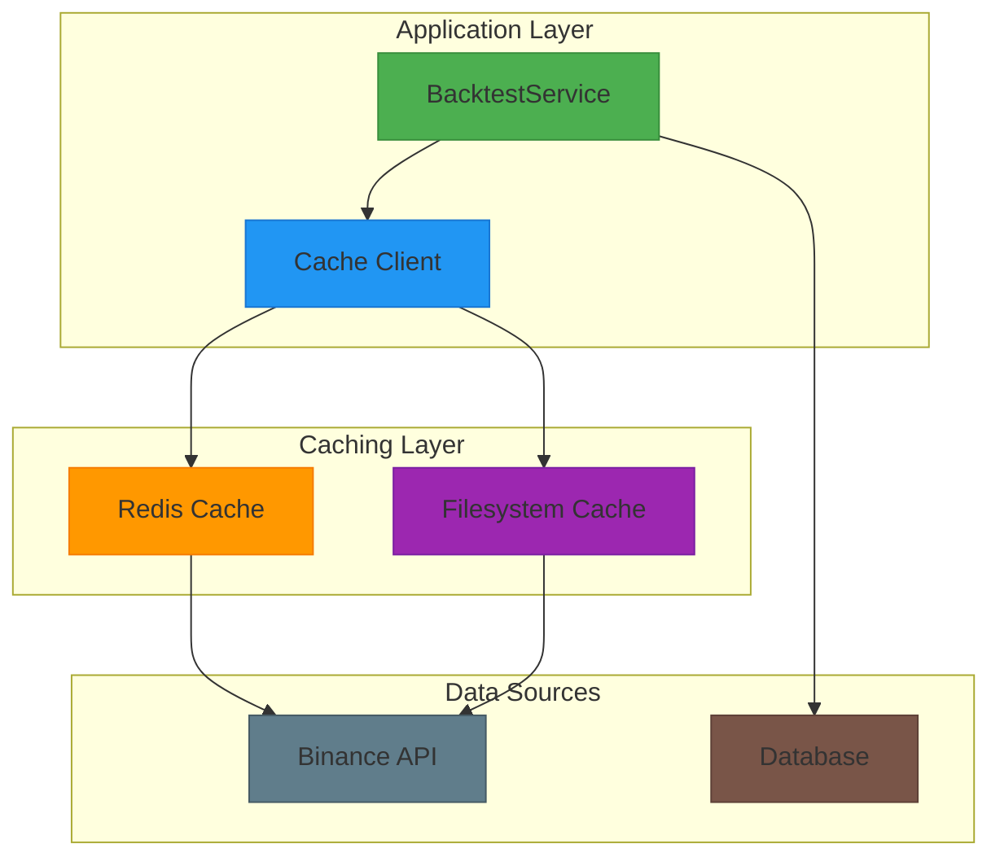
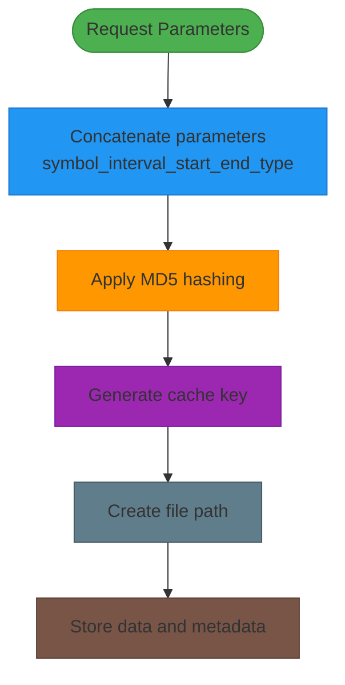
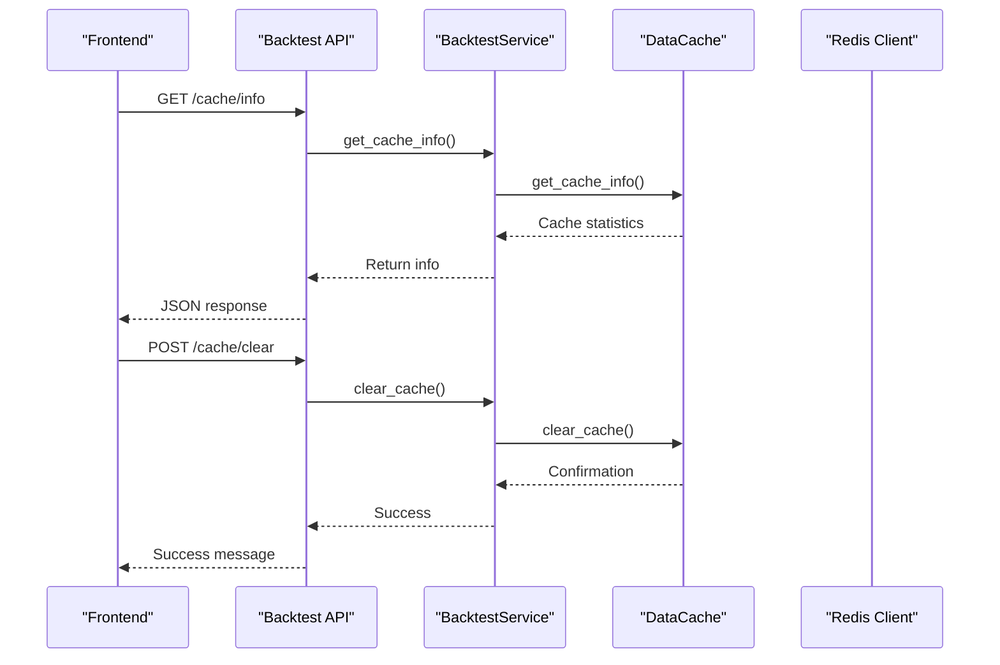

# Caching Strategy

<cite>
**Referenced Files in This Document**   
- [cache.py](file://app/core/cache.py)
- [redis_client.py](file://app/core/redis_client.py)
- [cache_warmup_tasks.py](file://app/core/cache_warmup_tasks.py)
- [backtest_service.py](file://app/services/backtest_service.py)
- [backtest.py](file://app/api/routes/backtest.py)
</cite>

## Table of Contents
1. [Introduction](#introduction)
2. [Dual-Layer Caching Architecture](#dual-layer-caching-architecture)
3. [Redis-Based Symbol Caching](#redis-based-symbol-caching)
4. [Filesystem-Based Market Data Caching](#filesystem-based-market-data-caching)
5. [Cache Lifecycle Management](#cache-lifecycle-management)
6. [Cache Metrics and Monitoring](#cache-metrics-and-monitoring)
7. [Integration with Backtesting System](#integration-with-backtesting-system)
8. [Cache Warmup Mechanism](#cache-warmup-mechanism)

## Introduction
The TradeBot system implements a dual-layer caching strategy to optimize performance and reduce API load. This strategy combines Redis for frequently accessed trading symbols and filesystem storage for historical market data. The caching system is designed to handle both spot and futures trading data with different expiration policies based on data recency. This documentation details the implementation, configuration, and operational aspects of the caching system, including cache key generation, validity rules, lifecycle methods, and integration with monitoring metrics.

## Dual-Layer Caching Architecture
The TradeBot system employs a dual-layer caching architecture that combines in-memory Redis caching for frequently accessed data with filesystem-based caching for larger historical datasets. This hybrid approach optimizes performance by leveraging Redis's low-latency access for trading symbols while using the filesystem's persistence for extensive market data. The architecture separates concerns between metadata and data storage, with Redis handling symbol information and the filesystem managing time-series market data in CSV format. This design enables efficient data retrieval while maintaining system responsiveness under high load conditions.



**Diagram sources**
- [cache.py](file://app/core/cache.py#L8-L190)
- [redis_client.py](file://app/core/redis_client.py#L11-L128)

**Section sources**
- [cache.py](file://app/core/cache.py#L8-L190)
- [redis_client.py](file://app/core/redis_client.py#L11-L128)

## Redis-Based Symbol Caching
The Redis-based caching system handles frequently accessed trading symbols for both spot and futures markets. The implementation uses specific key patterns to distinguish between different types of cached data. The `SPOT_SYMBOLS_CACHE_KEY` pattern with value "cache:symbols:spot:v1" stores current spot trading symbols, while the `FUTURES_SYMBOLS_CACHE_KEY` pattern with value "cache:symbols:futures:v1" manages futures symbols. These Redis keys are updated periodically through background tasks that fetch symbol data from the Binance API. The system also maintains separate keys for tracking cache hits and misses, enabling performance monitoring and optimization.

**Section sources**
- [redis_client.py](file://app/core/redis_client.py#L116-L124)
- [cache_warmup_tasks.py](file://app/core/cache_warmup_tasks.py#L41-L67)

## Filesystem-Based Market Data Caching
The filesystem caching mechanism, implemented through the `DataCache` class, stores historical market data as CSV files with accompanying JSON metadata. Each cache entry is uniquely identified by an MD5 hash generated from the combination of symbol, interval, start date, end date, and market type parameters. The cache stores data files with the `.csv` extension and metadata files with the `_meta.json` suffix. The metadata includes essential information such as symbol, interval, date range, market type, cache timestamp, and row count. This approach enables efficient retrieval and validation of cached market data while maintaining data integrity.

### Cache Key Generation
The cache key generation process combines multiple parameters to create a unique identifier for each data request. The `_get_cache_key` method concatenates the symbol, interval, start date, end date, and market type into a single string, which is then hashed using MD5. This ensures that identical requests generate the same cache key, enabling effective cache reuse while preventing collisions between different data requests.



**Diagram sources**
- [cache.py](file://app/core/cache.py#L13-L16)

**Section sources**
- [cache.py](file://app/core/cache.py#L13-L24)

## Cache Lifecycle Management
The caching system implements comprehensive lifecycle management through several key methods. The `is_cached` method determines whether data exists in the cache and is still valid based on expiration rules. Recent data (within one day of the current date) expires after 24 hours, while historical data has indefinite retention. The `get_cached_data` method retrieves cached data if available, while `cache_data` stores new data with associated metadata. The `clear_cache` method removes all cached files, and `get_cache_info` provides detailed information about the current cache state, including file count, cached symbols, and total storage size.

### Cache Validity Rules
The cache validity system implements different expiration policies based on data recency. For recent data where the end date is within one day of the current date, the cache remains valid for 24 hours from the time of caching. This ensures fresh data for active trading periods. For historical data with end dates further in the past, the cache never expires, providing persistent storage for backtesting and analysis purposes. This dual policy optimizes both data freshness for current trading and storage efficiency for historical analysis.

```mermaid
graph TD
A[Check Cache] --> B{Is end date<br/>recent?}
B --> |Yes| C{Less than<br/>24h old?}
B --> |No| D[Cache valid<br/>(historical)]
C --> |Yes| E[Cache valid<br/>(recent)]
C --> |No| F[Cache expired]
style A fill:#2196F3,stroke:#1976D2
style B fill:#FF9800,stroke:#F57C00
style C fill:#FF9800,stroke:#F57C00
style D fill:#4CAF50,stroke:#388E3C
style E fill:#4CAF50,stroke:#388E3C
style F fill:#F44336,stroke:#D32F2F
```

**Diagram sources**
- [cache.py](file://app/core/cache.py#L57-L69)

**Section sources**
- [cache.py](file://app/core/cache.py#L25-L72)

## Cache Metrics and Monitoring
The caching system integrates with Redis to track cache hit and miss metrics using atomic counter updates. The `SPOT_SYMBOLS_CACHE_HIT_KEY` ("metrics:cache_hit:symbols_spot") and `SPOT_SYMBOLS_CACHE_MISS_KEY` ("metrics:cache_miss:symbols_spot") track spot symbol cache performance, while corresponding keys handle futures symbol metrics. These counters are incremented atomically using the `incr_sync` function from the Redis client helpers, ensuring accurate metrics even under concurrent access. The system also tracks warmup task success and failure rates, providing comprehensive monitoring capabilities for cache performance and reliability.

**Section sources**
- [redis_client.py](file://app/core/redis_client.py#L118-L126)
- [cache_warmup_tasks.py](file://app/core/cache_warmup_tasks.py#L58-L62)

## Integration with Backtesting System
The caching system is tightly integrated with the backtesting functionality through the `BacktestService` class. When initializing, the service creates a `DataCache` instance with a specific directory path, establishing the connection between backtesting operations and caching. The `get_historical_data` method first checks the cache before making API calls, significantly reducing external requests. The API routes expose cache management endpoints, including `/cache/info` to retrieve cache statistics and `/cache/clear` to remove all cached data. This integration enables efficient backtesting by reusing previously fetched market data while providing administrative controls for cache management.



**Diagram sources**
- [backtest_service.py](file://app/services/backtest_service.py#L24-L27)
- [backtest.py](file://app/api/routes/backtest.py#L76-L120)

**Section sources**
- [backtest_service.py](file://app/services/backtest_service.py#L23-L37)
- [backtest.py](file://app/api/routes/backtest.py#L76-L120)

## Cache Warmup Mechanism
The cache warmup mechanism ensures that trading symbol data is pre-loaded into Redis at regular intervals. Implemented as Celery tasks, the `warmup_spot_symbols_cache` and `warmup_futures_symbols_cache` functions fetch symbol data from the Binance API and store it in Redis with appropriate TTL values. The system prioritizes popular trading pairs (BTC, ETH, BNB, etc.) and filters for USDT-denominated pairs. Upon successful update, the tasks record the refresh timestamp and update success metrics. If the update fails, the system falls back to the last known good data, ensuring continuous availability of symbol information for trading operations.

**Section sources**
- [cache_warmup_tasks.py](file://app/core/cache_warmup_tasks.py#L41-L127)