# Filesystem Caching

<cite>
**Referenced Files in This Document**   
- [DataCache](file://app/core/cache.py#L8-L190)
- [BacktestService](file://app/services/backtest_service.py#L24-L1360)
- [backtest.py](file://app/api/routes/backtest.py#L76-L120)
</cite>

## Table of Contents
1. [Introduction](#introduction)
2. [Cache Implementation](#cache-implementation)
3. [Cache Key Generation](#cache-key-generation)
4. [File Structure and Naming Conventions](#file-structure-and-naming-conventions)
5. [Cache Validity Logic](#cache-validity-logic)
6. [Core Methods](#core-methods)
7. [Cache Integrity Verification](#cache-integrity-verification)
8. [Disk Space and Organization](#disk-space-and-organization)
9. [Performance Benefits](#performance-benefits)
10. [Usage Examples](#usage-examples)

## Introduction
The TradeBot system implements a filesystem caching mechanism to store historical market data efficiently. This caching system reduces API load and improves response times for historical data queries by storing data in CSV format with accompanying JSON metadata files. The cache is managed through the DataCache class, which handles all aspects of data storage, retrieval, and validation.

**Section sources**
- [DataCache](file://app/core/cache.py#L8-L190)

## Cache Implementation
The DataCache class is responsible for managing the filesystem cache. It initializes with a specified cache directory, defaulting to "cache/data". The class provides methods for caching data, retrieving cached data, checking cache status, clearing the cache, and obtaining cache information.

**Diagram sources**
- [DataCache](file://app/core/cache.py#L8-L190)

**Section sources**
- [DataCache](file://app/core/cache.py#L8-L190)

## Cache Key Generation
The cache key is generated using the _get_cache_key method, which creates a unique identifier for each data request. The key is generated by combining the symbol, interval, start date, end date, and market type into a single string, which is then hashed using MD5. This ensures that each unique combination of parameters results in a unique cache key.

**Diagram sources**
- [DataCache](file://app/core/cache.py#L13-L16)

**Section sources**
- [DataCache](file://app/core/cache.py#L13-L16)

## File Structure and Naming Conventions
The cache stores data in CSV files and metadata in JSON files. The file paths are determined by the _get_cache_path and _get_metadata_path methods. The CSV files contain the historical market data, while the JSON files store metadata about the cached data, including the symbol, interval, date range, market type, cache timestamp, row count, and cache key.

**Diagram sources**
- [DataCache](file://app/core/cache.py#L18-L23)

**Section sources**
- [DataCache](file://app/core/cache.py#L18-L23)

## Cache Validity Logic
The cache implements a dual validity logic. Recent data, defined as data where the end date is within one day of the current date, is considered valid for 24 hours. Historical data, where the end date is more than one day in the past, is considered indefinitely valid. This logic is implemented in the is_cached method, which checks the cache age against the current time.

```mermaid
flowchart TD
A[Check Cache] --> B{End Date ≤ 1 Day Ago?}
B --> |Yes| C[Check Age < 24 Hours]
B --> |No| D[Cache Valid]
C --> E{Age < 24 Hours?}
E --> |Yes| F[Cache Valid]
E --> |No| G[Cache Invalid]
```

**Diagram sources**
- [DataCache](file://app/core/cache.py#L58-L69)

**Section sources**
- [DataCache](file://app/core/cache.py#L58-L69)

## Core Methods
The DataCache class provides several core methods for managing the cache:

- **is_cached**: Checks if data is already cached by verifying the existence of both the data and metadata files, and validating the cache age for recent data.
- **get_cached_data**: Retrieves cached data if available, returning a pandas DataFrame.
- **cache_data**: Stores data in a CSV file and metadata in a JSON file.
- **clear_cache**: Removes all cached files.
- **get_cache_info**: Returns information about the current cache state, including file count, size, and cached symbols.

**Diagram sources**
- [DataCache](file://app/core/cache.py#L26-L190)

**Section sources**
- [DataCache](file://app/core/cache.py#L26-L190)

## Cache Integrity Verification
Cache integrity is verified through metadata validation and timestamp checks. When checking if data is cached, the system reads the metadata file to ensure it contains valid information and checks the cache age against the current time. This ensures that only valid and up-to-date data is served from the cache.

**Section sources**
- [DataCache](file://app/core/cache.py#L44-L72)

## Disk Space and Organization
The cache is organized in a single directory with a flat structure, where each cache entry consists of a CSV file and a corresponding JSON metadata file. The system monitors disk space usage and provides cache information through the get_cache_info method, which returns the total number of files, total size in MB, and a list of cached symbols.

**Section sources**
- [DataCache](file://app/core/cache.py#L134-L190)

## Performance Benefits
The filesystem caching mechanism significantly reduces API load and improves response times for historical data queries. By serving data from the local filesystem instead of making repeated API calls, the system can respond to requests much faster, especially for frequently accessed data. This is particularly beneficial for backtesting and market data retrieval operations.

**Section sources**
- [BacktestService](file://app/services/backtest_service.py#L24-L1360)

## Usage Examples
The caching mechanism is used extensively in the backtesting functionality of the TradeBot system. When running a backtest, the system first checks if the required historical data is already cached. If it is, the data is retrieved from the cache; otherwise, it is downloaded from the API and stored in the cache for future use. The cache can be managed through API endpoints, allowing users to clear the cache or retrieve cache information.

**Diagram sources**
- [backtest.py](file://app/api/routes/backtest.py#L76-L120)
- [BacktestService](file://app/services/backtest_service.py#L24-L1360)
- [DataCache](file://app/core/cache.py#L8-L190)

**Section sources**
- [backtest.py](file://app/api/routes/backtest.py#L76-L120)
- [BacktestService](file://app/services/backtest_service.py#L24-L1360)
- [DataCache](file://app/core/cache.py#L8-L190)