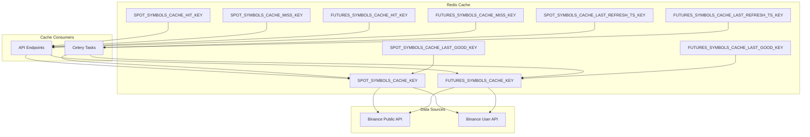
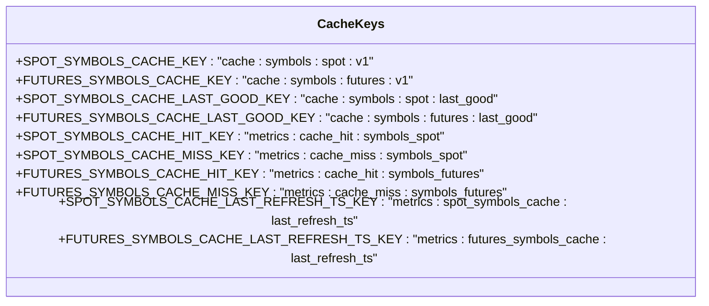
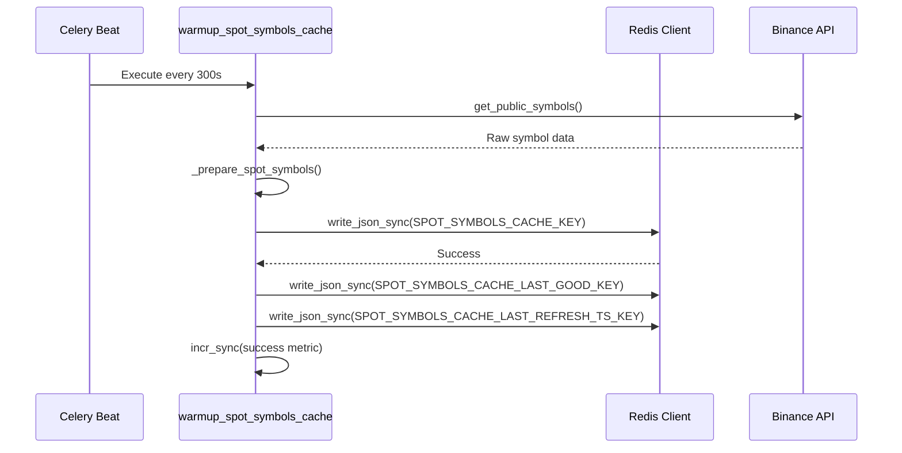
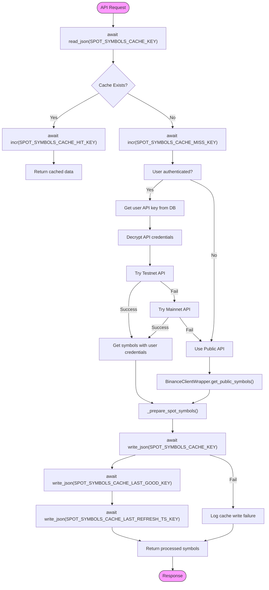
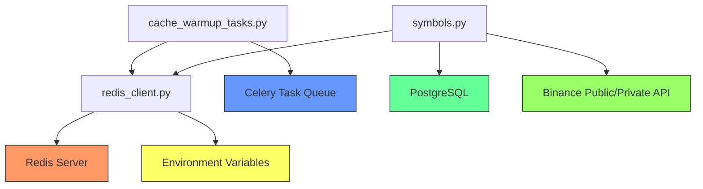

# Redis Caching

<cite>
**Referenced Files in This Document**   
- [redis_client.py](file://app/core/redis_client.py)
- [cache_warmup_tasks.py](file://app/core/cache_warmup_tasks.py)
- [symbols.py](file://app/api/routes/symbols.py)
</cite>

## Table of Contents
1. [Introduction](#introduction)
2. [Core Components](#core-components)
3. [Architecture Overview](#architecture-overview)
4. [Detailed Component Analysis](#detailed-component-analysis)
5. [Dependency Analysis](#dependency-analysis)
6. [Performance Considerations](#performance-considerations)
7. [Troubleshooting Guide](#troubleshooting-guide)
8. [Conclusion](#conclusion)

## Introduction
The TradeBot system implements a sophisticated Redis caching mechanism to optimize performance and reliability when serving trading symbol data for both spot and futures markets. This documentation details the comprehensive caching architecture that ensures high availability of symbol information while minimizing direct API calls to Binance. The system employs versioned cache keys, atomic metric tracking, last-good state preservation, and automated cache warming to create a resilient and performant solution for one of the most frequently accessed data sets in the application.

## Core Components
The Redis caching system in TradeBot consists of several key components working in concert: dedicated cache keys for spot and futures symbols with versioned namespaces, atomic counters for tracking cache hit/miss metrics, last-good state preservation for fault tolerance, and timestamp tracking for cache health monitoring. The implementation leverages both synchronous and asynchronous Redis clients to accommodate different operational contexts within the application. Cache warming tasks run periodically to pre-populate the cache, while API endpoints implement a sophisticated fallback strategy that prioritizes cached data but can reconstruct it from multiple sources when necessary.

**Section sources**
- [redis_client.py](file://app/core/redis_client.py#L115-L127)
- [cache_warmup_tasks.py](file://app/core/cache_warmup_tasks.py#L37-L63)
- [symbols.py](file://app/api/routes/symbols.py#L52-L133)

## Architecture Overview
The Redis caching architecture follows a multi-layered approach where symbol data is retrieved from Binance through various methods, processed, and stored in Redis with appropriate TTL (Time-To-Live) values. The system implements a cache-aside pattern where API endpoints first check Redis for existing data before falling back to direct API calls. Two distinct cache hierarchies exist for spot and futures symbols, each with their own key namespaces, metrics, and last-good state preservation. Cache warming tasks run on a configurable schedule to ensure the cache is populated even before the first user request, improving initial response times and reducing load on external APIs.

**Diagram sources **
- [redis_client.py](file://app/core/redis_client.py#L115-L127)
- [cache_warmup_tasks.py](file://app/core/cache_warmup_tasks.py#L37-L63)
- [symbols.py](file://app/api/routes/symbols.py#L52-L133)

## Detailed Component Analysis

### Cache Key Structure and Versioning
The Redis caching system employs a systematic naming convention for cache keys that includes both functional purpose and version information. This approach prevents key conflicts and enables seamless cache invalidation during system upgrades. The versioned namespace (v1) in keys like SPOT_SYMBOLS_CACHE_KEY and FUTURES_SYMBOLS_CACHE_KEY allows for backward compatibility during migrations and prevents stale data from being served after schema changes. The key structure follows a pattern of "cache:symbols:[market_type]:[version]" for primary caches and "metrics:[metric_type]:symbols_[market_type]" for performance counters, creating a clear taxonomy that facilitates monitoring and debugging.

**Diagram sources **
- [redis_client.py](file://app/core/redis_client.py#L115-L127)

**Section sources**
- [redis_client.py](file://app/core/redis_client.py#L115-L127)

### Cache Warming Mechanism
The cache warming system uses Celery tasks to periodically refresh symbol data from Binance and populate the Redis cache. These tasks run on configurable intervals (defaulting to 300 seconds) and follow a fail-safe approach: they retrieve symbol data from Binance's public API, process it to prioritize popular trading pairs, and write it to Redis with appropriate TTL values. Upon successful cache population, the system updates both the primary cache key and the last-good state key, along with a timestamp of the last successful refresh. This mechanism ensures that the cache is proactively maintained and that fallback data is always available even if subsequent refresh attempts fail.

**Diagram sources **
- [cache_warmup_tasks.py](file://app/core/cache_warmup_tasks.py#L41-L67)

**Section sources**
- [cache_warmup_tasks.py](file://app/core/cache_warmup_tasks.py#L41-L67)

### API Endpoint Cache Flow
The API endpoints for retrieving trading symbols implement a sophisticated cache-first strategy with multiple fallback mechanisms. When a request arrives, the system first attempts to retrieve data from the Redis cache. If successful, it increments the cache hit counter and returns the data immediately. On cache miss or Redis failure, the system proceeds to fetch data from Binance through a prioritized sequence: first attempting with the user's API credentials (if available), then falling back to the public API. After successful retrieval and processing, the data is written back to the cache for future requests, implementing a lazy population strategy that complements the proactive cache warming.

**Diagram sources **
- [symbols.py](file://app/api/routes/symbols.py#L52-L133)

**Section sources**
- [symbols.py](file://app/api/routes/symbols.py#L52-L133)

### Last-Good State and Failure Fallback
The system implements a robust last-good state preservation mechanism to maintain availability during external service outages. In addition to the primary cache with TTL, a secondary "last_good" key stores the most recently successful symbol data without expiration. When all data retrieval methods fail (user API, public API), the system attempts to serve this last-good state data rather than returning an error. This fail-degraded mode ensures that users can continue trading with slightly stale but functional symbol information during Binance API outages. The system also tracks the timestamp of the last successful cache refresh, providing operational visibility into cache health and data freshness.

**Section sources**
- [redis_client.py](file://app/core/redis_client.py#L117-L118)
- [symbols.py](file://app/api/routes/symbols.py#L127-L132)

## Dependency Analysis
The Redis caching system has well-defined dependencies that ensure its reliability and integration with the broader TradeBot architecture. The core dependency is on Redis itself, accessed through both synchronous and asynchronous clients that handle connection pooling and error recovery. The system depends on Binance's public and private APIs for source data, with a clear fallback hierarchy that prioritizes user-specific data when available. Configuration dependencies include environment variables that control cache TTL and refresh intervals, allowing operational tuning without code changes. The integration with Celery enables scheduled cache warming tasks, while the API endpoints depend on the caching layer for performance optimization.

**Diagram sources **
- [redis_client.py](file://app/core/redis_client.py)
- [cache_warmup_tasks.py](file://app/core/cache_warmup_tasks.py)
- [symbols.py](file://app/api/routes/symbols.py)

**Section sources**
- [redis_client.py](file://app/core/redis_client.py)
- [cache_warmup_tasks.py](file://app/core/cache_warmup_tasks.py)
- [symbols.py](file://app/api/routes/symbols.py)

## Performance Considerations
The Redis caching implementation delivers significant performance benefits by reducing latency for symbol data retrieval and decreasing load on external APIs. Cache hits serve data in milliseconds directly from memory, while cache misses trigger background processes that may take several hundred milliseconds to complete. The system is designed to handle high concurrency through Redis's inherent support for multiple connections and the use of both sync and async clients appropriate to the calling context. Memory usage is optimized by storing only essential symbol information and using JSON serialization for efficient storage. The cache TTL (default 300 seconds) balances data freshness with performance, while the atomic increment operations for metrics have minimal performance impact.

## Troubleshooting Guide
When diagnosing issues with the Redis caching system, begin by checking the cache hit/miss ratios using the metric keys (SPOT_SYMBOLS_CACHE_HIT_KEY, SPOT_SYMBOLS_CACHE_MISS_KEY, etc.) to identify potential cache thrashing or ineffective caching. Verify that the cache warming tasks are executing successfully by checking Celery logs and confirming that the last refresh timestamp (SPOT_SYMBOLS_CACHE_LAST_REFRESH_TS_KEY) is being updated regularly. If users report symbol loading issues, confirm that Redis is accessible and that the last-good state keys contain valid data. Monitor error logs for failures in Redis operations or Binance API calls, and verify that environment variables controlling cache behavior (TTL, refresh intervals) are set appropriately. During Binance API outages, expect to see increased cache miss rates and reliance on last-good state data.

**Section sources**
- [redis_client.py](file://app/core/redis_client.py#L89-L103)
- [cache_warmup_tasks.py](file://app/core/cache_warmup_tasks.py#L64-L68)
- [symbols.py](file://app/api/routes/symbols.py#L124-L134)

## Conclusion
The Redis caching mechanism in TradeBot represents a comprehensive solution for managing frequently accessed trading symbol data with high performance and reliability. By combining proactive cache warming, reactive cache population, versioned key namespaces, atomic metrics, and last-good state preservation, the system ensures optimal user experience even during external service disruptions. The clear separation of concerns between cache management, data retrieval, and API serving creates a maintainable architecture that can be easily monitored and tuned. This implementation serves as a model for caching critical application data in high-availability trading systems.