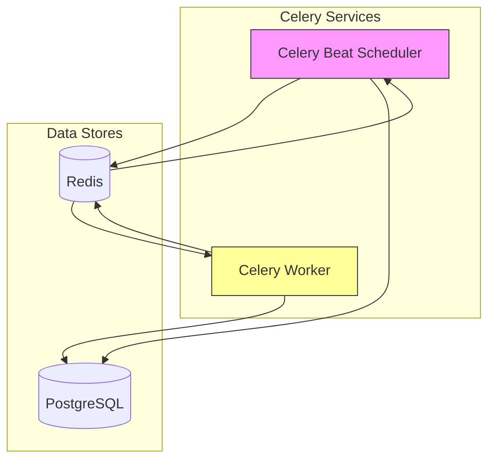
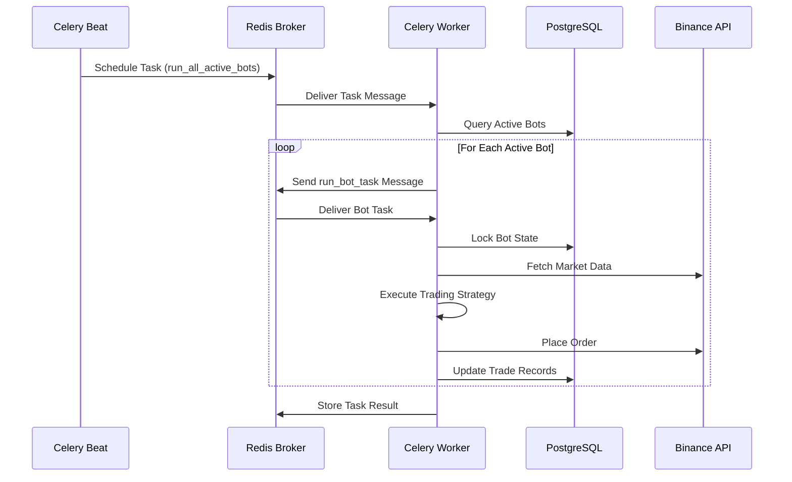
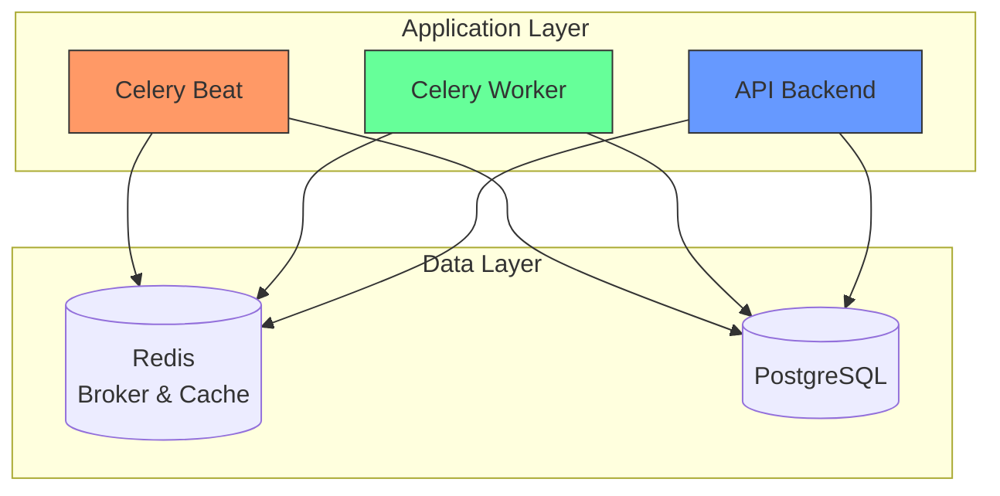

# Celery Integration

<cite>
**Referenced Files in This Document**   
- [celery_app.py](file://app/core/celery_app.py)
- [docker-compose.yml](file://docker-compose.yml)
- [bot_tasks.py](file://app/core/bot_tasks.py)
- [cache_warmup_tasks.py](file://app/core/cache_warmup_tasks.py)
- [redis_client.py](file://app/core/redis_client.py)
</cite>

## Table of Contents
1. [Introduction](#introduction)
2. [Celery Configuration and Redis Integration](#celery-configuration-and-redis-integration)
3. [Task Scheduling with Celery Beat](#task-scheduling-with-celery-beat)
4. [Docker Service Configuration](#docker-service-configuration)
5. [Security Hardening for Celery Containers](#security-hardening-for-celery-containers)
6. [Task Execution Flow](#task-execution-flow)
7. [Architecture Overview](#architecture-overview)
8. [Conclusion](#conclusion)

## Introduction
This document provides a comprehensive overview of the Celery integration within the TradeBot system, focusing on its interaction with Redis as both message broker and result backend. It details the configuration of Celery workers and beat schedulers, Docker deployment setup, security hardening measures, and the overall task execution flow that enables automated trading operations.

## Celery Configuration and Redis Integration

The Celery application is configured in `app/core/celery_app.py` to use Redis as both the message broker (CELERY_BROKER_URL) and result backend (CELERY_RESULT_BACKEND). This dual role enables Redis to handle task queuing and storage of task results efficiently.

The configuration uses environment variables with fallback defaults pointing to localhost Redis instances. The Celery app is initialized with specific security and performance settings:

- **task_acks_late**: Ensures tasks are only acknowledged after completion, preventing loss if a worker crashes mid-execution
- **worker_prefetch_multiplier=1**: Prevents workers from prefetching too many tasks, avoiding uneven load distribution
- **task_time_limit**: Hard time limit for tasks (default 180 seconds)
- **task_soft_time_limit**: Soft time limit warning before hard timeout (default 150 seconds)

These settings ensure reliable task processing and prevent system overload from long-running or stuck tasks.

**Section sources**
- [celery_app.py](file://app/core/celery_app.py#L6-L23)

## Task Scheduling with Celery Beat

Celery Beat is configured as the periodic task scheduler with two primary tasks:

1. **run-all-active-bots-every-minute**: Executes every minute via crontab schedule to process all active trading bots
2. **reactivate-bots-daily-at-utc-midnight**: Runs daily at UTC midnight to reset bot states and reactivate any deactivated bots

The scheduler uses the same Celery app configuration and connects to Redis for coordination. Additional periodic tasks for cache warming are dynamically registered through the `setup_periodic_tasks` function in `cache_warmup_tasks.py`, which configures spot and futures symbol cache updates at configurable intervals.

```mermaid
scheduleDiagram
timeInterval 1m
section Periodic Tasks
run-all-active-bots : cron, * * * * *, 1m
warmup-spot-symbols-cache : interval, 300s, 5m
warmup-futures-symbols-cache : interval, 300s, 5m
reactivate-bots-daily : cron, 0 0 * * *, 24h
```

**Diagram sources**
- [celery_app.py](file://app/core/celery_app.py#L26-L35)
- [cache_warmup_tasks.py](file://app/core/cache_warmup_tasks.py#L117-L126)

**Section sources**
- [celery_app.py](file://app/core/celery_app.py#L26-L35)
- [cache_warmup_tasks.py](file://app/core/cache_warmup_tasks.py#L117-L126)
- [bot_tasks.py](file://app/core/bot_tasks.py#L79-L108)

## Docker Service Configuration

The `docker-compose.yml` file defines two dedicated services for Celery:

### Celery Worker
- **Image**: Built from the same backend image as the main application
- **Dependencies**: Requires both PostgreSQL and Redis services to be healthy before startup
- **Environment Variables**: Inherits all necessary configuration from environment variables including database URLs, Redis connection details, and security keys
- **Volumes**: Mounts logs and alembic directories for persistent logging and database migration access
- **Command**: Starts the Celery worker process with info logging level

### Celery Beat
- **Image**: Same backend image as worker
- **Dependencies**: Also depends on PostgreSQL and Redis health
- **Environment**: Identical to worker service
- **Volumes**: Same volume mounts for logs and migrations
- **Command**: Launches Celery beat with schedule persistence to temporary storage
- **Schedule Storage**: Uses `/tmp/celerybeat-schedule` for schedule persistence between restarts

Both services use the same environment variable propagation mechanism as the main backend service, ensuring consistent configuration across all components.



**Diagram sources**
- [docker-compose.yml](file://docker-compose.yml#L104-L183)

**Section sources**
- [docker-compose.yml](file://docker-compose.yml#L104-L183)

## Security Hardening for Celery Containers

Both Celery worker and beat containers implement multiple security hardening measures:

- **no-new-privileges**: Prevents processes from gaining additional privileges, even when executing setuid binaries
- **cap_drop: ALL**: Drops all Linux capabilities, minimizing the attack surface
- **read_only**: Mounts the container filesystem as read-only, preventing unauthorized modifications
- **tmpfs**: Mounts `/tmp` as temporary filesystem for secure temporary file storage

These security measures follow the principle of least privilege, ensuring that even if a container is compromised, the potential damage is limited. The containers can still perform their intended functions while being protected against common attack vectors.

The same security configuration is applied consistently across all backend services, including the main API server, ensuring a uniform security posture throughout the application.

**Section sources**
- [docker-compose.yml](file://docker-compose.yml#L130-L136)
- [docker-compose.yml](file://docker-compose.yml#L173-L179)

## Task Execution Flow

The task execution flow begins with Celery Beat scheduling periodic tasks that are sent to Redis as messages. Workers consume these messages and execute the corresponding functions:

1. The `run_all_active_bots` task queries the database for all active bot configurations
2. For each active bot, it dispatches a `run_bot_task` with the bot's ID
3. The worker executes the trading logic, including market data analysis, risk management calculations, and order execution
4. Results are stored in the database and optionally published via Redis

The system uses Redis not only for Celery messaging but also as a general-purpose cache through the `redis_client.py` module, which provides synchronous and asynchronous Redis access for caching trading symbols and other frequently accessed data.

This architecture enables horizontal scaling of workers to handle increased load during peak trading periods while maintaining data consistency through database transactions and Redis coordination.



**Diagram sources**
- [celery_app.py](file://app/core/celery_app.py#L27-L34)
- [bot_tasks.py](file://app/core/bot_tasks.py#L111-L118)
- [bot_tasks.py](file://app/core/bot_tasks.py#L121-L124)

**Section sources**
- [celery_app.py](file://app/core/celery_app.py#L27-L34)
- [bot_tasks.py](file://app/core/bot_tasks.py#L111-L118)
- [bot_tasks.py](file://app/core/bot_tasks.py#L121-L124)
- [redis_client.py](file://app/core/redis_client.py#L11-L15)

## Architecture Overview

The Celery integration forms a critical part of the TradeBot system architecture, providing asynchronous task processing capabilities that enable real-time trading operations. Redis serves as the central nervous system, handling both message brokering for Celery and general caching needs.

The separation of concerns between the beat scheduler (responsible for timing) and workers (responsible for execution) allows for independent scaling and maintenance. The use of environment variables for configuration enables consistent deployment across different environments while maintaining security through externalized secrets.

This architecture supports the core trading functionality while providing reliability through task acknowledgments, fault tolerance through retry mechanisms, and performance through efficient Redis-based messaging.



**Diagram sources**
- [celery_app.py](file://app/core/celery_app.py)
- [docker-compose.yml](file://docker-compose.yml)
- [redis_client.py](file://app/core/redis_client.py)

## Conclusion
The Celery integration with Redis in the TradeBot system provides a robust foundation for automated trading operations. By leveraging Redis as both message broker and result backend, the system achieves high performance and reliability. The Docker-based deployment with comprehensive security hardening ensures production readiness, while the clear separation of scheduling and execution concerns enables maintainable and scalable architecture. This integration is essential for the system's ability to process trading signals in real-time and manage multiple trading bots efficiently.