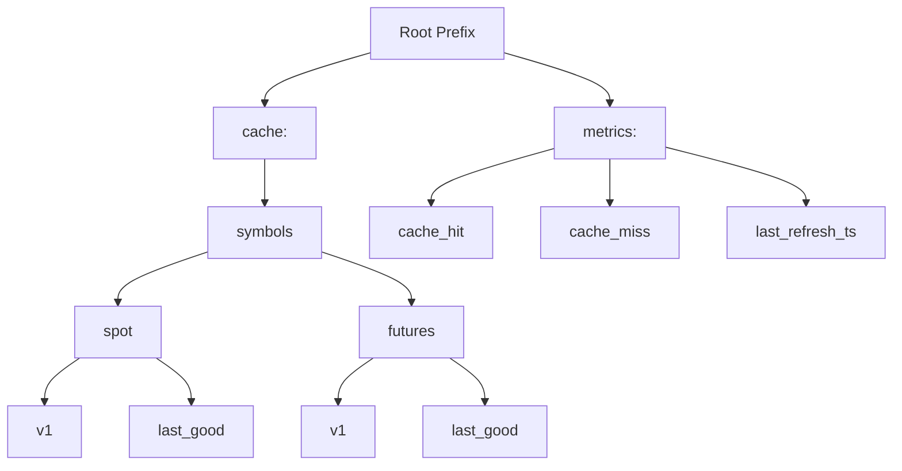
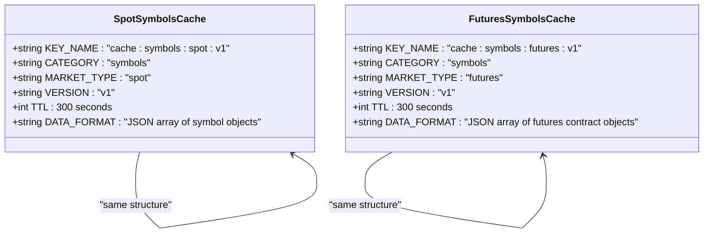
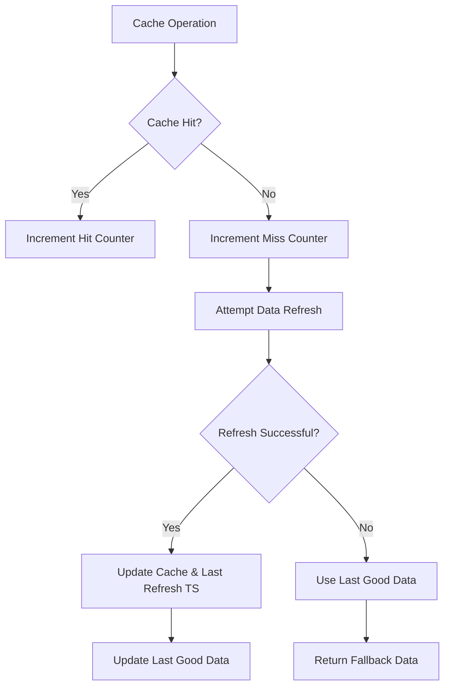
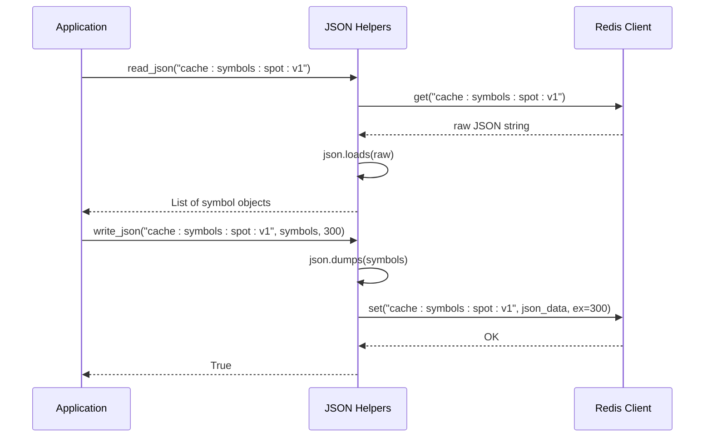
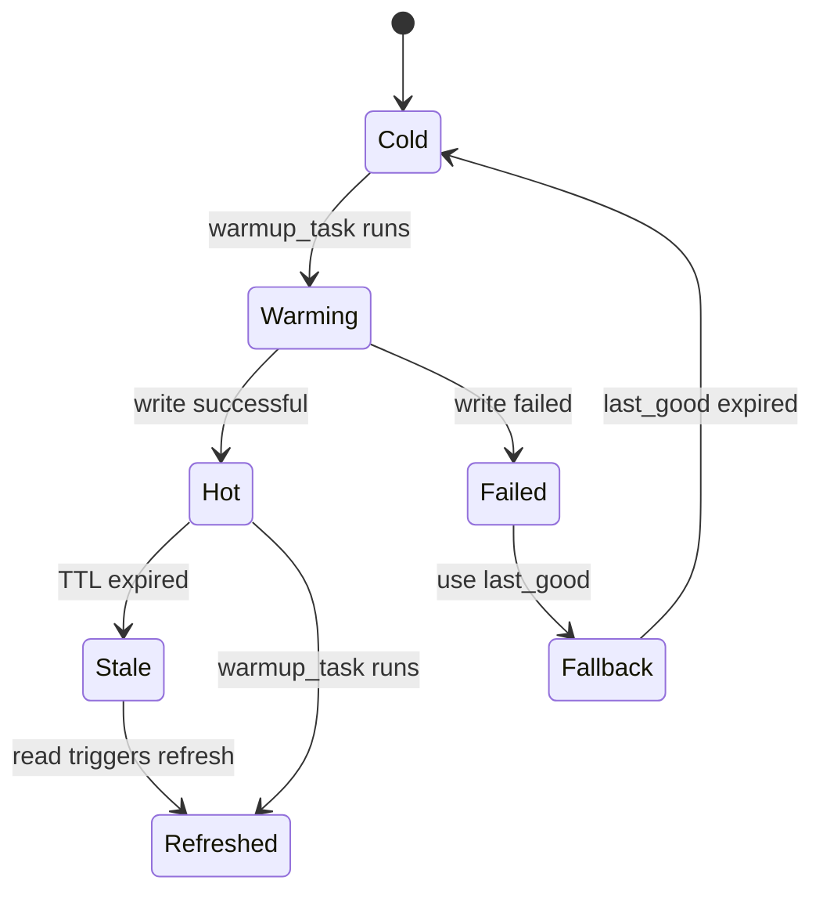
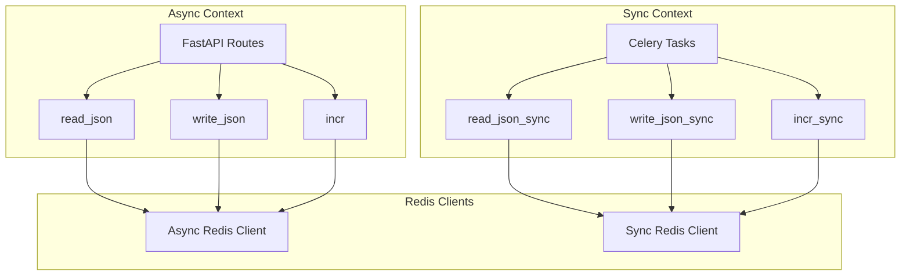
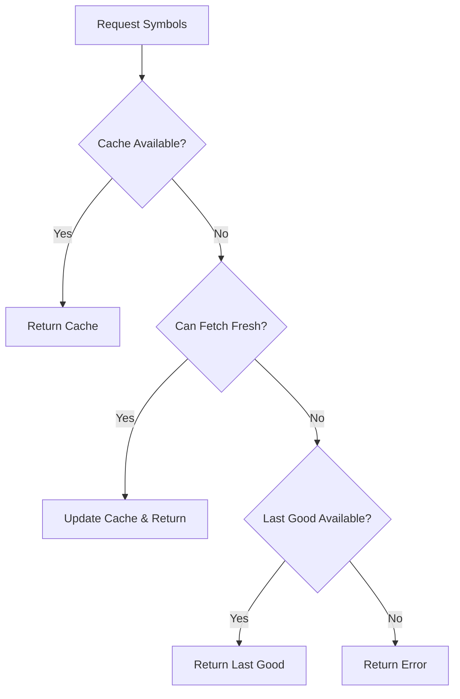

# Cache Key Naming Conventions

<cite>
**Referenced Files in This Document**   
- [redis_client.py](file://app/core/redis_client.py)
- [symbols.py](file://app/api/routes/symbols.py)
- [cache_warmup_tasks.py](file://app/core/cache_warmup_tasks.py)
</cite>

## Table of Contents
1. [Introduction](#introduction)
2. [Key Naming Hierarchy](#key-naming-hierarchy)
3. [Core Cache Keys](#core-cache-keys)
4. [Metadata and Metrics Keys](#metadata-and-metrics-keys)
5. [JSON Serialization and Data Handling](#json-serialization-and-data-handling)
6. [Versioning and Cache Invalidation](#versioning-and-cache-invalidation)
7. [Synchronous and Asynchronous Usage](#synchronous-and-asynchronous-usage)
8. [Fallback and Recovery Strategies](#fallback-and-recovery-strategies)
9. [Best Practices for Extension](#best-practices-for-extension)

## Introduction
The Redis cache key naming conventions in the tradebot system provide a structured approach to managing Binance trading pair data for both spot and futures markets. These conventions enable efficient data organization, retrieval, and monitoring through a consistent naming strategy that incorporates functional prefixes, market types, and versioning. The system implements a robust caching layer that reduces API calls to Binance while ensuring data availability through comprehensive fallback mechanisms. This documentation details the complete key structure, usage patterns, and operational principles that govern the symbol caching system.

**Section sources**
- [redis_client.py](file://app/core/redis_client.py#L115-L128)

## Key Naming Hierarchy
The cache key naming system follows a hierarchical structure that organizes keys by function, market type, and purpose. The naming convention uses colon-separated segments that provide immediate context about each key's role in the system.

The hierarchy follows this pattern:
```
<function>:<category>:<market_type>:<purpose>
```

Two primary prefixes organize the keys:
- **cache:** - Used for actual symbol data storage
- **metrics:** - Used for monitoring, counters, and metadata

Within the cache prefix, keys are further organized by:
- **symbols** - Indicates the data represents trading symbols
- **spot/futures** - Specifies the market type
- **v1** - Version identifier for cache invalidation

The metrics prefix contains subcategories for:
- **cache_hit/cache_miss** - Performance tracking
- **last_refresh_ts** - Timestamp monitoring
- Various operational metrics

This hierarchical approach enables efficient key scanning and management through Redis's pattern matching capabilities, allowing administrators to easily query all cache keys, all metrics, or specific market segments.



**Diagram sources**
- [redis_client.py](file://app/core/redis_client.py#L115-L128)

**Section sources**
- [redis_client.py](file://app/core/redis_client.py#L115-L128)

## Core Cache Keys
The system defines two primary cache keys for storing Binance trading symbols, differentiated by market type. These keys serve as the main storage locations for processed symbol data that is frequently accessed by the application.

### Spot Market Cache Key
The `SPOT_SYMBOLS_CACHE_KEY` stores the current list of available spot trading pairs from Binance, specifically filtered for USDT quote assets and prioritized by trading volume and popularity.

**Key Structure**: `cache:symbols:spot:v1`

This key contains a JSON-serialized array of symbol objects that have been processed to include only USDT-traded pairs, with popular symbols (BTC, ETH, etc.) sorted to the top of the list for better user experience.

### Futures Market Cache Key
The `FUTURES_SYMBOLS_CACHE_KEY` stores the current list of available futures trading pairs from Binance, similarly filtered for USDT-margined contracts and prioritized by popularity.

**Key Structure**: `cache:symbols:futures:v1`

This key contains a JSON-serialized array of futures contract objects, filtered for USDT quote assets and ordered with popular futures pairs at the beginning of the list.

Both cache keys are designed to be read frequently by the API endpoints and are updated periodically by background tasks to ensure data freshness while minimizing direct API calls to Binance.



**Diagram sources**
- [redis_client.py](file://app/core/redis_client.py#L116-L117)
- [redis_client.py](file://app/core/redis_client.py#L123-L124)

**Section sources**
- [redis_client.py](file://app/core/redis_client.py#L116-L124)

## Metadata and Metrics Keys
In addition to the primary cache keys, the system maintains several metadata and metrics keys that enhance reliability, monitoring, and performance tracking.

### Last Known Good State Keys
These keys store a backup of the last successfully retrieved symbol data, which serves as a fallback when current data cannot be obtained.

- `SPOT_SYMBOLS_CACHE_LAST_GOOD_KEY`: `cache:symbols:spot:last_good`
- `FUTURES_SYMBOLS_CACHE_LAST_GOOD_KEY`: `cache:symbols:futures:last_good`

When the system fails to refresh the primary cache (due to network issues, API problems, etc.), it can fall back to these last known good values rather than returning an error to the user.

### Cache Performance Metrics
The system tracks cache hit and miss rates to monitor effectiveness and identify potential issues.

- `SPOT_SYMBOLS_CACHE_HIT_KEY`: `metrics:cache_hit:symbols_spot`
- `SPOT_SYMBOLS_CACHE_MISS_KEY`: `metrics:cache_miss:symbols_spot`
- `FUTURES_SYMBOLS_CACHE_HIT_KEY`: `metrics:cache_hit:symbols_futures`
- `FUTURES_SYMBOLS_CACHE_MISS_KEY`: `metrics:cache_miss:symbols_futures`

These counters are incremented using the `incr` and `incr_sync` functions and provide valuable insights into cache utilization patterns.

### Refresh Timestamp Keys
These keys store the timestamp of the last successful cache refresh, enabling monitoring of data freshness.

- `SPOT_SYMBOLS_CACHE_LAST_REFRESH_TS_KEY`: `metrics:spot_symbols_cache:last_refresh_ts`
- `FUTURES_SYMBOLS_CACHE_LAST_REFRESH_TS_KEY`: `metrics:futures_symbols_cache:last_refresh_ts`

The timestamps are stored as Unix epoch integers and can be used to verify that caches are being updated at expected intervals.



**Diagram sources**
- [redis_client.py](file://app/core/redis_client.py#L117-L120)
- [redis_client.py](file://app/core/redis_client.py#L124-L127)
- [symbols.py](file://app/api/routes/symbols.py#L59-L67)
- [cache_warmup_tasks.py](file://app/core/cache_warmup_tasks.py#L54-L57)

**Section sources**
- [redis_client.py](file://app/core/redis_client.py#L117-L127)

## JSON Serialization and Data Handling
The system implements a comprehensive JSON serialization layer that handles the conversion between Python objects and Redis string storage. This abstraction simplifies cache operations and ensures consistent data handling across the application.

### Asynchronous JSON Operations
For async contexts (such as FastAPI routes), the system provides:

- `read_json(key)`: Asynchronously reads and deserializes JSON data
- `write_json(key, value, ttl_seconds)`: Asynchronously writes serialized JSON data with optional TTL

These functions use the async Redis client and are designed for use in coroutine contexts, preventing blocking operations in the main event loop.

### Synchronous JSON Operations
For synchronous contexts (such as Celery tasks), the system provides:

- `read_json_sync(key)`: Synchronously reads and deserializes JSON data
- `write_json_sync(key, value, ttl_seconds)`: Synchronously writes serialized JSON data with optional TTL

These functions use the sync Redis client and are suitable for background tasks and management commands.

### Error Handling
Both JSON operation variants include comprehensive error handling that:
- Returns `None` for read operations when keys don't exist or deserialization fails
- Returns `False` for write operations when serialization or Redis operations fail
- Logs warnings or errors as appropriate without raising exceptions

This graceful degradation ensures that cache issues do not cascade into application failures.



**Diagram sources**
- [redis_client.py](file://app/core/redis_client.py#L37-L84)

**Section sources**
- [redis_client.py](file://app/core/redis_client.py#L37-L84)

## Versioning and Cache Invalidation
The cache key naming convention incorporates versioning as a strategic approach to cache invalidation and migration.

### Version Suffix (v1)
The `v1` suffix in cache keys like `cache:symbols:spot:v1` serves multiple purposes:

1. **Schema Evolution**: When the structure of cached data changes, a new version (v2) can be introduced without affecting existing consumers of the old version.

2. **Rollback Capability**: If a new version has issues, the system can quickly revert to the previous version by updating code to read from v1 instead of v2.

3. **Gradual Migration**: During version transitions, both v1 and v2 keys can coexist, allowing for gradual migration of components.

4. **Cache Purging**: Specific versions can be targeted for deletion during maintenance or troubleshooting.

### Cache Warmup Strategy
The system employs a proactive cache warmup strategy using Celery periodic tasks:

- `warmup_spot_symbols_cache()`: Periodically refreshes spot symbol data
- `warmup_futures_symbols_cache()`: Periodically refreshes futures symbol data

These tasks run at configurable intervals (default: 300 seconds) and update both the primary cache keys and their associated metadata (last good data, refresh timestamps).

### Time-to-Live (TTL) Management
Cache entries are assigned TTL values from environment variables:
- `SPOT_SYMBOLS_CACHE_TTL_SECONDS` (default: 300)
- `FUTURES_SYMBOLS_CACHE_TTL_SECONDS` (default: 300)

This ensures that stale data is automatically removed from Redis, forcing a refresh on the next access if the background warmup hasn't occurred.



**Diagram sources**
- [redis_client.py](file://app/core/redis_client.py#L116-L124)
- [cache_warmup_tasks.py](file://app/core/cache_warmup_tasks.py#L47-L58)
- [cache_warmup_tasks.py](file://app/core/cache_warmup_tasks.py#L93-L104)

**Section sources**
- [redis_client.py](file://app/core/redis_client.py#L116-L124)
- [cache_warmup_tasks.py](file://app/core/cache_warmup_tasks.py#L41-L114)

## Synchronous and Asynchronous Usage
The cache system is designed to support both synchronous and asynchronous contexts, providing appropriate interfaces for different parts of the application architecture.

### Asynchronous Contexts (API Routes)
In FastAPI routes, asynchronous functions are used to prevent blocking the event loop:

```python
# Example from symbols.py API route
cached = await read_json(SPOT_SYMBOLS_CACHE_KEY)
if cached:
    await incr(SPOT_SYMBOLS_CACHE_HIT_KEY)
    return cached
else:
    await incr(SPOT_SYMBOLS_CACHE_MISS_KEY)
```

The async pattern uses `await` with coroutine functions and is essential for maintaining API responsiveness under load.

### Synchronous Contexts (Celery Tasks)
In Celery background tasks, synchronous functions are used for simplicity and compatibility:

```python
# Example from cache_warmup_tasks.py
wrote = write_json_sync(SPOT_SYMBOLS_CACHE_KEY, final_symbols, ttl_seconds=ttl_seconds)
if wrote:
    write_json_sync(SPOT_SYMBOLS_CACHE_LAST_GOOD_KEY, final_symbols)
    write_json_sync(SPOT_SYMBOLS_CACHE_LAST_REFRESH_TS_KEY, int(time.time()))
```

The sync pattern uses direct function calls and is suitable for background processing where async complexity is unnecessary.

### Client Management
The system maintains separate Redis client instances for async and sync operations:

- `_redis_async`: Async client for FastAPI routes
- `_redis_sync`: Sync client for Celery tasks

Both clients are implemented as singletons through the `get_redis_async()` and `get_redis_sync()` functions, ensuring efficient connection reuse.



**Diagram sources**
- [redis_client.py](file://app/core/redis_client.py#L18-L33)
- [symbols.py](file://app/api/routes/symbols.py#L60-L67)
- [cache_warmup_tasks.py](file://app/core/cache_warmup_tasks.py#L54-L57)

**Section sources**
- [redis_client.py](file://app/core/redis_client.py#L18-L33)
- [symbols.py](file://app/api/routes/symbols.py#L59-L118)
- [cache_warmup_tasks.py](file://app/core/cache_warmup_tasks.py#L54-L104)

## Fallback and Recovery Strategies
The system implements a comprehensive fallback strategy to ensure availability even when external services are unreachable.

### Multi-Layered Data Retrieval
When retrieving symbol data, the system follows this hierarchy:

1. **Primary Cache**: Attempt to read from Redis cache
2. **User API**: Try to fetch from user's Binance API (testnet then mainnet)
3. **Public API**: Fall back to Binance public endpoints
4. **Last Known Good**: Use previously stored valid data
5. **Error Response**: Return HTTP 500 if all else fails

### Error Recovery Flow
When cache updates fail, the system preserves the last known good state:

```python
# If Redis write fails, preserve last_good data
last = read_json_sync(SPOT_SYMBOLS_CACHE_LAST_GOOD_KEY)
logger.error(f"Warm-up failed: {e}; using last_good={bool(last)}")
```

This ensures that even if the cache cannot be refreshed, the system can continue operating with slightly stale data rather than becoming unavailable.

### Circuit Breaker Pattern
The combination of cache hit/miss metrics and last refresh timestamps effectively implements a circuit breaker pattern, allowing monitoring systems to detect when the cache refresh process is failing consistently.

### Graceful Degradation
The system is designed to degrade gracefully:
- Cache misses are non-fatal and trigger background refresh attempts
- Failed cache updates don't affect existing data
- Missing data falls back to previous valid states
- Users receive data even if it's not perfectly up-to-date



**Diagram sources**
- [symbols.py](file://app/api/routes/symbols.py#L127-L134)
- [cache_warmup_tasks.py](file://app/core/cache_warmup_tasks.py#L64-L68)
- [symbols.py](file://app/api/routes/symbols.py#L235-L245)

**Section sources**
- [symbols.py](file://app/api/routes/symbols.py#L127-L134)
- [cache_warmup_tasks.py](file://app/core/cache_warmup_tasks.py#L64-L68)

## Best Practices for Extension
When extending the cache system with new features, maintain consistency with existing conventions.

### Key Naming Guidelines
Follow the established pattern: `<function>:<category>:<market_type>:<purpose>`

Examples for potential extensions:
- `cache:indicators:spot:v1` - Technical indicators for spot trading
- `metrics:cache_hit:indicators_spot` - Hit metrics for indicators
- `cache:portfolio:futures:v1` - Futures portfolio data

### Versioning Strategy
Always include a version suffix (v1, v2, etc.) to enable smooth migrations and rollbacks.

### Metrics Collection
For every new cache, implement corresponding metrics:
- Cache hit counter
- Cache miss counter
- Last refresh timestamp
- Success/error counters for update operations

### Synchronous and Asynchronous Support
Provide both async and sync versions of data access functions to support different execution contexts.

### Error Handling
Implement graceful degradation:
- Return None/False on errors rather than raising exceptions
- Log issues without interrupting application flow
- Preserve existing data when updates fail

### Testing Considerations
Ensure new cache implementations include:
- Unit tests for JSON serialization/deserialization
- Tests for both hit and miss scenarios
- Validation of fallback behaviors
- Verification of TTL and expiration handling

By following these guidelines, new cache implementations will integrate seamlessly with the existing system and maintain the reliability and consistency users expect.

**Section sources**
- [redis_client.py](file://app/core/redis_client.py#L115-L128)
- [cache_warmup_tasks.py](file://app/core/cache_warmup_tasks.py#L41-L114)
- [symbols.py](file://app/api/routes/symbols.py#L52-L249)