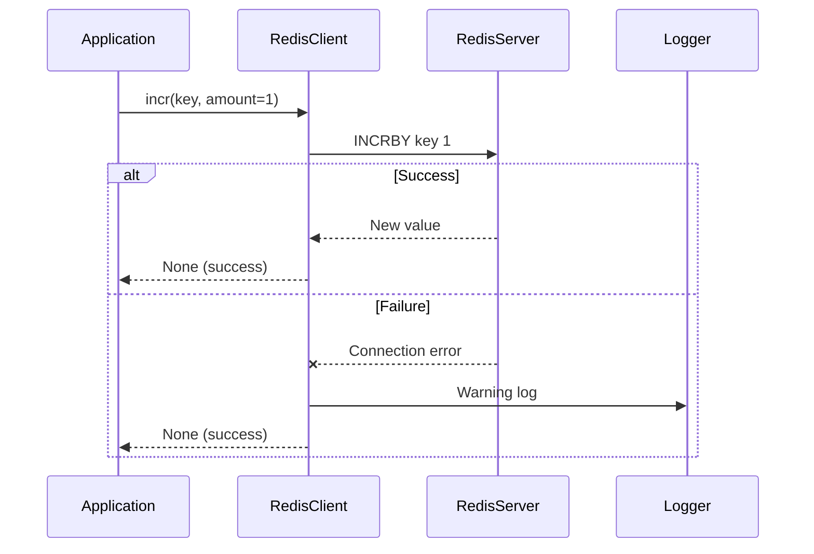
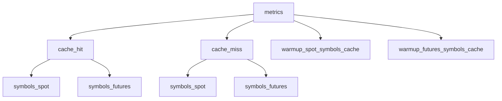
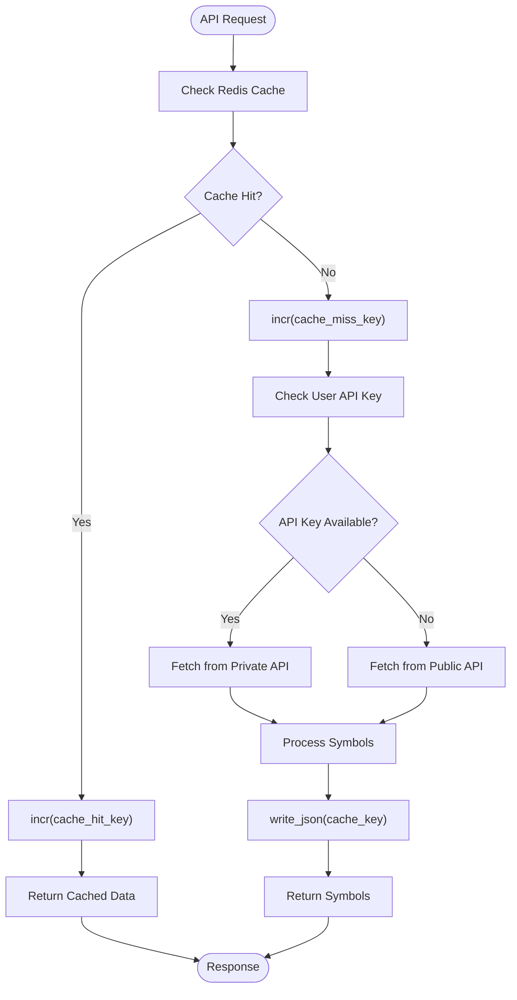

# Counter and Metrics Utilities

<cite>
**Referenced Files in This Document**   
- [redis_client.py](file://app/core/redis_client.py)
- [symbols.py](file://app/api/routes/symbols.py)
- [cache_warmup_tasks.py](file://app/core/cache_warmup_tasks.py)
</cite>

## Table of Contents
1. [Introduction](#introduction)
2. [Core Counter Functions](#core-counter-functions)
3. [Key Naming Conventions](#key-naming-conventions)
4. [Cache Hit/Miss Tracking Workflow](#cache-hitmiss-tracking-workflow)
5. [Error Resilience and Fallback Behavior](#error-resilience-and-fallback-behavior)
6. [Integration with Monitoring Systems](#integration-with-monitoring-systems)
7. [Extended Use Cases](#extended-use-cases)
8. [Best Practices](#best-practices)

## Introduction
The counter and metrics tracking utilities in the tradebot system provide atomic operations for real-time performance monitoring and operational analytics. Built on Redis, these utilities enable reliable, low-latency increment and retrieval operations that support critical functions such as cache hit/miss tracking for cryptocurrency trading symbols. The implementation ensures resilience against Redis failures while maintaining data consistency through atomic operations. This document details the architecture, usage patterns, and integration points of these utilities, focusing on their role in monitoring symbol cache performance for both spot and futures markets.

## Core Counter Functions

The `redis_client.py` module provides three primary functions for counter operations: `incr()`, `incr_sync()`, and `get_int_sync()`. These functions serve as wrappers around Redis atomic operations, ensuring thread-safe and reliable counter management.

The `incr()` function performs asynchronous increments using Redis's `INCRBY` command through an async Redis client. It accepts a key and an optional amount parameter (defaulting to 1) and attempts to increment the counter atomically. If Redis is unavailable, it logs a warning but does not propagate the error, maintaining application stability.

The `incr_sync()` function provides synchronous counter increment capability, using the sync Redis client. This is particularly useful in Celery tasks and other synchronous contexts where async operations are not appropriate. Like its async counterpart, it gracefully handles Redis connection issues by logging warnings without interrupting execution flow.

The `get_int_sync()` function retrieves counter values as integers, with built-in error handling. It attempts to fetch the value from Redis and convert it to an integer, returning 0 if the key doesn't exist or if any error occurs during retrieval. This fail-safe behavior ensures that monitoring systems can always obtain a valid numerical value, even in error conditions.

**Diagram sources**
- [redis_client.py](file://app/core/redis_client.py#L89-L96)
- [redis_client.py](file://app/core/redis_client.py#L98-L104)

**Section sources**
- [redis_client.py](file://app/core/redis_client.py#L89-L112)

## Key Naming Conventions

The system employs a consistent and descriptive key naming convention for metrics, following a hierarchical structure that enables easy filtering and aggregation. The pattern `metrics:<metric_type>:<context>` provides clear categorization of different counter types.

For cache hit tracking, the system defines specific constants for both spot and futures markets:
- `SPOT_SYMBOLS_CACHE_HIT_KEY` = "metrics:cache_hit:symbols_spot"
- `FUTURES_SYMBOLS_CACHE_HIT_KEY` = "metrics:cache_hit:symbols_futures"
- `SPOT_SYMBOLS_CACHE_MISS_KEY` = "metrics:cache_miss:symbols_spot" 
- `FUTURES_SYMBOLS_CACHE_MISS_KEY` = "metrics:cache_miss:symbols_futures"

This naming convention serves multiple purposes: it clearly identifies the metric type (cache_hit or cache_miss), specifies the market context (spot or futures), and indicates the subject (symbols). The hierarchical structure allows monitoring tools to easily query all cache-related metrics using pattern matching (e.g., `metrics:cache_*`), while also enabling precise targeting of specific metrics.

The use of constants rather than string literals throughout the codebase ensures consistency and prevents typos that could lead to fragmented metrics. These constants are imported and used across multiple modules, including API routes and background tasks, creating a unified metrics collection system.

**Diagram sources**
- [redis_client.py](file://app/core/redis_client.py#L116-L127)

**Section sources**
- [redis_client.py](file://app/core/redis_client.py#L116-L127)

## Cache Hit/Miss Tracking Workflow

The counter utilities are integrated into the symbol cache lookup workflow to provide real-time metrics on cache performance. When a client requests trading symbols, the system first attempts to retrieve them from Redis cache, incrementing appropriate counters based on the outcome.

In the `get_spot_symbols` and `get_futures_symbols` API endpoints, the workflow begins with a cache lookup using `read_json()`. If the requested symbols are found in cache, the system increments the corresponding cache hit counter using `incr()` and returns the cached data. If the data is not found, the system increments the cache miss counter and proceeds to fetch the symbols from Binance API.

The workflow demonstrates a multi-layered caching strategy with fallback mechanisms. After a cache miss, the system attempts to retrieve symbols using the user's API key if available, falling back to public endpoints if necessary. Throughout this process, various counters are incremented to track the success and failure rates of different retrieval methods.

**Diagram sources**
- [symbols.py](file://app/api/routes/symbols.py#L52-L133)
- [symbols.py](file://app/api/routes/symbols.py#L137-L247)

**Section sources**
- [symbols.py](file://app/api/routes/symbols.py#L52-L247)

## Error Resilience and Fallback Behavior

The counter system is designed with resilience as a primary concern, ensuring that Redis failures do not impact the core functionality of the application. Each counter operation is wrapped in try-except blocks that catch exceptions and log warnings without propagating errors to calling functions.

When Redis is unavailable, the `incr()` and `incr_sync()` functions simply log a warning message and continue execution. This fail-open approach prioritizes application availability over metrics collection, recognizing that operational functionality is more critical than monitoring data. The `get_int_sync()` function follows a similar pattern, returning 0 when Redis is unreachable, which allows monitoring dashboards to display zero values rather than failing entirely.

The system also implements a sophisticated fallback mechanism for cache data. When both the primary cache and live data retrieval fail, the system attempts to serve stale but valid data from a "last good" cache. This secondary cache stores previously successful responses and serves as a fallback when all other methods fail, ensuring that clients receive some data rather than encountering errors.

This resilience extends to the cache warming tasks, which run periodically to refresh symbol data. These Celery tasks include retry mechanisms with exponential backoff, ensuring that temporary Redis or API issues do not permanently disrupt the caching system. Success and failure metrics are themselves tracked with counters, providing visibility into the health of the cache warming process.

**Section sources**
- [redis_client.py](file://app/core/redis_client.py#L89-L112)
- [cache_warmup_tasks.py](file://app/core/cache_warmup_tasks.py#L41-L68)

## Integration with Monitoring Systems

The counter utilities are designed to integrate seamlessly with external monitoring and observability platforms. The structured key naming convention enables easy integration with time-series databases and visualization tools like Grafana, allowing teams to create dashboards that track cache performance over time.

The system exposes cache metrics through dedicated counters that can be scraped by monitoring agents. Key metrics include:
- Cache hit rates for spot and futures symbols
- Cache miss rates and their trends
- Cache warming task success and failure rates
- Last refresh timestamps for cache data

These metrics enable operations teams to monitor the health of the caching system, identify performance bottlenecks, and detect anomalies in system behavior. For example, a sudden drop in cache hit rate might indicate issues with the cache warming process or changes in user access patterns.

The atomic nature of Redis counter operations ensures data consistency even under high concurrency, making the metrics reliable for capacity planning and performance analysis. The synchronous and asynchronous counter variants allow different parts of the system to contribute to the same metrics regardless of their execution context.

**Section sources**
- [redis_client.py](file://app/core/redis_client.py#L89-L112)
- [cache_warmup_tasks.py](file://app/core/cache_warmup_tasks.py#L58-L63)

## Extended Use Cases

Beyond cache performance monitoring, the counter utilities support several other critical use cases within the trading system. The same infrastructure that tracks cache hits and misses can be adapted for various operational metrics and control mechanisms.

One significant use case is rate limiting, where counters track the number of API requests or trading operations over time. By incrementing counters with appropriate keys and time windows, the system can enforce rate limits and prevent abuse. For example, a counter like "rate_limit:user_123:api_calls" could track a specific user's API usage over a rolling window.

The utilities also support task execution tracking, particularly in the Celery-based background task system. Cache warming tasks use counters to track their success and failure rates, providing visibility into the reliability of these critical background operations. Custom metrics like "metrics:warmup_spot_symbols_cache:success" and "metrics:warmup_spot_symbols_cache:error" enable monitoring of task health.

Additionally, the counters can be used for feature usage analytics, tracking how often different trading strategies or system features are accessed. This data can inform product decisions and help identify popular or underutilized features. The atomic increment operations ensure accurate counting even when multiple instances of the application are running simultaneously.

**Section sources**
- [cache_warmup_tasks.py](file://app/core/cache_warmup_tasks.py#L58-L63)
- [redis_client.py](file://app/core/redis_client.py#L89-L112)

## Best Practices

The implementation demonstrates several best practices for metrics collection and counter management in distributed systems. These practices ensure reliability, maintainability, and effective monitoring.

First, the use of constants for metric keys prevents typos and ensures consistency across the codebase. Instead of using string literals throughout the application, developers import predefined constants, reducing the risk of creating duplicate or misspelled metrics.

Second, the system employs a fail-open approach to metrics collection, where counter failures do not impact primary functionality. This recognizes that monitoring is a secondary concern to operational reliability and prevents monitoring infrastructure issues from cascading into application failures.

Third, the hierarchical key naming convention enables effective data organization and querying. The structure "metrics:<type>:<context>" allows for both broad queries (e.g., all cache metrics) and specific targeting (e.g., spot symbol cache hits), making the data more valuable for analysis.

Fourth, the implementation separates synchronous and asynchronous counter operations, providing appropriate interfaces for different execution contexts. This prevents blocking operations in async code paths while still supporting synchronous use cases like Celery tasks.

Finally, the system combines atomic counters with periodic aggregation, enabling both real-time monitoring and historical analysis. The raw counter values can be used for immediate dashboards, while aggregated data can be processed for long-term trend analysis and reporting.

**Section sources**
- [redis_client.py](file://app/core/redis_client.py#L89-L127)
- [cache_warmup_tasks.py](file://app/core/cache_warmup_tasks.py#L58-L63)
- [symbols.py](file://app/api/routes/symbols.py#L52-L247)