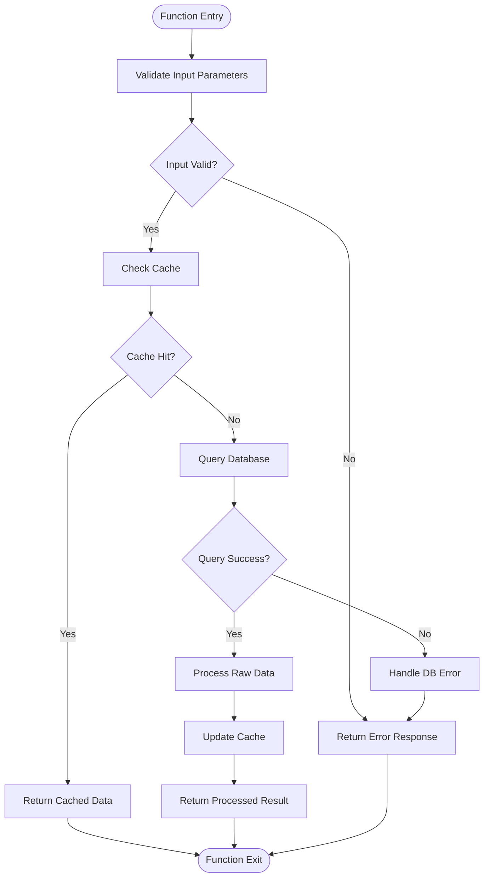
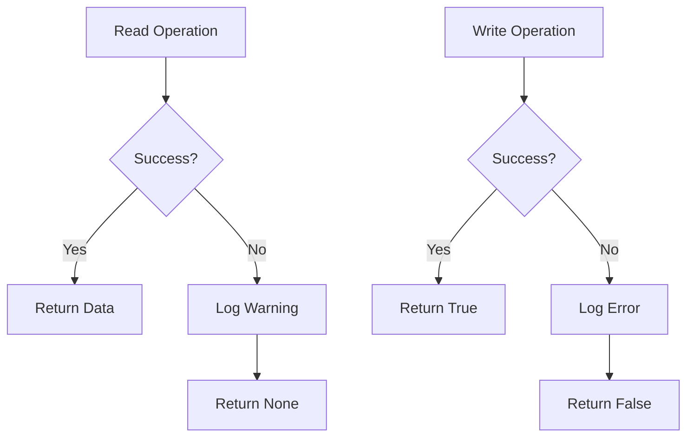
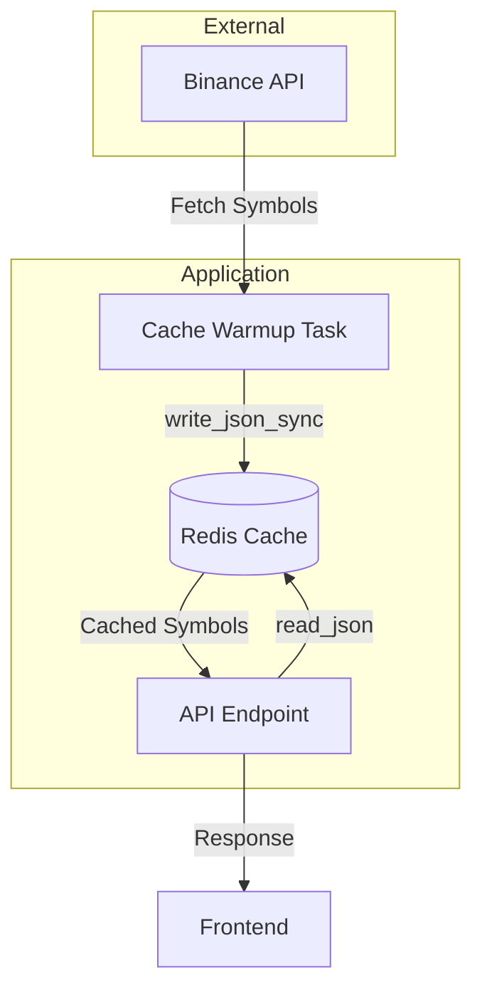

# JSON Serialization Helpers

<cite>
**Referenced Files in This Document**   
- [redis_client.py](file://app/core/redis_client.py)
- [cache_warmup_tasks.py](file://app/core/cache_warmup_tasks.py)
- [symbols.py](file://app/api/routes/symbols.py)
</cite>

## Table of Contents
1. [Introduction](#introduction)
2. [Core JSON Serialization Functions](#core-json-serialization-functions)
3. [Error Handling and Resilience](#error-handling-and-resilience)
4. [TTL and Cache Freshness](#ttl-and-cache-freshness)
5. [Integration with Binance Symbol Caching](#integration-with-binance-symbol-caching)
6. [Usage Patterns and Examples](#usage-patterns-and-examples)
7. [Troubleshooting Common Issues](#troubleshooting-common-issues)
8. [Optimization Recommendations](#optimization-recommendations)

## Introduction

The JSON serialization utilities in `redis_client.py` provide a robust interface for storing and retrieving complex Python objects in Redis. These utilities are central to the application's caching strategy, particularly for trading symbol metadata from Binance. The system implements both asynchronous and synchronous versions of read and write operations to accommodate different execution contexts within the application. This documentation details the functionality, error handling, integration points, and best practices for using these serialization helpers effectively.

**Section sources**
- [redis_client.py](file://app/core/redis_client.py#L36-L85)

## Core JSON Serialization Functions

The JSON serialization module provides four primary functions for interacting with Redis: `read_json()`, `write_json()`, `read_json_sync()`, and `write_json_sync()`. These functions handle the encoding and decoding of Python objects to and from JSON format for storage in Redis.

The asynchronous functions `read_json()` and `write_json()` are designed for use in async contexts, such as FastAPI route handlers, while their synchronous counterparts are intended for Celery tasks and other synchronous execution environments. All functions use Python's built-in `json` module for serialization, converting Python objects to JSON strings during writes and parsing JSON strings back to Python objects during reads.

**Diagram sources**
- [redis_client.py](file://app/core/redis_client.py#L36-L85)

**Section sources**
- [redis_client.py](file://app/core/redis_client.py#L36-L85)

## Error Handling and Resilience

The JSON serialization utilities implement a comprehensive error handling strategy to maintain system resilience during serialization issues. The error handling differs between read and write operations, reflecting their different criticality to application functionality.

For read operations (`read_json` and `read_json_sync`), exceptions are logged as warnings using `logger.warning()` and the functions return `None`. This graceful degradation allows the application to continue execution even when cache reads fail, falling back to alternative data sources or recomputing values. The warning logs include the specific key that failed, aiding in troubleshooting.

**Diagram sources**
- [redis_client.py](file://app/core/redis_client.py#L44-L46)
- [redis_client.py](file://app/core/redis_client.py#L70-L72)

For write operations (`write_json` and `write_json_sync`), exceptions are logged as errors using `logger.error()` and the functions return `False` to indicate failure. This distinction reflects the higher severity of write failures, which could lead to stale or missing cache data. The error logs provide detailed information about the failure, including the key and the specific exception, which is critical for monitoring and debugging.

**Section sources**
- [redis_client.py](file://app/core/redis_client.py#L44-L60)
- [redis_client.py](file://app/core/redis_client.py#L70-L86)

## TTL and Cache Freshness

Time-to-live (TTL) is a critical feature of the write operations, ensuring cache freshness and preventing stale data from persisting indefinitely. The `write_json` and `write_json_sync` functions accept an optional `ttl_seconds` parameter that specifies the duration (in seconds) for which the cached data should remain valid.

When a positive TTL value is provided, the Redis `SET` command is called with the `ex` parameter to automatically expire the key after the specified duration. This mechanism is essential for trading symbol metadata, which needs to be refreshed periodically to reflect current market conditions. The TTL values are typically configured through environment variables, allowing for runtime adjustments without code changes.

The combination of TTL with the cache warmup tasks ensures that symbol data is automatically refreshed at regular intervals, maintaining data accuracy while minimizing direct API calls to Binance. This approach balances performance and data freshness, reducing load on both the application and the external API.

**Section sources**
- [redis_client.py](file://app/core/redis_client.py#L53-L56)
- [redis_client.py](file://app/core/redis_client.py#L79-L82)

## Integration with Binance Symbol Caching

The JSON serialization utilities are tightly integrated with the Binance client for symbol caching, forming a critical part of the application's performance optimization strategy. The system caches both spot and futures trading symbols, using dedicated Redis keys for each cache type.

The `SPOT_SYMBOLS_CACHE_KEY` and `FUTURES_SYMBOLS_CACHE_KEY` constants define the Redis keys used for storing symbol metadata. These caches are populated by periodic Celery tasks in `cache_warmup_tasks.py`, which fetch symbol data from Binance and store it using the `write_json_sync` function. The API endpoints in `symbols.py` then retrieve this cached data using `read_json`, providing fast access to symbol information for frontend components.

**Diagram sources**
- [redis_client.py](file://app/core/redis_client.py#L116-L127)
- [cache_warmup_tasks.py](file://app/core/cache_warmup_tasks.py#L54-L55)
- [symbols.py](file://app/api/routes/symbols.py#L60-L61)

The system also maintains "last good" copies of the cache data in `SPOT_SYMBOLS_CACHE_LAST_GOOD_KEY` and `FUTURES_SYMBOLS_CACHE_LAST_GOOD_KEY`. These fallback caches are updated whenever a successful write occurs and are used when both the primary cache read and live data retrieval fail, providing an additional layer of resilience.

**Section sources**
- [redis_client.py](file://app/core/redis_client.py#L115-L127)
- [cache_warmup_tasks.py](file://app/core/cache_warmup_tasks.py#L56-L57)
- [symbols.py](file://app/api/routes/symbols.py#L128-L131)

## Usage Patterns and Examples

The JSON serialization utilities are used throughout the application in both asynchronous and synchronous contexts. In API routes, the asynchronous functions are used to serve cached symbol data with minimal latency. When a request arrives for symbol information, the system first attempts to read from the cache using `read_json`. If the cache contains valid data, it is returned immediately with a cache hit metric incremented. If the cache is empty or inaccessible, the system falls back to fetching data from Binance.

In the background, Celery tasks use the synchronous functions to periodically refresh the caches. The `warmup_spot_symbols_cache` and `warmup_futures_symbols_cache` tasks fetch fresh symbol data and write it to Redis using `write_json_sync` with a configured TTL. These tasks are scheduled to run at regular intervals, ensuring that the cache is proactively updated.

The integration between these components creates a robust caching layer that improves application performance while maintaining data accuracy. The use of separate async and sync functions allows the same serialization logic to be used across different execution contexts without blocking operations.

**Section sources**
- [symbols.py](file://app/api/routes/symbols.py#L59-L64)
- [cache_warmup_tasks.py](file://app/core/cache_warmup_tasks.py#L54-L55)

## Troubleshooting Common Issues

Common issues with the JSON serialization utilities typically fall into three categories: connection problems, serialization errors, and cache consistency issues.

Connection problems may occur if the Redis server is unreachable or misconfigured. These manifest as repeated warning logs from read operations and error logs from write operations. The first step in troubleshooting is to verify the `REDIS_URL` environment variable and ensure the Redis server is running and accessible from the application.

Serialization errors can occur when attempting to serialize complex Python objects that are not JSON serializable, such as datetime objects or custom classes without proper serialization methods. These errors appear in the logs with details about the specific object that failed to serialize. To resolve these issues, ensure that all objects being cached are properly converted to JSON-serializable formats before calling the write functions.

Cache consistency issues may arise when the TTL is set too high, leading to stale data, or too low, causing excessive cache misses. Monitoring the cache hit and miss metrics can help identify these issues. The system's fallback to "last good" cache data provides resilience during temporary failures, but persistent issues should be investigated by examining the error logs and cache warmup task execution.

**Section sources**
- [redis_client.py](file://app/core/redis_client.py#L44-L46)
- [redis_client.py](file://app/core/redis_client.py#L58-L60)

## Optimization Recommendations

To optimize the performance of the JSON serialization utilities, consider the following recommendations:

1. **Minimize serialization overhead**: Ensure that only necessary data is cached. Large or complex objects increase serialization time and memory usage. Consider simplifying data structures or caching only essential fields.

2. **Tune TTL values**: Adjust the TTL based on how frequently the underlying data changes. For trading symbols, a TTL of 300 seconds (5 minutes) is reasonable, but this should be monitored and adjusted based on cache hit rates and data freshness requirements.

3. **Monitor cache metrics**: The system includes metrics for cache hits and misses. Regularly monitor these metrics to identify performance issues and optimize caching strategies.

4. **Handle large datasets efficiently**: For very large symbol lists, consider implementing pagination or filtering at the cache level to reduce the size of individual cache entries and improve retrieval performance.

5. **Ensure proper error handling**: While the current error handling is robust, ensure that applications using these utilities properly handle the `None` return value from read operations and the `False` return value from write operations.

These optimizations can help maintain high performance and reliability of the caching system, particularly under heavy load or during periods of high market volatility when symbol data may change more frequently.

**Section sources**
- [redis_client.py](file://app/core/redis_client.py#L48-L59)
- [redis_client.py](file://app/core/redis_client.py#L74-L85)