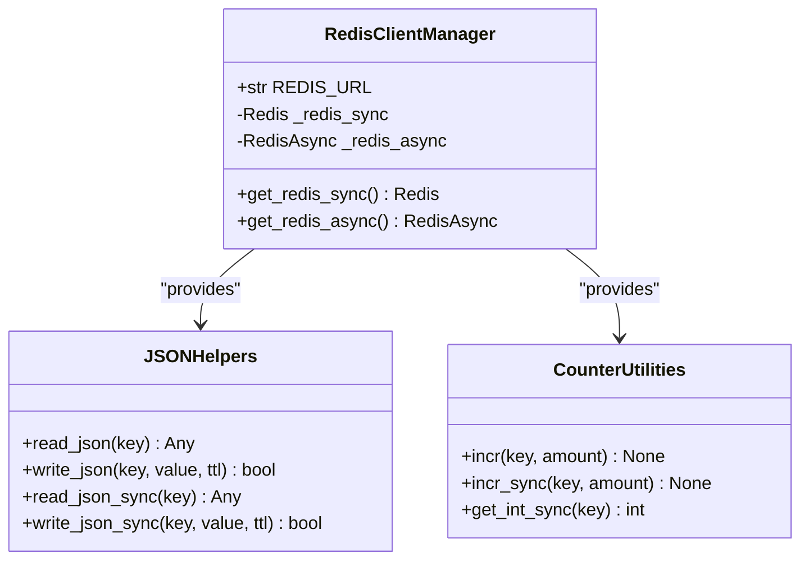
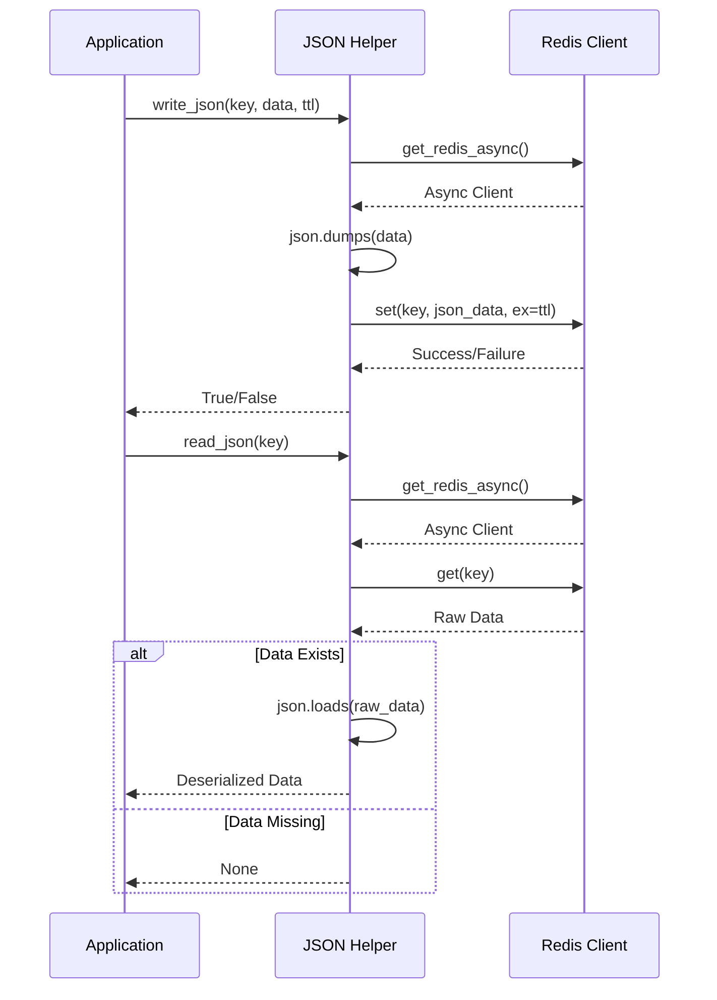
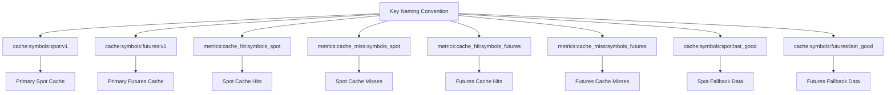

# Redis Client Implementation

<cite>
**Referenced Files in This Document**   
- [app/core/redis_client.py](file://app/core/redis_client.py)
- [app/core/cache_warmup_tasks.py](file://app/core/cache_warmup_tasks.py)
- [app/api/routes/symbols.py](file://app/api/routes/symbols.py)
</cite>

## Table of Contents
1. [Introduction](#introduction)
2. [Singleton Client Initialization](#singleton-client-initialization)
3. [Connection String Resolution](#connection-string-resolution)
4. [JSON Serialization Helpers](#json-serialization-helpers)
5. [Counter Utilities](#counter-utilities)
6. [Key Naming Conventions](#key-naming-conventions)
7. [Usage Examples](#usage-examples)
8. [Conclusion](#conclusion)

## Introduction
The Redis client implementation in the trading bot application provides a robust caching and metrics infrastructure for managing trading symbol data and tracking cache performance. This document details the architecture and functionality of the Redis client system, focusing on its singleton pattern implementation, connection management, serialization utilities, and key usage patterns for both spot and futures trading symbols.

**Section sources**
- [app/core/redis_client.py](file://app/core/redis_client.py#L1-L129)

## Singleton Client Initialization

The Redis client implementation employs a singleton pattern to ensure efficient resource utilization and consistent client behavior across the application. Two separate client instances are maintained: one asynchronous client (_redis_async) for async operations and one synchronous client (_redis_sync) for sync operations.

The `get_redis_async()` function initializes and returns the asynchronous Redis client instance. When first called, it creates a new client using the resolved Redis URL with UTF-8 encoding and response decoding enabled. Subsequent calls return the same instance, ensuring singleton behavior. Similarly, the `get_redis_sync()` function manages the synchronous Redis client instance with identical initialization parameters.

This dual-client approach allows the application to handle both asynchronous API requests and synchronous background tasks efficiently, with each client type optimized for its respective execution context.

**Diagram sources**
- [app/core/redis_client.py](file://app/core/redis_client.py#L14-L32)

**Section sources**
- [app/core/redis_client.py](file://app/core/redis_client.py#L14-L32)

## Connection String Resolution

The Redis client implements a hierarchical connection string resolution mechanism that prioritizes configuration flexibility and deployment compatibility. The connection URL is determined through an ordered fallback strategy:

The system first checks for the `REDIS_URL` environment variable, which represents the preferred and explicit Redis connection configuration. If this variable is not set, the system falls back to checking the `CELERY_BROKER_URL` environment variable, enabling shared Redis infrastructure between the application and Celery task processing. If neither environment variable is defined, the system defaults to a local Redis instance at `redis://localhost:6379/0`.

This resolution strategy ensures seamless integration with Celery's configuration while maintaining the ability to specify a dedicated Redis URL when needed. The implementation promotes deployment flexibility, allowing the same codebase to work in development, testing, and production environments with minimal configuration changes.

**Section sources**
- [app/core/redis_client.py](file://app/core/redis_client.py#L11-L12)

## JSON Serialization Helpers

The Redis client provides comprehensive JSON serialization helpers for both asynchronous and synchronous operations, enabling seamless storage and retrieval of complex data structures. These helpers abstract the serialization process, error handling, and logging to provide a reliable interface for Redis operations.

The asynchronous helpers `read_json()` and `write_json()` support non-blocking operations suitable for API endpoints. The `read_json()` function attempts to retrieve and deserialize JSON data from Redis, returning None if the key doesn't exist or if deserialization fails. The `write_json()` function serializes Python objects to JSON strings and stores them in Redis, with optional TTL (time-to-live) parameters for automatic expiration.

Corresponding synchronous versions `read_json_sync()` and `write_json_sync()` provide similar functionality for background tasks and Celery workers. Both sets of functions include comprehensive error handling with appropriate logging levels—warnings for read failures and errors for write failures—enabling effective monitoring and troubleshooting of Redis operations.

**Diagram sources**
- [app/core/redis_client.py](file://app/core/redis_client.py#L36-L85)

**Section sources**
- [app/core/redis_client.py](file://app/core/redis_client.py#L36-L85)

## Counter Utilities

The Redis client implements atomic counter utilities for tracking metrics and operational statistics. These utilities leverage Redis's atomic operations to ensure data consistency in concurrent environments.

The `incr()` function provides asynchronous increment capability, using Redis's INCRBY command to atomically increase a counter value by a specified amount (defaulting to 1). This function is designed for use in API endpoints and other async contexts. Similarly, the `incr_sync()` function provides synchronous increment operations for background tasks and Celery workers.

The `get_int_sync()` function complements the increment operations by retrieving counter values and safely converting them to integers. It handles cases where the key doesn't exist or the value cannot be converted, returning 0 in such scenarios. This defensive programming approach prevents application errors due to missing or malformed counter data.

These counter utilities are essential for tracking cache hit/miss ratios, monitoring task execution success/failure rates, and collecting other performance metrics that inform system health and optimization opportunities.

**Section sources**
- [app/core/redis_client.py](file://app/core/redis_client.py#L89-L111)

## Key Naming Conventions

The Redis client defines standardized key naming conventions for caching trading symbols and tracking related metrics. These conventions follow a clear hierarchical structure that indicates the data type, purpose, and scope of each key.

For spot trading symbols, the primary cache key `SPOT_SYMBOLS_CACHE_KEY` uses the pattern "cache:symbols:spot:v1", with "v1" indicating the schema version to support future migrations. The system also maintains a fallback key `SPOT_SYMBOLS_CACHE_LAST_GOOD_KEY` to store the last successfully retrieved symbol list for use during API failures.

Cache performance metrics are tracked using dedicated keys with the "metrics:cache_hit" and "metrics:cache_miss" prefixes. The `SPOT_SYMBOLS_CACHE_HIT_KEY` and `SPOT_SYMBOLS_CACHE_MISS_KEY` enable monitoring of cache effectiveness for spot symbols. Additionally, a timestamp key `SPOT_SYMBOLS_CACHE_LAST_REFRESH_TS_KEY` records the last successful cache update time.

A parallel set of keys exists for futures trading symbols, following the same naming pattern with "futures" instead of "spot". This consistent naming strategy enables easy identification, management, and monitoring of cache-related data across different trading instrument types.

**Diagram sources**
- [app/core/redis_client.py](file://app/core/redis_client.py#L115-L127)

**Section sources**
- [app/core/redis_client.py](file://app/core/redis_client.py#L115-L127)

## Usage Examples

The Redis client is extensively used throughout the application for caching trading symbols and tracking cache performance metrics. The implementation follows a comprehensive strategy that combines proactive cache warming with reactive API fallbacks.

In the cache warming process, background tasks use the synchronous Redis client to populate caches with fresh symbol data. The `warmup_spot_symbols_cache()` and `warmup_futures_symbols_cache()` functions in `cache_warmup_tasks.py` retrieve symbol lists from Binance's public API, process them, and store them in Redis using `write_json_sync()`. These tasks also update the "last good" fallback data and increment success/error counters using `incr_sync()`.

The API endpoints for retrieving trading symbols implement a sophisticated caching strategy. When a request arrives, the system first attempts to read from the Redis cache using `read_json()`. If successful, it increments the cache hit counter using `incr()`. On cache misses, the system retrieves data from Binance's API (using user credentials when available, falling back to public endpoints), processes the results, and writes them to cache with appropriate TTL using `write_json()`.

The system also implements a robust fallback mechanism. When all data retrieval methods fail, it attempts to serve the last known good data from `SPOT_SYMBOLS_CACHE_LAST_GOOD_KEY` or `FUTURES_SYMBOLS_CACHE_LAST_GOOD_KEY`, ensuring continuous service availability even during external API outages.

**Section sources**
- [app/core/redis_client.py](file://app/core/redis_client.py#L1-L129)
- [app/core/cache_warmup_tasks.py](file://app/core/cache_warmup_tasks.py#L1-L128)
- [app/api/routes/symbols.py](file://app/api/routes/symbols.py#L1-L249)

## Conclusion
The Redis client implementation provides a comprehensive caching solution that enhances application performance, reliability, and scalability. By implementing singleton patterns for both synchronous and asynchronous clients, the system efficiently manages Redis connections while supporting both API endpoints and background tasks. The hierarchical connection string resolution ensures deployment flexibility, while the JSON serialization helpers abstract complexity and provide robust error handling. The standardized key naming conventions and counter utilities enable effective monitoring and maintenance of cache performance for both spot and futures trading symbols. This well-structured implementation demonstrates a thoughtful approach to caching that balances performance optimization with system resilience.