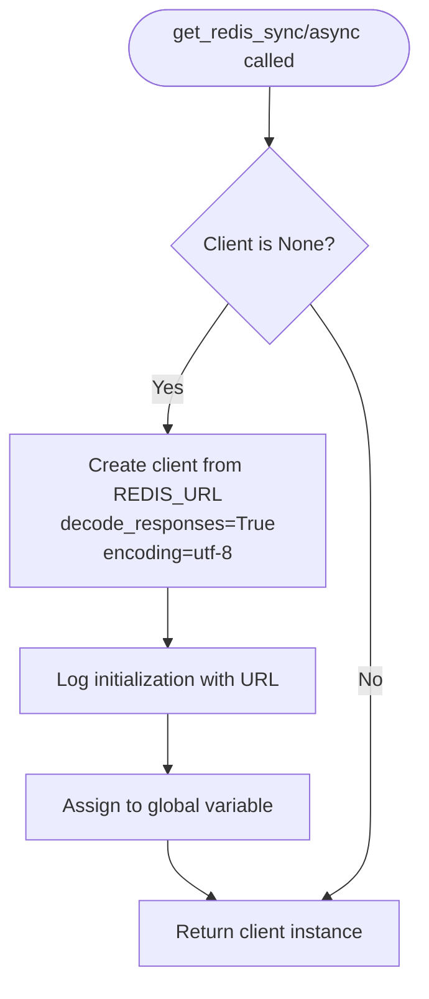
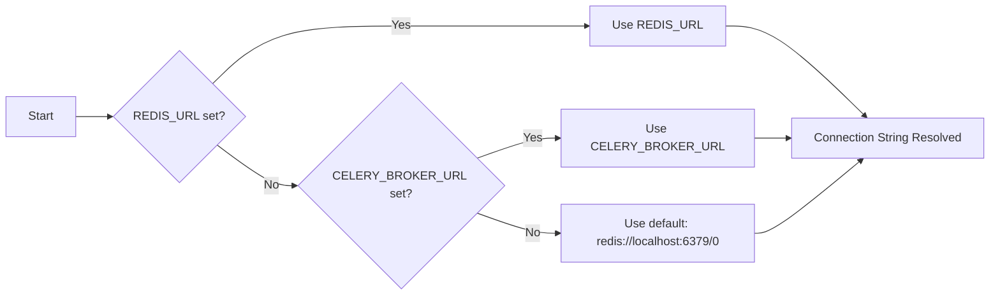
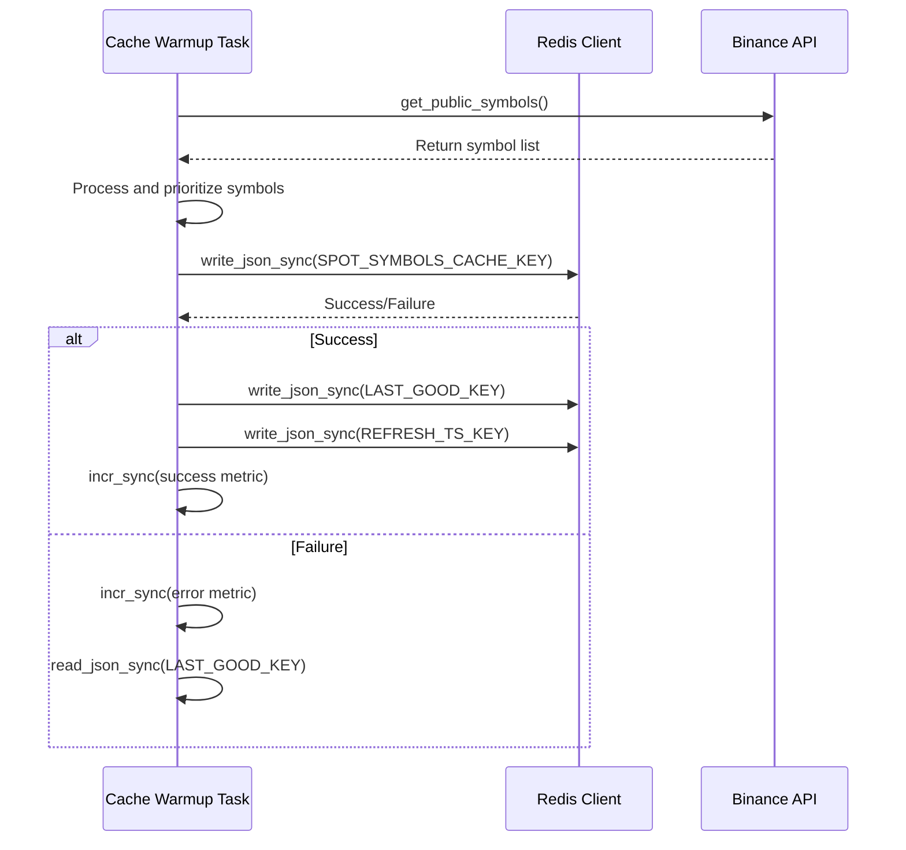
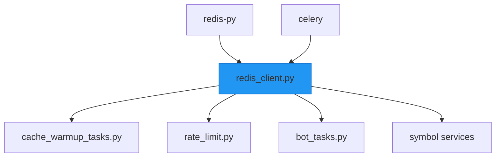

# Redis Connection Management

<cite>
**Referenced Files in This Document**   
- [redis_client.py](file://app/core/redis_client.py)
- [cache_warmup_tasks.py](file://app/core/cache_warmup_tasks.py)
- [celery_app.py](file://app/core/celery_app.py)
</cite>

## Table of Contents
1. [Introduction](#introduction)
2. [Core Components](#core-components)
3. [Architecture Overview](#architecture-overview)
4. [Detailed Component Analysis](#detailed-component-analysis)
5. [Dependency Analysis](#dependency-analysis)
6. [Performance Considerations](#performance-considerations)
7. [Troubleshooting Guide](#troubleshooting-guide)
8. [Conclusion](#conclusion)

## Introduction
The Redis connection management system in the tradebot application provides a centralized, efficient mechanism for both synchronous and asynchronous Redis interactions. This documentation details the implementation of singleton pattern clients, connection string resolution, initialization logic, and usage patterns across the application. The system ensures consistent connectivity for critical operations including symbol data caching and Celery task execution, while providing robust error handling and configuration flexibility for different deployment environments.

## Core Components
The Redis connection management system consists of two primary singleton clients: a synchronous client (_redis_sync) and an asynchronous client (_redis_async). These clients are initialized through the get_redis_sync() and get_redis_async() functions respectively, which implement lazy initialization to ensure thread-safe global instance handling. The system uses a unified connection string resolution mechanism that prioritizes REDIS_URL with a fallback to CELERY_BROKER_URL, ensuring compatibility across services. Additional utility functions provide JSON serialization, counter operations, and standardized key naming for symbol caching and metrics.

**Section sources**
- [redis_client.py](file://app/core/redis_client.py#L1-L129)

## Architecture Overview
The Redis connection management system serves as a foundational service layer that integrates with multiple application components. It provides connectivity for Celery task execution, symbol data caching, rate limiting, and metrics collection. The architecture follows a singleton pattern to prevent connection proliferation and ensure consistent state across the application.

```mermaid
graph TB
subgraph "Application Services"
A[Cache Warmup Tasks]
B[Celery Tasks]
C[Rate Limiting]
D[Symbol Data Caching]
end
subgraph "Redis Connection Layer"
E[get_redis_sync()]
F[get_redis_async()]
G[Connection String Resolution]
end
subgraph "Redis Backend"
H[(Redis Server)]
end
A --> E
B --> E
C --> E
F --> H
E --> H
G --> E
G --> F
style E fill:#4CAF50,stroke:#388E3C
style F fill:#4CAF50,stroke:#388E3C
```

**Diagram sources**
- [redis_client.py](file://app/core/redis_client.py#L1-L129)
- [cache_warmup_tasks.py](file://app/core/cache_warmup_tasks.py#L1-L128)
- [celery_app.py](file://app/core/celery_app.py#L1-L44)

## Detailed Component Analysis

### Redis Client Initialization
The Redis client initialization process implements a thread-safe singleton pattern for both synchronous and asynchronous clients. The initialization occurs lazily when the client is first accessed, ensuring resources are only allocated when needed.



**Diagram sources**
- [redis_client.py](file://app/core/redis_client.py#L18-L33)

**Section sources**
- [redis_client.py](file://app/core/redis_client.py#L18-L33)

### Connection String Resolution
The system resolves the Redis connection string through a hierarchical environment variable lookup. This ensures consistent connectivity across services by sharing configuration with Celery.



**Diagram sources**
- [redis_client.py](file://app/core/redis_client.py#L12)

### Symbol Data Caching Implementation
The system implements a comprehensive symbol data caching mechanism that utilizes the Redis clients for storing and retrieving market symbol information. This caching is critical for application performance and is managed through periodic warm-up tasks.



**Diagram sources**
- [cache_warmup_tasks.py](file://app/core/cache_warmup_tasks.py#L41-L68)
- [redis_client.py](file://app/core/redis_client.py#L74-L85)

**Section sources**
- [cache_warmup_tasks.py](file://app/core/cache_warmup_tasks.py#L41-L128)
- [redis_client.py](file://app/core/redis_client.py#L74-L85)

## Dependency Analysis
The Redis connection management system has dependencies on the Redis Python client library and integrates with Celery for task execution. It is depended upon by multiple application components including cache warmup tasks, rate limiting, and symbol data services. The system shares configuration with Celery through the use of common environment variables.



**Diagram sources**
- [redis_client.py](file://app/core/redis_client.py)
- [cache_warmup_tasks.py](file://app/core/cache_warmup_tasks.py)
- [celery_app.py](file://app/core/celery_app.py)

**Section sources**
- [redis_client.py](file://app/core/redis_client.py)
- [cache_warmup_tasks.py](file://app/core/cache_warmup_tasks.py)
- [celery_app.py](file://app/core/celery_app.py)

## Performance Considerations
The Redis connection management system is designed with performance optimization in mind. The singleton pattern prevents connection proliferation, effectively implementing connection pooling through shared client instances. The decode_responses=True parameter ensures string responses are automatically decoded, reducing processing overhead. The system uses appropriate TTL values for cached data to balance freshness and performance. The asynchronous client enables non-blocking operations for improved throughput in I/O-bound scenarios. Connection initialization is lazy, minimizing startup overhead.

**Section sources**
- [redis_client.py](file://app/core/redis_client.py#L21-L22)
- [redis_client.py](file://app/core/redis_client.py#L30-L31)

## Troubleshooting Guide
Common connection issues include network timeouts, authentication failures, and configuration mismatches. The system includes comprehensive logging that records client initialization with the resolved URL, helping diagnose configuration issues. Error handling is implemented at multiple levels: write operations log errors, while read operations log warnings and return None on failure. In production environments, ensure REDIS_URL or CELERY_BROKER_URL is properly configured with authentication credentials. For development, the default localhost connection can be used. Connection issues in Celery tasks often indicate Redis unavailability, which can be verified using the provided redis_ping.py script.

**Section sources**
- [redis_client.py](file://app/core/redis_client.py#L44-L46)
- [redis_client.py](file://app/core/redis_client.py#L58-L60)
- [redis_client.py](file://app/core/redis_client.py#L71-L72)
- [redis_ping.py](file://scripts/redis_ping.py)

## Conclusion
The Redis connection management system provides a robust, efficient foundation for Redis interactions in the tradebot application. Through the implementation of singleton pattern clients, unified connection string resolution, and comprehensive error handling, the system ensures reliable connectivity for critical operations. The integration with Celery and symbol data caching demonstrates its central role in the application architecture. Proper environment configuration and monitoring of connection logs are essential for maintaining system reliability in production environments.