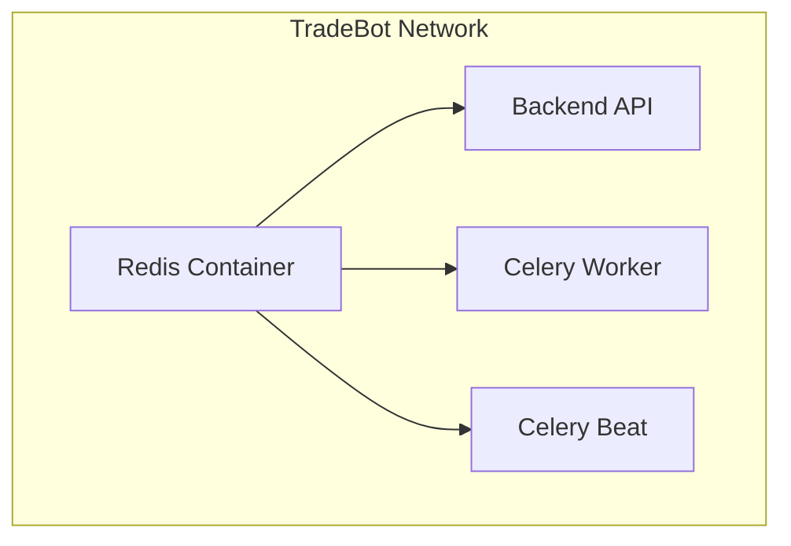
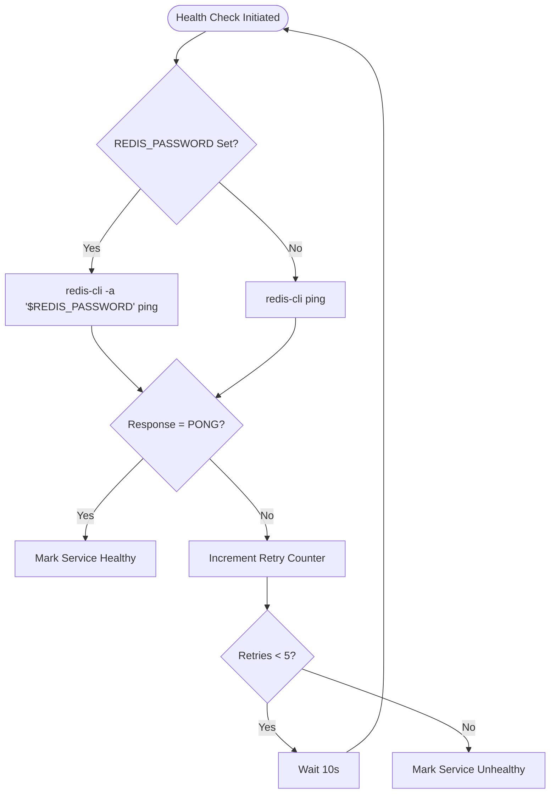
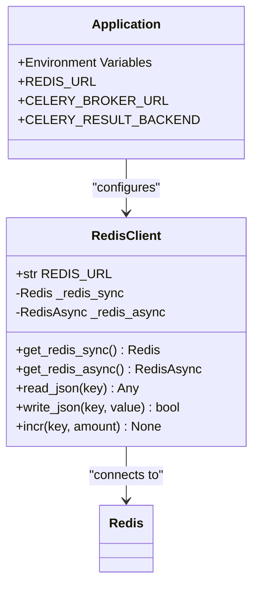
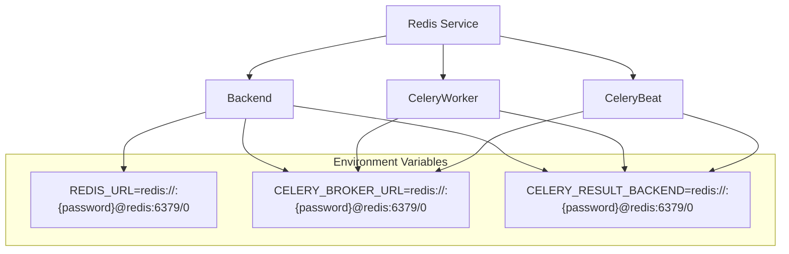

# Redis Configuration

<cite>
**Referenced Files in This Document**   
- [docker-compose.yml](file://docker-compose.yml)
- [app/core/redis_client.py](file://app/core/redis_client.py)
- [scripts/redis_ping.py](file://scripts/redis_ping.py)
</cite>

## Table of Contents
1. [Introduction](#introduction)
2. [Redis Container Configuration](#redis-container-configuration)
3. [Authentication and Security](#authentication-and-security)
4. [Health Check Implementation](#health-check-implementation)
5. [Data Persistence and Durability](#data-persistence-and-durability)
6. [Application Integration](#application-integration)
7. [Service Dependencies](#service-dependencies)
8. [Conclusion](#conclusion)

## Introduction
The Redis service in the TradeBot system serves as a critical component for caching, rate limiting, and task queuing. This document provides comprehensive architectural documentation of the Redis configuration as defined in the docker-compose.yml file and integrated throughout the application. The configuration emphasizes security through password protection, ensures data durability through append-only file persistence, and implements robust health checking to maintain service reliability. The Redis instance is tightly integrated with the application's configuration system through environment variables that are shared across multiple services.

## Redis Container Configuration
The Redis service is configured as a Docker container using the official Redis 7-alpine image, providing a lightweight and secure foundation. The container is assigned the name "tradebot-redis" and is configured to restart automatically unless explicitly stopped, ensuring high availability. The service is exposed on port 6379, the standard Redis port, allowing both internal container communication and external access when needed. The container is isolated within the "tradebot-network" Docker network, enabling secure communication with other services in the ecosystem while maintaining network separation from external systems.

**Diagram sources**
- [docker-compose.yml](file://docker-compose.yml#L29-L38)

**Section sources**
- [docker-compose.yml](file://docker-compose.yml#L29-L38)

## Authentication and Security
The Redis service implements password-based authentication through the REDIS_PASSWORD environment variable, which is dynamically generated during system installation and stored in the .env file. The authentication mechanism is conditional: when the REDIS_PASSWORD environment variable is set, the Redis server is launched with the --requirepass flag to enforce password authentication. This approach provides flexibility for different deployment environments while maintaining security in production. The password is automatically generated with 24 characters of randomness during the installation process, ensuring strong cryptographic security.

**Section sources**
- [docker-compose.yml](file://docker-compose.yml#L40)
- [install.sh](file://install.sh#L180-L204)
- [setup_env.py](file://scripts/setup_env.py#L44-L75)

## Health Check Implementation
The Redis service includes a sophisticated health check mechanism that adapts to the authentication configuration. The health check command uses a shell conditional to determine whether authentication is enabled: if the REDIS_PASSWORD environment variable is set, the health check uses redis-cli with the -a flag to authenticate before sending the PING command; otherwise, it sends an unauthenticated PING. This adaptive approach ensures reliable health monitoring regardless of the authentication configuration. The health check runs every 10 seconds with a 5-second timeout and allows 5 retries before marking the service as unhealthy, providing a balance between responsiveness and resilience to transient issues.

**Diagram sources**
- [docker-compose.yml](file://docker-compose.yml#L42-L45)

**Section sources**
- [docker-compose.yml](file://docker-compose.yml#L42-L45)

## Data Persistence and Durability
The Redis configuration prioritizes data durability through append-only file (AOF) persistence. The container command conditionally enables AOF persistence by including the --appendonly yes flag in the redis-server startup command, regardless of whether password authentication is enabled. Data persistence is achieved through volume mounting, with the Redis data directory (/data) mounted to the Docker volume "redis_data". This volume configuration ensures that Redis data survives container restarts and deployments, providing data continuity across service lifecycle events. The combination of AOF persistence and volume mounting creates a robust data durability strategy that protects against data loss.

**Section sources**
- [docker-compose.yml](file://docker-compose.yml#L36)
- [docker-compose.yml](file://docker-compose.yml#L46-L47)

## Application Integration
The Redis service is seamlessly integrated into the application through a centralized configuration system using environment variables. The REDIS_URL environment variable defines the connection string for Redis, including the password when authentication is enabled. This URL follows the format redis://:{password}@redis:6379/0, using the service name "redis" for DNS resolution within the Docker network. The application's Redis client, implemented in redis_client.py, retrieves the connection URL from the REDIS_URL environment variable, with a fallback to CELERY_BROKER_URL if REDIS_URL is not set. This integration pattern ensures consistent Redis connectivity across the application.

**Diagram sources**
- [app/core/redis_client.py](file://app/core/redis_client.py#L12)
- [app/core/redis_client.py](file://app/core/redis_client.py#L18-L33)

**Section sources**
- [app/core/redis_client.py](file://app/core/redis_client.py#L1-L129)
- [docker-compose.yml](file://docker-compose.yml#L59-L62)

## Service Dependencies
Multiple services in the TradeBot system depend on the Redis instance for various functionality. The backend API service uses Redis for caching market data, rate limiting, and storing application state. The Celery worker and Celery beat services use Redis as both a message broker (CELERY_BROKER_URL) and result backend (CELERY_RESULT_BACKEND) for distributed task processing. All dependent services configure their Redis connections through environment variables that are set in the docker-compose.yml file. The dependency structure includes health-based startup ordering, ensuring that services only start after Redis has passed its health check, preventing connection failures during service initialization.

**Diagram sources**
- [docker-compose.yml](file://docker-compose.yml#L49-L102)
- [docker-compose.yml](file://docker-compose.yml#L105-L145)

**Section sources**
- [docker-compose.yml](file://docker-compose.yml#L49-L188)

## Conclusion
The Redis configuration in the TradeBot system demonstrates a well-architected approach to database service deployment, balancing security, reliability, and performance. The use of conditional authentication based on environment variables provides deployment flexibility while maintaining security best practices. The adaptive health check mechanism ensures reliable service monitoring across different configuration scenarios. Data durability is prioritized through AOF persistence and Docker volume mounting, protecting against data loss. The centralized configuration through environment variables enables consistent integration across multiple services, while the network isolation provides security boundaries. This comprehensive configuration establishes Redis as a robust and reliable component of the TradeBot ecosystem.