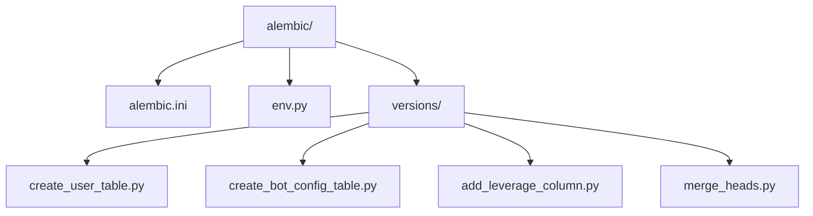
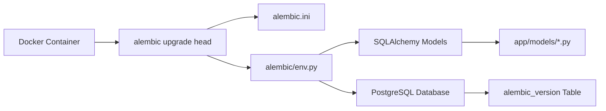
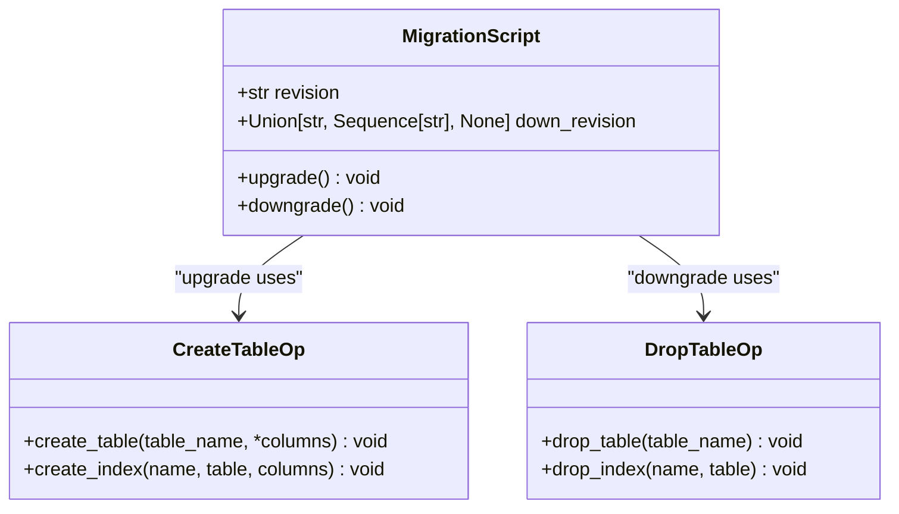
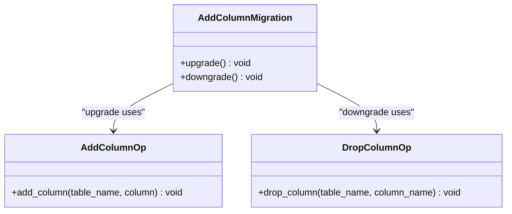
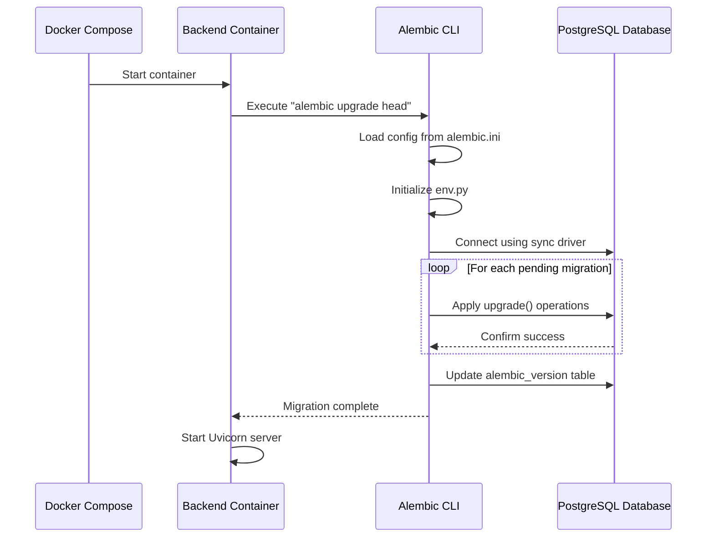
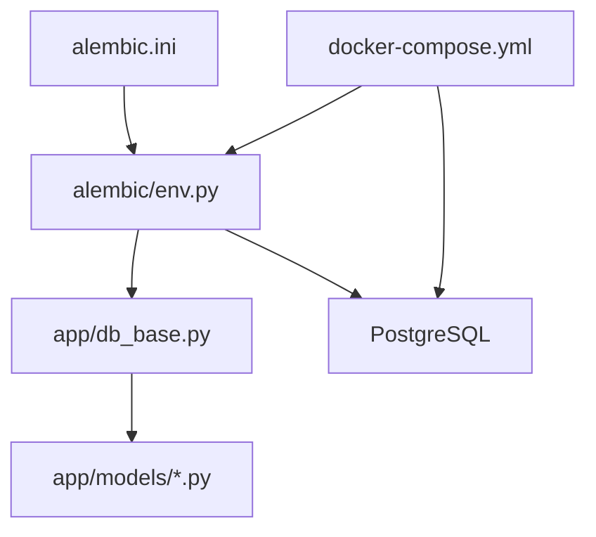

# Database Migration System

<cite>
**Referenced Files in This Document**   
- [alembic/env.py](file://alembic/env.py)
- [alembic.ini](file://alembic.ini)
- [docker-compose.yml](file://docker-compose.yml)
- [app/db_base.py](file://app/db_base.py)
- [app/models/user.py](file://app/models/user.py)
- [app/models/bot_config.py](file://app/models/bot_config.py)
- [app/models/trade.py](file://app/models/trade.py)
- [app/models/backtest.py](file://app/models/backtest.py)
- [app/models/api_key.py](file://app/models/api_key.py)
- [alembic/versions/30d6391a9fcf_create_user_table.py](file://alembic/versions/30d6391a9fcf_create_user_table.py)
- [alembic/versions/19adfce0d2a6_create_bot_config_table.py](file://alembic/versions/19adfce0d2a6_create_bot_config_table.py)
- [alembic/versions/7354d6bd11ea_create_trade_table.py](file://alembic/versions/7354d6bd11ea_create_trade_table.py)
- [alembic/versions/8dff47bdfa5f_create_backtest_table_fixed.py](file://alembic/versions/8dff47bdfa5f_create_backtest_table_fixed.py)
- [alembic/versions/4b2e65b4c85b_create_api_key_table.py](file://alembic/versions/4b2e65b4c85b_create_api_key_table.py)
- [alembic/versions/e2cbe40c4a2c_create_bot_state_table.py](file://alembic/versions/e2cbe40c4a2c_create_bot_state_table.py)
- [alembic/versions/107856acfca7_add_leverage_column_to_bot_configs.py](file://alembic/versions/107856acfca7_add_leverage_column_to_bot_configs.py)
- [alembic/versions/59a0e8d02f5a_add_strategy_and_ema_period_to_bot_.py](file://alembic/versions/59a0e8d02f5a_add_strategy_and_ema_period_to_bot_.py)
- [alembic/versions/92c67f02186c_add_realized_pnl_to_trade.py](file://alembic/versions/92c67f02186c_add_realized_pnl_to_trade.py)
- [alembic/versions/3742c83cd3b1_add_advanced_bot_parameters.py](file://alembic/versions/3742c83cd3b1_add_advanced_bot_parameters.py)
- [alembic/versions/69694099e14e_add_api_key_id_to_bot_config.py](file://alembic/versions/69694099e14e_add_api_key_id_to_bot_config.py)
- [alembic/versions/a1b2c3d4e5f6_add_market_type_to_backtests.py](file://alembic/versions/a1b2c3d4e5f6_add_market_type_to_backtests.py)
- [alembic/versions/d24f9f7e7532_add_reset_token_fields_to_users.py](file://alembic/versions/d24f9f7e7532_add_reset_token_fields_to_users.py)
- [alembic/versions/b7e3f2c1a9d8_merge_heads_d24f_a1b2.py](file://alembic/versions/b7e3f2c1a9d8_merge_heads_d24f_a1b2.py)
</cite>

## Table of Contents
1. [Introduction](#introduction)
2. [Project Structure](#project-structure)
3. [Core Components](#core-components)
4. [Architecture Overview](#architecture-overview)
5. [Detailed Component Analysis](#detailed-component-analysis)
6. [Dependency Analysis](#dependency-analysis)
7. [Performance Considerations](#performance-considerations)
8. [Troubleshooting Guide](#troubleshooting-guide)
9. [Conclusion](#conclusion)

## Introduction
This document provides comprehensive documentation for the Alembic-based database migration system in the TradeBot application. The system enables incremental schema evolution through version-controlled migration scripts, ensuring database consistency across development, testing, and production environments. The migration process is automated during container startup via Docker Compose, where the command `alembic upgrade head` synchronizes the database schema to the latest version. This documentation details the structure and execution of migration scripts, key schema changes, configuration files, and best practices for managing database evolution in a distributed development environment.

## Project Structure
The database migration system is organized under the `alembic/` directory, which contains configuration files and a `versions/` subdirectory housing individual migration scripts. Each migration script is timestamped and uniquely identified, enabling ordered application of schema changes. The core components include:
- `alembic.ini`: Configuration file for Alembic settings
- `alembic/env.py`: Environment script that connects Alembic to the application's SQLAlchemy models
- `alembic/versions/`: Directory containing individual migration scripts

The migration scripts are Python files that define `upgrade()` and `downgrade()` functions to apply and reverse schema changes. These scripts are generated automatically using Alembic's autogenerate feature or created manually for complex data migrations.



**Diagram sources**
- [alembic.ini](file://alembic.ini)
- [alembic/env.py](file://alembic/env.py)
- [alembic/versions/](file://alembic/versions/)

**Section sources**
- [alembic.ini](file://alembic.ini)
- [alembic/env.py](file://alembic/env.py)
- [alembic/versions/](file://alembic/versions/)

## Core Components
The core components of the database migration system include the Alembic configuration, environment setup, and migration scripts that define schema changes. The system leverages SQLAlchemy models defined in `app/models/` to generate and apply migrations. Key components include:
- **Alembic Configuration**: Managed via `alembic.ini`, this file defines script locations, logging, and database URL templates
- **Migration Environment**: Implemented in `alembic/env.py`, this script connects Alembic to the application's metadata and handles online/offline migration execution
- **Migration Scripts**: Individual Python files in `alembic/versions/` that implement schema changes through `upgrade()` and `downgrade()` methods
- **Model Definitions**: SQLAlchemy models in `app/models/` that serve as the source of truth for database schema

The system supports both automated schema generation and manual migration creation, allowing developers to handle complex schema changes and data migrations.

**Section sources**
- [alembic.ini](file://alembic.ini)
- [alembic/env.py](file://alembic/env.py)
- [app/db_base.py](file://app/db_base.py)
- [app/models/](file://app/models/)

## Architecture Overview
The database migration architecture follows a layered approach where Alembic acts as an intermediary between the application's SQLAlchemy models and the PostgreSQL database. During container startup, the backend service executes `alembic upgrade head` to synchronize the database schema. The migration process involves:
1. Loading configuration from `alembic.ini`
2. Initializing the migration environment via `alembic/env.py`
3. Connecting to the database using the async engine (converted to sync for Alembic)
4. Applying pending migration scripts in chronological order
5. Updating the `alembic_version` table to track the current schema version

The architecture supports both online and offline migration modes, with online mode being used in production environments to directly apply changes to the database.



**Diagram sources**
- [alembic.ini](file://alembic.ini)
- [alembic/env.py](file://alembic/env.py)
- [docker-compose.yml](file://docker-compose.yml)
- [app/models/](file://app/models/)

## Detailed Component Analysis

### Migration Script Structure
Each migration script follows a standardized structure with metadata and two primary functions: `upgrade()` and `downgrade()`. The metadata includes revision ID, parent revision(s), and creation timestamp. The `upgrade()` function applies schema changes, while `downgrade()` reverses them, enabling bidirectional migration.

#### Example: Table Creation Migration


**Diagram sources**
- [alembic/versions/30d6391a9fcf_create_user_table.py](file://alembic/versions/30d6391a9fcf_create_user_table.py)
- [alembic/versions/19adfce0d2a6_create_bot_config_table.py](file://alembic/versions/19adfce0d2a6_create_bot_config_table.py)

**Section sources**
- [alembic/versions/30d6391a9fcf_create_user_table.py](file://alembic/versions/30d6391a9fcf_create_user_table.py)
- [alembic/versions/19adfce0d2a6_create_bot_config_table.py](file://alembic/versions/19adfce0d2a6_create_bot_config_table.py)

#### Example: Column Addition Migration


**Diagram sources**
- [alembic/versions/107856acfca7_add_leverage_column_to_bot_configs.py](file://alembic/versions/107856acfca7_add_leverage_column_to_bot_configs.py)
- [alembic/versions/92c67f02186c_add_realized_pnl_to_trade.py](file://alembic/versions/92c67f02186c_add_realized_pnl_to_trade.py)

**Section sources**
- [alembic/versions/107856acfca7_add_leverage_column_to_bot_configs.py](file://alembic/versions/107856acfca7_add_leverage_column_to_bot_configs.py)
- [alembic/versions/92c67f02186c_add_realized_pnl_to_trade.py](file://alembic/versions/92c67f02186c_add_realized_pnl_to_trade.py)

### Key Migrations Analysis

#### User Table Creation
The initial migration creates the `users` table with essential fields for authentication and user management, including email, hashed password, and account status.

**Section sources**
- [alembic/versions/30d6391a9fcf_create_user_table.py](file://alembic/versions/30d6391a9fcf_create_user_table.py)
- [app/models/user.py](file://app/models/user.py)

#### BotConfig Table Evolution
The `bot_configs` table has undergone multiple migrations to support evolving trading strategies:
- Initial creation with basic trading parameters
- Addition of strategy-specific parameters (EMA, RSI)
- Introduction of leverage support for futures trading
- Advanced risk management parameters

**Section sources**
- [alembic/versions/19adfce0d2a6_create_bot_config_table.py](file://alembic/versions/19adfce0d2a6_create_bot_config_table.py)
- [alembic/versions/59a0e8d02f5a_add_strategy_and_ema_period_to_bot_.py](file://alembic/versions/59a0e8d02f5a_add_strategy_and_ema_period_to_bot_.py)
- [alembic/versions/3742c83cd3b1_add_advanced_bot_parameters.py](file://alembic/versions/3742c83cd3b1_add_advanced_bot_parameters.py)
- [alembic/versions/107856acfca7_add_leverage_column_to_bot_configs.py](file://alembic/versions/107856acfca7_add_leverage_column_to_bot_configs.py)
- [app/models/bot_config.py](file://app/models/bot_config.py)

#### Trade Table with Realized PnL
The `trades` table was enhanced with a `realized_pnl` column to track actual profit and loss from completed trades, providing more accurate performance metrics.

**Section sources**
- [alembic/versions/7354d6bd11ea_create_trade_table.py](file://alembic/versions/7354d6bd11ea_create_trade_table.py)
- [alembic/versions/92c67f02186c_add_realized_pnl_to_trade.py](file://alembic/versions/92c67f02186c_add_realized_pnl_to_trade.py)
- [app/models/trade.py](file://app/models/trade.py)

#### Backtest Table with Market Type
The `backtests` table was extended to support different market types (spot vs. futures) through the addition of the `market_type` column with a default value of 'spot'.

**Section sources**
- [alembic/versions/8dff47bdfa5f_create_backtest_table_fixed.py](file://alembic/versions/8dff47bdfa5f_create_backtest_table_fixed.py)
- [alembic/versions/a1b2c3d4e5f6_add_market_type_to_backtests.py](file://alembic/versions/a1b2c3d4e5f6_add_market_type_to_backtests.py)
- [app/models/backtest.py](file://app/models/backtest.py)

#### Merge Migration for Branch Resolution
A merge migration (`b7e3f2c1a9d8_merge_heads_d24f_a1b2.py`) was created to resolve multiple migration heads resulting from parallel development branches, ensuring a linear migration history.

**Section sources**
- [alembic/versions/b7e3f2c1a9d8_merge_heads_d24f_a1b2.py](file://alembic/versions/b7e3f2c1a9d8_merge_heads_d24f_a1b2.py)

### Migration Execution Flow
The sequence of events during container startup is critical for ensuring database schema consistency across deployments.



**Diagram sources**
- [docker-compose.yml](file://docker-compose.yml)
- [alembic/env.py](file://alembic/env.py)
- [alembic.ini](file://alembic.ini)

**Section sources**
- [docker-compose.yml](file://docker-compose.yml)
- [alembic/env.py](file://alembic/env.py)

## Dependency Analysis
The database migration system has dependencies across multiple layers of the application architecture. The primary dependencies include:
- **SQLAlchemy Models**: The migration system depends on model definitions in `app/models/` for autogeneration of migration scripts
- **Database Configuration**: Environment variables and connection strings are required for database connectivity
- **Alembic Configuration**: The `alembic.ini` file provides essential configuration for the migration process
- **Container Orchestration**: Docker Compose coordinates the startup sequence and service dependencies

The system uses a dependency graph where each migration script references its parent revision(s) through the `down_revision` attribute, creating a directed acyclic graph of schema changes.



**Diagram sources**
- [alembic.ini](file://alembic.ini)
- [alembic/env.py](file://alembic/env.py)
- [app/db_base.py](file://app/db_base.py)
- [app/models/](file://app/models/)
- [docker-compose.yml](file://docker-compose.yml)

**Section sources**
- [alembic.ini](file://alembic.ini)
- [alembic/env.py](file://alembic/env.py)
- [app/db_base.py](file://app/db_base.py)
- [app/models/](file://app/models/)
- [docker-compose.yml](file://docker-compose.yml)

## Performance Considerations
Database migrations can impact application performance, particularly during production deployments. The TradeBot migration system addresses performance through several strategies:
- **Online Migrations**: Schema changes are applied in online mode with minimal downtime
- **Index Management**: Indexes are created after table population to reduce migration time
- **Conditional Logic**: Some migrations include conditional checks to avoid redundant operations
- **Atomic Transactions**: Each migration runs within a transaction to ensure consistency

Long-running migrations should be tested in staging environments before production deployment. For large tables, consider breaking schema changes into smaller migrations to minimize lock contention.

## Troubleshooting Guide
Common issues with the database migration system and their solutions include:

### Migration Conflicts in Distributed Development
When multiple developers create migrations simultaneously, multiple heads can occur. Resolve with:
```bash
alembic merge -m "merge heads" <revision_id_1> <revision_id_2>
```

### Failed Migration During Startup
Check container logs for specific error messages. Common causes include:
- Database connectivity issues
- Syntax errors in migration scripts
- Constraint violations during data changes

### Reversing a Migration
Use the downgrade command to revert to a previous version:
```bash
alembic downgrade <target_revision>
```

### Generating New Migrations
After model changes, generate a new migration:
```bash
alembic revision --autogenerate -m "description of changes"
```

**Section sources**
- [alembic/env.py](file://alembic/env.py)
- [docker-compose.yml](file://docker-compose.yml)

## Conclusion
The Alembic-based database migration system in TradeBot provides a robust framework for managing database schema evolution. By leveraging version-controlled migration scripts, the system ensures consistent database states across environments and enables safe, reversible schema changes. The integration with Docker Compose automates schema synchronization during container startup, reducing deployment complexity. Best practices such as writing reversible migrations, testing in staging environments, and resolving merge conflicts promptly help maintain database integrity in a distributed development workflow. The system supports both automated and manual migration creation, accommodating simple schema changes and complex data migrations alike.