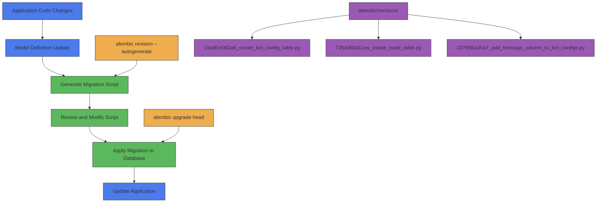
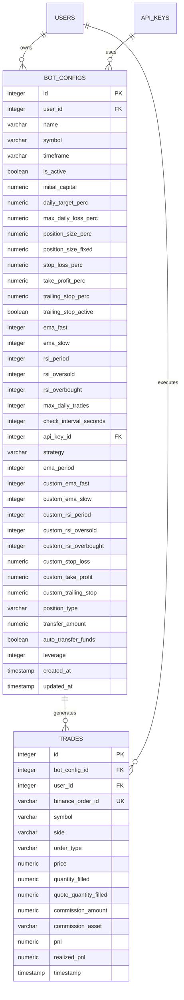
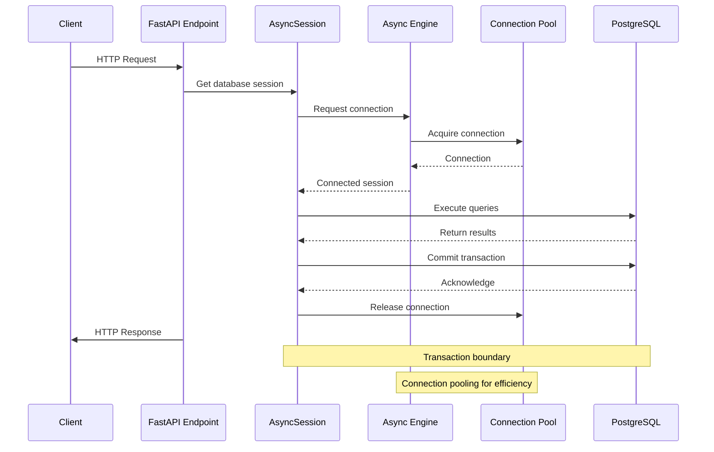
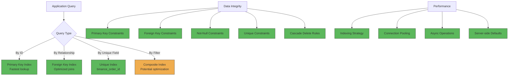

# Database Storage

<cite>
**Referenced Files in This Document**   
- [docker-compose.yml](file://docker-compose.yml)
- [app/database.py](file://app/database.py)
- [alembic/env.py](file://alembic/env.py)
- [app/models/bot_config.py](file://app/models/bot_config.py)
- [app/models/trade.py](file://app/models/trade.py)
- [app/db_base.py](file://app/db_base.py)
- [alembic/versions/19adfce0d2a6_create_bot_config_table.py](file://alembic/versions/19adfce0d2a6_create_bot_config_table.py)
- [alembic/versions/7354d6bd11ea_create_trade_table.py](file://alembic/versions/7354d6bd11ea_create_trade_table.py)
- [alembic/versions/107856acfca7_add_leverage_column_to_bot_configs.py](file://alembic/versions/107856acfca7_add_leverage_column_to_bot_configs.py)
</cite>

## Table of Contents
1. [Introduction](#introduction)
2. [PostgreSQL Container Configuration](#postgresql-container-configuration)
3. [SQLAlchemy ORM Implementation](#sqlalchemy-orm-implementation)
4. [Database Migration Strategy](#database-migration-strategy)
5. [Core Data Models](#core-data-models)
6. [Connection Management and Transaction Patterns](#connection-management-and-transaction-patterns)
7. [Data Integrity and Performance Optimization](#data-integrity-and-performance-optimization)
8. [Backup and Recovery Considerations](#backup-and-recovery-considerations)

## Introduction
The TradeBot application implements a robust database storage layer using PostgreSQL as the primary relational database management system, integrated with SQLAlchemy ORM for Python-based data access. This documentation provides a comprehensive overview of the database architecture, covering containerized deployment, ORM integration, migration strategy, and data model design. The system is designed for production readiness with emphasis on data persistence, integrity, and performance optimization. The architecture follows a microservices pattern where the PostgreSQL container operates as an independent service within the Docker Compose orchestration, providing reliable data storage for the trading bot's configuration, trade execution, and backtesting data.

## PostgreSQL Container Configuration

The PostgreSQL database service is configured as a Docker container within the docker-compose.yml file, providing a production-ready database environment with data persistence and health monitoring capabilities. The container uses the official PostgreSQL 15-alpine image, ensuring a lightweight and secure deployment. The service is named "tradebot-postgres" and is configured to restart automatically unless explicitly stopped, ensuring high availability.

Database credentials are securely managed through environment variables, with the POSTGRES_PASSWORD value sourced from the .env file during container startup. This approach prevents hardcoding sensitive information in the configuration file. The database is initialized with a dedicated tradebot_db database and tradebot_user role, establishing proper access control from the outset.

Data persistence is achieved through Docker volumes, with a dedicated "postgres_data" volume mounted to /var/lib/postgresql/data. This ensures that database files survive container restarts and updates, protecting trading configuration and historical trade data from loss. The volume uses the local driver, storing data on the host filesystem for reliable persistence.

Health monitoring is implemented through a comprehensive health check that verifies database readiness using the pg_isready command. The health check queries the database with the tradebot_user credentials against the tradebot_db database, ensuring not only that the PostgreSQL process is running but that the specific database instance is fully operational. The check runs every 10 seconds with a 5-second timeout and allows 5 retries before marking the container as unhealthy. This health status is critical for the application's startup sequence, as other services like the backend and Celery workers depend on the database being healthy before they start, preventing race conditions during system initialization.

The container exposes port 5432 to the host, enabling external access for administration and monitoring tools. All services within the application ecosystem communicate with the database through the internal "tradebot-network" Docker network, ensuring secure and efficient inter-service communication.

```mermaid
graph TB
subgraph "Docker Compose Environment"
PostgresContainer["PostgreSQL Container<br/>postgres:15-alpine"]
Volume["Docker Volume<br/>postgres_data"]
HealthCheck["Health Check<br/>pg_isready command"]
Network["Docker Network<br/>tradebot-network"]
end
PostgresContainer --> Volume: "Mounts data directory"
PostgresContainer --> HealthCheck: "Executes readiness probe"
PostgresContainer --> Network: "Connects via network"
HealthCheck --> PostgresContainer: "Verifies database readiness"
Backend --> PostgresContainer: "Depends on healthy state"
style PostgresContainer fill:#4B7BEC,stroke:#333
style Volume fill:#5CB85C,stroke:#333
style HealthCheck fill:#F0AD4E,stroke:#333
style Network fill:#9B59B6,stroke:#333
style Backend fill:#D9534F,stroke:#333
```

**Diagram sources**
- [docker-compose.yml](file://docker-compose.yml#L3-L27)

**Section sources**
- [docker-compose.yml](file://docker-compose.yml#L3-L27)

## SQLAlchemy ORM Implementation

The TradeBot application implements SQLAlchemy ORM for database interactions, leveraging the async capabilities of SQLAlchemy 2.0 with asyncpg for non-blocking database operations. The ORM configuration is centralized in app/database.py, which establishes the database engine, session factory, and connection parameters. The implementation follows modern SQLAlchemy patterns with a focus on type safety and async operations.

The database connection URL is dynamically constructed from environment variables, with a fallback to a default connection string for development environments. The DATABASE_URL environment variable is mandatory in production, enforcing secure configuration practices. The connection string uses the postgresql+asyncpg dialect, enabling asynchronous operations that are essential for the application's performance when handling multiple concurrent trading operations.

The core of the ORM implementation is the async engine created with create_async_engine, which manages the connection pool and handles database communication. The engine is configured with SQLALCHEMY_ECHO, which can be enabled for debugging to log all SQL statements. This provides valuable insight during development and troubleshooting while being disabled in production for performance reasons.

Database sessions are managed through an async_sessionmaker factory (SessionLocal), which creates AsyncSession instances for individual database operations. The session configuration is optimized for the application's needs with autoflush set to False to prevent unintended database writes and expire_on_commit set to False to maintain object state after transaction completion. This pattern gives developers explicit control over when data is flushed to the database and prevents the overhead of re-reading objects after commits.

To prevent import-time side effects, particularly with Alembic migrations, the Base declarative base is separated into app/db_base.py. This clean separation allows models to inherit from Base without triggering engine creation during import, which is crucial for migration tooling that needs to inspect model definitions without establishing database connections.

```mermaid
classDiagram
class AsyncSession {
+execute(statement)
+commit()
+rollback()
+refresh(instance)
+close()
}
class async_sessionmaker {
+__call__() AsyncSession
}
class create_async_engine {
+connect() Connection
+dispose()
}
class Base {
+__tablename__
+metadata
}
async_sessionmaker --> AsyncSession : "creates"
create_async_engine --> async_sessionmaker : "binds to"
Base <|-- BotConfig : "inherits"
Base <|-- Trade : "inherits"
create_async_engine --> Base : "manages metadata"
note right of async_sessionmaker
Session factory for
creating AsyncSession
instances with configured
parameters
end note
note right of create_async_engine
Central engine managing
connection pool and
async database operations
with asyncpg driver
end note
```

**Diagram sources**
- [app/database.py](file://app/database.py#L1-L24)
- [app/db_base.py](file://app/db_base.py#L1-L5)

**Section sources**
- [app/database.py](file://app/database.py#L1-L24)
- [app/db_base.py](file://app/db_base.py#L1-L5)

## Database Migration Strategy

TradeBot employs Alembic for database schema migrations, implementing a robust version control system for the database schema that enables incremental evolution of the data model. The migration strategy follows a structured approach with timestamp-based revision identifiers and explicit dependency tracking between migration scripts, ensuring reliable and repeatable schema changes across different environments.

The migration environment is configured in alembic/env.py, which sets up the migration context by dynamically determining the database URL from environment variables. A critical aspect of the configuration is the conversion of the asyncpg connection URL to a psycopg2 URL, as Alembic's autogenerate feature is not fully compatible with async drivers. This conversion allows Alembic to inspect the current database state and generate accurate migration scripts while the application continues to use asyncpg for runtime operations.

The target metadata for migrations is set to Base.metadata, which aggregates all model definitions across the application. This centralized metadata approach ensures that all models in app/models/ are included in the migration process. The env.py script supports both offline and online migration modes, with the online mode being used in production to apply migrations directly to the database through an active connection.

Migration scripts are stored in the alembic/versions/ directory, with each script representing an incremental change to the schema. The naming convention includes a unique revision ID and a descriptive name, such as "19adfce0d2a6_create_bot_config_table.py" for creating the bot configuration table or "107856acfca7_add_leverage_column_to_bot_configs.py" for adding leverage support to existing configurations. This incremental approach allows for precise tracking of schema changes and facilitates rollback operations when necessary.

The migration process is automated as part of the application startup sequence in docker-compose.yml, where the backend service executes "alembic upgrade head" before starting the Uvicorn server. This ensures that the database schema is always up-to-date with the application code, preventing version mismatches that could cause runtime errors. The migration strategy supports both additive changes (adding columns or tables) and structural modifications, with careful consideration given to data migration when altering existing schemas.



**Diagram sources**
- [alembic/env.py](file://alembic/env.py#L1-L98)
- [docker-compose.yml](file://docker-compose.yml#L97-L99)

**Section sources**
- [alembic/env.py](file://alembic/env.py#L1-L98)
- [docker-compose.yml](file://docker-compose.yml#L97-L99)

## Core Data Models

The TradeBot application implements a relational data model centered around trading configurations and executed trades, with well-defined relationships and constraints to ensure data integrity. The core models are defined in the app/models/ directory, with each model corresponding to a database table and encapsulating the business logic for trading operations.

The BotConfig model represents a trading bot configuration with comprehensive parameters for trading strategy, risk management, and execution settings. It includes fields for basic configuration like name, symbol, and timeframe, as well as advanced parameters for technical indicators (EMA periods, RSI thresholds), position sizing (fixed or percentage-based), and stop-loss/take-profit levels. The model supports both spot and futures trading through the position_type field, with futures trading enabled by the leverage field that specifies the leverage multiplier. Timestamps for creation and update are automatically managed by the database with server_default and onupdate triggers.

The Trade model captures individual trade executions with detailed information including the bot configuration that generated the trade, execution price, quantity, fees, and profit/loss calculations. Each trade is linked to a specific bot configuration through a foreign key relationship, establishing a one-to-many relationship where a single bot configuration can generate multiple trades. The model includes both unrealized PnL (pnl) and realized PnL (realized_pnl) fields to track performance metrics accurately.

The relationship between BotConfig and Trade is bidirectional, with BotConfig having a relationship field "trades" that provides access to all trades associated with a configuration, and Trade having a "bot" relationship that references its parent configuration. This relationship is configured with cascade="all, delete-orphan" semantics, ensuring that when a bot configuration is deleted, all associated trades are automatically removed, maintaining referential integrity.

Both models include indexing on foreign key fields (user_id, bot_config_id) to optimize query performance for retrieving user-specific data or trades by bot configuration. Primary keys are auto-incrementing integers with indexes for efficient lookups. The models inherit from a central Base class that provides the declarative ORM functionality and metadata aggregation for Alembic migrations.



**Diagram sources**
- [app/models/bot_config.py](file://app/models/bot_config.py#L1-L59)
- [app/models/trade.py](file://app/models/trade.py#L1-L27)

**Section sources**
- [app/models/bot_config.py](file://app/models/bot_config.py#L1-L59)
- [app/models/trade.py](file://app/models/trade.py#L1-L27)

## Connection Management and Transaction Patterns

The TradeBot application implements a sophisticated connection management system that leverages SQLAlchemy's async session patterns to ensure efficient database resource utilization and data consistency. The connection architecture is designed to handle the high-concurrency requirements of a trading application while maintaining data integrity across distributed components.

Database connections are managed through a connection pool created by the async engine, which reuses database connections across multiple operations to minimize the overhead of establishing new connections. The pool configuration is implicit in the create_async_engine call, with default settings optimized for the application's workload. The asyncpg driver provides native asynchronous I/O operations, allowing the application to handle multiple database operations concurrently without blocking the event loop.

Transaction management follows a pattern of explicit session control, where each business operation acquires a database session, performs its operations, and then commits or rolls back the transaction. The async_sessionmaker factory (SessionLocal) creates AsyncSession instances that provide transaction boundaries through context managers or explicit commit/rollback calls. The session configuration with autoflush=False gives developers precise control over when changes are written to the database, preventing unintended side effects from automatic flushing.

The application implements a dependency injection pattern for database sessions, where API endpoints and background tasks receive a database session as a dependency. This ensures that sessions are properly scoped to individual requests or tasks and are automatically cleaned up after use. The session lifecycle is tied to the request lifecycle in the FastAPI application, with sessions created at the beginning of a request and closed at the end, regardless of success or failure.

For background tasks executed by Celery workers, a separate but identical database connection pattern is used, with workers establishing their own connections to the database. The connection URL for workers uses a synchronous variant (SYNC_DATABASE_URL) to accommodate Celery's threading model, while the main application uses the async URL. This dual-connection strategy ensures that both real-time API operations and background processing can access the database efficiently.



**Diagram sources**
- [app/database.py](file://app/database.py#L1-L24)
- [docker-compose.yml](file://docker-compose.yml#L50-L102)

**Section sources**
- [app/database.py](file://app/database.py#L1-L24)

## Data Integrity and Performance Optimization

The TradeBot database implementation incorporates comprehensive data integrity constraints and performance optimization strategies to ensure reliable operation and responsive query performance. These measures are critical for a trading application where data accuracy and low-latency access directly impact trading decisions and system reliability.

Data integrity is enforced through multiple mechanisms at the database level. Primary key constraints ensure unique identification of records in all tables, while foreign key constraints maintain referential integrity between related entities such as BotConfig and Trade. The foreign key relationships include cascading deletes (cascade="all, delete-orphan") to automatically clean up dependent records when parent records are removed, preventing orphaned data. Not-null constraints are applied to critical fields like user_id, symbol, and price to prevent incomplete records. The Trade model includes a unique constraint on binance_order_id to prevent duplicate trade records from the same exchange order.

Performance optimization is achieved through strategic indexing on fields commonly used in query filters and joins. All primary key fields are automatically indexed by PostgreSQL, providing efficient lookups by ID. Foreign key fields (user_id, bot_config_id, api_key_id) are explicitly indexed to optimize join operations and queries that filter by ownership or association. The unique constraint on binance_order_id in the Trade table also creates a unique index, enabling fast lookups by exchange order ID. These indexes significantly improve query performance for common operations like retrieving a user's bot configurations or finding trades by bot ID.

The application also leverages database-level features for performance and data consistency. Timestamp fields use server_default=func.now() to ensure consistent time recording across all application instances, avoiding clock skew issues. The updated_at field in BotConfig uses onupdate=func.now() to automatically update the timestamp whenever a record is modified, providing an accurate audit trail without requiring application-level code. Numeric fields use the appropriate PostgreSQL numeric type to ensure precision in financial calculations, avoiding floating-point rounding errors that could impact trading decisions.



**Diagram sources**
- [app/models/bot_config.py](file://app/models/bot_config.py#L1-L59)
- [app/models/trade.py](file://app/models/trade.py#L1-L27)

**Section sources**
- [app/models/bot_config.py](file://app/models/bot_config.py#L1-L59)
- [app/models/trade.py](file://app/models/trade.py#L1-L27)

## Backup and Recovery Considerations

The TradeBot application implements a robust backup and recovery strategy centered on Docker volume persistence and operational procedures to protect trading data from loss. The primary mechanism for data protection is the Docker volume configuration in docker-compose.yml, which ensures that PostgreSQL data files are stored outside the container filesystem.

The "postgres_data" volume is explicitly defined and mounted to the PostgreSQL container's data directory (/var/lib/postgresql/data), ensuring that database files persist across container lifecycle events. This means that container restarts, updates, or recreations do not result in data loss, as the volume maintains its state independently of the container. The volume uses the local driver, storing data on the host machine's filesystem where it can be protected by host-level backup solutions.

While the current configuration provides basic persistence, a comprehensive backup strategy would require additional components not present in the current setup. Automated database dumps could be implemented through scheduled jobs that execute pg_dump to create SQL backups, which could then be stored in cloud storage or external drives. Point-in-time recovery could be enabled by configuring PostgreSQL's Write-Ahead Logging (WAL) archiving, allowing restoration to any point in time.

The application includes operational scripts in the scripts/ directory that provide monitoring capabilities, such as db_monitor.py, which can report on database statistics including table sizes. This visibility helps operators understand data growth patterns and plan storage capacity accordingly. However, dedicated backup scripts are not included in the current codebase, indicating that backup procedures may be handled externally to the application.

Recovery procedures would involve restoring from backups to a new or existing postgres_data volume, with careful attention to file permissions and ownership to ensure the PostgreSQL process can access the restored data. In a disaster recovery scenario, the docker-compose.yml configuration provides a clear blueprint for recreating the database service with the appropriate volume mappings and environment settings.

**Section sources**
- [docker-compose.yml](file://docker-compose.yml#L263-L267)