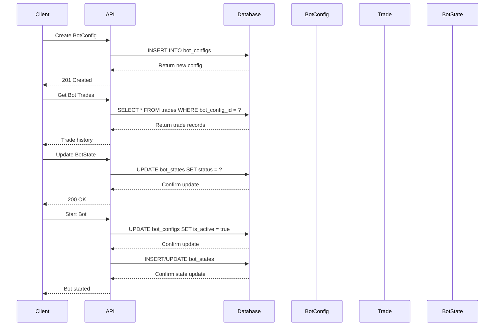

# ORM Models

<cite>
**Referenced Files in This Document**   
- [bot_config.py](file://app/models/bot_config.py)
- [trade.py](file://app/models/trade.py)
- [user.py](file://app/models/user.py)
- [api_key.py](file://app/models/api_key.py)
- [backtest.py](file://app/models/backtest.py)
- [bot_state.py](file://app/models/bot_state.py)
- [db_base.py](file://app/db_base.py)
- [bot_runner.py](file://app/api/routes/bot_runner.py)
- [bot_report.py](file://app/api/routes/bot_report.py)
</cite>

## Table of Contents
1. [Introduction](#introduction)
2. [Base Class and Async SQLAlchemy Patterns](#base-class-and-async-sqlalchemy-patterns)
3. [Entity Models Documentation](#entity-models-documentation)
   - [BotConfig Model](#botconfig-model)
   - [Trade Model](#trade-model)
   - [User Model](#user-model)
   - [ApiKey Model](#apikey-model)
   - [Backtest Model](#backtest-model)
   - [BotState Model](#botstate-model)
4. [Model Relationships and Data Flow](#model-relationships-and-data-flow)
5. [CRUD Operations and Query Patterns](#crud-operations-and-query-patterns)
6. [Indexing and Performance Optimization](#indexing-and-performance-optimization)
7. [Data Validation and Security Considerations](#data-validation-and-security-considerations)
8. [Conclusion](#conclusion)

## Introduction
This document provides comprehensive documentation for the TradeBot ORM models implemented using SQLAlchemy. The models represent core entities in the trading system including bot configurations, trade records, user accounts, API credentials, backtest results, and runtime bot states. The documentation details entity structures, field definitions, data types, constraints, relationships, and implementation patterns. Special attention is given to the async SQLAlchemy patterns used throughout the application, foreign key relationships between models, and security considerations for sensitive data.

## Base Class and Async SQLAlchemy Patterns
The ORM models inherit from a central Base class defined in the application's database foundation layer. This Base class serves as the declarative base for all SQLAlchemy models in the system, enabling consistent model definition and metadata management across the application.

```mermaid
classDiagram
class Base {
<<variable>>
declarative_base()
}
BotConfig --|> Base : inherits
Trade --|> Base : inherits
User --|> Base : inherits
ApiKey --|> Base : inherits
Backtest --|> Base : inherits
BotState --|> Base : inherits
note right of Base
Central declarative base for all models
Enables consistent metadata management
Prevents engine creation on import
end note
```

**Diagram sources**
- [db_base.py](file://app/db_base.py#L1-L5)
- [bot_config.py](file://app/models/bot_config.py#L1-L5)

**Section sources**
- [db_base.py](file://app/db_base.py#L1-L5)

## Entity Models Documentation

### BotConfig Model
The BotConfig model represents trading parameters and strategy settings for automated trading bots. It contains comprehensive configuration options for various trading strategies, risk management parameters, and execution settings.

**Field Definitions and Constraints**
- **id**: Primary key with index for efficient lookups
- **user_id**: Foreign key to User model with index for ownership queries
- **name, symbol, timeframe**: Required string fields for bot identification and market specification
- **is_active**: Boolean flag with default False to control bot execution
- **Risk Management**: stop_loss_perc, take_profit_perc (required), trailing_stop_perc (optional)
- **Technical Indicators**: ema_fast, ema_slow, rsi_period, rsi_oversold, rsi_overbought (required)
- **Advanced Parameters**: Customizable EMA, RSI, and risk values with sensible defaults
- **Position Management**: position_type (spot/futures), leverage (default 10), auto_transfer_funds
- **Timestamps**: created_at and updated_at with timezone support and automatic server-side defaults

The model includes comprehensive indexing on frequently queried fields such as user_id and bot configuration status. Default values are provided for optional parameters to ensure consistent behavior.

**Section sources**
- [bot_config.py](file://app/models/bot_config.py#L1-L59)

### Trade Model
The Trade model records executed trades with profit and loss tracking. It captures detailed information about each trade execution, including pricing, quantities, fees, and performance metrics.

**Field Definitions and Constraints**
- **id**: Primary key with index for trade identification
- **bot_config_id**: Foreign key to BotConfig with index for bot-specific trade retrieval
- **user_id**: Foreign key to User with index for user-specific trade analysis
- **binance_order_id**: Unique string field for exchange order reference
- **Execution Details**: symbol, side (BUY/SELL), order_type, price, quantity_filled, quote_quantity_filled
- **Financial Metrics**: commission_amount, commission_asset, pnl (profit/loss), realized_pnl
- **timestamp**: DateTime field with server default for automatic time recording

The model is designed to support detailed performance analysis and PnL tracking across different trading strategies and time periods.

**Section sources**
- [trade.py](file://app/models/trade.py#L1-L27)

### User Model
The User model manages authentication and profile data for application users. It stores essential user information and authentication credentials while maintaining relationships with other entities.

**Field Definitions and Constraints**
- **id**: Primary key with index for user identification
- **email**: Unique string field with index for authentication and lookup
- **hashed_password**: Required string field for secure credential storage
- **is_active**: Boolean flag with default True for account status management
- **Password Reset**: reset_token and reset_token_expires for secure password recovery
- **Timestamps**: created_at and updated_at with timezone support and automatic defaults

The model implements proper indexing on the email field to optimize authentication queries and ensure data integrity through uniqueness constraints.

**Section sources**
- [user.py](file://app/models/user.py#L1-L24)

### ApiKey Model
The ApiKey model securely stores encrypted exchange credentials for users. It enables the application to interact with external trading platforms while protecting sensitive API information.

**Field Definitions and Constraints**
- **id**: Primary key with index for credential identification
- **user_id**: Foreign key to User with index for ownership queries
- **encrypted_api_key, encrypted_secret_key**: Required string fields for encrypted credentials
- **label**: Optional string field for user-friendly key identification
- **is_valid**: Boolean flag with default False for credential status tracking
- **Timestamps**: created_at and updated_at with timezone support and automatic defaults

The model ensures that API credentials are never stored in plaintext, with encryption handled at the application level before persistence.

**Section sources**
- [api_key.py](file://app/models/api_key.py#L1-L18)

### Backtest Model
The Backtest model stores historical strategy simulation results. It captures both the parameters used in backtesting and the performance outcomes for analysis and comparison.

**Field Definitions and Constraints**
- **id**: Primary key with index for result identification
- **user_id**: Foreign key to User with index for ownership queries
- **Backtest Parameters**: symbol, interval, start_date, end_date for simulation configuration
- **Strategy Parameters**: JSON field for flexible storage of strategy configuration
- **Performance Results**: initial_capital, final_capital, total_return, total_trades, win_rate, total_fees, avg_profit
- **Detailed Results**: JSON fields for daily_results and monthly_results
- **Metadata**: test_mode (true/false), market_type (spot/futures), leverage
- **Timestamps**: created_at and updated_at with timezone support and automatic defaults

The model uses JSON fields to accommodate varying strategy parameters and detailed results without requiring schema changes.

**Section sources**
- [backtest.py](file://app/models/backtest.py#L1-L44)

### BotState Model
The BotState model provides runtime state persistence for trading bots. It tracks the current operational status and position details of active bots between executions.

**Field Definitions and Constraints**
- **id**: Primary key with foreign key constraint to BotConfig (1:1 relationship)
- **status**: String field with default "stopped" for operational state tracking
- **Position State**: in_position (boolean), entry_price, current_position_size_coins
- **Dynamic Pricing**: trailing_stop_price, max_price_since_entry, take_profit_price, stop_loss_price
- **Performance Tracking**: daily_pnl, daily_trades_count
- **Operational Metadata**: last_run_at, last_error_message, last_updated_at with automatic updates

The model uses a foreign key as its primary key to enforce a strict one-to-one relationship with BotConfig, ensuring each bot configuration has exactly one state record.

**Section sources**
- [bot_state.py](file://app/models/bot_state.py#L1-L24)

## Model Relationships and Data Flow
The ORM models are interconnected through well-defined relationships that reflect the business logic of the trading system. These relationships enable efficient data retrieval and maintain referential integrity across the application.

```mermaid
erDiagram
USER ||--o{ BOT_CONFIG : "owns"
USER ||--o{ API_KEY : "owns"
USER ||--o{ TRADE : "executes"
USER ||--o{ BACKTEST : "runs"
BOT_CONFIG }|--|| BOT_STATE : "has"
BOT_CONFIG ||--o{ TRADE : "generates"
BOT_CONFIG }|--| API_KEY : "uses"
USER {
integer id PK
string email UK
string hashed_password
boolean is_active
datetime created_at
datetime updated_at
string reset_token
datetime reset_token_expires
}
BOT_CONFIG {
integer id PK
integer user_id FK
string name
string symbol
string timeframe
boolean is_active
numeric initial_capital
numeric daily_target_perc
numeric max_daily_loss_perc
numeric position_size_perc
numeric position_size_fixed
numeric stop_loss_perc
numeric take_profit_perc
numeric trailing_stop_perc
boolean trailing_stop_active
integer ema_fast
integer ema_slow
integer rsi_period
integer rsi_oversold
integer rsi_overbought
integer max_daily_trades
integer check_interval_seconds
integer api_key_id FK
string strategy
integer ema_period
integer custom_ema_fast
integer custom_ema_slow
integer custom_rsi_period
integer custom_rsi_oversold
integer custom_rsi_overbought
numeric custom_stop_loss
numeric custom_take_profit
numeric custom_trailing_stop
string position_type
numeric transfer_amount
boolean auto_transfer_funds
integer leverage
datetime created_at
datetime updated_at
}
API_KEY {
integer id PK
integer user_id FK
string encrypted_api_key
string encrypted_secret_key
string label
boolean is_valid
datetime created_at
datetime updated_at
}
TRADE {
integer id PK
integer bot_config_id FK
integer user_id FK
string binance_order_id UK
string symbol
string side
string order_type
numeric price
numeric quantity_filled
numeric quote_quantity_filled
numeric commission_amount
string commission_asset
numeric pnl
numeric realized_pnl
datetime timestamp
}
BACKTEST {
integer id PK
integer user_id FK
string symbol
string interval
string start_date
string end_date
json parameters
float initial_capital
float final_capital
float total_return
integer total_trades
integer winning_trades
integer losing_trades
float win_rate
float total_fees
float avg_profit
json daily_results
json monthly_results
string test_mode
string market_type
datetime created_at
datetime updated_at
}
BOT_STATE {
integer id PK, FK
string status
boolean in_position
numeric entry_price
numeric current_position_size_coins
numeric trailing_stop_price
numeric max_price_since_entry
numeric take_profit_price
numeric stop_loss_price
numeric daily_pnl
integer daily_trades_count
datetime last_run_at
datetime last_error_message
datetime last_updated_at
}
```

**Diagram sources**
- [bot_config.py](file://app/models/bot_config.py#L1-L59)
- [trade.py](file://app/models/trade.py#L1-L27)
- [user.py](file://app/models/user.py#L1-L24)
- [api_key.py](file://app/models/api_key.py#L1-L18)
- [backtest.py](file://app/models/backtest.py#L1-L44)
- [bot_state.py](file://app/models/bot_state.py#L1-L24)

**Section sources**
- [bot_config.py](file://app/models/bot_config.py#L1-L59)

## CRUD Operations and Query Patterns
The application implements various CRUD operations and query patterns to interact with the ORM models efficiently. These patterns leverage async SQLAlchemy features for non-blocking database operations.



**Diagram sources**
- [bot_runner.py](file://app/api/routes/bot_runner.py#L1-L55)
- [bot_report.py](file://app/api/routes/bot_report.py#L1-L110)

**Section sources**
- [bot_runner.py](file://app/api/routes/bot_runner.py#L1-L55)
- [bot_report.py](file://app/api/routes/bot_report.py#L1-L110)

## Indexing and Performance Optimization
The database schema includes strategic indexing on frequently queried fields to optimize performance. These indexes support efficient filtering, sorting, and joining operations across the application.

**Indexing Strategy**
- **Primary Keys**: All models have primary key indexes on their id fields
- **Foreign Keys**: Indexes on user_id, bot_config_id, and api_key_id fields for relationship queries
- **Unique Constraints**: binance_order_id in Trade model ensures no duplicate exchange orders
- **Composite Queries**: Indexes on user_id in BotConfig enable efficient user-specific bot retrieval

The indexing strategy balances query performance with write overhead, focusing on fields most commonly used in WHERE clauses and JOIN operations. This approach ensures responsive user interfaces and efficient data processing pipelines.

**Section sources**
- [bot_config.py](file://app/models/bot_config.py#L1-L59)
- [trade.py](file://app/models/trade.py#L1-L27)

## Data Validation and Security Considerations
The ORM models incorporate data validation and security measures to protect sensitive information and ensure data integrity.

**Security Measures**
- **Encrypted Credentials**: API keys are stored in encrypted form using application-level encryption
- **Password Protection**: User passwords are hashed before storage
- **Token Expiration**: Reset tokens include expiration timestamps to prevent unauthorized access
- **Input Validation**: Required fields enforce data completeness
- **Default Values**: Strategic defaults prevent null-related issues

**Data Validation**
- **NotNull Constraints**: Critical fields like user_id, symbol, and pricing information are required
- **Type Safety**: Proper data types ensure correct value storage and prevent injection attacks
- **Range Validation**: Numeric fields for percentages and prices ensure reasonable values
- **Status Management**: Enum-like string fields for status and type values maintain consistency

These measures collectively ensure that the application maintains data integrity while protecting sensitive user information according to security best practices.

**Section sources**
- [api_key.py](file://app/models/api_key.py#L1-L18)
- [user.py](file://app/models/user.py#L1-L24)

## Conclusion
The TradeBot ORM models provide a robust foundation for the trading application, implementing a well-structured data model with clear relationships and appropriate constraints. The models leverage SQLAlchemy's capabilities to create a maintainable and efficient persistence layer that supports the application's trading functionality. Key strengths include the comprehensive bot configuration options, detailed trade tracking, secure credential management, and runtime state persistence. The async patterns enable non-blocking database operations, while strategic indexing ensures good performance for common queries. The security measures protect sensitive data, and the validation rules maintain data integrity throughout the system.