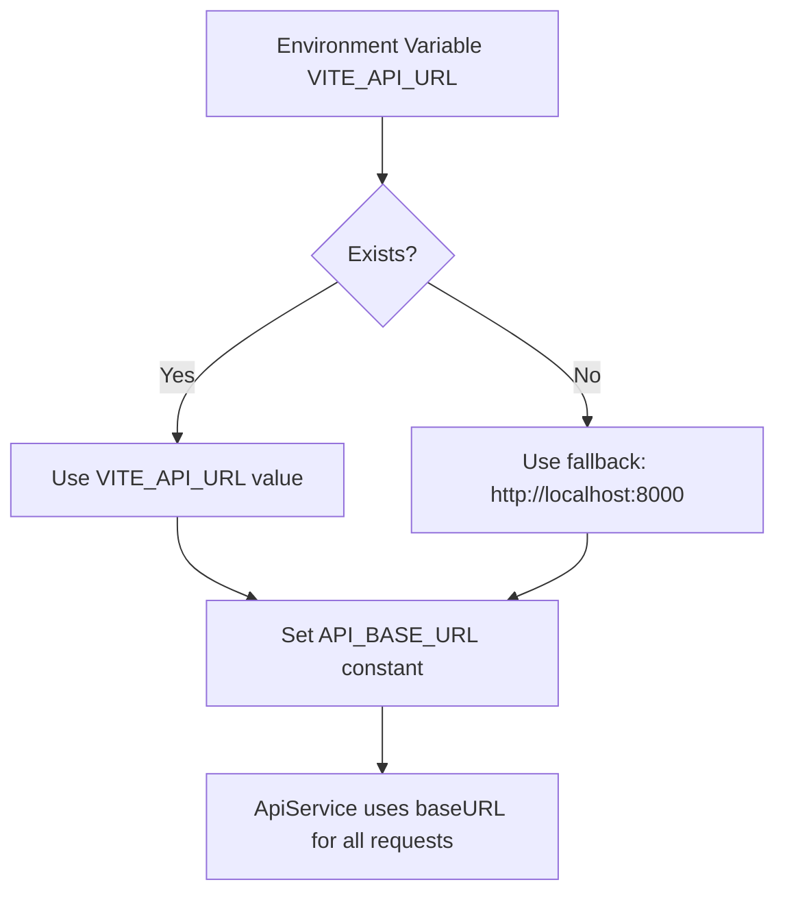
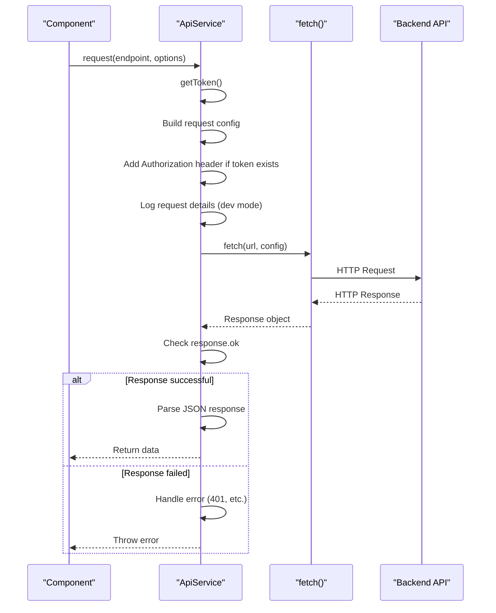
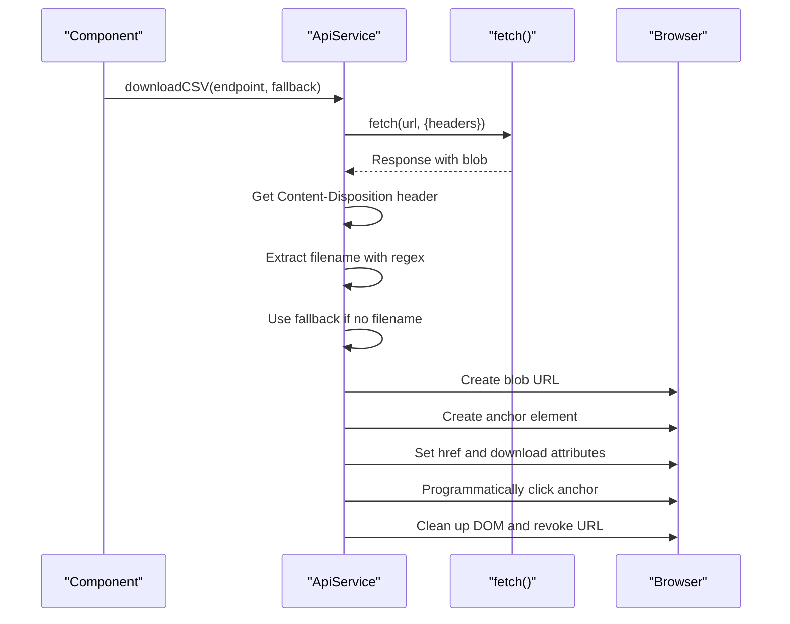
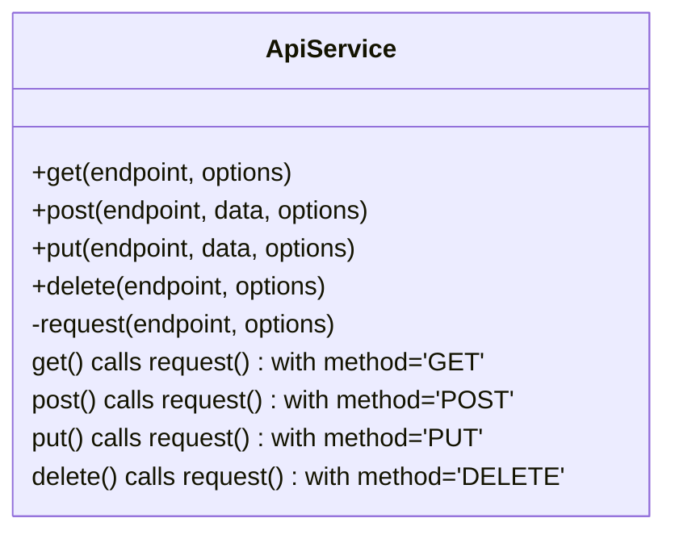
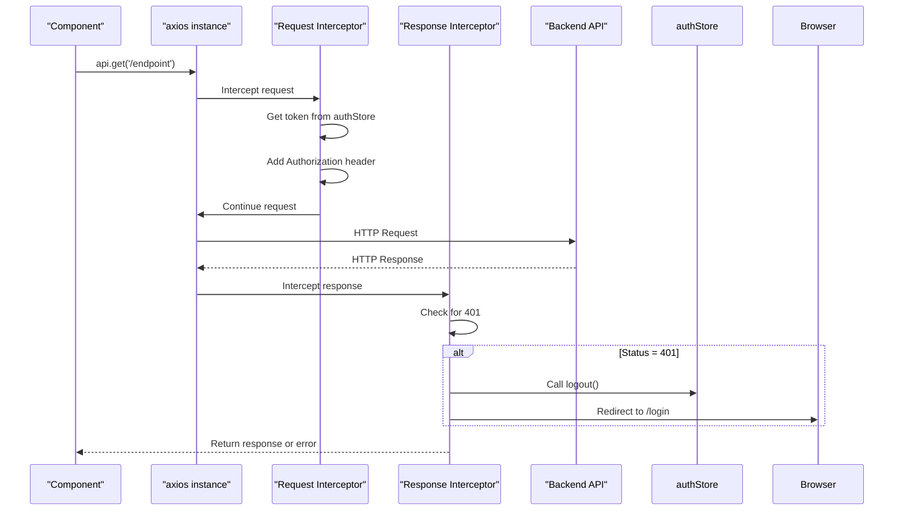
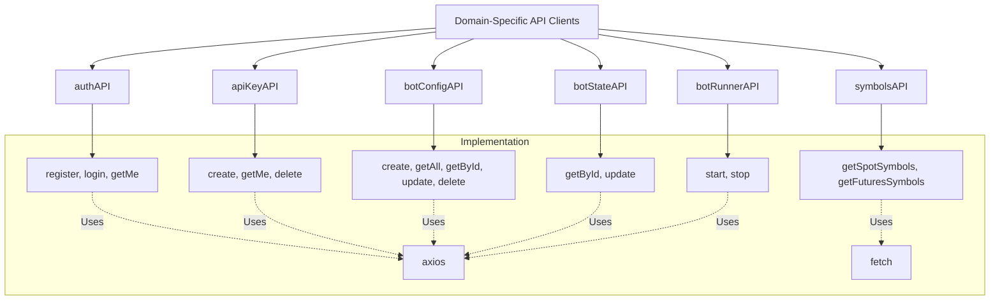

# Frontend API Integration

<cite>
**Referenced Files in This Document**   
- [api.js](file://frontend/src/services/api.js)
- [authStore.js](file://frontend/src/store/authStore.js)
- [vite.config.js](file://frontend/vite.config.js)
- [package.json](file://frontend/package.json)
</cite>

## Table of Contents
1. [Introduction](#introduction)
2. [API Configuration and Base URL](#api-configuration-and-base-url)
3. [ApiService Class and Request Lifecycle](#apiservice-class-and-request-lifecycle)
4. [Authentication Flow and JWT Token Management](#authentication-flow-and-jwt-token-management)
5. [Error Handling and Unauthorized Response Management](#error-handling-and-unauthorized-response-management)
6. [File Download Implementation with downloadCSV](#file-download-implementation-with-downloadcsv)
7. [Convenience Methods for HTTP Operations](#convenience-methods-for-http-operations)
8. [Legacy Axios Instance and Interceptors](#legacy-axios-instance-and-interceptors)
9. [Domain-Specific API Clients](#domain-specific-api-clients)
10. [Debugging and Development Features](#debugging-and-development-features)

## Introduction
This document provides comprehensive documentation for the frontend API integration in the TradeBot application, focusing on the ApiService class and related API clients. The documentation covers the complete API integration architecture, including configuration, authentication, error handling, and utility functions that enable seamless communication between the frontend and backend services. The implementation follows modern JavaScript practices with a focus on maintainability, security, and developer experience.

## API Configuration and Base URL
The API integration is configured through environment variables, allowing for flexible deployment across different environments. The base API URL is defined using Vite's environment variable system, with a fallback to a default localhost address for development purposes.



**Diagram sources**
- [api.js](file://frontend/src/services/api.js#L5)
- [vite.config.js](file://frontend/vite.config.js#L10-L12)

**Section sources**
- [api.js](file://frontend/src/services/api.js#L1-L6)
- [vite.config.js](file://frontend/vite.config.js#L7-L15)

## ApiService Class and Request Lifecycle
The ApiService class serves as the primary interface for API communication, implementing a robust request lifecycle that handles configuration, authentication, and response processing. The class encapsulates the fetch API with enhanced error handling and logging capabilities.



**Diagram sources**
- [api.js](file://frontend/src/services/api.js#L7-L97)

**Section sources**
- [api.js](file://frontend/src/services/api.js#L7-L97)

## Authentication Flow and JWT Token Management
The authentication system implements a dual-storage approach for JWT tokens, checking both the application state and localStorage to ensure session persistence across page reloads. This approach provides a seamless user experience while maintaining security best practices.

```mermaid
flowchart TD
A[ApiService.getToken()] --> B{Check Zustand Store}
B --> |Token exists| C[Return store token]
B --> |No token| D{Check localStorage}
D --> |Token exists| E[Return localStorage token]
D --> |No token| F[Return null]
C --> G[Use token in Authorization header]
E --> G
F --> H[Proceed without Authorization header]
G --> I[Make API request]
H --> I
```

**Diagram sources**
- [api.js](file://frontend/src/services/api.js#L12-L17)
- [authStore.js](file://frontend/src/store/authStore.js#L8)

**Section sources**
- [api.js](file://frontend/src/services/api.js#L12-L17)
- [authStore.js](file://frontend/src/store/authStore.js#L1-L68)

## Error Handling and Unauthorized Response Management
The API integration includes comprehensive error handling strategies, with special attention to unauthorized (401) responses. When a 401 error is detected, the system automatically logs the user out and redirects to the login page, ensuring that expired or invalid sessions are handled gracefully.

```mermaid
flowchart TD
A[API Response received] --> B{response.ok?}
B --> |Yes| C[Parse and return JSON]
B --> |No| D[Read error text]
D --> E{Status = 401?}
E --> |Yes| F[Call logout() on authStore]
E --> |No| G[Log error details]
F --> H[Redirect to /login]
G --> I[Throw formatted error]
H --> J[User redirected to login]
I --> K[Component handles error]
```

**Diagram sources**
- [api.js](file://frontend/src/services/api.js#L73-L87)

**Section sources**
- [api.js](file://frontend/src/services/api.js#L73-L87)
- [authStore.js](file://frontend/src/store/authStore.js#L21-L28)

## File Download Implementation with downloadCSV
The downloadCSV utility method provides specialized handling for file downloads, particularly CSV files from the backend. It properly handles binary data through blob objects and extracts filenames from Content-Disposition headers, ensuring that downloaded files retain their intended names.



**Diagram sources**
- [api.js](file://frontend/src/services/api.js#L100-L132)

**Section sources**
- [api.js](file://frontend/src/services/api.js#L100-L132)

## Convenience Methods for HTTP Operations
The ApiService class provides convenience methods (get, post, put, delete) that simplify common HTTP operations. These methods wrap the core request method with appropriate HTTP verbs and parameter handling, reducing boilerplate code in components that consume the API.



**Diagram sources**
- [api.js](file://frontend/src/services/api.js#L136-L157)

**Section sources**
- [api.js](file://frontend/src/services/api.js#L136-L157)

## Legacy Axios Instance and Interceptors
For backward compatibility, the system maintains a legacy axios instance with request and response interceptors. This allows older code to continue using axios while new code can adopt the modern fetch-based ApiService. The interceptors handle token injection and unauthorized response handling consistently across both systems.



**Diagram sources**
- [api.js](file://frontend/src/services/api.js#L214-L244)

**Section sources**
- [api.js](file://frontend/src/services/api.js#L214-L244)
- [package.json](file://frontend/package.json#L13)

## Domain-Specific API Clients
The system exports modular, domain-specific API clients (authAPI, apiKeyAPI, botConfigAPI, etc.) that provide higher-level interfaces for specific application domains. These clients encapsulate endpoint URLs and parameter structures, making it easier for components to interact with the API without knowing implementation details.



**Diagram sources**
- [api.js](file://frontend/src/services/api.js#L247-L371)

**Section sources**
- [api.js](file://frontend/src/services/api.js#L247-L371)

## Debugging and Development Features
The API integration includes comprehensive debugging features for non-production environments, including detailed request logging, authentication debugging, and hidden token display in logs. These features help developers troubleshoot issues during development without compromising security in production.

```mermaid
flowchart TD
A[Development Mode Check] --> B{import.meta.env.MODE !== 'production'?}
B --> |Yes| C[Enable Debug Logging]
B --> |No| D[Skip Debug Logging]
C --> E[Log request details]
C --> F[Log authentication debug info]
C --> G[Log request config with hidden token]
C --> H[Log error details]
E --> I[Console output with endpoint and options]
F --> J[Console output with token sources]
G --> K[Console output with [TOKEN_HIDDEN]]
H --> L[Console error with stack trace]
```

**Diagram sources**
- [api.js](file://frontend/src/services/api.js#L20-L44)

**Section sources**
- [api.js](file://frontend/src/services/api.js#L20-L44)
- [vite.config.js](file://frontend/vite.config.js#L5)