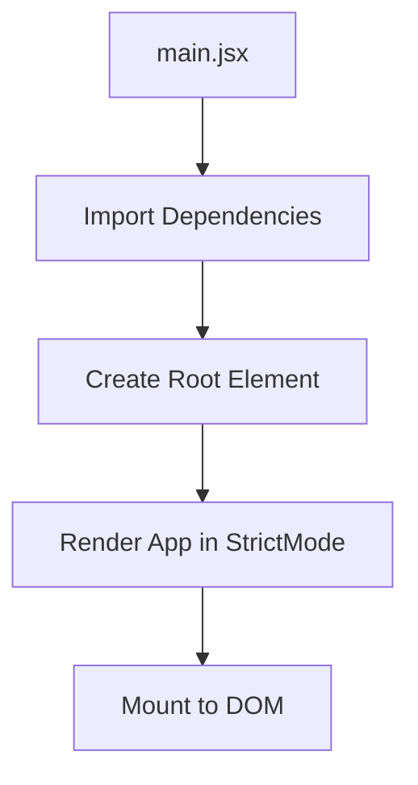
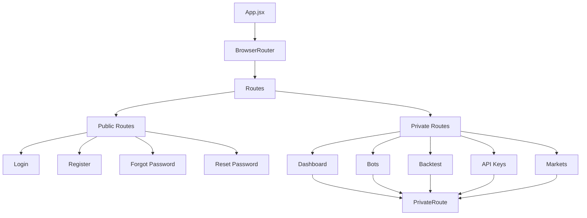
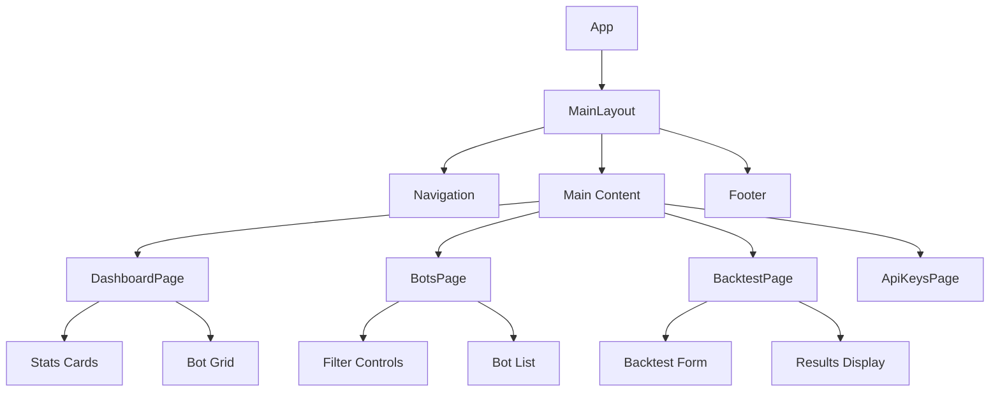
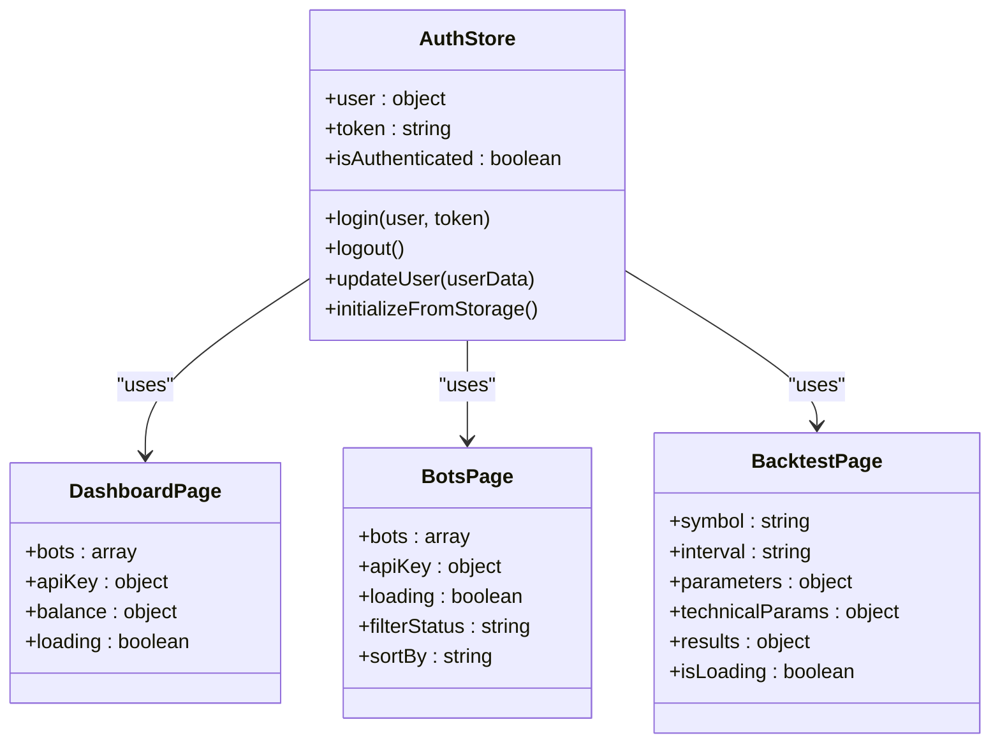
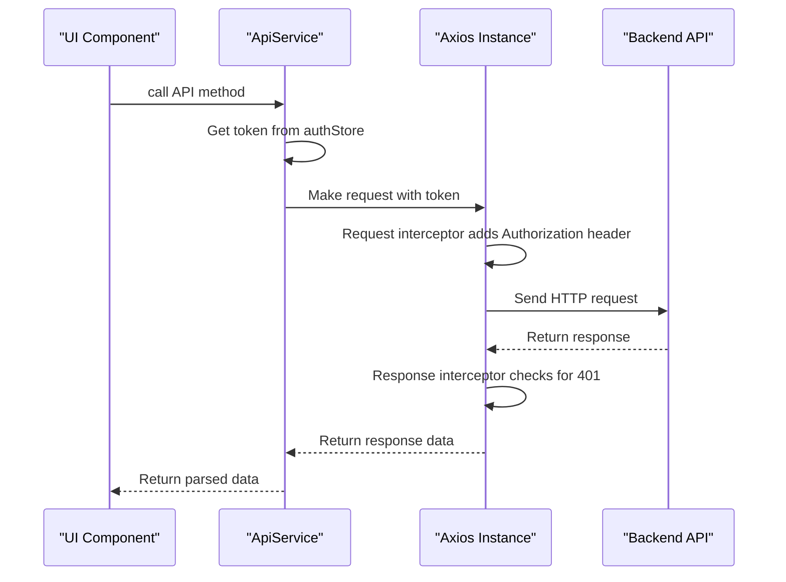
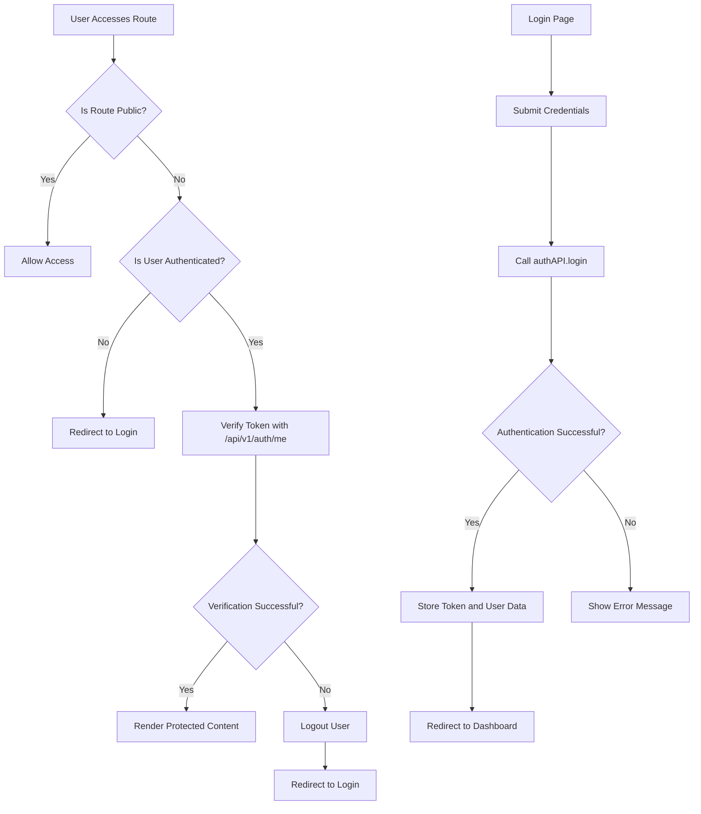
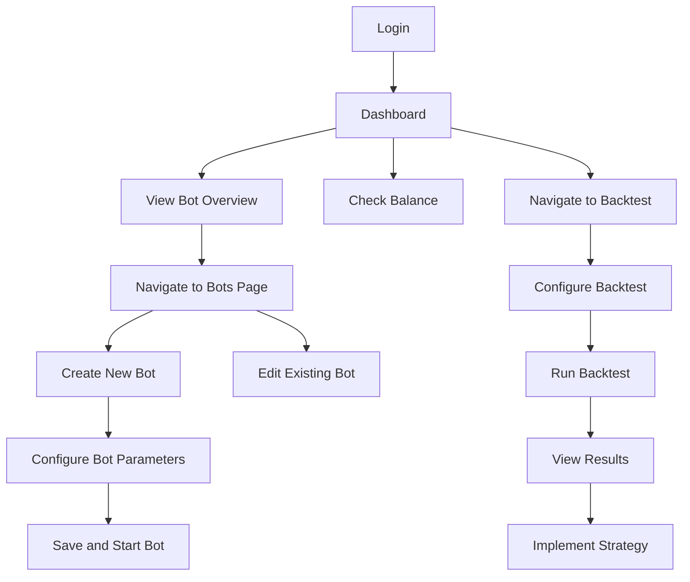
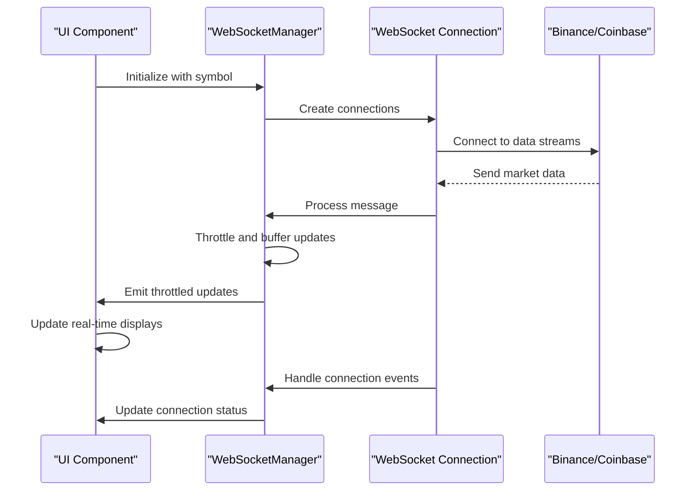

# Frontend Interface

<cite>
**Referenced Files in This Document**   
- [main.jsx](file://frontend/src/main.jsx)
- [App.jsx](file://frontend/src/App.jsx)
- [PrivateRoute.jsx](file://frontend/src/components/Auth/PrivateRoute.jsx)
- [authStore.js](file://frontend/src/store/authStore.js)
- [api.js](file://frontend/src/services/api.js)
- [MainLayout.jsx](file://frontend/src/components/Layout/MainLayout.jsx)
- [DashboardPage.jsx](file://frontend/src/pages/Dashboard/DashboardPage.jsx)
- [BotsPage.jsx](file://frontend/src/pages/Bots/BotsPage.jsx)
- [BacktestPage.jsx](file://frontend/src/pages/Backtest/BacktestPage.jsx)
- [WebSocketManager.jsx](file://frontend/src/components/Markets/WebSocketManager.jsx)
</cite>

## Table of Contents
1. [Introduction](#introduction)
2. [Application Entry Point](#application-entry-point)
3. [Routing System](#routing-system)
4. [Component Hierarchy](#component-hierarchy)
5. [State Management](#state-management)
6. [API Integration](#api-integration)
7. [Authentication Flow](#authentication-flow)
8. [User Experience Flow](#user-experience-flow)
9. [Real-Time Updates](#real-time-updates)
10. [Conclusion](#conclusion)

## Introduction
The TradeBot frontend interface is a React-based application designed to provide users with a comprehensive trading bot management system. This documentation details the architecture, component structure, state management, and client-server communication patterns used in the application. The interface enables users to create, manage, and monitor trading bots, perform backtesting, and view real-time market data. The application follows modern React practices with a focus on performance, maintainability, and user experience.

## Application Entry Point

The application entry point is defined in `frontend/src/main.jsx`, which serves as the bootstrap file for the entire React application. This file imports the necessary React dependencies and renders the root component into the DOM. The entry point uses React's StrictMode to highlight potential problems in the application and wraps the entire application with the main App component.

The rendering process begins by selecting the root DOM element with ID 'root' and creating a React root instance using `createRoot`. The App component is then rendered within StrictMode, which helps identify unsafe lifecycle methods, legacy string ref usage, and other issues during development. This approach ensures that the application starts with proper error boundaries and development checks in place.

**Diagram sources**
- [main.jsx](file://frontend/src/main.jsx#L1-L11)

**Section sources**
- [main.jsx](file://frontend/src/main.jsx#L1-L11)

## Routing System

The routing system is implemented in `frontend/src/App.jsx` using React Router, providing a client-side routing solution that enables navigation between different views without page reloads. The application uses a nested route structure with a main layout that contains shared UI elements like the navigation bar and footer.

The routing configuration includes both public and private routes, with authentication protection implemented through the PrivateRoute component. Public routes include login, registration, and password recovery pages, while private routes require authentication and include the dashboard, bot management, backtesting, and API key management pages. The routing system also implements lazy loading for page components using React's `lazy` and `Suspense` features, which improves initial load performance by code splitting.

The App component initializes the authentication state from localStorage during component mount, ensuring that the user's authentication status persists across sessions. Route guards redirect authenticated users away from authentication pages and unauthenticated users away from protected routes.

**Diagram sources**
- [App.jsx](file://frontend/src/App.jsx#L1-L183)

**Section sources**
- [App.jsx](file://frontend/src/App.jsx#L1-L183)

## Component Hierarchy

The application follows a well-structured component hierarchy with clear separation of concerns. The main layout is defined in `MainLayout.jsx`, which provides a consistent UI structure across all pages with a navigation bar, main content area, and footer. The layout component handles theme toggling, user authentication status display, and mobile responsiveness.

Page components are organized in the `pages` directory and include DashboardPage, BotsPage, BacktestPage, and others. These pages are composed of smaller, reusable UI components that handle specific functionality. Layout components like MainLayout provide the overall page structure, while page components define the content for specific routes.

Reusable UI elements are organized in the `components` directory and include form elements, data displays, and interactive controls. The component hierarchy follows the container/presentational pattern, where container components handle data fetching and state management, while presentational components focus on rendering UI based on props.

**Diagram sources**
- [MainLayout.jsx](file://frontend/src/components/Layout/MainLayout.jsx#L6-L275)
- [DashboardPage.jsx](file://frontend/src/pages/Dashboard/DashboardPage.jsx#L8-L513)
- [BotsPage.jsx](file://frontend/src/pages/Bots/BotsPage.jsx#L6-L358)
- [BacktestPage.jsx](file://frontend/src/pages/Backtest/BacktestPage.jsx#L11-L799)

**Section sources**
- [MainLayout.jsx](file://frontend/src/components/Layout/MainLayout.jsx#L6-L275)
- [DashboardPage.jsx](file://frontend/src/pages/Dashboard/DashboardPage.jsx#L8-L513)
- [BotsPage.jsx](file://frontend/src/pages/Bots/BotsPage.jsx#L6-L358)
- [BacktestPage.jsx](file://frontend/src/pages/Backtest/BacktestPage.jsx#L11-L799)

## State Management

State management in the TradeBot frontend is implemented using Zustand, a lightweight state management solution for React. The authentication state is managed in `authStore.js`, which creates a persistent store that syncs with localStorage to maintain user session data across page refreshes.

The auth store contains key state properties including user information, authentication token, and isAuthenticated flag. It provides actions for login, logout, and updating user data. The store uses Zustand's persist middleware to automatically save and restore state from localStorage, ensuring that users remain authenticated during subsequent visits.

Component-specific state is managed locally within components using React's useState and useEffect hooks. For example, the DashboardPage maintains local state for bot data, API key information, and balance details. This approach follows the principle of colocating state as close as possible to where it's needed, reducing unnecessary re-renders and improving performance.

**Diagram sources**
- [authStore.js](file://frontend/src/store/authStore.js#L4-L68)
- [DashboardPage.jsx](file://frontend/src/pages/Dashboard/DashboardPage.jsx#L8-L513)
- [BotsPage.jsx](file://frontend/src/pages/Bots/BotsPage.jsx#L8-L358)
- [BacktestPage.jsx](file://frontend/src/pages/Backtest/BacktestPage.jsx#L17-L799)

**Section sources**
- [authStore.js](file://frontend/src/store/authStore.js#L4-L68)
- [DashboardPage.jsx](file://frontend/src/pages/Dashboard/DashboardPage.jsx#L8-L513)
- [BotsPage.jsx](file://frontend/src/pages/Bots/BotsPage.jsx#L8-L358)
- [BacktestPage.jsx](file://frontend/src/pages/Backtest/BacktestPage.jsx#L17-L799)

## API Integration

API integration is handled through the `api.js` service located in `frontend/src/services/api.js`, which provides a centralized interface for all client-server communications. The service uses Axios for HTTP requests and implements request and response interceptors to handle authentication and error management automatically.

The ApiService class encapsulates the core HTTP functionality with methods for GET, POST, PUT, and DELETE operations. It automatically attaches JWT tokens to requests by retrieving them from the auth store or localStorage. The service includes comprehensive error handling, with 401 responses triggering automatic logout and redirection to the login page.

The API service exports several specialized API objects for different domains:
- authAPI: Handles authentication operations including login, registration, and password recovery
- apiKeyAPI: Manages API key operations for connecting to exchange accounts
- botConfigAPI: Handles bot configuration CRUD operations
- botStateAPI: Manages bot state information
- botRunnerAPI: Controls bot lifecycle (start/stop)
- symbolsAPI: Retrieves available trading symbols from exchanges

**Diagram sources**
- [api.js](file://frontend/src/services/api.js#L7-L374)

**Section sources**
- [api.js](file://frontend/src/services/api.js#L7-L374)

## Authentication Flow

The authentication flow is implemented using a combination of the PrivateRoute component and the auth store. The PrivateRoute component, defined in `PrivateRoute.jsx`, acts as a route guard that verifies the user's authentication status before allowing access to protected routes.

When a user attempts to access a private route, the PrivateRoute component first checks the isAuthenticated flag from the auth store. If the user is not authenticated, they are redirected to the login page. If the user is believed to be authenticated, the component makes a verification request to the `/api/v1/auth/me` endpoint to confirm the validity of the authentication token.

This two-step verification process ensures that users with expired or invalid tokens are properly logged out and redirected to the login page. The PrivateRoute component displays a loading spinner during the verification process to provide visual feedback to the user.

The authentication flow begins with the login page, where users submit their credentials to the authAPI.login method. Upon successful authentication, the returned user data and token are stored in the auth store and localStorage. The application then redirects the user to the dashboard page.

**Diagram sources**
- [PrivateRoute.jsx](file://frontend/src/components/Auth/PrivateRoute.jsx#L6-L56)
- [authStore.js](file://frontend/src/store/authStore.js#L4-L68)
- [api.js](file://frontend/src/services/api.js#L247-L296)

**Section sources**
- [PrivateRoute.jsx](file://frontend/src/components/Auth/PrivateRoute.jsx#L6-L56)
- [authStore.js](file://frontend/src/store/authStore.js#L4-L68)
- [api.js](file://frontend/src/services/api.js#L247-L296)

## User Experience Flow

The user experience flow begins with authentication and progresses through bot management and backtesting functionalities. After logging in, users are directed to the dashboard which provides an overview of their trading bots, including total bots, active bots, and total trades. The dashboard also displays real-time balance information from connected exchange accounts.

From the dashboard, users can navigate to the bots management page to create, edit, or monitor their trading bots. The BotsPage provides filtering and sorting capabilities to help users manage multiple bots efficiently. Each bot can be started, stopped, or configured with specific trading parameters.

The backtesting workflow allows users to test trading strategies against historical market data. The BacktestPage provides a comprehensive interface for configuring backtest parameters including symbol, timeframe, risk management settings, and technical indicators. Users can run backtests and view detailed performance metrics and insights.

Throughout the application, consistent navigation is provided by the MainLayout component, which includes a responsive navigation menu that adapts to different screen sizes. The application also supports dark/light theme toggling, enhancing user comfort during extended trading sessions.

**Diagram sources**
- [DashboardPage.jsx](file://frontend/src/pages/Dashboard/DashboardPage.jsx#L8-L513)
- [BotsPage.jsx](file://frontend/src/pages/Bots/BotsPage.jsx#L6-L358)
- [BacktestPage.jsx](file://frontend/src/pages/Backtest/BacktestPage.jsx#L11-L799)

**Section sources**
- [DashboardPage.jsx](file://frontend/src/pages/Dashboard/DashboardPage.jsx#L8-L513)
- [BotsPage.jsx](file://frontend/src/pages/Bots/BotsPage.jsx#L6-L358)
- [BacktestPage.jsx](file://frontend/src/pages/Backtest/BacktestPage.jsx#L11-L799)

## Real-Time Updates

Real-time updates in the TradeBot interface are implemented through WebSocket connections managed by the WebSocketManager component in `WebSocketManager.jsx`. This component establishes and maintains connections to multiple exchange data streams, including Binance and Coinbase, to provide live market data to the application.

The WebSocketManager handles connection lifecycle events including connection, disconnection, reconnection, and error handling. It implements exponential backoff for reconnection attempts and maintains connection state information that can be used to display connection status to users. The component also includes circuit breaker functionality to prevent excessive reconnection attempts during prolonged outages.

To optimize performance and prevent UI freezing, the WebSocketManager implements throttling and buffering for high-frequency data updates. Order book data is coalesced and updated at a controlled rate (approximately 8-10 times per second), while trade data is batched and processed in small groups. This approach ensures smooth UI performance even during periods of high market activity.

The component provides callbacks for different types of market data updates, including ticker information, order book depth, and recent trades. These updates are passed to consuming components through props, enabling real-time visualization of market conditions in the MarketsPage and other relevant views.

**Diagram sources**
- [WebSocketManager.jsx](file://frontend/src/components/Markets/WebSocketManager.jsx#L34-L624)

**Section sources**
- [WebSocketManager.jsx](file://frontend/src/components/Markets/WebSocketManager.jsx#L34-L624)

## Conclusion

The TradeBot frontend interface demonstrates a well-architected React application with clear separation of concerns, effective state management, and robust client-server communication. The application leverages modern React patterns including component composition, hooks, and context to create a maintainable and scalable codebase.

Key architectural strengths include the use of Zustand for global state management with persistence, React Router for client-side navigation with proper authentication guarding, and a centralized API service with interceptors for consistent request handling. The component hierarchy follows established patterns with reusable UI elements and clear separation between layout, page, and presentational components.

The application provides a comprehensive trading experience with features for bot management, strategy backtesting, and real-time market monitoring. The implementation of WebSocket connections for live data, combined with throttling and buffering, ensures a responsive user interface even under high data volume conditions.

Overall, the TradeBot frontend represents a production-ready trading interface with attention to user experience, performance optimization, and code maintainability.