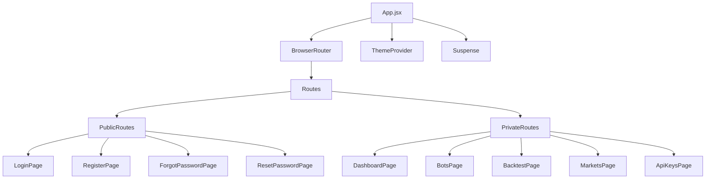
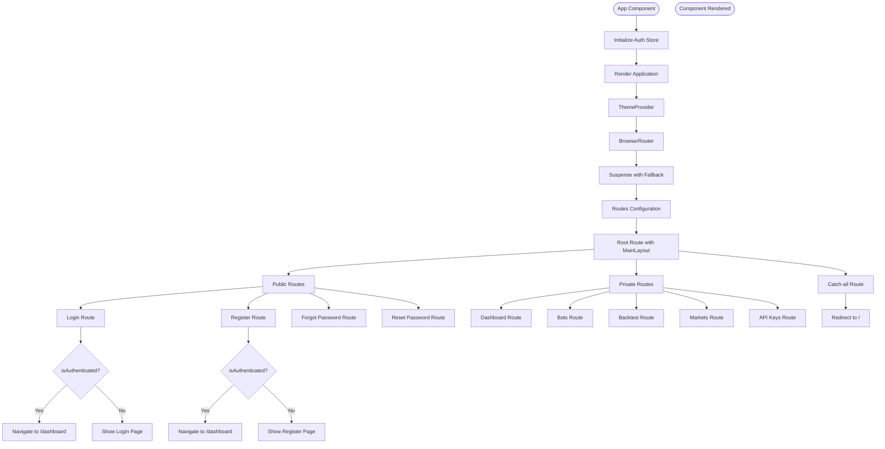
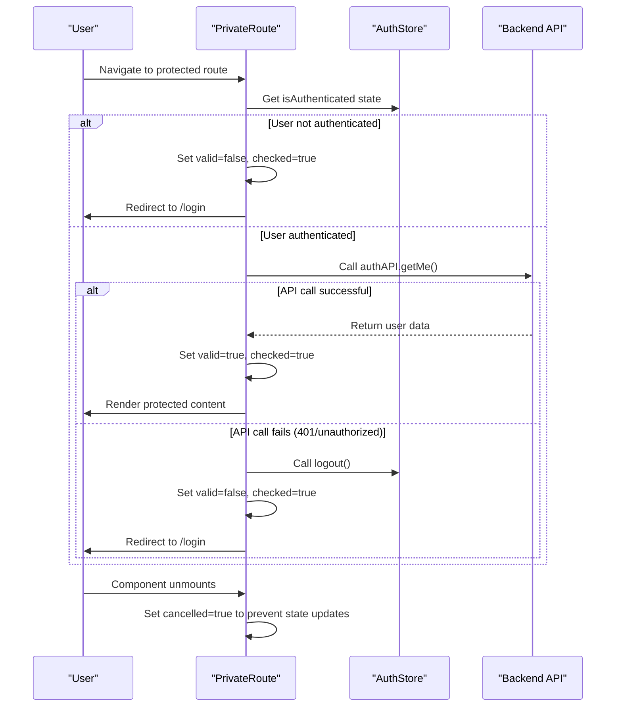
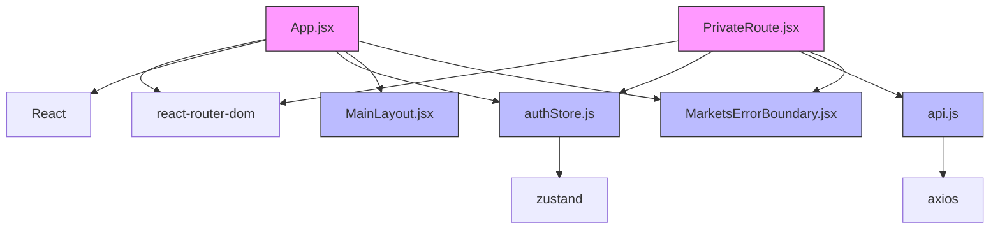
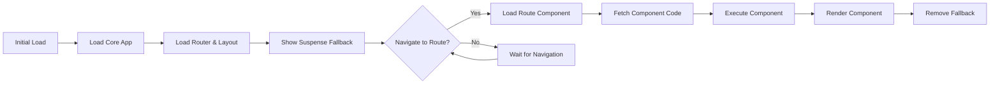

# Frontend Routing System

<cite>
**Referenced Files in This Document**   
- [App.jsx](file://frontend/src/App.jsx)
- [PrivateRoute.jsx](file://frontend/src/components/Auth/PrivateRoute.jsx)
- [authStore.js](file://frontend/src/store/authStore.js)
- [api.js](file://frontend/src/services/api.js)
- [MainLayout.jsx](file://frontend/src/components/Layout/MainLayout.jsx)
- [MarketsErrorBoundary.jsx](file://frontend/src/components/ErrorBoundary/MarketsErrorBoundary.jsx)
</cite>

## Table of Contents
1. [Introduction](#introduction)
2. [Project Structure](#project-structure)
3. [Core Components](#core-components)
4. [Architecture Overview](#architecture-overview)
5. [Detailed Component Analysis](#detailed-component-analysis)
6. [Dependency Analysis](#dependency-analysis)
7. [Performance Considerations](#performance-considerations)
8. [Troubleshooting Guide](#troubleshooting-guide)
9. [Conclusion](#conclusion)

## Introduction
The frontend routing system in TradeBot is built on React Router and implements a robust navigation architecture with authentication-based route protection. The system separates public and private routes, implements lazy loading for performance optimization, and integrates tightly with the authentication system to control access based on user session state. This documentation provides a comprehensive analysis of the routing implementation, focusing on the structure, authentication flows, and performance optimizations.

## Project Structure
The routing system is centered around the App.jsx file in the frontend/src directory, which serves as the root component for the application. The structure follows a feature-based organization with clear separation between components, pages, and services. The routing configuration is implemented in the App component, which wraps the entire application with necessary providers and route definitions.



**Diagram sources**
- [App.jsx](file://frontend/src/App.jsx#L1-L183)

**Section sources**
- [App.jsx](file://frontend/src/App.jsx#L1-L183)

## Core Components
The routing system consists of several core components that work together to provide a seamless navigation experience. The App component serves as the central routing configuration, defining all routes and their access conditions. The PrivateRoute component acts as a wrapper for authentication-protected routes, ensuring only authenticated users can access them. The system also implements lazy loading through React.lazy() and Suspense for optimal performance.

**Section sources**
- [App.jsx](file://frontend/src/App.jsx#L24-L182)
- [PrivateRoute.jsx](file://frontend/src/components/Auth/PrivateRoute.jsx#L6-L56)

## Architecture Overview
The routing architecture implements a hierarchical structure with public and private route separation. Public routes include authentication flows such as login, registration, and password recovery, while private routes encompass the main application functionality. The system uses React Router's nested route feature with MainLayout as the parent route, providing a consistent layout across authenticated pages.

```mermaid
graph TD
A[App] --> B[Router]
B --> C[Suspense]
C --> D[Routes]
D --> E[MainLayout]
E --> F[Public Routes]
E --> G[Private Routes]
F --> H[/login]
F --> I[/register]
F --> J[/forgot-password]
F --> K[/reset-password]
G --> L[/dashboard]
G --> M[/bots]
G --> N[/backtest]
G --> O[/markets]
G --> P[/api-keys]
G --> Q[/bots/create]
G --> R[/bots/:id]
G --> S[/bots/:id/edit]
G --> T[/bots/:id/trades]
G --> U[/bots/:id/performance]
G --> V[/backtest/report]
```

**Diagram sources**
- [App.jsx](file://frontend/src/App.jsx#L32-L175)

**Section sources**
- [App.jsx](file://frontend/src/App.jsx#L32-L175)

## Detailed Component Analysis

### App Component Analysis
The App component serves as the root component and routing configuration for the TradeBot frontend. It implements React Router with BrowserRouter, defining the complete route hierarchy for the application. The component uses React's Suspense to handle lazy-loaded components and integrates with the authentication system through Zustand store.



**Diagram sources**
- [App.jsx](file://frontend/src/App.jsx#L24-L182)

**Section sources**
- [App.jsx](file://frontend/src/App.jsx#L24-L182)

### PrivateRoute Component Analysis
The PrivateRoute component implements authentication protection for routes that require user authentication. It checks the user's authentication status and validates the session with the backend API before allowing access to protected routes. The component provides a seamless user experience by handling authentication state changes and redirecting appropriately.



**Diagram sources**
- [PrivateRoute.jsx](file://frontend/src/components/Auth/PrivateRoute.jsx#L6-L56)

**Section sources**
- [PrivateRoute.jsx](file://frontend/src/components/Auth/PrivateRoute.jsx#L6-L56)

### Authentication Flow Analysis
The routing system implements a comprehensive authentication flow that prevents authenticated users from accessing public authentication routes and protects private routes from unauthenticated access. The flow includes login, registration, password recovery, and session validation.

```mermaid
flowchart TD
A[User Action] --> B{User Authenticated?}
B --> |No| C[Show Public Routes]
C --> D[Login Page]
C --> E[Register Page]
C --> F[Forgot Password]
C --> G[Reset Password]
B --> |Yes| H[Redirect to Dashboard]
D --> I[Submit Credentials]
I --> J[Call authAPI.login()]
J --> K{Login Successful?}
K --> |Yes| L[Store Token]
L --> M[Update AuthStore]
M --> N[Navigate to Dashboard]
K --> |No| O[Show Error]
O --> D
P[Direct Navigation] --> Q{Route Protected?}
Q --> |Yes| R[Check Authentication]
R --> S{Valid Session?}
S --> |Yes| T[Render Route]
S --> |No| U[Redirect to Login]
Q --> |No| V{Authenticated?}
V --> |Yes| W[Redirect to Dashboard]
V --> |No| X[Render Public Route]
```

**Diagram sources**
- [App.jsx](file://frontend/src/App.jsx#L48-L78)
- [PrivateRoute.jsx](file://frontend/src/components/Auth/PrivateRoute.jsx#L12-L39)

**Section sources**
- [App.jsx](file://frontend/src/App.jsx#L48-L78)
- [PrivateRoute.jsx](file://frontend/src/components/Auth/PrivateRoute.jsx#L12-L39)

## Dependency Analysis
The routing system has several key dependencies that enable its functionality. The primary dependencies include React Router for routing capabilities, Zustand for state management, and Axios for API communication. The system also depends on React's lazy loading and Suspense features for performance optimization.



**Diagram sources**
- [App.jsx](file://frontend/src/App.jsx#L1-L23)
- [PrivateRoute.jsx](file://frontend/src/components/Auth/PrivateRoute.jsx#L1-L4)
- [authStore.js](file://frontend/src/store/authStore.js#L1-L3)
- [api.js](file://frontend/src/services/api.js#L1-L2)

**Section sources**
- [App.jsx](file://frontend/src/App.jsx#L1-L23)
- [PrivateRoute.jsx](file://frontend/src/components/Auth/PrivateRoute.jsx#L1-L4)
- [authStore.js](file://frontend/src/store/authStore.js#L1-L3)
- [api.js](file://frontend/src/services/api.js#L1-L2)

## Performance Considerations
The routing system implements several performance optimizations to ensure fast loading times and efficient resource usage. The primary optimization is the use of React.lazy() for code splitting, which loads page components only when needed. This reduces the initial bundle size and improves startup performance.



**Diagram sources**
- [App.jsx](file://frontend/src/App.jsx#L5-L19)
- [App.jsx](file://frontend/src/App.jsx#L35-L36)

**Section sources**
- [App.jsx](file://frontend/src/App.jsx#L5-L19)
- [App.jsx](file://frontend/src/App.jsx#L35-L36)

## Troubleshooting Guide
The routing system includes several mechanisms for handling common issues such as authentication errors, component loading failures, and undefined routes. Understanding these mechanisms can help diagnose and resolve issues quickly.

### Authentication Issues
When users experience authentication-related routing problems, check the following:
- Verify the authentication token is properly stored in localStorage
- Ensure the authAPI.getMe() endpoint is accessible and returning valid user data
- Check that the Zustand store is correctly updating the isAuthenticated state

### Component Loading Issues
For lazy-loaded component loading problems:
- Verify the component paths in the import() statements are correct
- Check network connectivity and server availability
- Ensure the Suspense fallback is properly configured

### Route Redirection Problems
When routes are not redirecting as expected:
- Verify the isAuthenticated state is correctly updated in the authStore
- Check that the PrivateRoute component is properly wrapped around protected routes
- Ensure the Navigate component is using the correct path and replace parameters

**Section sources**
- [PrivateRoute.jsx](file://frontend/src/components/Auth/PrivateRoute.jsx#L42-L53)
- [App.jsx](file://frontend/src/App.jsx#L42-L44)
- [App.jsx](file://frontend/src/App.jsx#L173-L174)

## Conclusion
The frontend routing system in TradeBot provides a robust and secure navigation architecture that effectively separates public and private routes. By leveraging React Router, lazy loading, and a custom PrivateRoute component, the system ensures optimal performance and proper access control based on user authentication state. The integration with the Zustand store and backend API creates a seamless user experience while maintaining security. The system's design allows for easy extension with new routes and features while maintaining consistent navigation patterns throughout the application.