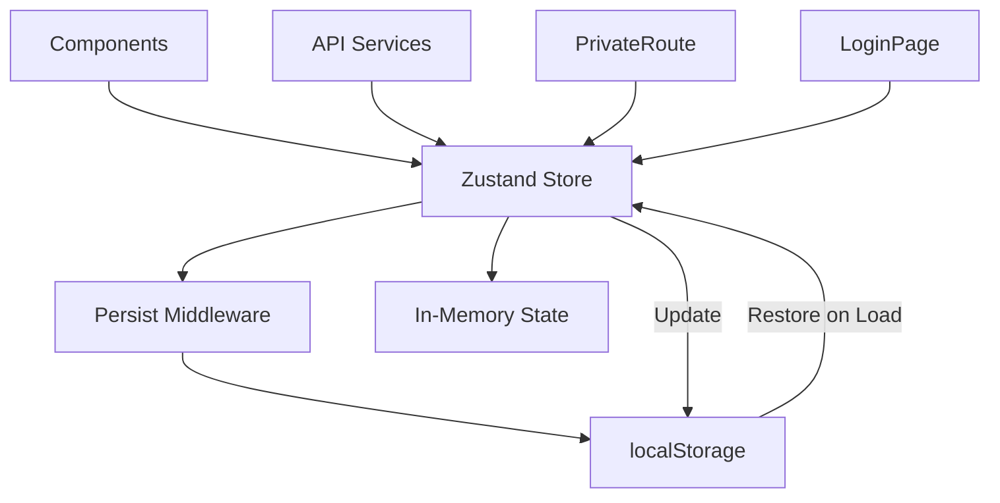
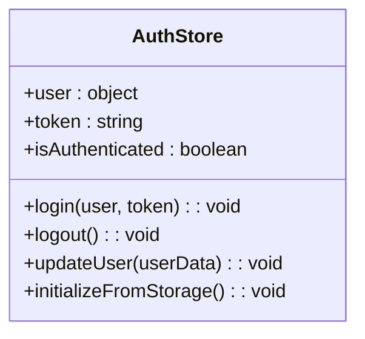
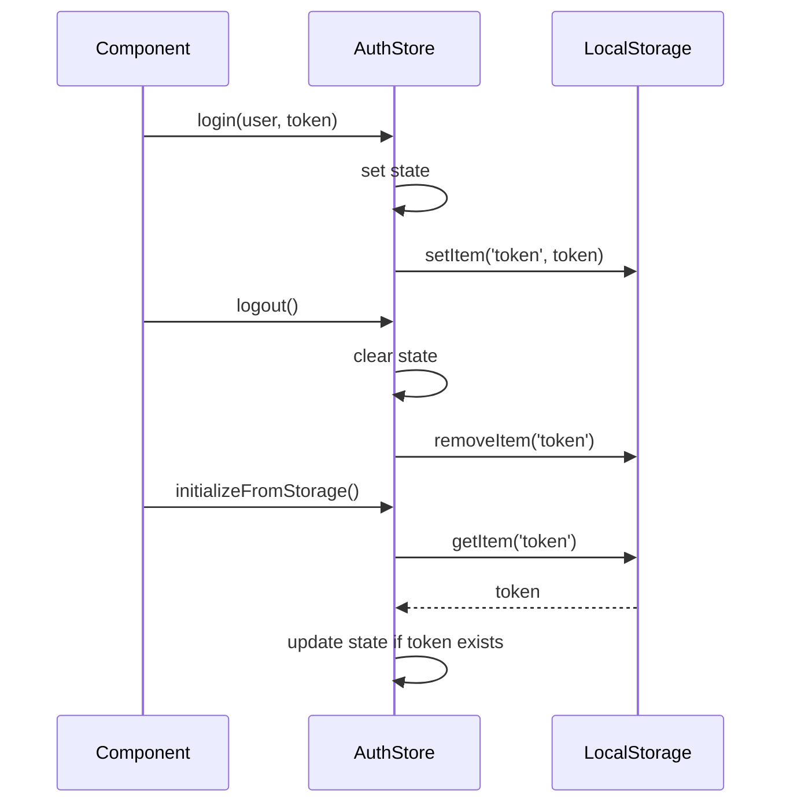
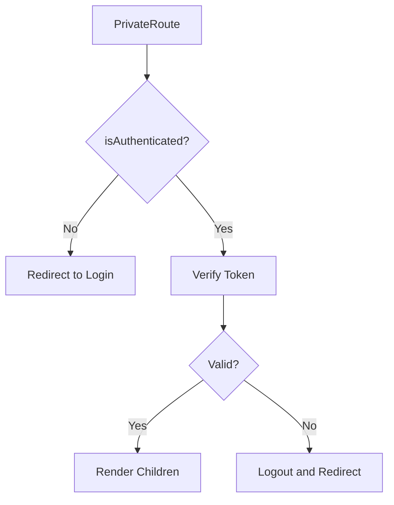
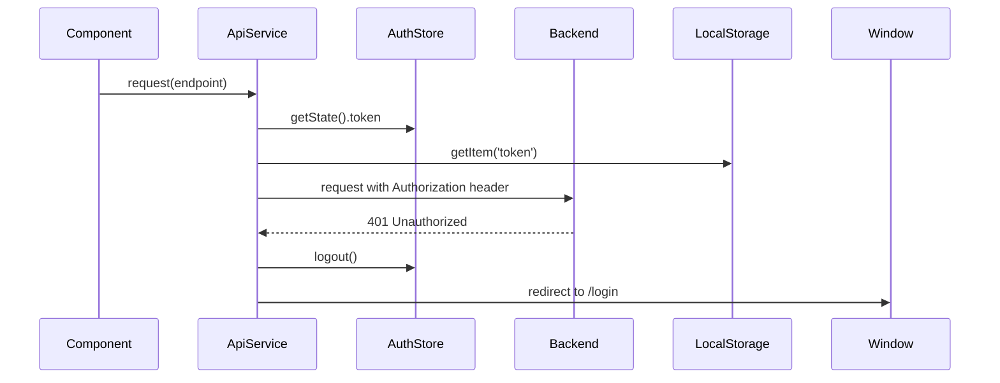
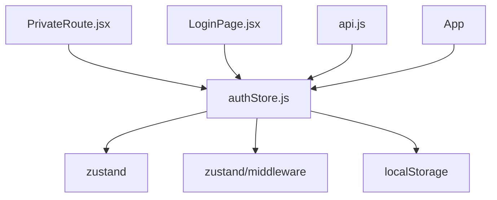

# Frontend State Management

<cite>
**Referenced Files in This Document**   
- [authStore.js](file://frontend/src/store/authStore.js)
- [PrivateRoute.jsx](file://frontend/src/components/Auth/PrivateRoute.jsx)
- [LoginPage.jsx](file://frontend/src/pages/Auth/LoginPage.jsx)
- [api.js](file://frontend/src/services/api.js)
</cite>

## Table of Contents
1. [Introduction](#introduction)
2. [Core Components](#core-components)
3. [Architecture Overview](#architecture-overview)
4. [Detailed Component Analysis](#detailed-component-analysis)
5. [Dependency Analysis](#dependency-analysis)
6. [Performance Considerations](#performance-considerations)
7. [Troubleshooting Guide](#troubleshooting-guide)
8. [Conclusion](#conclusion)

## Introduction
This document provides comprehensive documentation for the Zustand-based state management system in the TradeBot frontend application, focusing on the authentication state management implementation. The system leverages Zustand with the persist middleware to maintain user authentication state across sessions, ensuring a seamless user experience. The documentation covers the core architecture, implementation details, integration patterns, and best practices for state management in the application.

## Core Components

The authentication state management system is built around several key components that work together to provide a robust and persistent authentication solution. The core of this system is the `authStore` implementation, which manages user authentication state using Zustand with the persist middleware. This store maintains critical authentication properties including user information, authentication token, and authentication status. The system integrates with localStorage for token persistence and provides a comprehensive set of actions for managing authentication state transitions.

**Section sources**
- [authStore.js](file://frontend/src/store/authStore.js#L1-L69)

## Architecture Overview

The authentication state management architecture follows a layered approach with clear separation of concerns. At the core is the Zustand store that maintains the application's authentication state. This store is enhanced with the persist middleware to ensure state persistence across page reloads and browser sessions. The store interacts with localStorage directly for token storage while maintaining the full authentication state in memory for optimal performance.

The architecture includes a well-defined initialization process that restores state from persistent storage when the application loads. Components throughout the application consume the store through React hooks, enabling reactive updates when authentication state changes. The system also includes integration with API services that automatically include authentication tokens in requests and handle authentication errors appropriately.

**Diagram sources **
- [authStore.js](file://frontend/src/store/authStore.js#L1-L69)

## Detailed Component Analysis

### Auth Store Implementation
The authStore implementation provides a centralized solution for managing user authentication state in the TradeBot frontend application. Built on Zustand with the persist middleware, this store ensures that authentication state is maintained across sessions while providing a simple and intuitive API for components to interact with.

#### Store Structure and Properties
The store maintains three core properties that represent the authentication state:
- `user`: Stores user information object when authenticated
- `token`: Contains the authentication token for API requests
- `isAuthenticated`: Boolean flag indicating current authentication status

These properties are initialized to null/false values, representing an unauthenticated state when the application first loads.

**Diagram sources **
- [authStore.js](file://frontend/src/store/authStore.js#L7-L9)

#### Authentication Actions
The store provides several actions to manage authentication state transitions:

**Login Action**: When a user successfully authenticates, the login action updates the store state with user information and token, sets the isAuthenticated flag to true, and stores the token in localStorage for persistence.

**Logout Action**: The logout action clears all authentication state from both the store and localStorage, effectively ending the user session.

**Update User Action**: Allows partial updates to the user object without requiring a full re-authentication.

**Initialize from Storage**: A special action that runs during application initialization to restore authentication state from localStorage if available.

**Diagram sources **
- [authStore.js](file://frontend/src/store/authStore.js#L11-L56)

### Integration with Application Components
The authStore is integrated throughout the application to provide authentication functionality to various components.

#### Private Route Component
The PrivateRoute component uses the authStore to protect routes that require authentication. It checks the isAuthenticated state and verifies the token with the backend before allowing access to protected pages. If authentication fails, it automatically redirects to the login page.

**Diagram sources **
- [PrivateRoute.jsx](file://frontend/src/components/Auth/PrivateRoute.jsx#L7-L53)

#### Login Page Component
The LoginPage component interacts with the authStore during the authentication process. When a user submits valid credentials, the component calls the login action with the user data and authentication token received from the API, which updates the store state and persists the token.

**Section sources**
- [LoginPage.jsx](file://frontend/src/pages/Auth/LoginPage.jsx#L16-L40)

### API Service Integration
The API services in the application integrate with the authStore to automatically include authentication tokens in requests and handle authentication errors.

#### Token Management
The ApiService class retrieves the authentication token from multiple sources, first checking the Zustand store and falling back to localStorage if necessary. This ensures that tokens are available even if the store hasn't been fully initialized.

#### Error Handling
When API requests return 401 Unauthorized responses, the ApiService automatically triggers the logout action and redirects to the login page, providing a seamless experience when authentication tokens expire or become invalid.

**Diagram sources **
- [api.js](file://frontend/src/services/api.js#L12-L85)

## Dependency Analysis

The authentication state management system has well-defined dependencies that ensure proper functionality and integration with the rest of the application.

**Diagram sources **
- [authStore.js](file://frontend/src/store/authStore.js#L1-L2)
- [PrivateRoute.jsx](file://frontend/src/components/Auth/PrivateRoute.jsx#L3)
- [LoginPage.jsx](file://frontend/src/pages/Auth/LoginPage.jsx#L5)
- [api.js](file://frontend/src/services/api.js#L2)

**Section sources**
- [authStore.js](file://frontend/src/store/authStore.js#L1-L69)
- [PrivateRoute.jsx](file://frontend/src/components/Auth/PrivateRoute.jsx#L1-L57)
- [LoginPage.jsx](file://frontend/src/pages/Auth/LoginPage.jsx#L1-L207)
- [api.js](file://frontend/src/services/api.js#L1-L375)

## Performance Considerations
The authentication state management system is designed with performance in mind. By using Zustand, the application benefits from efficient state updates that only trigger re-renders in components that actually use the changed state. The persist middleware is configured to only persist the essential authentication properties, minimizing storage overhead.

The initialization process is optimized to quickly restore state from localStorage without blocking the main thread. The system also includes debugging logs that are only enabled in non-production environments, ensuring that performance is not impacted in production deployments.

## Troubleshooting Guide
When troubleshooting issues with the authentication state management system, consider the following common scenarios:

1. **State not persisting across page reloads**: Verify that the persist middleware is properly configured and that the localStorage operations are successful.

2. **Authentication token not being sent with API requests**: Check that the ApiService is correctly retrieving the token from both the store and localStorage.

3. **Inconsistent authentication state**: Ensure that all components are using the same instance of the authStore and that state updates are properly synchronized.

4. **Unexpected logout behavior**: Review the error handling in the ApiService to ensure 401 responses are handled correctly.

The system includes comprehensive console logging for debugging purposes, with different log messages for login, logout, and state initialization events.

**Section sources**
- [authStore.js](file://frontend/src/store/authStore.js#L18-L28)
- [api.js](file://frontend/src/services/api.js#L20-L43)

## Conclusion
The Zustand-based state management system in the TradeBot frontend provides a robust and efficient solution for managing user authentication state. By leveraging the persist middleware, the system ensures that user sessions are maintained across browser sessions while providing a simple and intuitive API for components to interact with. The integration with localStorage and API services creates a seamless authentication experience that handles both normal operations and edge cases effectively. This architecture serves as a solid foundation for the application's security model and user experience.