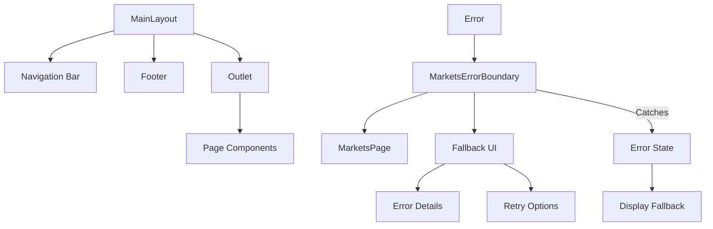
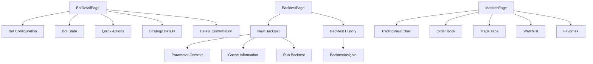
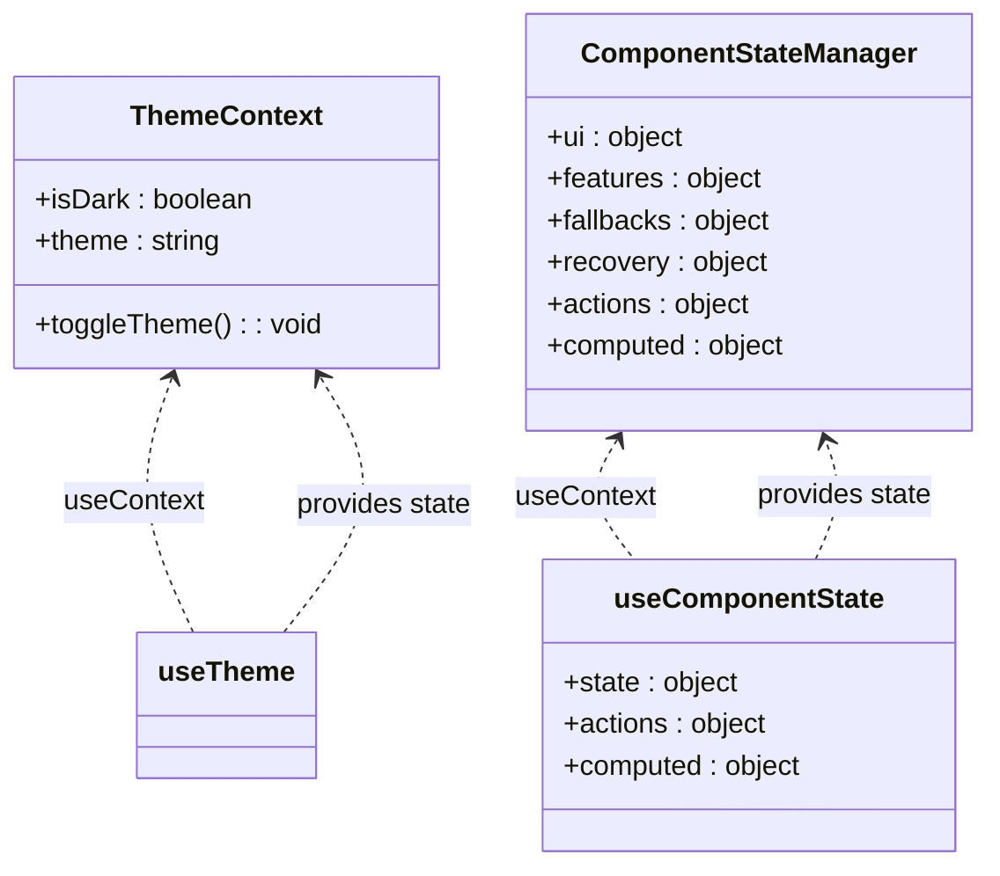
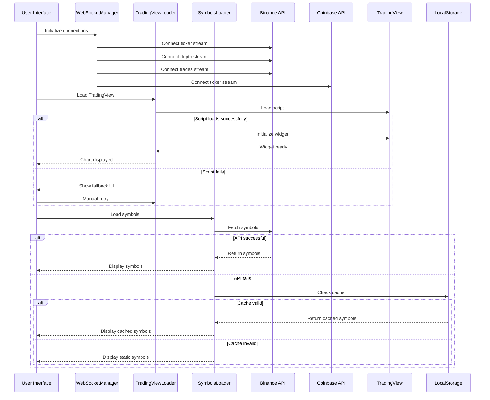
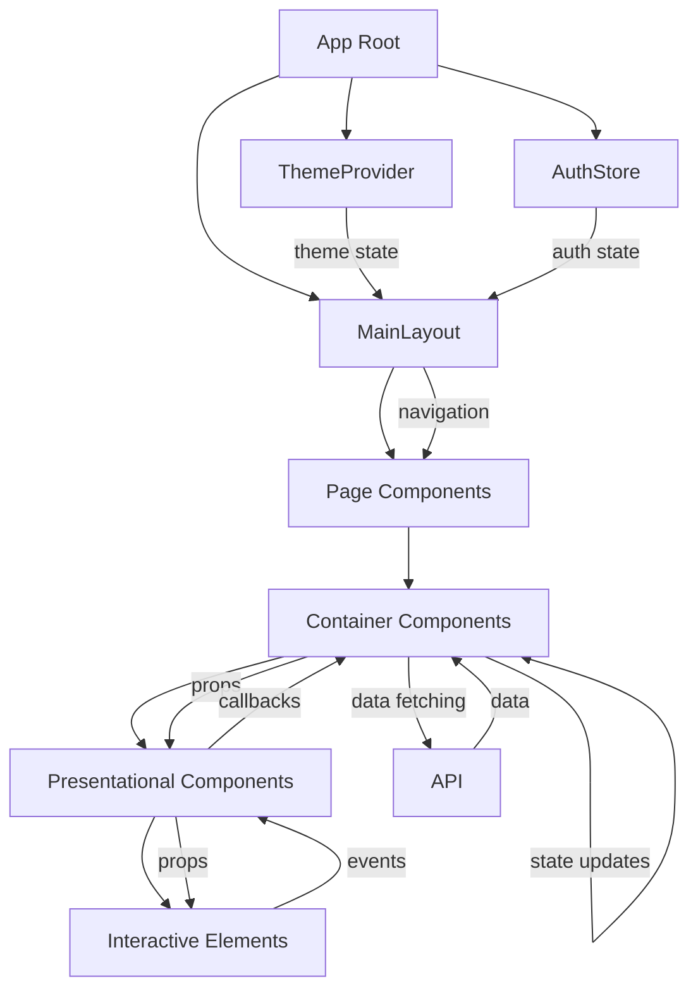

# Frontend UI Components

<cite>
**Referenced Files in This Document**   
- [MainLayout.jsx](file://frontend/src/components/Layout/MainLayout.jsx)
- [MarketsErrorBoundary.jsx](file://frontend/src/components/ErrorBoundary/MarketsErrorBoundary.jsx)
- [ThemeContext.jsx](file://frontend/src/contexts/ThemeContext.jsx)
- [BotDetailPage.jsx](file://frontend/src/pages/Bots/BotDetailPage.jsx)
- [BacktestPage.jsx](file://frontend/src/pages/Backtest/BacktestPage.jsx)
- [MarketsPage.jsx](file://frontend/src/pages/Markets/MarketsPage.jsx)
- [WebSocketManager.jsx](file://frontend/src/components/Markets/WebSocketManager.jsx)
- [TradingViewLoader.jsx](file://frontend/src/components/Markets/TradingViewLoader.jsx)
- [ComponentStateManager.jsx](file://frontend/src/components/Markets/ComponentStateManager.jsx)
- [SymbolsLoader.jsx](file://frontend/src/components/Markets/SymbolsLoader.jsx)
</cite>

## Table of Contents
1. [Introduction](#introduction)
2. [Component Hierarchy and Layout](#component-hierarchy-and-layout)
3. [Layout and Error Boundary Components](#layout-and-error-boundary-components)
4. [Page-Level Components](#page-level-components)
5. [State Management and Context](#state-management-and-context)
6. [Specialized Functional Components](#specialized-functional-components)
7. [Component Composition and Data Flow](#component-composition-and-data-flow)
8. [Accessibility, Responsiveness, and Styling](#accessibility-responsiveness-and-styling)
9. [Best Practices for Component Development](#best-practices-for-component-development)
10. [Conclusion](#conclusion)

## Introduction
The TradeBot frontend application is built using React with a component-based architecture that emphasizes reusability, fault isolation, and maintainable code organization. The UI structure is organized into reusable components in the `frontend/src/components/` directory and page-level components in `frontend/src/pages/`. The application uses React Router for navigation, Tailwind CSS for styling, and implements several architectural patterns for state management, error handling, and real-time data processing. This documentation provides a comprehensive overview of the frontend UI components, detailing their structure, relationships, and implementation patterns to guide development and maintenance.

## Component Hierarchy and Layout
The TradeBot frontend follows a hierarchical component structure that begins with layout components and extends to specialized page and functional components. At the top level, the `MainLayout` component serves as the primary container for all authenticated views, providing consistent navigation, theming, and structural elements across the application. This layout wraps all page components and establishes the visual and functional framework for the user interface.

Page components such as `BotDetailPage`, `BacktestPage`, and `MarketsPage` are organized within their respective directories in `frontend/src/pages/` and represent distinct sections of the application. These page components are composed of reusable subcomponents from `frontend/src/components/`, creating a tree-like hierarchy where higher-level components coordinate the behavior and data flow for their children.

The component hierarchy follows a clear pattern of composition, with layout components containing page components, which in turn contain specialized functional components. This structure enables consistent UI patterns while allowing for page-specific functionality. The routing system, managed by React Router, determines which page component is rendered within the main layout based on the current URL path, creating a single-page application experience with distinct views for different functionalities.

**Section sources**
- [MainLayout.jsx](file://frontend/src/components/Layout/MainLayout.jsx)
- [BotDetailPage.jsx](file://frontend/src/pages/Bots/BotDetailPage.jsx)
- [BacktestPage.jsx](file://frontend/src/pages/Backtest/BacktestPage.jsx)
- [MarketsPage.jsx](file://frontend/src/pages/Markets/MarketsPage.jsx)

## Layout and Error Boundary Components
The `MainLayout` component serves as the foundational layout for the TradeBot application, providing a consistent user interface across all pages. This component includes a responsive navigation bar with authentication controls, theme toggling, and user profile information. It uses React Router's `Outlet` component to render child routes, establishing a parent-child relationship between the layout and page components. The layout implements responsive design patterns, with a collapsible mobile menu that adapts to smaller screen sizes.

Error boundaries are implemented to provide fault isolation and graceful error recovery. The `MarketsErrorBoundary` component is a class-based error boundary that catches JavaScript errors in its child component tree, preventing the entire application from crashing. When an error occurs, it displays a user-friendly fallback UI with error details, retry functionality, and manual refresh options. The error boundary categorizes errors by type (such as TradingView, WebSocket, network, or script loading errors) and implements automated retry logic for recoverable errors, with exponential backoff and a maximum retry limit.

The error boundary also provides detailed error information in development mode, including the error message, component stack trace, and retry count, while maintaining a cleaner interface in production. It includes manual recovery options, allowing users to retry the operation or perform a full page refresh as a last resort. This fault-tolerant design ensures that transient errors in specific components do not disrupt the entire user experience, particularly important for the Markets page which relies on multiple external services.

**Diagram sources**
- [MainLayout.jsx](file://frontend/src/components/Layout/MainLayout.jsx#L1-L276)
- [MarketsErrorBoundary.jsx](file://frontend/src/components/ErrorBoundary/MarketsErrorBoundary.jsx#L1-L306)

**Section sources**
- [MainLayout.jsx](file://frontend/src/components/Layout/MainLayout.jsx#L1-L276)
- [MarketsErrorBoundary.jsx](file://frontend/src/components/ErrorBoundary/MarketsErrorBoundary.jsx#L1-L306)

## Page-Level Components
The TradeBot application features several key page components that provide distinct functionality for users. The `BotDetailPage` component displays comprehensive information about a specific trading bot, including its configuration, current state, performance metrics, and control options. It implements a tabbed interface with quick action buttons for starting, stopping, and editing the bot, as well as a confirmation modal for deletion. The page fetches bot data, state information, and balance data through API calls and displays them in organized information cards with appropriate styling based on the bot's status.

The `BacktestPage` component provides a comprehensive interface for running and analyzing backtests of trading strategies. It features a tabbed navigation system that separates the creation of new backtests from viewing historical results. The new backtest interface includes extensive parameter controls for strategy configuration, risk management, and technical indicators, with input validation and sensible default values. Users can configure the symbol, time interval, date range, and various strategy parameters before executing a backtest, with results displayed through the `BacktestInsights` component.

The `MarketsPage` component offers real-time market data visualization with a multi-pane interface that includes a TradingView chart, order book, trade tape, and watchlist functionality. It implements a sophisticated data loading strategy that first displays a static list of popular symbols while asynchronously fetching the complete symbol list from the backend. The page supports user customization through favorites and watchlists, with persistent storage in localStorage, and provides real-time price updates from both Binance and Coinbase WebSocket streams for price comparison.

**Diagram sources**
- [BotDetailPage.jsx](file://frontend/src/pages/Bots/BotDetailPage.jsx#L1-L711)
- [BacktestPage.jsx](file://frontend/src/pages/Backtest/BacktestPage.jsx#L1-L800)
- [MarketsPage.jsx](file://frontend/src/pages/Markets/MarketsPage.jsx#L1-L375)

**Section sources**
- [BotDetailPage.jsx](file://frontend/src/pages/Bots/BotDetailPage.jsx#L1-L711)
- [BacktestPage.jsx](file://frontend/src/pages/Backtest/BacktestPage.jsx#L1-L800)
- [MarketsPage.jsx](file://frontend/src/pages/Markets/MarketsPage.jsx#L1-L375)

## State Management and Context
The TradeBot frontend implements a comprehensive state management system using React Context for global state and custom hooks for component-specific state. The `ThemeContext` provides a centralized mechanism for theme management across the application, allowing users to toggle between light and dark modes. The context stores the current theme state, provides a toggle function, and persists the user's preference in localStorage. It also updates the document class to apply the appropriate CSS classes for styling, enabling a consistent theming experience throughout the application.

For more complex state management needs, particularly in the Markets page, the application uses a sophisticated state management pattern with the `ComponentStateManager` component. This provider uses a reducer pattern to manage various aspects of component state, including loading status, error conditions, feature availability, and recovery state. It implements a circuit breaker pattern to prevent repeated failed attempts to connect to external services, with configurable failure thresholds and recovery timeouts.

The state management system also includes retry scheduling, health monitoring, and fallback data management. Components can subscribe to specific state slices using selectors to minimize unnecessary re-renders. The system tracks the status of critical features like TradingView, WebSocket connections, and symbol loading, providing a unified view of the application's health and connectivity status. This approach enables components to make informed decisions about rendering fallback content or attempting recovery operations based on the overall system state.

**Diagram sources**
- [ThemeContext.jsx](file://frontend/src/contexts/ThemeContext.jsx#L1-L52)
- [ComponentStateManager.jsx](file://frontend/src/components/Markets/ComponentStateManager.jsx#L1-L477)

**Section sources**
- [ThemeContext.jsx](file://frontend/src/contexts/ThemeContext.jsx#L1-L52)
- [ComponentStateManager.jsx](file://frontend/src/components/Markets/ComponentStateManager.jsx#L1-L477)

## Specialized Functional Components
The TradeBot application includes several specialized functional components that handle complex interactions with external services and real-time data. The `WebSocketManager` component orchestrates multiple WebSocket connections to Binance and Coinbase for real-time market data, implementing connection management, error recovery, and data normalization. It establishes separate connections for ticker data, order book depth, and trade streams, with configurable reconnection strategies and exponential backoff for failed connections.

The `TradingViewLoader` component manages the integration with the TradingView charting library, handling the dynamic loading of the TradingView script and widget initialization. It implements a circuit breaker pattern to prevent repeated failed attempts to load the external script, with configurable retry limits and timeouts. The component provides fallback UI when the TradingView service is unavailable, allowing users to continue viewing market data from other sources even when the charting functionality is impaired.

The `SymbolsLoader` component implements a sophisticated data loading strategy with multiple fallback levels. It first attempts to fetch the complete symbol list from the backend API, then falls back to cached data if the API is unavailable, and finally uses a static list of popular symbols as a last resort. This progressive enhancement approach ensures that the application remains functional even when external services are temporarily unavailable, providing a resilient user experience.

The `RetryManager` hook provides a reusable mechanism for implementing retry logic across different components, with configurable retry strategies for different types of operations (API calls, WebSocket connections, script loading). It tracks retry attempts, calculates appropriate delays using exponential backoff, and integrates with the circuit breaker system to prevent overwhelming external services with repeated requests.

**Diagram sources**
- [WebSocketManager.jsx](file://frontend/src/components/Markets/WebSocketManager.jsx#L1-L625)
- [TradingViewLoader.jsx](file://frontend/src/components/Markets/TradingViewLoader.jsx#L1-L414)
- [SymbolsLoader.jsx](file://frontend/src/components/Markets/SymbolsLoader.jsx#L1-L382)
- [RetryManager.jsx](file://frontend/src/components/Markets/RetryManager.jsx#L1-L207)

**Section sources**
- [WebSocketManager.jsx](file://frontend/src/components/Markets/WebSocketManager.jsx#L1-L625)
- [TradingViewLoader.jsx](file://frontend/src/components/Markets/TradingViewLoader.jsx#L1-L414)
- [SymbolsLoader.jsx](file://frontend/src/components/Markets/SymbolsLoader.jsx#L1-L382)
- [RetryManager.jsx](file://frontend/src/components/Markets/RetryManager.jsx#L1-L207)

## Component Composition and Data Flow
The TradeBot frontend follows a clear pattern of component composition and unidirectional data flow, with parent components coordinating state and passing data and callbacks to child components through props. The `MainLayout` component serves as the root container, receiving authentication and theme state from context and passing relevant props to page components rendered through the `Outlet`. Page components like `BotDetailPage` and `BacktestPage` act as container components that fetch data from APIs and manage component state, then pass this data down to presentational components.

Data flows from higher-level components to lower-level components through props, with callbacks passed in the opposite direction to enable child components to communicate state changes back to their parents. For example, in the `BotDetailPage`, the parent component manages the bot data state and passes it to information cards, while the cards receive callback functions for actions like starting or stopping the bot. This pattern creates a clear separation of concerns, with container components handling data and logic, and presentational components focusing on rendering UI.

The application also implements prop drilling for theme and authentication state, with context providers at the root level making these values available to all components without requiring explicit prop passing through intermediate components. Event handling is centralized in container components, which define callback functions and pass them to interactive elements in child components. This approach maintains a predictable data flow and makes it easier to trace the origin of state changes and side effects.

**Diagram sources**
- [MainLayout.jsx](file://frontend/src/components/Layout/MainLayout.jsx#L1-L276)
- [BotDetailPage.jsx](file://frontend/src/pages/Bots/BotDetailPage.jsx#L1-L711)
- [BacktestPage.jsx](file://frontend/src/pages/Backtest/BacktestPage.jsx#L1-L800)

**Section sources**
- [MainLayout.jsx](file://frontend/src/components/Layout/MainLayout.jsx#L1-L276)
- [BotDetailPage.jsx](file://frontend/src/pages/Bots/BotDetailPage.jsx#L1-L711)
- [BacktestPage.jsx](file://frontend/src/pages/Backtest/BacktestPage.jsx#L1-L800)

## Accessibility, Responsiveness, and Styling
The TradeBot frontend implements comprehensive accessibility, responsiveness, and styling practices to ensure a high-quality user experience across different devices and user needs. The application uses Tailwind CSS for styling, leveraging its utility-first approach to create consistent, responsive designs with minimal custom CSS. The design system includes a cohesive color palette, typography hierarchy, and spacing system that creates a professional and modern appearance.

Responsive design is implemented throughout the application, with the `MainLayout` component featuring a mobile-first approach that includes a collapsible navigation menu for smaller screens. Media queries and responsive utility classes ensure that layouts adapt appropriately to different viewport sizes, with grid systems that reflow content from multi-column layouts on desktop to single-column layouts on mobile devices.

Accessibility features include semantic HTML elements, proper heading hierarchy, ARIA attributes for interactive components, and keyboard navigation support. Interactive elements have appropriate focus states and sufficient color contrast to meet accessibility standards. Form controls include descriptive labels and error messages, and dynamic content updates are announced to screen readers through appropriate ARIA live regions.

The dark mode implementation provides a complete theme toggle that affects all components consistently, with careful attention to color contrast and readability in both light and dark themes. The application uses system preference detection to automatically match the user's operating system theme setting, while also allowing manual override through the theme toggle button in the navigation bar.

**Section sources**
- [MainLayout.jsx](file://frontend/src/components/Layout/MainLayout.jsx#L1-L276)
- [BotDetailPage.jsx](file://frontend/src/pages/Bots/BotDetailPage.jsx#L1-L711)
- [BacktestPage.jsx](file://frontend/src/pages/Backtest/BacktestPage.jsx#L1-L800)
- [MarketsPage.jsx](file://frontend/src/pages/Markets/MarketsPage.jsx#L1-L375)

## Best Practices for Component Development
When developing new components for the TradeBot frontend, several best practices should be followed to maintain code quality and consistency. Components should be designed with reusability in mind, extracting common UI patterns into standalone components that can be shared across different pages. Presentational and container component patterns should be used to separate concerns, with container components handling data fetching and state management, and presentational components focusing on rendering UI based on props.

Error handling should be implemented at appropriate levels, with error boundaries used to contain failures in specific component trees and prevent application-wide crashes. Components that interact with external services should implement retry logic and fallback UI to provide a resilient user experience when services are temporarily unavailable. The circuit breaker pattern should be used for critical external dependencies to prevent cascading failures and allow services time to recover.

State management should leverage React Context for global state like theme and authentication, while using local component state or custom hooks for component-specific state. The reducer pattern should be used for complex state logic to ensure predictable state transitions. Performance optimization techniques like memoization with `React.memo`, `useMemo`, and `useCallback` should be applied to prevent unnecessary re-renders, particularly for components that receive frequently changing props.

Accessibility should be considered from the beginning of component development, with semantic HTML, proper ARIA attributes, keyboard navigation support, and sufficient color contrast. Components should be tested with screen readers and keyboard-only navigation to ensure they are usable by all users. Responsive design principles should be applied to ensure components work well on different screen sizes and orientations.

**Section sources**
- [MainLayout.jsx](file://frontend/src/components/Layout/MainLayout.jsx#L1-L276)
- [MarketsErrorBoundary.jsx](file://frontend/src/components/ErrorBoundary/MarketsErrorBoundary.jsx#L1-L306)
- [ThemeContext.jsx](file://frontend/src/contexts/ThemeContext.jsx#L1-L52)
- [ComponentStateManager.jsx](file://frontend/src/components/Markets/ComponentStateManager.jsx#L1-L477)

## Conclusion
The TradeBot frontend UI architecture demonstrates a well-structured, component-based approach to building a complex trading application. By organizing components into reusable and page-specific categories, implementing robust state management and error handling, and following modern React patterns, the application achieves a balance of functionality, maintainability, and user experience. The use of React Context for global state, sophisticated error boundaries, and specialized components for real-time data handling creates a resilient application that can gracefully handle failures in external services.

The component hierarchy, from the `MainLayout` foundation to specialized page and functional components, provides a clear structure that facilitates development and maintenance. The integration of third-party services like TradingView and WebSocket data streams is handled through dedicated components that manage connection lifecycle, error recovery, and fallback strategies. This modular approach allows for isolated development and testing of components while maintaining a cohesive user experience.

Future development should continue to follow the established patterns of component organization, state management, and error handling to ensure consistency across the codebase. As new features are added, consideration should be given to extracting reusable components, implementing appropriate error boundaries, and ensuring accessibility and responsiveness are maintained throughout the application.