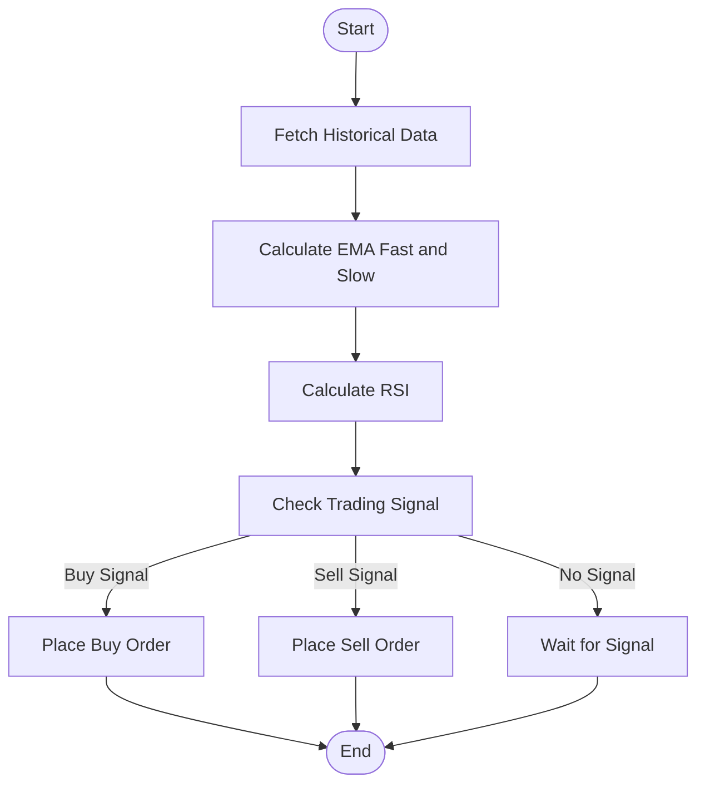
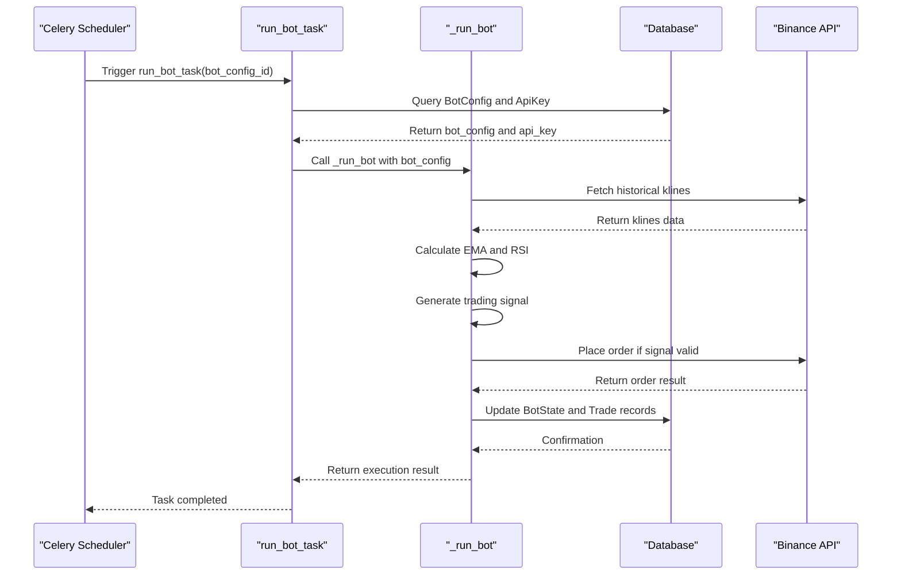
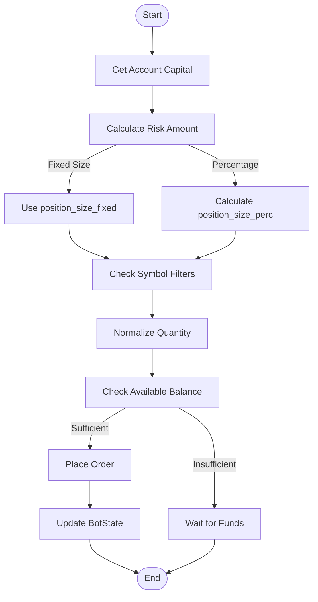

# Automated Trading System

<cite>
**Referenced Files in This Document**   
- [bot_tasks.py](file://app/core/bot_tasks.py)
- [bot_config.py](file://app/models/bot_config.py)
- [binance_client.py](file://app/core/binance_client.py)
- [backtest_service.py](file://app/services/backtest_service.py)
- [celery_app.py](file://app/core/celery_app.py)
</cite>

## Table of Contents
1. [Introduction](#introduction)
2. [Strategy Configuration and Execution](#strategy-configuration-and-execution)
3. [EMA/RSI Strategy Implementation](#emarsi-strategy-implementation)
4. [Bot Configuration and Celery Task Invocation](#bot-configuration-and-celery-task-invocation)
5. [Position Sizing and Risk Management](#position-sizing-and-risk-management)
6. [Common Issues and Solutions](#common-issues-and-solutions)
7. [Strategy Optimization and Parameter Tuning](#strategy-optimization-and-parameter-tuning)
8. [Conclusion](#conclusion)

## Introduction
The Automated Trading System is a robust platform designed to execute trading strategies based on technical indicators and risk management parameters. This document focuses on the implementation details of the EMA/RSI strategy, the configuration of bot parameters, and the execution flow within Celery tasks. The system leverages Binance API for market data and trade execution, with comprehensive risk controls and position sizing mechanisms. The documentation aims to provide both beginners and experienced developers with a clear understanding of the system's architecture and functionality.

## Strategy Configuration and Execution
The Automated Trading System allows users to configure trading strategies through the BotConfig model, which stores various parameters such as symbol, timeframe, and strategy type. The system supports multiple strategies, with the EMA/RSI strategy being a key implementation. The strategy execution is triggered by Celery tasks, which run at regular intervals to check for trading signals. The system ensures that only active bots are processed, and it handles concurrency through database row locking to prevent multiple instances of the same bot running simultaneously.

**Section sources**
- [bot_config.py](file://app/models/bot_config.py#L4-L57)
- [bot_tasks.py](file://app/core/bot_tasks.py#L121-L123)

## EMA/RSI Strategy Implementation
The EMA/RSI strategy is implemented in the `_run_bot` function within `bot_tasks.py`. The strategy uses Exponential Moving Averages (EMA) and Relative Strength Index (RSI) to generate trading signals. The EMA values are calculated using a smoothing factor, and the RSI is computed based on the average gains and losses over a specified period. The trading signal is generated when the fast EMA crosses above the slow EMA and the RSI is below the overbought threshold, indicating a buy signal, or when the fast EMA crosses below the slow EMA and the RSI is above the oversold threshold, indicating a sell signal.

**Diagram sources **
- [bot_tasks.py](file://app/core/bot_tasks.py#L251-L326)

## Bot Configuration and Celery Task Invocation
The BotConfig model defines the parameters for each trading bot, including technical indicators and risk management settings. The Celery task `run_bot_task` is invoked to execute the trading logic for a specific bot configuration. The task retrieves the bot configuration from the database, initializes the Binance client, and processes the trading strategy. The task is scheduled to run at regular intervals, ensuring that the bot continuously monitors the market for trading opportunities.

**Diagram sources **
- [bot_tasks.py](file://app/core/bot_tasks.py#L121-L123)
- [celery_app.py](file://app/core/celery_app.py#L27-L30)

## Position Sizing and Risk Management
Position sizing is calculated based on the `risk_per_trade` parameter and the account's initial capital. The system ensures that the position size does not exceed the available capital and adheres to the risk management rules defined in the bot configuration. The position size can be specified as a fixed amount or as a percentage of the account capital. The system also enforces daily trading limits, maximum daily loss, and daily profit targets to manage risk effectively.

**Diagram sources **
- [bot_tasks.py](file://app/core/bot_tasks.py#L340-L351)
- [binance_client.py](file://app/core/binance_client.py#L170-L221)

## Common Issues and Solutions
Common issues in the Automated Trading System include insufficient balance, API rate limits, and invalid trading signals. The system handles insufficient balance by normalizing the order quantity to meet the minimum notional requirements and by checking the available balance before placing an order. API rate limits are managed through retry mechanisms with exponential backoff and by respecting the rate limit headers returned by the Binance API. Invalid trading signals are handled by waiting for a valid signal and updating the bot state accordingly.

**Section sources**
- [bot_tasks.py](file://app/core/bot_tasks.py#L351-L374)
- [binance_client.py](file://app/core/binance_client.py#L74-L96)

## Strategy Optimization and Parameter Tuning
Strategy optimization involves tuning the parameters of the EMA/RSI strategy to achieve better performance. The system allows users to configure custom parameters for the EMA periods, RSI period, and overbought/oversold thresholds. The backtest service can be used to evaluate the performance of different parameter combinations and to identify the optimal settings. The system also supports walk-forward analysis and Monte Carlo simulations to validate the robustness of the strategy.

**Section sources**
- [backtest_service.py](file://app/services/backtest_service.py#L677-L701)
- [backtest_service.py](file://app/services/backtest_service.py#L832-L861)

## Conclusion
The Automated Trading System provides a comprehensive framework for implementing and executing trading strategies based on technical indicators and risk management principles. The EMA/RSI strategy is a key component of the system, offering a robust method for generating trading signals. The system's architecture, built on Celery tasks and Binance API integration, ensures reliable and efficient trade execution. By understanding the implementation details and configuration options, users can effectively optimize their trading strategies and manage risk in the dynamic cryptocurrency market.