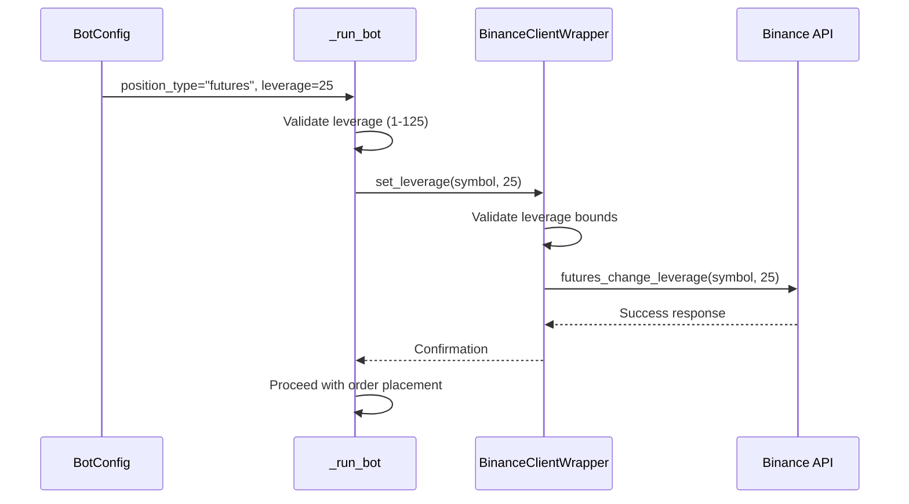

# Market Type Support

<cite>
**Referenced Files in This Document**   
- [bot_config.py](file://app/models/bot_config.py)
- [bot_tasks.py](file://app/core/bot_tasks.py)
- [binance_client.py](file://app/core/binance_client.py)
</cite>

## Table of Contents
1. [Introduction](#introduction)
2. [BotConfig Model and position_type Field](#botconfig-model-and-position_type-field)
3. [Trade Execution Logic in _run_bot](#trade-execution-logic-in-_run_bot)
4. [Leverage Management in Futures Trading](#leverage-management-in-futures-trading)
5. [Fund Transfer Mechanisms](#fund-transfer-mechanisms)
6. [BinanceClientWrapper Configuration](#binanceclientwrapper-configuration)
7. [Common Issues and Solutions](#common-issues-and-solutions)
8. [Conclusion](#conclusion)

## Introduction
This document provides a comprehensive analysis of market type support in the trading bot system, focusing on spot and futures trading modes. It details the implementation of key features including the position_type field in the BotConfig model, leverage management for futures trading, fund transfer mechanisms between spot and futures accounts, and configuration of trading parameters through the BinanceClientWrapper. The documentation is designed to be accessible to beginners while providing sufficient technical depth for experienced developers working with multi-market risk management.

## BotConfig Model and position_type Field

The BotConfig model serves as the central configuration entity for trading bots, with the `position_type` field being a critical component for determining the trading mode. This field is implemented as a String column with a default value of "spot", allowing for two possible values: "spot" or "futures". The implementation is found in the database model definition, where it controls the execution path for trade operations.

The `position_type` field directly influences several aspects of bot behavior:
- Trade execution logic (spot vs futures order placement)
- Risk management parameters
- Fund transfer mechanisms
- Leverage application
- Margin mode configuration

When a bot is configured with `position_type = "futures"`, the system enables futures-specific features such as leverage, isolated margin, and one-way position mode. For `position_type = "spot"`, the system operates in traditional spot trading mode with no leverage and standard margin requirements.

**Section sources**
- [bot_config.py](file://app/models/bot_config.py#L47-L50)

## Trade Execution Logic in _run_bot

The `_run_bot` function implements the core trade execution logic that branches based on the `position_type` field value. This function orchestrates the entire trading process, from market data retrieval to order execution and state management.

The execution flow begins with authentication and client initialization, followed by market data retrieval. The function then evaluates trading signals based on the configured strategy (such as EMA crossover with RSI confirmation). When a valid trading signal is detected, the function proceeds to calculate position sizing, risk parameters, and order quantities.

The critical branching occurs when placing orders. For spot trading (`position_type = "spot"`), the system uses standard market order placement methods. For futures trading (`position_type = "futures"`), the execution path includes additional safety checks and configuration steps before order placement.

The function also implements comprehensive error handling and state management, updating the BotState model to reflect the current status of the bot (running, waiting, paused, or error states). Daily trading limits, profit targets, and loss thresholds are enforced within this function to ensure risk management compliance.

```mermaid
flowchart TD
A[Start _run_bot] --> B{Valid BotConfig?}
B --> |No| C[Return Error]
B --> |Yes| D[Initialize Binance Client]
D --> E{Demo Mode?}
E --> |No| F[Check API Credentials]
E --> |Yes| G[Proceed with Demo]
F --> H{Credentials Valid?}
H --> |No| I[Set Error State]
H --> |Yes| J[Proceed]
J --> K{auto_transfer_funds?}
K --> |Yes| L[_handle_fund_transfer]
K --> |No| M[Skip Transfer]
L --> N{position_type = "futures"?}
M --> N
N --> |Yes| O[set_leverage]
N --> |No| P[Skip Leverage]
O --> Q[ensure_one_way_mode]
Q --> R[ensure_isolated_margin]
R --> S[Place Futures Order]
P --> T[Place Spot Order]
S --> U[Update BotState]
T --> U
U --> V[Send Notifications]
V --> W[End]
```

**Diagram sources**
- [bot_tasks.py](file://app/core/bot_tasks.py#L125-L516)

**Section sources**
- [bot_tasks.py](file://app/core/bot_tasks.py#L125-L516)

## Leverage Management in Futures Trading

Leverage management is a crucial aspect of futures trading, implemented through the `leverage` parameter in the BotConfig model and the `set_leverage` method in the BinanceClientWrapper. The leverage parameter is stored as an Integer column with a default value of 10, representing 10x leverage.

The leverage application occurs in the `_run_bot` function, where it checks if the `position_type` is set to "futures" before attempting to set leverage. The system validates the leverage value to ensure it falls within acceptable bounds (1-125x), with a safety guard that limits leverage to 50x even if higher values are configured.

The `set_leverage` method in BinanceClientWrapper handles the actual API call to Binance to configure the leverage for a specific symbol. This method includes validation to ensure the leverage value is within the allowed range (1-125), with a default fallback of 10x if invalid values are provided. The method uses retry logic to handle potential API rate limiting or transient errors.

Leverage is applied before any futures order placement, ensuring that the trading account is properly configured for the desired risk level. The system logs successful leverage changes and errors, providing visibility into the configuration process.



**Diagram sources**
- [bot_tasks.py](file://app/core/bot_tasks.py#L200-L209)
- [binance_client.py](file://app/core/binance_client.py#L488-L503)

**Section sources**
- [bot_tasks.py](file://app/core/bot_tasks.py#L200-L209)
- [binance_client.py](file://app/core/binance_client.py#L488-L503)

## Fund Transfer Mechanisms

The system implements bidirectional fund transfer mechanisms between spot and futures accounts through the `_handle_fund_transfer` function. This function enables automated capital movement based on the bot's configured `position_type` and trading requirements.

The transfer logic is conditional on the `auto_transfer_funds` flag in the BotConfig model. When enabled, the system automatically transfers funds between accounts to ensure sufficient capital is available for trading. The transfer amount can be specified explicitly through the `transfer_amount` field, or calculated dynamically based on available balances.

For spot-to-futures transfers (`position_type = "futures"`), the system transfers USDT from the spot wallet to the futures wallet, leaving a minimum of 10 USDT in the spot account as a safety buffer. For futures-to-spot transfers (`position_type = "spot"`), the system transfers USDT from the futures wallet to the spot wallet, leaving a minimum of 1 USDT in the futures account.

The actual transfer operations are handled by the BinanceClientWrapper methods `transfer_to_futures` and `transfer_to_spot`, which use Binance's futures_account_transfer API endpoint with type parameters 1 (spot to futures) and 2 (futures to spot) respectively. The system includes error handling to manage transfer failures and logs all transfer activities for audit purposes.

```mermaid
flowchart TD
A[Start Transfer] --> B{auto_transfer_funds?}
B --> |No| C[End]
B --> |Yes| D{transfer_amount specified?}
D --> |Yes| E[Use specified amount]
D --> |No| F{position_type = "futures"?}
F --> |Yes| G[Calculate spot_balance - 10]
F --> |No| H[Calculate futures_balance - 1]
G --> I{Amount > 0?}
H --> I
E --> I
I --> |No| J[End]
I --> |Yes| K{position_type = "futures"?}
K --> |Yes| L[transfer_to_futures]
K --> |No| M[transfer_to_spot]
L --> N[Log Success]
M --> N
N --> O[End]
```

**Diagram sources**
- [bot_tasks.py](file://app/core/bot_tasks.py#L42-L75)
- [binance_client.py](file://app/core/binance_client.py#L419-L445)

**Section sources**
- [bot_tasks.py](file://app/core/bot_tasks.py#L42-L75)
- [binance_client.py](file://app/core/binance_client.py#L419-L445)

## BinanceClientWrapper Configuration

The BinanceClientWrapper class enforces critical trading configurations for futures trading, specifically isolated margin mode and one-way position mode. These configurations are essential for proper risk management and position tracking in futures markets.

Isolated margin mode is enforced through the `ensure_isolated_margin` method, which calls Binance's futures_change_margin_type API endpoint with marginType='ISOLATED'. This method includes error handling for the -4046 error code, which indicates the margin type is already set to isolated, allowing the system to proceed without error in this case.

One-way position mode is enforced through the `ensure_one_way_mode` method, which checks the current position mode using futures_get_position_mode and changes it to one-way mode (dualSidePosition=False) if currently in hedge mode. This ensures that the bot operates with a single position per symbol, simplifying position tracking and risk management.

These configuration methods are called immediately before futures order placement in the `_run_bot` function, ensuring that the trading account is properly configured regardless of its previous state. The methods include retry logic to handle API rate limiting and transient errors, making the system resilient to temporary connectivity issues.

```mermaid
classDiagram
class BinanceClientWrapper {
+ensure_isolated_margin(symbol)
+ensure_one_way_mode()
+set_leverage(symbol, leverage)
+transfer_to_futures(asset, amount)
+transfer_to_spot(asset, amount)
}
BinanceClientWrapper --> "1" BinanceAPI : calls
BinanceClientWrapper --> "_run_bot" : used by
```

**Diagram sources**
- [binance_client.py](file://app/core/binance_client.py#L521-L544)

**Section sources**
- [binance_client.py](file://app/core/binance_client.py#L521-L544)

## Common Issues and Solutions

Several common issues can arise when configuring and operating bots with different market types. Understanding these issues and their solutions is critical for reliable bot operation.

**Incorrect Position Mode**: If the futures account is in hedge mode instead of one-way mode, position tracking may fail. Solution: The `ensure_one_way_mode` method automatically detects and corrects this configuration.

**Failed Fund Transfers**: Transfers between spot and futures accounts can fail due to insufficient balances or API connectivity issues. Solution: The system includes balance checks before transfer attempts and retry logic for API calls.

**Leverage Restrictions**: Some symbols may have specific leverage limits that differ from the configured value. Solution: The system validates leverage values against Binance's requirements (1-125x) and provides logging for successful and failed leverage changes.

**Insufficient Margin**: Futures trading requires adequate margin, which may not be available if fund transfers fail. Solution: The system performs balance checks and leaves safety buffers in source accounts to prevent complete fund depletion.

**Rate Limiting**: Frequent API calls can trigger rate limits. Solution: The BinanceClientWrapper implements retry logic with exponential backoff and respects Binance's rate limit headers.

**Configuration Persistence**: Trading mode configurations (margin type, position mode) may be changed by other applications or manual trading. Solution: The system re-applies necessary configurations before each trading operation, ensuring consistent behavior.

## Conclusion

The market type support system provides robust functionality for both spot and futures trading modes through careful configuration of the BotConfig model and coordinated execution in the _run_bot function. The position_type field serves as the primary switch between trading modes, with corresponding adjustments to leverage, margin, and fund management.

The implementation demonstrates a layered approach to risk management, with multiple safeguards including leverage limits, balance protections, and configuration enforcement. The system's modular design separates concerns between configuration (BotConfig), execution logic (_run_bot), and API interaction (BinanceClientWrapper), making it maintainable and extensible.

For developers, understanding the interaction between these components is essential for implementing reliable trading strategies across different market types. The comprehensive error handling and state management ensure that bots can operate safely in production environments while providing clear feedback for troubleshooting.