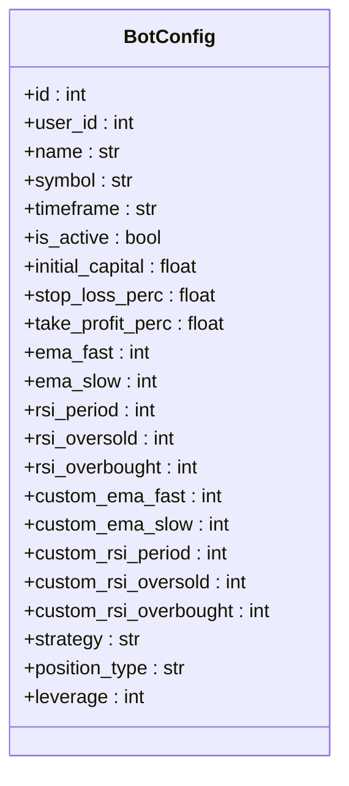
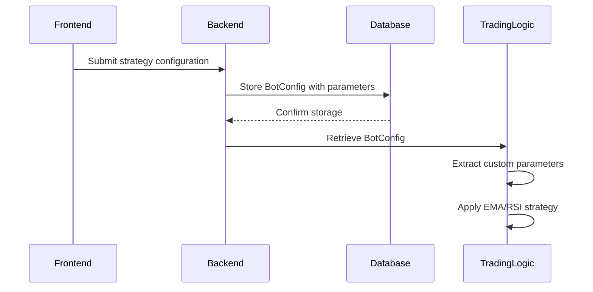
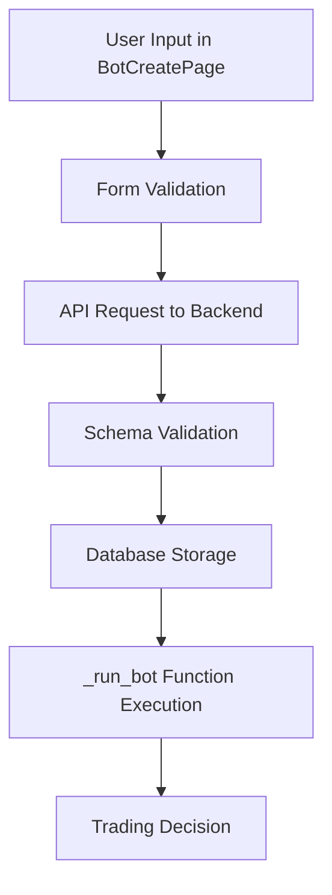

# Strategy Configuration

<cite>
**Referenced Files in This Document**   
- [BotConfig](file://app/models/bot_config.py)
- [bot_tasks.py](file://app/core/bot_tasks.py)
- [BotCreatePage.jsx](file://frontend/src/pages/Bots/BotCreatePage.jsx)
- [bot_config.py](file://app/schemas/bot_config.py)
</cite>

## Table of Contents
1. [Introduction](#introduction)
2. [Bot Configuration Model](#bot-configuration-model)
3. [Strategy Parameters in Code](#strategy-parameters-in-code)
4. [Frontend to Backend Flow](#frontend-to-backend-flow)
5. [Parameter Validation and Error Handling](#parameter-validation-and-error-handling)
6. [Common Issues and Solutions](#common-issues-and-solutions)
7. [Strategy Optimization Guide](#strategy-optimization-guide)

## Introduction
This document provides comprehensive documentation for the Strategy Configuration feature in the trading bot system, focusing on the EMA/RSI strategy implementation. It explains how technical indicators are configured through the BotConfig model, how these parameters are used in the trading logic, and the complete flow from frontend input to backend execution. The documentation is designed to be accessible to beginners while providing sufficient technical depth for experienced developers regarding strategy optimization and parameter tuning.

## Bot Configuration Model

The BotConfig model serves as the central data structure for storing all trading strategy parameters. It contains both basic and advanced configuration options for the trading bot.



**Diagram sources**
- [bot_config.py](file://app/models/bot_config.py#L4-L57)

**Section sources**
- [bot_config.py](file://app/models/bot_config.py#L4-L57)

## Strategy Parameters in Code

The EMA/RSI strategy parameters are implemented as database columns in the BotConfig model and are used in the _run_bot function to make trading decisions.

### Technical Indicator Parameters

The following parameters are used to configure the EMA/RSI strategy:

- **ema_fast**: Fast EMA period (default: not nullable)
- **ema_slow**: Slow EMA period (default: not nullable) 
- **rsi_period**: RSI calculation period (default: not nullable)
- **rsi_oversold**: RSI oversold threshold (default: not nullable)
- **rsi_overbought**: RSI overbought threshold (default: not nullable)

### Custom Strategy Parameters

The system also supports custom parameters with default values:

- **custom_ema_fast**: Custom fast EMA period (default: 8)
- **custom_ema_slow**: Custom slow EMA period (default: 21)
- **custom_rsi_period**: Custom RSI period (default: 7)
- **custom_rsi_oversold**: Custom RSI oversold level (default: 35)
- **custom_rsi_overbought**: Custom RSI overbought level (default: 65)

These custom parameters are retrieved and applied in the _run_bot function:



**Diagram sources**
- [bot_tasks.py](file://app/core/bot_tasks.py#L125-L516)
- [BotCreatePage.jsx](file://frontend/src/pages/Bots/BotCreatePage.jsx#L1-L901)

**Section sources**
- [bot_tasks.py](file://app/core/bot_tasks.py#L125-L516)

## Frontend to Backend Flow

The strategy configuration process begins in the frontend with the BotCreatePage component and flows through to the backend for execution.

### Frontend Implementation

The BotCreatePage.jsx component provides a user interface for configuring the EMA/RSI strategy parameters. Users can set values for:

- Fast and slow EMA periods
- RSI period and thresholds
- Risk management parameters
- Position type and leverage

The form uses React Hook Form for validation and submits the configuration to the backend API.

### Backend Processing

When the configuration is submitted, the following process occurs:

1. The frontend sends the strategy parameters to the backend API
2. The backend validates the parameters against the BotConfig schema
3. Valid parameters are stored in the database
4. The _run_bot function retrieves these parameters when executing trades



**Diagram sources**
- [BotCreatePage.jsx](file://frontend/src/pages/Bots/BotCreatePage.jsx#L1-L901)
- [bot_tasks.py](file://app/core/bot_tasks.py#L125-L516)

**Section sources**
- [BotCreatePage.jsx](file://frontend/src/pages/Bots/BotCreatePage.jsx#L1-L901)

## Parameter Validation and Error Handling

The system implements comprehensive validation for strategy parameters at both frontend and backend levels.

### Frontend Validation

The BotCreatePage component includes client-side validation rules:

- EMA fast period: minimum 3, maximum 50
- EMA slow period: minimum 10, maximum 200
- RSI period: minimum 5, maximum 50
- RSI oversold: minimum 20, maximum 40
- RSI overbought: minimum 60, maximum 80

### Backend Validation

The BotConfig schema in bot_config.py implements server-side validation:

- Leverage must be between 1 and 125
- Position type must be 'spot' or 'futures'
- Required fields are enforced with appropriate data types

The _run_bot function includes additional runtime validation:

- Checks for sufficient market data
- Validates order quantities against exchange requirements
- Ensures position sizing is appropriate

**Section sources**
- [bot_config.py](file://app/schemas/bot_config.py#L1-L82)
- [BotCreatePage.jsx](file://frontend/src/pages/Bots/BotCreatePage.jsx#L1-L901)

## Common Issues and Solutions

### Invalid Parameter Ranges

**Issue**: Users may input parameter values outside acceptable ranges.

**Solution**: The system provides immediate feedback through form validation. For example, if a user enters an RSI oversold value of 15 (below the minimum of 20), an error message appears: "RSI oversold must be at least 20".

### Missing Required Values

**Issue**: Required parameters like EMA periods or RSI thresholds are not provided.

**Solution**: The form marks required fields with asterisks and displays specific error messages when validation fails. The backend also enforces required fields, preventing incomplete configurations from being stored.

### Data Insufficiency

**Issue**: The bot may not have enough historical data to calculate indicators.

**Solution**: The _run_bot function includes a check for sufficient data:
```python
if len(closes) < max(ema_slow, rsi_period):
    raise Exception("Insufficient data available")
```
When this occurs, the bot waits for more data before making trading decisions.

### Order Quantity Issues

**Issue**: Calculated order quantities may not meet exchange minimums.

**Solution**: The system normalizes quantities based on symbol filters and includes a fallback mechanism:
```python
if order_quantity is None or order_quantity <= 0:
    # Wait and retry
    return "Quantity does not meet filters"
```

**Section sources**
- [bot_tasks.py](file://app/core/bot_tasks.py#L125-L516)
- [BotCreatePage.jsx](file://frontend/src/pages/Bots/BotCreatePage.jsx#L1-L901)

## Strategy Optimization Guide

### EMA/RSI Strategy Logic

The EMA/RSI strategy makes trading decisions based on the following logic:

- **BUY signal**: Fast EMA crosses above Slow EMA AND RSI is below overbought level
- **SELL signal**: Fast EMA crosses below Slow EMA AND RSI is above oversold level

### Parameter Tuning Recommendations

#### EMA Periods
- **Fast EMA (8-12)**: Shorter periods make the strategy more responsive but increase false signals
- **Slow EMA (21-26)**: Longer periods provide better trend confirmation but with more lag

#### RSI Settings
- **RSI Period (7-14)**: Shorter periods are more volatile, longer periods are smoother
- **Oversold (30-40)**: Lower values make the strategy more aggressive
- **Overbought (60-70)**: Higher values make the strategy more conservative

### Risk Management

The system includes multiple layers of risk management:

1. **Stop Loss**: Limits potential losses on individual trades
2. **Take Profit**: Secures profits at predetermined levels
3. **Daily Limits**: Prevents excessive trading or losses in a single day
4. **Position Sizing**: Controls exposure based on account size

### Performance Considerations

When optimizing strategy parameters, consider the following:

- **Backtesting**: Test parameter combinations on historical data before live deployment
- **Market Conditions**: Different parameters may work better in trending vs. ranging markets
- **Timeframe Alignment**: Ensure indicator periods are appropriate for the selected trading timeframe

**Section sources**
- [bot_tasks.py](file://app/core/bot_tasks.py#L125-L516)
- [bot_config.py](file://app/models/bot_config.py#L4-L57)