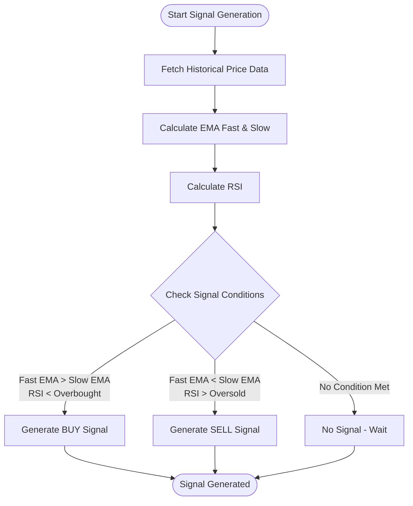
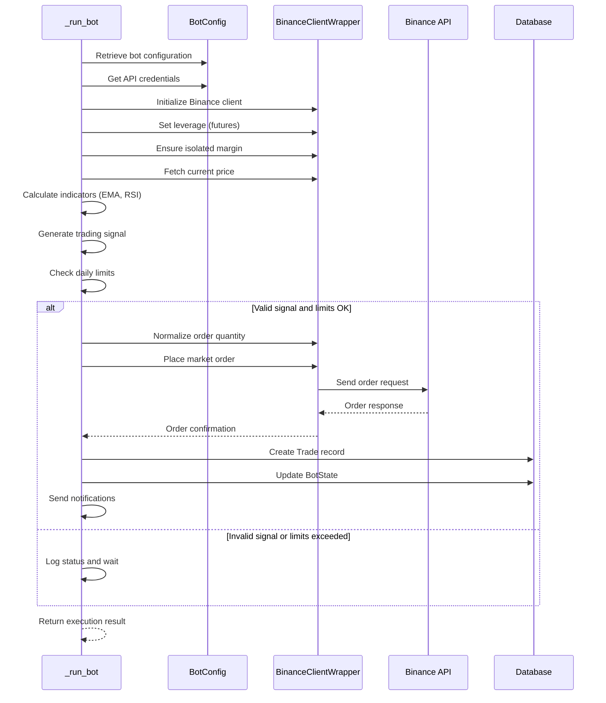
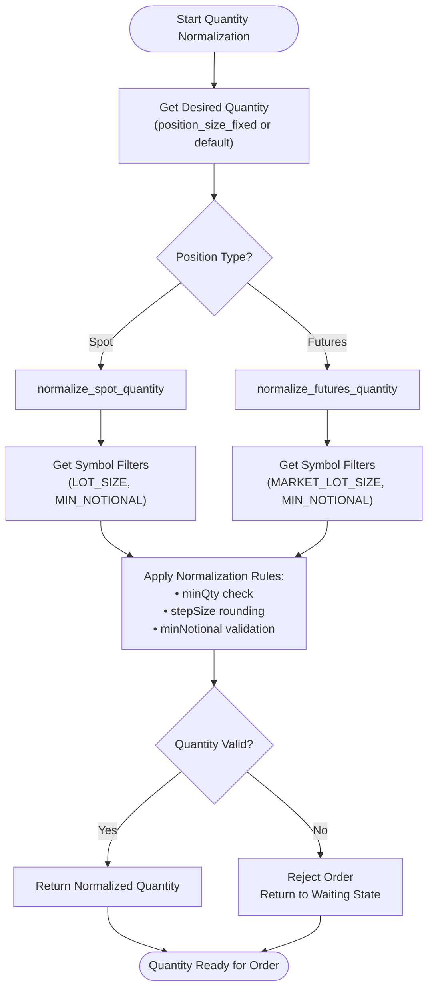
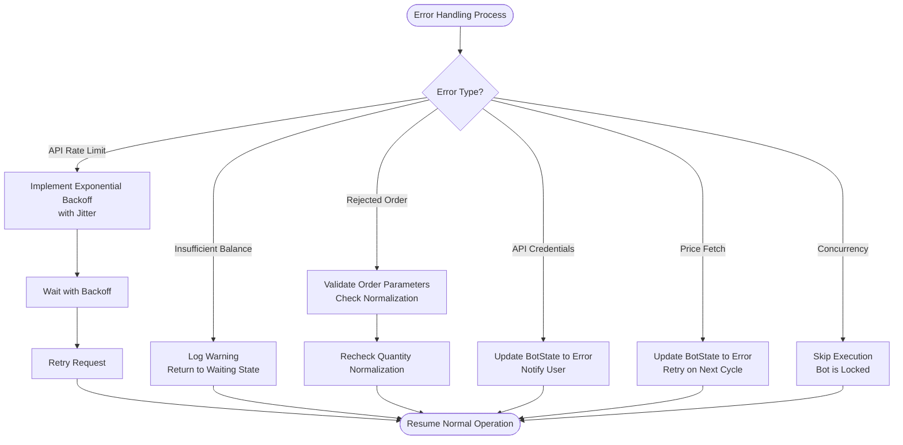

# Trade Execution

<cite>
**Referenced Files in This Document**   
- [bot_tasks.py](file://app/core/bot_tasks.py)
- [binance_client.py](file://app/core/binance_client.py)
- [bot_config.py](file://app/models/bot_config.py)
</cite>

## Table of Contents
1. [Introduction](#introduction)
2. [Core Components](#core-components)
3. [Signal Generation Logic](#signal-generation-logic)
4. [Trade Execution Flow](#trade-execution-flow)
5. [Order Normalization and Quantity Management](#order-normalization-and-quantity-management)
6. [Error Handling and Common Issues](#error-handling-and-common-issues)
7. [Configuration and Parameter Mapping](#configuration-and-parameter-mapping)
8. [Conclusion](#conclusion)

## Introduction
This document provides a comprehensive analysis of the trade execution system within the trading bot application, focusing on market and futures order placement. The system is designed to automate trading decisions based on technical indicators such as EMA crossover and RSI thresholds. The core execution logic resides in the `_run_bot` function, which orchestrates the entire trading process from signal generation to order placement and risk management. The system supports both spot and futures trading, with configurable parameters for position sizing, stop-loss, take-profit, and leverage. The implementation ensures robust error handling, rate limit management, and daily trading limits to protect user capital and maintain system stability.

**Section sources**
- [bot_tasks.py](file://app/core/bot_tasks.py#L125-L516)

## Core Components

The trade execution system consists of three primary components: the `_run_bot` function for orchestration, the `BinanceClientWrapper` class for API interaction, and the `BotConfig` model for configuration storage. The `_run_bot` function serves as the main entry point for trade execution, handling concurrency control, API key management, and strategy execution. It retrieves bot configuration from the database, initializes the Binance client, and processes trading signals based on the configured strategy. The `BinanceClientWrapper` class provides a robust interface to the Binance API with built-in retry mechanisms, rate limit handling, and error recovery. The `BotConfig` model stores all trading parameters, including technical indicator settings, risk management rules, and position type preferences.

**Section sources**
- [bot_tasks.py](file://app/core/bot_tasks.py#L125-L516)
- [binance_client.py](file://app/core/binance_client.py#L17-L572)
- [bot_config.py](file://app/models/bot_config.py#L4-L57)

## Signal Generation Logic

The trading system generates BUY/SELL signals using an EMA crossover strategy combined with RSI thresholds. The signal generation process begins by retrieving historical price data for the configured symbol and timeframe. The system calculates two exponential moving averages (EMA) using customizable periods: a fast EMA (typically 8 periods) and a slow EMA (typically 21 periods). Additionally, the Relative Strength Index (RSI) is calculated using a configurable period (typically 7 periods) with oversold (typically 35) and overbought (typically 65) thresholds.

A BUY signal is generated when the fast EMA crosses above the slow EMA and the RSI is below the overbought threshold, indicating potential upward momentum. Conversely, a SELL signal is generated when the fast EMA crosses below the slow EMA and the RSI is above the oversold threshold, indicating potential downward momentum. The system uses the `calculate_ema` and `calculate_rsi` helper functions within the `_run_bot` function to compute these indicators. The signal generation logic is contained within the "ema" strategy branch of the `_run_bot` function, which retrieves the custom EMA and RSI parameters from the BotConfig model.

**Diagram sources**
- [bot_tasks.py](file://app/core/bot_tasks.py#L280-L310)

## Trade Execution Flow

The trade execution flow begins with the invocation of the `_run_bot` function, which retrieves the bot configuration and API credentials from the database. After establishing a connection to the Binance API through the `BinanceClientWrapper`, the system checks for various trading conditions and constraints before placing orders. For futures trading, the system first sets the appropriate leverage using the `set_leverage` method and ensures isolated margin mode is enabled through `ensure_isolated_margin`. The system then retrieves the current market price and evaluates the configured trading strategy.

When a valid trading signal is detected, the system calculates the appropriate order quantity based on the configured position sizing rules. Before placing the order, the system performs several validation checks, including daily trade limits, daily loss limits, and daily profit targets. If any of these limits are reached, the bot pauses execution. For BUY orders, the system calculates stop-loss and take-profit prices based on the configured percentages. The actual order placement is handled by different methods depending on the position type: `place_market_buy_order` and `place_market_sell_order` for spot trading, and `place_futures_market_buy_order` and `place_futures_market_sell_order` for futures trading.

After successful order execution, the system creates a Trade record in the database, updates the BotState with the latest execution details, and sends optional notifications via webhook or email. The entire execution flow is wrapped in database transactions to ensure data consistency, and comprehensive error handling is implemented throughout the process to manage API failures, network issues, and other exceptions.

**Diagram sources**
- [bot_tasks.py](file://app/core/bot_tasks.py#L125-L516)
- [binance_client.py](file://app/core/binance_client.py#L274-L471)

## Order Normalization and Quantity Management

The system implements robust order normalization to ensure compliance with Binance exchange requirements for both spot and futures trading. The quantity management process begins by determining the desired order quantity based on the bot configuration. If a fixed position size is specified in the `position_size_fixed` parameter, this value is used; otherwise, a default notional value of 25 USDT is used to calculate the quantity.

The actual order quantity is normalized using exchange-specific rules through the `normalize_spot_quantity` and `normalize_futures_quantity` methods of the `BinanceClientWrapper` class. These methods retrieve the symbol's LOT_SIZE and MIN_NOTIONAL filters from the exchange and adjust the quantity accordingly. The normalization process ensures the quantity meets the minimum lot size requirements and exceeds the minimum notional value (price × quantity). For spot trading, the LOT_SIZE filter is used, while futures trading uses the MARKET_LOT_SIZE filter. The system also handles step size requirements by rounding the quantity to the nearest valid increment using the `_round_step` helper method.

If the normalized quantity does not meet the exchange requirements, the order is rejected, and the bot returns to a waiting state. This normalization process prevents order rejections due to invalid quantities and ensures all orders comply with Binance's trading rules. The system also implements additional risk protection by limiting leverage to a maximum of 50x for futures trading, regardless of the configured leverage value.

**Diagram sources**
- [bot_tasks.py](file://app/core/bot_tasks.py#L340-L359)
- [binance_client.py](file://app/core/binance_client.py#L182-L220)

## Error Handling and Common Issues

The trade execution system implements comprehensive error handling to manage various failure scenarios and ensure system reliability. The most common issues addressed include insufficient balance, API rate limits, and rejected orders. For insufficient balance scenarios, the system checks available funds through the `get_balance` and `get_futures_balance` methods before attempting order placement. If insufficient funds are detected, the order is not placed, and the bot returns to a waiting state.

API rate limiting is handled through a sophisticated retry mechanism implemented in the `_retry` method of the `BinanceClientWrapper` class. When rate limit errors (API codes -1003, -1015, -1021) are encountered, the system implements exponential backoff with jitter, waiting progressively longer between retry attempts. The system also respects Binance's weight-based rate limiting by monitoring the X-MBX-USED-WEIGHT headers and pausing execution when approaching threshold limits.

Rejected orders are managed through multiple layers of validation. The system first validates order parameters against exchange requirements using the normalization methods. If an order is rejected by the exchange, the `BinanceOrderException` is caught, logged, and handled gracefully without crashing the bot. The system also implements concurrency control through database row locking to prevent multiple instances of the same bot from executing simultaneously, which could lead to balance miscalculations and order conflicts.

Other error conditions include API credential validation failures, price fetch errors, and strategy configuration issues. Each error type is logged with appropriate severity, and the bot state is updated to reflect the error condition. The system distinguishes between temporary errors (which may resolve on retry) and permanent errors (which require user intervention), allowing for appropriate recovery strategies.

**Diagram sources**
- [bot_tasks.py](file://app/core/bot_tasks.py#L140-L144)
- [binance_client.py](file://app/core/binance_client.py#L73-L95)

## Configuration and Parameter Mapping

The trade execution system uses the `BotConfig` model to store and manage all trading parameters, creating a clear mapping between configuration settings and actual trade execution. Key parameters include `position_type` which determines whether trades are executed as spot or futures, and `leverage` which specifies the leverage for futures positions. The `strategy` parameter selects the trading logic, with "ema" enabling the EMA/RSI strategy described in this document.

Technical indicator parameters are stored as `custom_ema_fast`, `custom_ema_slow`, `custom_rsi_period`, `custom_rsi_oversold`, and `custom_rsi_overbought`, allowing users to customize the signal generation logic. Risk management parameters include `custom_stop_loss`, `custom_take_profit`, and `custom_trailing_stop`, which define the percentage levels for exit strategies. Position sizing is controlled by `position_size_fixed` for absolute amounts or `position_size_perc` for percentage-based sizing.

The system maps these configuration parameters to actual trading operations through the `_run_bot` function, which retrieves the BotConfig instance and extracts the relevant parameters for strategy execution. For example, the `leverage` parameter is passed to the `set_leverage` method of the Binance client, while the `position_size_fixed` parameter is used to calculate the order quantity. The `auto_transfer_funds` and `transfer_amount` parameters control automatic fund transfers between spot and futures accounts when needed.

This configuration system provides flexibility for users to customize their trading strategies while maintaining a consistent execution framework. The separation of configuration from execution logic allows for easy strategy modifications without changing the core trading engine.

**Section sources**
- [bot_config.py](file://app/models/bot_config.py#L4-L57)
- [bot_tasks.py](file://app/core/bot_tasks.py#L125-L516)

## Conclusion
The trade execution system provides a robust framework for automated trading with comprehensive support for both spot and futures markets. The core `_run_bot` function orchestrates the entire trading process, from signal generation using EMA and RSI indicators to order placement and risk management. The system's modular design, with clear separation between configuration, execution logic, and API interaction, enables reliable and maintainable trading operations.

Key strengths of the system include its comprehensive error handling, rate limit management, and validation of order parameters against exchange requirements. The use of database transactions ensures data consistency, while concurrency control prevents conflicting operations. The configuration system allows for extensive customization of trading strategies while maintaining a consistent execution framework.

For optimal performance, users should ensure their API credentials are properly configured, maintain sufficient account balances, and set appropriate risk parameters. The system's design prioritizes reliability and capital preservation, making it suitable for both beginner and experienced traders seeking automated trading solutions.