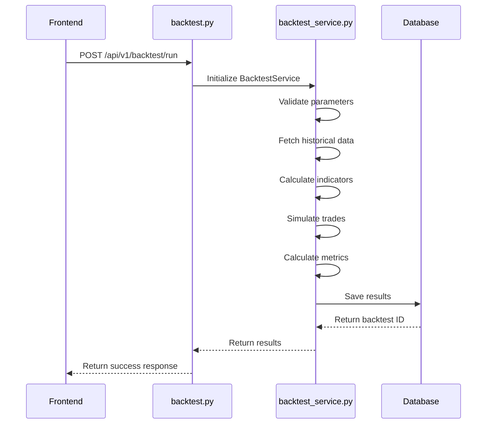
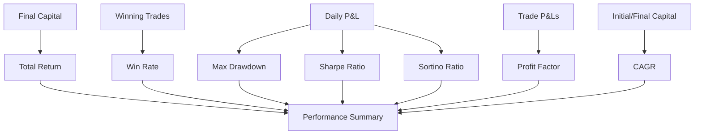
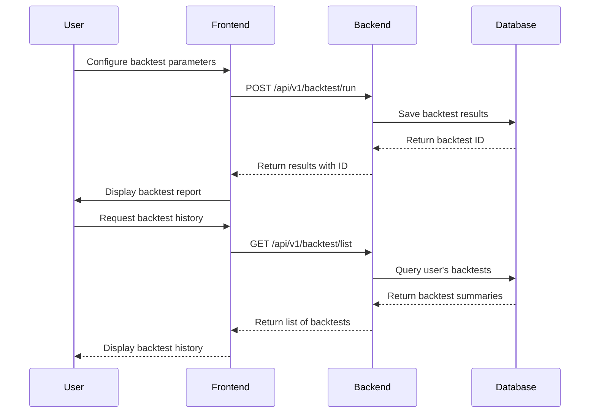
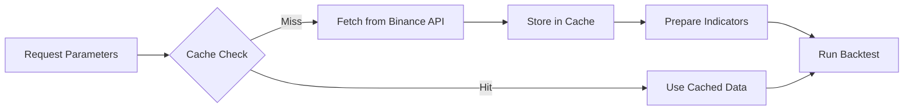
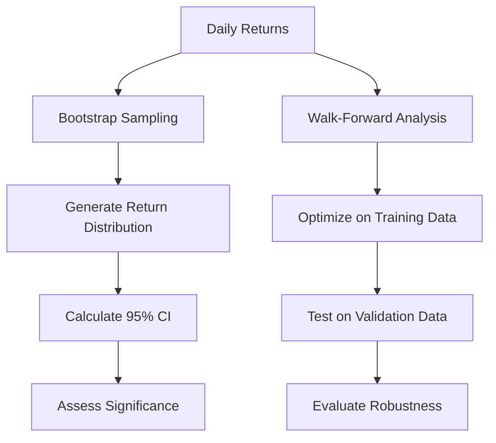

# Backtesting System

<cite>
**Referenced Files in This Document**   
- [backtest_service.py](file://app/services/backtest_service.py)
- [backtest.py](file://app/api/routes/backtest.py)
- [backtest.py](file://app/models/backtest.py)
- [backtest.py](file://app/schemas/backtest.py)
- [backtest_significance.py](file://scripts/backtest_significance.py)
</cite>

## Table of Contents
1. [Introduction](#introduction)
2. [Backtest Execution Flow](#backtest-execution-flow)
3. [Strategy Simulation and Trade Processing](#strategy-simulation-and-trade-processing)
4. [Performance Metrics Calculation](#performance-metrics-calculation)
5. [Frontend-Backend Interaction](#frontend-backend-interaction)
6. [Risk Management and Trading Parameters](#risk-management-and-trading-parameters)
7. [Data Processing and Caching](#data-processing-and-caching)
8. [Result Interpretation and Statistical Significance](#result-interpretation-and-statistical-significance)
9. [Common Issues and Solutions](#common-issues-and-solutions)

## Introduction
The Backtesting System enables users to simulate trading strategies using historical market data for both spot and futures markets. It provides comprehensive performance analysis through detailed metrics and supports leverage trading in futures mode. The system processes historical data, simulates trades based on technical indicators, and calculates key performance indicators such as win_rate, total_return, and daily_results. Users can run backtests through the frontend interface, which communicates with the backend service to execute simulations and store results for future reference.

## Backtest Execution Flow
The backtesting process begins with a request from the frontend that specifies trading parameters including symbol, timeframe, date range, and strategy configuration. This triggers the backend service to initiate a simulation that processes historical data and executes trades according to defined rules. The system supports both spot trading (1x leverage) and futures trading with configurable leverage up to 125x. After completing the simulation, results are stored in the database and returned to the user for analysis.

**Diagram sources**
- [backtest.py](file://app/api/routes/backtest.py#L26-L73)
- [backtest_service.py](file://app/services/backtest_service.py#L829-L1021)

**Section sources**
- [backtest.py](file://app/api/routes/backtest.py#L26-L73)
- [backtest_service.py](file://app/services/backtest_service.py#L829-L1021)

## Strategy Simulation and Trade Processing
The core simulation logic resides in the `run_backtest` method of the BacktestService class. This method processes historical price data and simulates trades based on technical indicators including EMA crossovers, RSI levels, MACD, and Bollinger Bands. The system evaluates entry signals by checking multiple conditions such as trend alignment, momentum, volatility, and volume. For each valid entry signal, the system calculates position size based on risk parameters and executes simulated trades with proper fee and slippage calculations.

The simulation handles both spot and futures trading modes, with futures supporting leverage that amplifies both gains and losses. Position sizing takes into account stop-loss levels and risk-per-trade constraints to ensure proper capital allocation. The system implements trailing stop-loss mechanisms that adjust exit prices as the market moves favorably, helping to protect profits during volatile periods.

**Section sources**
- [backtest_service.py](file://app/services/backtest_service.py#L829-L1021)
- [backtest_service.py](file://app/services/backtest_service.py#L620-L827)

## Performance Metrics Calculation
The system calculates a comprehensive set of performance metrics to evaluate strategy effectiveness. Key metrics include:

- **total_return**: Percentage return calculated as ((final_capital - initial_capital) / initial_capital) * 100
- **win_rate**: Percentage of winning trades out of total trades
- **daily_results**: Daily profit/loss percentages and trade counts
- **monthly_results**: Monthly aggregated performance
- **max_drawdown**: Maximum peak-to-trough decline in portfolio value
- **sharpe_ratio**: Risk-adjusted return metric
- **sortino_ratio**: Downside risk-adjusted return
- **profit_factor**: Ratio of gross profits to gross losses
- **cagr**: Compound annual growth rate

These metrics are calculated after completing all trade simulations and provide insights into the strategy's risk-reward profile, consistency, and statistical significance.

**Diagram sources**
- [backtest_service.py](file://app/services/backtest_service.py#L950-L1014)
- [backtest_service.py](file://app/services/backtest_service.py#L444-L511)

**Section sources**
- [backtest_service.py](file://app/services/backtest_service.py#L950-L1014)

## Frontend-Backend Interaction
The frontend communicates with the backend through a well-defined API interface that handles backtest requests and responses. When a user submits a backtest request through the UI, the frontend sends a structured payload containing strategy parameters to the backend endpoint. The backend processes this request, runs the simulation, stores results in the database, and returns comprehensive results including performance metrics and trade details.

The API supports various operations including running new backtests, retrieving historical backtest results, deleting stored results, and downloading detailed reports in CSV format. This interaction enables users to iterate on their strategies by adjusting parameters and comparing results across different market conditions and time periods.

**Diagram sources**
- [backtest.py](file://app/api/routes/backtest.py#L26-L73)
- [backtest.py](file://app/api/routes/backtest.py#L123-L135)

**Section sources**
- [backtest.py](file://app/api/routes/backtest.py#L26-L73)
- [backtest.py](file://app/api/routes/backtest.py#L123-L135)

## Risk Management and Trading Parameters
The backtesting system implements comprehensive risk management features to simulate realistic trading conditions. Key risk parameters include:

- **daily_target**: Maximum daily return target (default: 3.0%) that stops trading when reached
- **max_daily_loss**: Maximum daily loss limit (default: 1.0%) that stops trading when breached
- **risk_per_trade**: Percentage of capital risked per trade (default: 2.0%)
- **stop_loss**: Fixed percentage stop-loss level (default: 0.5%)
- **take_profit**: Profit target level (default: 1.5%)
- **trailing_stop**: Trailing stop percentage (default: 0.3%)
- **max_daily_trades**: Maximum number of trades per day (default: 5)

These parameters help prevent overtrading and protect capital during adverse market conditions. The system also enforces position sizing rules based on stop-loss levels and available capital, ensuring that no single trade risks more than the specified percentage of the portfolio.

**Section sources**
- [backtest_service.py](file://app/services/backtest_service.py#L842-L904)
- [backtest_service.py](file://app/services/backtest_service.py#L661-L667)

## Data Processing and Caching
The system efficiently handles historical market data through a multi-layered approach that includes caching, data preparation, and indicator calculation. Historical price data is retrieved from Binance's public API endpoints, with separate endpoints for spot (api.binance.com) and futures (fapi.binance.com) markets. Retrieved data is cached locally to avoid redundant API calls and improve performance for subsequent backtests with the same parameters.

Before simulation, the system prepares technical indicators including EMA, RSI, MACD, and Bollinger Bands. These indicators are used to generate trading signals and make entry/exit decisions. The data processing pipeline handles missing values, normalizes data formats, and ensures consistency across different market types and timeframes.

**Diagram sources**
- [backtest_service.py](file://app/services/backtest_service.py#L244-L344)
- [backtest_service.py](file://app/services/backtest_service.py#L346-L442)

**Section sources**
- [backtest_service.py](file://app/services/backtest_service.py#L244-L344)
- [backtest_service.py](file://app/services/backtest_service.py#L346-L442)

## Result Interpretation and Statistical Significance
The backtesting system provides tools for interpreting results and assessing statistical significance through Monte Carlo methods. The `backtest_significance.py` script implements bootstrap analysis that resamples daily returns to generate confidence intervals for cumulative returns and Sharpe ratio. This helps users determine whether observed performance is likely due to skill or random chance.

The system also supports walk-forward analysis that optimizes strategy parameters on a training period and tests them on out-of-sample data. This approach helps identify robust strategies that perform well across different market regimes and reduces the risk of overfitting to historical data.

**Diagram sources**
- [backtest_significance.py](file://scripts/backtest_significance.py#L1-L146)

**Section sources**
- [backtest_significance.py](file://scripts/backtest_significance.py#L1-L146)

## Common Issues and Solutions
The backtesting system addresses several common issues that can lead to unrealistic results:

**Slippage and Fees**: The system incorporates realistic fee structures and slippage modeling to prevent overestimation of returns. Maker fees default to 0.02% for spot and 0.01% for futures, while taker fees default to 0.04%. Slippage is modeled at 1 basis point by default but can be adjusted based on market conditions.

**Look-Ahead Bias**: The simulation strictly uses only information available at the time of each trading decision, preventing the use of future data in signal generation.

**Overfitting**: By supporting walk-forward analysis and parameter optimization on training data with validation on out-of-sample data, the system helps identify strategies that are less likely to be overfitted.

**Leverage Risk**: For futures trading, the system properly accounts for margin requirements and liquidation risks, ensuring that position sizes do not exceed available capital.

**Data Quality**: The system handles missing data, outliers, and API failures through robust error handling and fallback mechanisms, including the generation of sample data when real data is unavailable.

**Section sources**
- [backtest_service.py](file://app/services/backtest_service.py#L594-L618)
- [backtest_service.py](file://app/services/backtest_service.py#L888-L897)
- [backtest_significance.py](file://scripts/backtest_significance.py#L1-L146)