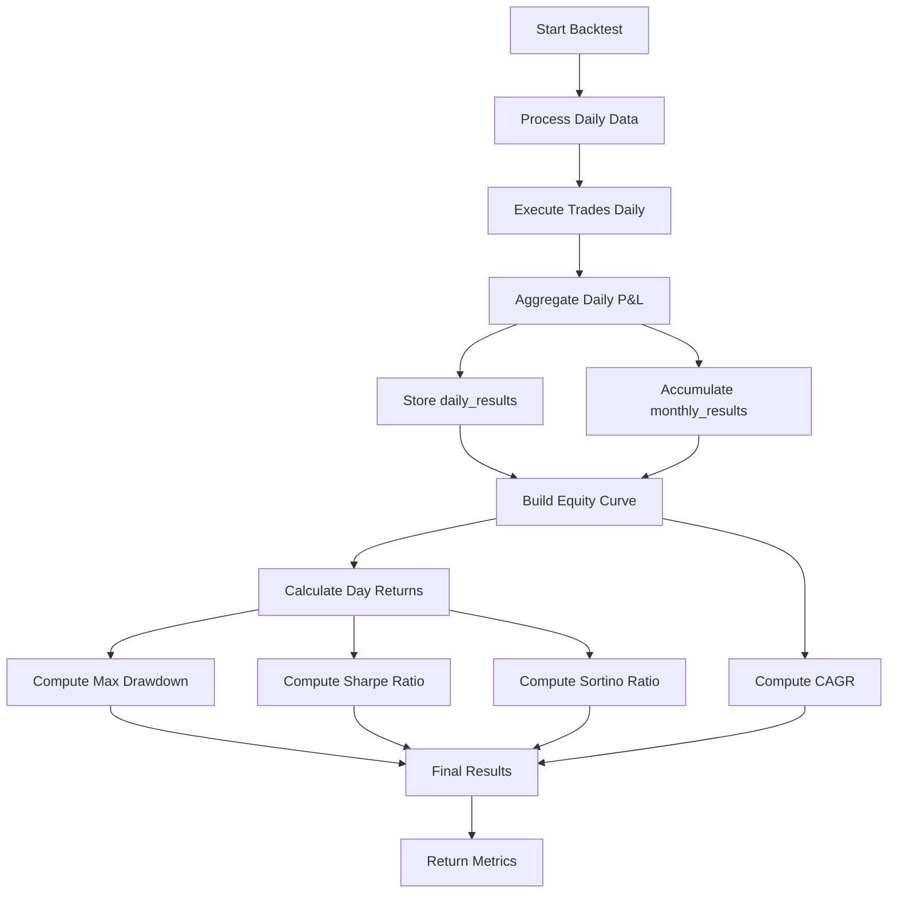
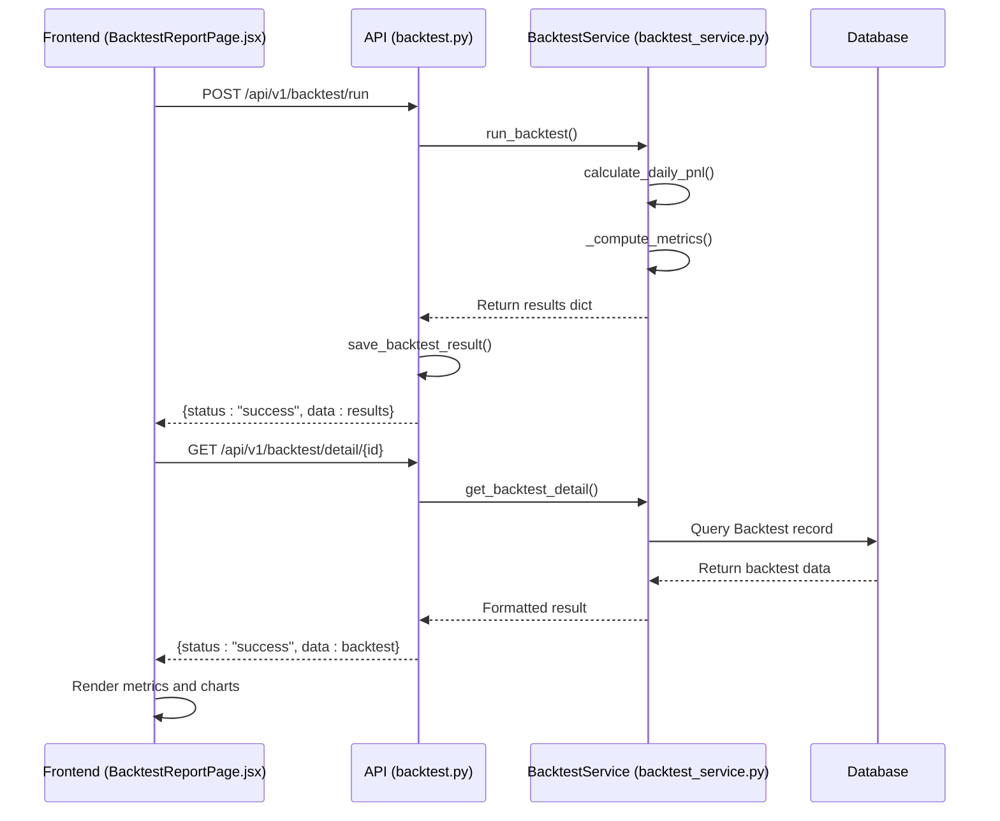

# Performance Analysis

<cite>
**Referenced Files in This Document**   
- [backtest_service.py](file://app/services/backtest_service.py)
- [backtest.py](file://app/api/routes/backtest.py)
- [BacktestReportPage.jsx](file://frontend/src/pages/Backtest/BacktestReportPage.jsx)
- [backtest_significance.py](file://scripts/backtest_significance.py)
</cite>

## Table of Contents
1. [Introduction](#introduction)
2. [Performance Metrics Calculation](#performance-metrics-calculation)
3. [Daily and Monthly P&L Aggregation](#daily-and-monthly-pnl-aggregation)
4. [Metric Implementation Details](#metric-implementation-details)
5. [API and Frontend Integration](#api-and-frontend-integration)
6. [Common Issues and Solutions](#common-issues-and-solutions)
7. [Conclusion](#conclusion)

## Introduction
The Performance Analysis module provides a comprehensive evaluation of trading strategy effectiveness through quantitative metrics derived from backtesting. This document details the implementation of key performance indicators such as `total_return`, `win_rate`, `max_drawdown`, `sharpe`, `sortino`, `profit_factor`, and `cagr` within the `run_backtest` method. It explains how daily and monthly profit and loss (P&L) results are aggregated and stored in `daily_results` and `monthly_results`. The analysis covers the technical implementation of risk-adjusted return calculations, their exposure via API endpoints, and visualization in the frontend BacktestReportPage. Additionally, it addresses common pitfalls like survivorship bias and unrealistic fee assumptions, offering solutions such as sensitivity analysis and Monte Carlo simulations to enhance statistical robustness.

## Performance Metrics Calculation
The performance metrics are calculated at the conclusion of the backtest execution within the `run_backtest` method. After processing all trades and aggregating daily results, the system computes both basic and advanced performance indicators. Basic metrics include `total_return`, which measures the overall percentage gain or loss relative to the initial capital, and `win_rate`, which calculates the proportion of winning trades out of the total number of trades. Advanced risk-adjusted metrics such as `sharpe`, `sortino`, and `max_drawdown` are derived from the equity curve and daily returns, providing deeper insights into strategy efficiency and downside risk. The `profit_factor` evaluates the ratio of gross profits to gross losses, while `cagr` (Compound Annual Growth Rate) annualizes the return over the backtest period for standardized comparison across different time frames.

**Section sources**
- [backtest_service.py](file://app/services/backtest_service.py#L829-L1021)

## Daily and Monthly P&L Aggregation
Daily and monthly P&L results are generated and stored through the `calculate_daily_pnl` method, which processes grouped daily candle data to simulate trading activity under specified risk parameters. The method iterates through each trading day, applying entry signals based on technical indicators such as EMA crossovers and RSI levels. For each valid trade, it calculates entry and exit prices, applies fees and slippage, and updates the running capital. At the end of each day, if trades were executed, a summary is appended to `daily_results` containing the date, daily P&L percentage, number of trades, and ending capital. Simultaneously, these daily results are aggregated into `monthly_results`, where monthly P&L percentages and trade counts are accumulated. This hierarchical aggregation enables both granular daily analysis and broader monthly performance evaluation.

**Section sources**
- [backtest_service.py](file://app/services/backtest_service.py#L619-L827)

## Metric Implementation Details
The implementation of performance metrics involves specialized helper methods that process the equity curve and daily returns data. The `_compute_max_drawdown` function calculates the largest peak-to-trough decline in the equity curve, expressed as a negative percentage. It iterates through the equity values, tracking the highest peak and computing drawdowns relative to that peak. The `_compute_sharpe` function calculates the Sharpe ratio by first converting daily percentage returns to decimal form, then computing the mean return and standard deviation. It annualizes the ratio using a 252-day trading year assumption. Similarly, `_compute_sortino` focuses only on downside volatility by calculating the standard deviation of negative returns, providing a more nuanced view of risk. The `_compute_cagr` function determines the compound annual growth rate by taking the ratio of final to initial capital, raising it to the inverse of the holding period in years, and subtracting one. These functions include robust error handling to manage edge cases such as zero-length return series or invalid date formats.

**Diagram sources**
- [backtest_service.py](file://app/services/backtest_service.py#L829-L1021)
- [backtest_service.py](file://app/services/backtest_service.py#L619-L827)

**Section sources**
- [backtest_service.py](file://app/services/backtest_service.py#L444-L456)
- [backtest_service.py](file://app/services/backtest_service.py#L466-L475)
- [backtest_service.py](file://app/services/backtest_service.py#L478-L488)
- [backtest_service.py](file://app/services/backtest_service.py#L499-L510)

## API and Frontend Integration
Performance metrics are exposed to the frontend through a well-defined API interface. The `run_backtest` endpoint in `backtest.py` orchestrates the backtest execution by instantiating the `BacktestService` and validating input parameters before delegating to the core `run_backtest` method. Upon completion, it saves the results to the database and returns them in a structured JSON response. The `get_backtest_detail` endpoint retrieves stored backtest results, ensuring proper formatting and type conversion, particularly for leverage values in spot versus futures markets. On the frontend, the `BacktestReportPage.jsx` component consumes these API responses to render performance metrics in an interactive dashboard. It displays key indicators such as total return and win rate using color-coded visualizations and generates charts for daily P&L, trade frequency, and exit reason distribution (TP/SL), enabling users to analyze strategy performance comprehensively.

**Diagram sources**
- [backtest.py](file://app/api/routes/backtest.py#L26-L73)
- [backtest.py](file://app/api/routes/backtest.py#L144-L162)
- [BacktestReportPage.jsx](file://frontend/src/pages/Backtest/BacktestReportPage.jsx#L1-L1202)

**Section sources**
- [backtest.py](file://app/api/routes/backtest.py#L26-L73)
- [backtest.py](file://app/api/routes/backtest.py#L144-L162)
- [BacktestReportPage.jsx](file://frontend/src/pages/Backtest/BacktestReportPage.jsx#L1-L1202)

## Common Issues and Solutions
Several common issues can lead to misleading performance assessments in backtesting. Survivorship bias occurs when only currently listed assets are tested, ignoring delisted or failed assets, which can inflate historical performance. Unrealistic fee assumptions, such as using maker fees for all trades when taker fees are more appropriate for market orders, can also distort results. To address these issues, the system implements sensitivity analysis by allowing users to adjust fee parameters and leverage settings. Additionally, Monte Carlo simulations are supported through the `backtest_significance.py` script, which performs bootstrap resampling of daily returns to generate confidence intervals for cumulative returns and Sharpe ratios. This approach helps assess the statistical significance of backtest results and provides a range of potential outcomes, reducing overconfidence in single-point estimates. Users are encouraged to test strategies across multiple market conditions and parameter sets to ensure robustness.

**Section sources**
- [backtest_significance.py](file://scripts/backtest_significance.py#L1-L33)
- [backtest_service.py](file://app/services/backtest_service.py#L829-L1021)

## Conclusion
The Performance Analysis module offers a robust framework for evaluating trading strategies through a comprehensive set of metrics that balance profitability with risk considerations. By accurately calculating and aggregating daily and monthly P&L results, and exposing them through a well-structured API to an intuitive frontend interface, the system enables thorough strategy assessment. The implementation of advanced metrics like Sharpe and Sortino ratios, along with tools for addressing common backtesting pitfalls, ensures that performance evaluations are both statistically sound and practically meaningful. Future enhancements could include walk-forward analysis and more sophisticated risk modeling to further improve the reliability of backtest results.