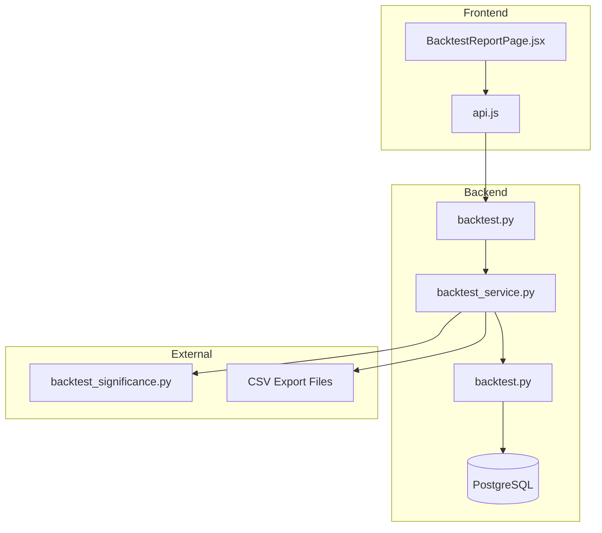
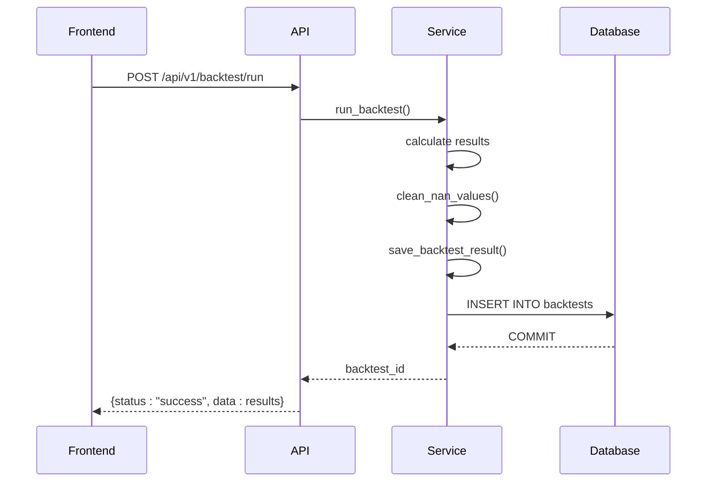
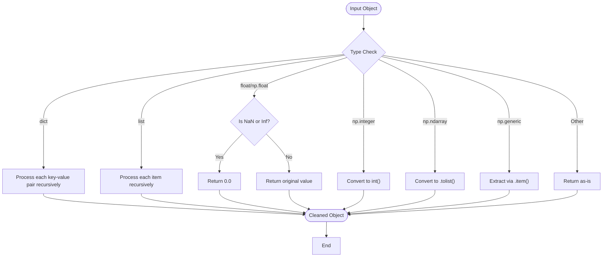
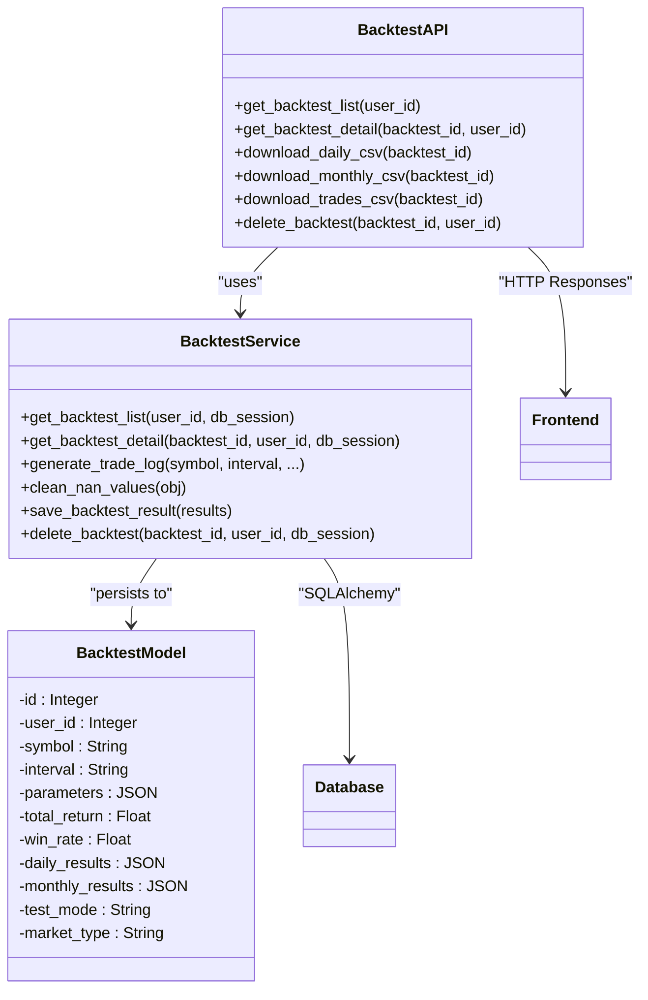
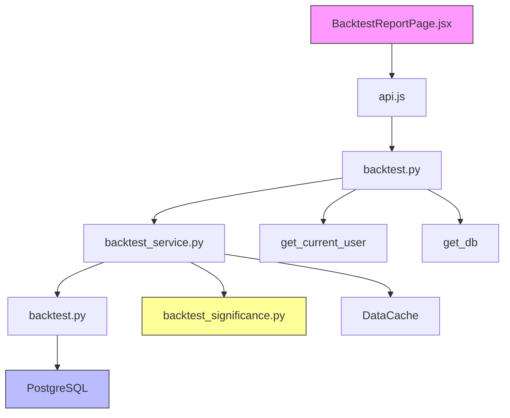

# Result Export

<cite>
**Referenced Files in This Document**   
- [backtest.py](file://app/api/routes/backtest.py)
- [backtest_service.py](file://app/services/backtest_service.py)
- [backtest.py](file://app/models/backtest.py)
- [backtest_significance.py](file://scripts/backtest_significance.py)
- [BacktestReportPage.jsx](file://frontend/src/pages/Backtest/BacktestReportPage.jsx)
</cite>

## Table of Contents
1. [Introduction](#introduction)
2. [Core Components](#core-components)
3. [Architecture Overview](#architecture-overview)
4. [Detailed Component Analysis](#detailed-component-analysis)
5. [Dependency Analysis](#dependency-analysis)
6. [Performance Considerations](#performance-considerations)
7. [Troubleshooting Guide](#troubleshooting-guide)
8. [Conclusion](#conclusion)

## Introduction
The Result Export functionality enables users to persist, retrieve, and analyze backtesting results from trading strategy simulations. This system integrates data serialization, database storage via PostgreSQL and SQLAlchemy, JSON compatibility handling, and export capabilities for external analysis. It supports CRUD operations for backtest records, CSV exports for daily, monthly, and trade-level data, and integration with statistical validation scripts. The implementation ensures data integrity through transaction management, validation hooks, and NaN/Inf value sanitization for reliable interoperability between backend services and frontend visualization components.

## Core Components

The Result Export system revolves around three core methods: `save_backtest_result`, `get_backtest_list`, and `clean_nan_values`. These are implemented in the `BacktestService` class and exposed through API endpoints in `backtest.py`. The `Backtest` ORM model defines the schema for persistence, while external scripts like `backtest_significance.py` enable advanced statistical analysis. Frontend components in `BacktestReportPage.jsx` consume the exported data for visualization and user interaction.

**Section sources**
- [backtest_service.py](file://app/services/backtest_service.py#L1023-L1062)
- [backtest_service.py](file://app/services/backtest_service.py#L1064-L1092)
- [backtest_service.py](file://app/services/backtest_service.py#L1187-L1202)
- [backtest.py](file://app/api/routes/backtest.py#L123-L141)
- [backtest.py](file://app/models/backtest.py#L5-L42)

## Architecture Overview

**Diagram sources**
- [backtest.py](file://app/api/routes/backtest.py)
- [backtest_service.py](file://app/services/backtest_service.py)
- [backtest.py](file://app/models/backtest.py)
- [backtest_significance.py](file://scripts/backtest_significance.py)
- [BacktestReportPage.jsx](file://frontend/src/pages/Backtest/BacktestReportPage.jsx)

## Detailed Component Analysis

### Data Persistence and Retrieval

The `save_backtest_result` method persists backtest results to the PostgreSQL database using the SQLAlchemy ORM. It creates a `Backtest` model instance with key performance metrics such as `total_return`, `win_rate`, `parameters`, and detailed results (`daily_results`, `monthly_results`). The method employs transaction management with commit and rollback operations to ensure data integrity. If an error occurs during persistence, the transaction is rolled back to prevent partial or inconsistent state.

**Diagram sources**
- [backtest_service.py](file://app/services/backtest_service.py#L1023-L1062)
- [backtest.py](file://app/api/routes/backtest.py#L26-L68)

**Section sources**
- [backtest_service.py](file://app/services/backtest_service.py#L1023-L1062)
- [backtest.py](file://app/api/routes/backtest.py#L26-L68)

### JSON Serialization and Data Cleaning

The `clean_nan_values` method ensures JSON compatibility by recursively processing data structures and replacing NaN and Inf values with safe defaults (0.0). This is critical because PostgreSQL's JSONB type and frontend JavaScript both have issues with non-finite floating-point values. The method handles dictionaries, lists, numpy scalars, and arrays, converting them to native Python types suitable for serialization.

**Diagram sources**
- [backtest_service.py](file://app/services/backtest_service.py#L1187-L1202)

**Section sources**
- [backtest_service.py](file://app/services/backtest_service.py#L1187-L1202)

### API Endpoints and CRUD Operations

The API endpoints in `backtest.py` provide a RESTful interface for backtest management. The `/list` endpoint calls `get_backtest_list` to retrieve a user's backtests with summary metrics. The `/detail/{id}` endpoint fetches comprehensive results, while download endpoints (`/download/{id}/daily.csv`, etc.) generate CSV files from stored JSON data. These endpoints integrate with frontend export actions, enabling users to download structured data for external analysis in tools like Excel or Python.

**Diagram sources**
- [backtest.py](file://app/api/routes/backtest.py)
- [backtest_service.py](file://app/services/backtest_service.py)
- [backtest.py](file://app/models/backtest.py)

**Section sources**
- [backtest.py](file://app/api/routes/backtest.py)
- [backtest_service.py](file://app/services/backtest_service.py)

### External Analysis Integration

The `backtest_significance.py` script demonstrates integration with external analysis tools by performing Monte Carlo bootstrapping and walk-forward optimization on backtest results. It uses the same `BacktestService` to run simulations and evaluates statistical significance of returns. This enables users to validate strategy robustness beyond single-run metrics. The script outputs confidence intervals and p-values, supporting data-driven decision making for live deployment.

**Section sources**
- [backtest_significance.py](file://scripts/backtest_significance.py)

## Dependency Analysis

**Diagram sources**
- [BacktestReportPage.jsx](file://frontend/src/pages/Backtest/BacktestReportPage.jsx)
- [backtest.py](file://app/api/routes/backtest.py)
- [backtest_service.py](file://app/services/backtest_service.py)
- [backtest.py](file://app/models/backtest.py)

**Section sources**
- [BacktestReportPage.jsx](file://frontend/src/pages/Backtest/BacktestReportPage.jsx)
- [backtest.py](file://app/api/routes/backtest.py)
- [backtest_service.py](file://app/services/backtest_service.py)
- [backtest.py](file://app/models/backtest.py)

## Performance Considerations

The system employs several performance optimizations: data is cached using the `DataCache` component to avoid redundant API calls to Binance; database queries are limited to 50 recent backtests with proper indexing on `user_id` and `created_at`; and CSV generation streams data directly without loading entire datasets into memory. The `clean_nan_values` method uses efficient recursion with type checks to minimize overhead during serialization. For large backtest logs, the trade CSV generation reconstructs the trade log on-demand rather than storing it permanently, balancing storage efficiency with export functionality.

## Troubleshooting Guide

Common issues include data loss during serialization due to unhandled NaN values, which is mitigated by the `clean_nan_values` pre-processing step. Inconsistencies between cache and database state can occur if cache invalidation is not properly managed; this is addressed by clearing relevant cache entries after successful database commits. Transaction failures are handled with explicit rollback calls and error logging. When CSV exports fail, the system provides detailed error messages and fallback mechanisms. For debugging, developers should check the console logs for "❌" error markers and verify that all required fields are present in the response schema.

**Section sources**
- [backtest_service.py](file://app/services/backtest_service.py#L1051-L1087)
- [backtest.py](file://app/api/routes/backtest.py#L254-L255)
- [backtest_service.py](file://app/services/backtest_service.py#L1170-L1204)

## Conclusion

The Result Export functionality provides a robust framework for persisting, retrieving, and analyzing backtesting results. By combining SQLAlchemy-based database storage, comprehensive data cleaning, and flexible export options, it ensures data integrity and interoperability across the system. The integration with external analysis scripts enhances the value of backtest data, enabling statistical validation and deeper insights. This implementation balances performance, reliability, and usability, making it suitable for both novice users and experienced developers working with trading strategy evaluation.