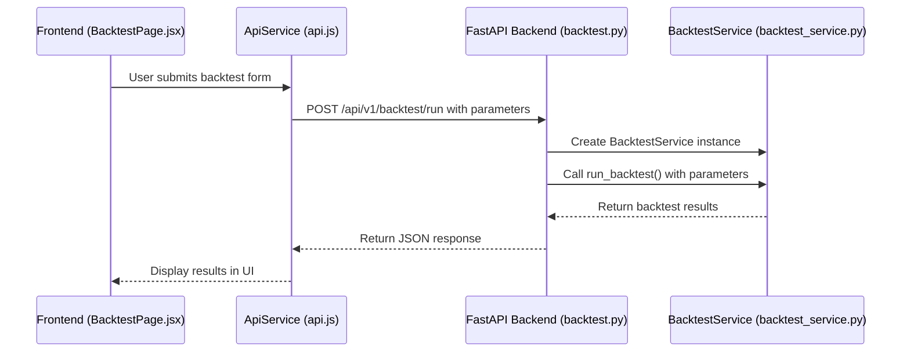

# Strategy Simulation

<cite>
**Referenced Files in This Document**   
- [backtest_service.py](file://app/services/backtest_service.py)
- [backtest.py](file://app/api/routes/backtest.py)
- [BacktestPage.jsx](file://frontend/src/pages/Backtest/BacktestPage.jsx)
- [api.js](file://frontend/src/services/api.js)
- [backtest.py](file://app/models/backtest.py)
- [backtest.py](file://app/schemas/backtest.py)
</cite>

## Table of Contents
1. [Introduction](#introduction)
2. [Frontend to Backend Invocation Flow](#frontend-to-backend-invocation-flow)
3. [Backtest Execution Process](#backtest-execution-process)
4. [Technical Indicator Calculation](#technical-indicator-calculation)
5. [Signal Generation Logic](#signal-generation-logic)
6. [Risk Management and Trade Execution](#risk-management-and-trade-execution)
7. [Data Management and Caching](#data-management-and-caching)
8. [Performance Metrics and Results](#performance-metrics-and-results)
9. [Common Issues and Solutions](#common-issues-and-solutions)
10. [Conclusion](#conclusion)

## Introduction
The Strategy Simulation component enables users to test trading strategies against historical market data through a comprehensive backtesting system. This document details the implementation of the `run_backtest` method in backtest_service.py, which orchestrates the entire backtesting process from data retrieval to performance analysis. The system supports both spot and futures trading with leverage, and incorporates multiple technical indicators including EMA, RSI, MACD, and Bollinger Bands to generate entry signals. The backtesting framework includes robust risk management features such as daily loss limits, stop-loss, take-profit, and trailing stop mechanisms. The process begins with a frontend request that flows through FastAPI routes to the backend service, where market data is fetched, indicators are calculated, and trades are simulated based on the defined strategy parameters.

**Section sources**
- [backtest_service.py](file://app/services/backtest_service.py#L829-L1021)
- [backtest.py](file://app/api/routes/backtest.py#L26-L73)

## Frontend to Backend Invocation Flow
The backtesting process begins with a user interface in the frontend that allows users to configure their backtest parameters. The BacktestPage component provides a form where users can specify the trading pair, time interval, date range, market type (spot or futures), and various strategy parameters. When the user submits the form, the runBacktest method in the ApiService is called, which sends an HTTP POST request to the backend API endpoint. This request contains all the configuration parameters in a structured format. The backend receives this request through the FastAPI route defined in backtest.py, which validates the input parameters and creates an instance of the BacktestService with the user's context. The service then initiates the backtesting process by calling the run_backtest method with the provided parameters. This invocation flow ensures a clean separation between the user interface and the backtesting logic, allowing for a responsive and user-friendly experience while maintaining the complexity of the backtesting algorithm on the server side.

**Diagram sources**
- [BacktestPage.jsx](file://frontend/src/pages/Backtest/BacktestPage.jsx#L231-L262)
- [api.js](file://frontend/src/services/api.js#L161-L163)
- [backtest.py](file://app/api/routes/backtest.py#L26-L73)
- [backtest_service.py](file://app/services/backtest_service.py#L829-L1021)

**Section sources**
- [BacktestPage.jsx](file://frontend/src/pages/Backtest/BacktestPage.jsx#L231-L262)
- [api.js](file://frontend/src/services/api.js#L161-L163)
- [backtest.py](file://app/api/routes/backtest.py#L26-L73)

## Backtest Execution Process
The backtest execution process is orchestrated by the run_backtest method in the BacktestService class. This method begins by initializing the Binance client using the user's API keys from the database, or falls back to test mode if no credentials are available. The method then sanitizes and validates all input parameters, setting default values where necessary. Key parameters include initial capital, daily target return, maximum daily loss, stop-loss, take-profit, trailing stop, and risk per trade. For futures trading, leverage is validated to ensure it falls within the acceptable range of 1-125x, with a default of 10x if outside this range. The method also processes technical indicator parameters such as EMA fast and slow periods, RSI period, and RSI overbought/oversold thresholds. After parameter validation, the method retrieves historical market data using the get_historical_data method, prepares technical indicators with prepare_indicators, and groups the data by day for daily trading limit enforcement. The core of the backtest execution is the calculate_daily_pnl method, which iterates through each day's data, checks for entry signals, and simulates trades according to the strategy rules. The process concludes with the calculation of performance metrics such as total return, win rate, maximum drawdown, Sharpe ratio, and profit factor, which are returned to the frontend for display.

**Section sources**
- [backtest_service.py](file://app/services/backtest_service.py#L829-L1021)

## Technical Indicator Calculation
The technical indicator calculation process is handled by the prepare_indicators method in the BacktestService class. This method takes a DataFrame containing historical price data and adds multiple technical indicators to it. The process begins by creating a copy of the input DataFrame to avoid modifying the original data. The method then calculates the Exponential Moving Average (EMA) for both fast and slow periods using the EMAIndicator from the TA library. The Relative Strength Index (RSI) is calculated using the RSIIndicator with the specified period. The Moving Average Convergence Divergence (MACD) is computed using the MACD class, with the macd_diff method providing the MACD histogram value. Bollinger Bands are calculated using the BollingerBands class, generating upper, middle, and lower band values. The method also includes volume analysis by calculating a 20-period moving average of volume and a volume ratio to identify surges in trading activity. Volatility is measured as the standard deviation of percentage price changes over a 10-period window. A trend strength indicator is calculated as the percentage difference between the fast and slow EMAs. The method includes comprehensive error handling, filling any NaN or infinite values with appropriate defaults and returning a basic DataFrame with fallback values if the calculation fails.

**Section sources**
- [backtest_service.py](file://app/services/backtest_service.py#L345-L441)

## Signal Generation Logic
The signal generation logic is implemented in the check_entry_signal method of the BacktestService class. This method evaluates whether the current market conditions meet the criteria for entering a trade by analyzing multiple technical indicators and market conditions. The method first performs safety checks to ensure all required columns are present and free of NaN values. It then evaluates several primary signals that must be satisfied for a trade entry: an uptrend confirmed by the closing price being above both the fast and slow EMAs, an RSI value within the oversold to overbought range (configurable but defaulting to 35-65), a positive MACD histogram, a price within the upper half of the Bollinger Bands, and a volume surge indicated by a volume ratio greater than 1.2. At least three of these primary signals must be true. The method also evaluates confirmation signals including trend acceleration (increasing EMA spread), rising RSI, increasing MACD, expanding Bollinger Bands, price momentum (0.05% minimum increase), strong trend (trend strength > 0.2%), and acceptable volatility (current volatility below its moving average). At least two of these confirmation signals must be true. The combination of primary and confirmation signals creates a robust entry condition that reduces false positives and improves the reliability of the trading strategy.

**Section sources**
- [backtest_service.py](file://app/services/backtest_service.py#L512-L591)

## Risk Management and Trade Execution
The risk management and trade execution process is implemented in the calculate_daily_pnl method of the BacktestService class. This method simulates trading activity while enforcing multiple risk constraints to protect the simulated capital. For each potential trade, the method calculates the maximum position size based on the risk per trade percentage of the current capital. The entry price is set to the closing price of the current candle, and stop-loss and take-profit prices are calculated based on the specified percentages. The method calculates the number of units that can be traded based on the risk per unit and available capital, ensuring that the margin required (adjusted for leverage in futures trading) does not exceed 95% of the current capital. Trading fees are calculated using the calculate_fees method, which accounts for maker/taker fees and slippage. The method enforces daily trading limits, stopping further trades once the maximum daily trades or maximum daily loss threshold is reached, or the daily target return is achieved. For each trade, the method simulates the exit conditions including take-profit, stop-loss, trailing stop, or end-of-day exit. The trailing stop is dynamically updated as the price moves in favor of the trade. The method tracks all trades in a log and updates the daily and monthly performance metrics, providing a comprehensive record of the backtest results.

**Section sources**
- [backtest_service.py](file://app/services/backtest_service.py#L619-L827)

## Data Management and Caching
The data management and caching system is designed to optimize performance and reduce API usage by storing historical market data locally. The get_historical_data method in the BacktestService class implements a multi-tiered data retrieval strategy. First, it checks the local cache for the requested data using the cache key composed of symbol, interval, date range, and market type. If the data is found in the cache, it is returned immediately without making any API calls. If the data is not cached, the method attempts to retrieve it from the public Binance API using the get_historical_data_public method, which works for both spot and futures markets without requiring authentication. If the public API call fails, the method attempts to use the authenticated Binance client with the user's API keys, which can provide more reliable access to the data. As a final fallback, the method generates sample data using the generate_sample_data method, which creates realistic price series based on the current market price. Once data is retrieved from any source, it is cached using the cache_data method for future use. The cache system also provides endpoints to view cache information and clear the cache, allowing users to manage their cached data through the frontend interface.

**Section sources**
- [backtest_service.py](file://app/services/backtest_service.py#L243-L343)

## Performance Metrics and Results
The performance metrics and results are calculated at the conclusion of the backtest execution to provide a comprehensive evaluation of the trading strategy. The run_backtest method computes several key performance indicators including total return, win rate, average profit per trade, maximum drawdown, Sharpe ratio, Sortino ratio, profit factor, and compound annual growth rate (CAGR). The total return is calculated as the percentage change in capital from the initial to final amount. The win rate is the percentage of winning trades out of the total number of trades. The maximum drawdown is computed using the _compute_max_drawdown method, which identifies the largest peak-to-trough decline in the equity curve. The Sharpe ratio measures risk-adjusted returns by dividing the average daily return by its standard deviation, while the Sortino ratio focuses specifically on downside volatility. The profit factor is calculated as the ratio of gross profits to gross losses. The CAGR is computed based on the start and end dates of the backtest period. These metrics are returned in the results dictionary along with detailed daily and monthly performance data, allowing users to analyze the strategy's performance from multiple perspectives. The results are also saved to the database through the save_backtest_result method, enabling users to review and compare multiple backtest results over time.

**Section sources**
- [backtest_service.py](file://app/services/backtest_service.py#L829-L1021)

## Common Issues and Solutions
Several common issues can arise when using the strategy simulation component, along with corresponding solutions. One common issue is overfitting, where a strategy performs well on historical data but fails in live trading. This can be mitigated by using parameter optimization ranges rather than single optimal values, and by employing walk-forward analysis to validate the strategy on out-of-sample data. Another issue is insufficient historical data, which can lead to unreliable backtest results. This is addressed by the system's default behavior of using six months of historical data when no date range is specified, and by providing fallback mechanisms when data cannot be retrieved from the exchange. Parameter validation helps prevent invalid inputs, such as leverage values outside the 1-125x range for futures trading or daily trade limits outside the 1-50 range. The system's caching mechanism reduces API rate limiting issues and improves performance by reusing previously retrieved data. For users without API keys, the system generates realistic sample data to allow strategy testing. The comprehensive error handling throughout the backtesting process ensures that issues are logged and appropriate fallbacks are used, preventing complete failure of the backtest. Users can also clear the cache and retry if they suspect stale data is affecting their results.

**Section sources**
- [backtest_service.py](file://app/services/backtest_service.py#L829-L1021)

## Conclusion
The Strategy Simulation component provides a robust framework for testing trading strategies against historical market data. The system's architecture separates concerns between the frontend user interface, API routing, and backend service logic, enabling a clean and maintainable codebase. The backtesting process incorporates multiple technical indicators and sophisticated signal generation logic to identify high-probability trade entries. Comprehensive risk management features protect the simulated capital by enforcing daily loss limits, position sizing rules, and multiple exit conditions. The data management system optimizes performance through caching while providing fallback mechanisms for data retrieval failures. The performance metrics offer a comprehensive evaluation of strategy effectiveness from multiple perspectives. By addressing common issues such as overfitting and data availability, the system provides reliable backtest results that can inform real trading decisions. The integration between the frontend and backend is seamless, allowing users to configure and execute backtests with minimal friction. This comprehensive approach to strategy simulation enables both novice and experienced traders to develop, test, and refine their trading strategies in a controlled environment before risking real capital.