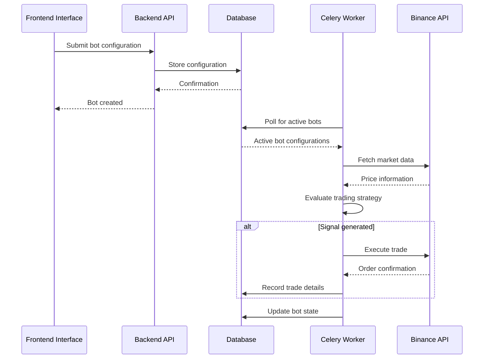
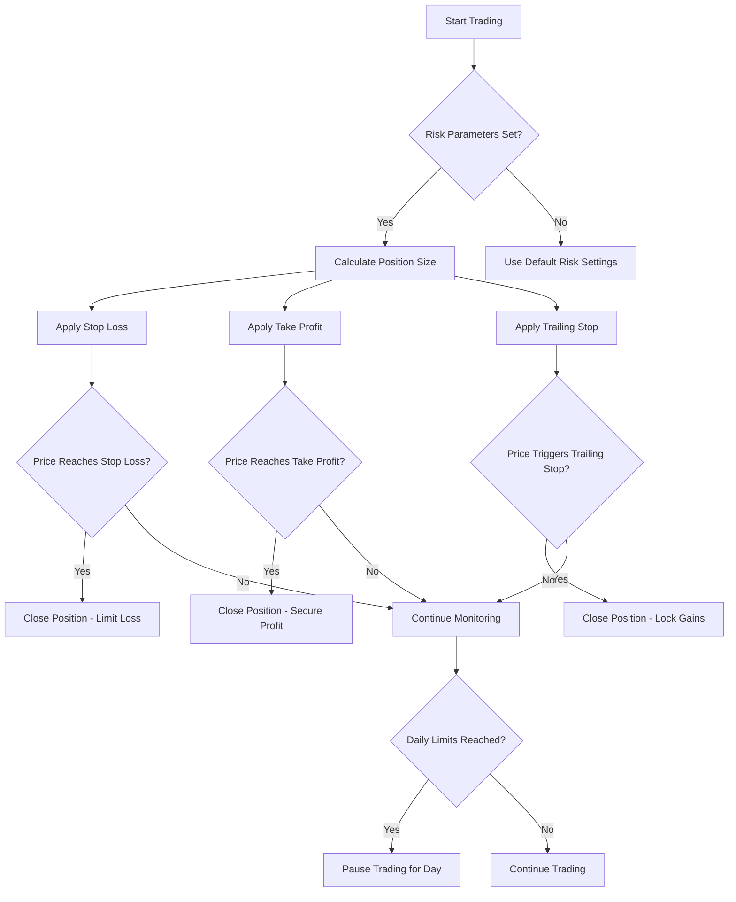
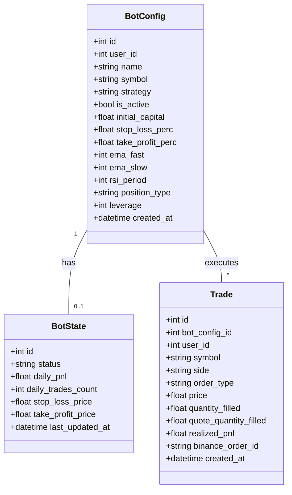
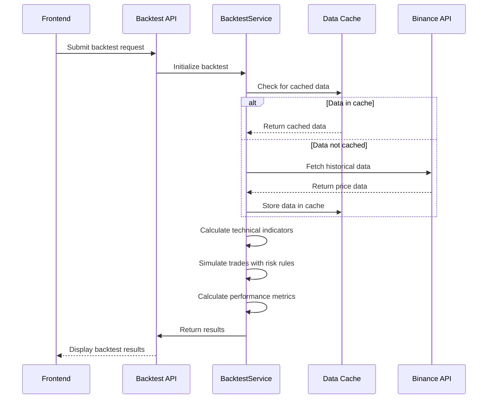
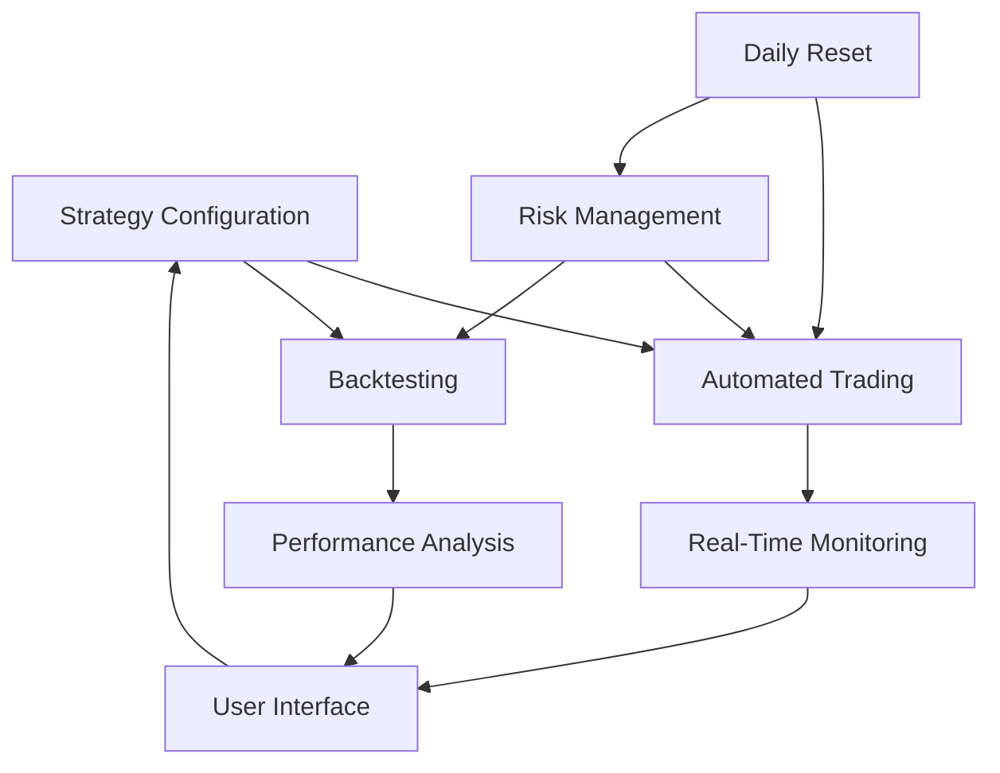

# Core Features

<cite>
**Referenced Files in This Document**   
- [bot_config.py](file://app/models/bot_config.py)
- [bot_tasks.py](file://app/core/bot_tasks.py)
- [backtest_service.py](file://app/services/backtest_service.py)
- [backtest.py](file://app/api/routes/backtest.py)
- [BotCreatePage.jsx](file://frontend/src/pages/Bots/BotCreatePage.jsx)
- [BotDetailPage.jsx](file://frontend/src/pages/Bots/BotDetailPage.jsx)
- [BacktestPage.jsx](file://frontend/src/pages/Backtest/BacktestPage.jsx)
</cite>

## Table of Contents
1. [Introduction](#introduction)
2. [Automated Trading](#automated-trading)
3. [Risk Management](#risk-management)
4. [Real-Time Monitoring](#real-time-monitoring)
5. [Backtesting Capabilities](#backtesting-capabilities)
6. [Feature Interdependencies](#feature-interdependencies)
7. [Common Configuration Issues and Solutions](#common-configuration-issues-and-solutions)
8. [Conclusion](#conclusion)

## Introduction
The TradeBot application provides a comprehensive suite of features for automated cryptocurrency trading. This document details the core functionalities including automated trading execution, risk management, real-time monitoring, and backtesting capabilities. The system allows users to configure trading strategies through the `bot_config` module, execute trades via `bot_tasks`, and monitor performance through the frontend interface. The implementation supports advanced features such as EMA/RSI strategy execution, futures trading with leverage, and comprehensive risk controls. This documentation explains the technical implementation, feature relationships, and common user issues to assist both beginners and experienced developers in effectively utilizing the platform.

## Automated Trading
The automated trading system in TradeBot enables users to create and execute trading bots based on configurable strategies. The core implementation resides in the `bot_tasks.py` file, which contains the main trading logic executed by Celery workers. When a user creates a bot through the frontend interface, the configuration is stored in the database and subsequently processed by the automated trading engine.

The system supports multiple trading strategies, with the EMA/RSI strategy being a primary implementation. This strategy analyzes price data using Exponential Moving Averages and Relative Strength Index indicators to generate trading signals. The trading engine evaluates market conditions at regular intervals (configurable via `check_interval_seconds`) and executes trades when predefined conditions are met.

**Diagram sources**
- [bot_tasks.py](file://app/core/bot_tasks.py)
- [bot_config.py](file://app/models/bot_config.py)

**Section sources**
- [bot_tasks.py](file://app/core/bot_tasks.py)
- [BotCreatePage.jsx](file://frontend/src/pages/Bots/BotCreatePage.jsx)

## Risk Management
TradeBot incorporates comprehensive risk management features to protect user capital and control trading exposure. The risk parameters are configured during bot creation and enforced during automated trading execution. Key risk controls include stop loss, take profit, trailing stop, daily trade limits, and daily loss limits.

The system implements position sizing based on risk percentage of the initial capital, ensuring that no single trade exceeds the user-defined risk threshold. For futures trading, the system supports leverage configuration with appropriate risk warnings displayed in the frontend interface. The maximum leverage allowed is 125x, with default settings at 10x to balance potential returns with risk exposure.

**Diagram sources**
- [bot_tasks.py](file://app/core/bot_tasks.py)
- [bot_config.py](file://app/models/bot_config.py)

**Section sources**
- [bot_tasks.py](file://app/core/bot_tasks.py)
- [BotCreatePage.jsx](file://frontend/src/pages/Bots/BotCreatePage.jsx)

## Real-Time Monitoring
The real-time monitoring system provides users with comprehensive insights into their bot's performance and current status. The frontend interface displays key metrics including current trading status, daily PnL, trade count, and position details. The monitoring data is updated in real-time through periodic polling of the backend API.

The system maintains a bot state record that tracks the current status, last update time, daily PNL, and number of trades executed. This information is accessible through the bot detail page, where users can view their bot's configuration, current status, and performance metrics. The interface also provides quick action buttons to start, stop, or edit bots directly from the monitoring view.

**Diagram sources**
- [bot_config.py](file://app/models/bot_config.py)
- [BotDetailPage.jsx](file://frontend/src/pages/Bots/BotDetailPage.jsx)

**Section sources**
- [bot_config.py](file://app/models/bot_config.py)
- [BotDetailPage.jsx](file://frontend/src/pages/Bots/BotDetailPage.jsx)

## Backtesting Capabilities
The backtesting system allows users to evaluate their trading strategies against historical market data before deploying them with real capital. The implementation in `backtest_service.py` provides a comprehensive framework for simulating trades, calculating performance metrics, and analyzing strategy effectiveness.

The backtesting engine supports both spot and futures trading with leverage, enabling users to test strategies under various market conditions. It incorporates realistic trading fees, slippage, and market impact to provide accurate performance estimates. The system caches historical data to improve performance and reduce API calls to Binance.

Key performance metrics calculated during backtesting include:
- Total return percentage
- Win rate
- Maximum drawdown
- Sharpe ratio
- Sortino ratio
- Profit factor
- CAGR (Compound Annual Growth Rate)

**Diagram sources**
- [backtest_service.py](file://app/services/backtest_service.py)
- [backtest.py](file://app/api/routes/backtest.py)

**Section sources**
- [backtest_service.py](file://app/services/backtest_service.py)
- [BacktestPage.jsx](file://frontend/src/pages/Backtest/BacktestPage.jsx)

## Feature Interdependencies
The core features of TradeBot are interconnected, with configuration parameters from one feature directly affecting the behavior of others. The strategy configuration in `bot_config` serves as the foundation that drives automated trading, risk management, and backtesting processes.

When a user configures a bot, the parameters are used across multiple system components. For example, the EMA/RSI parameters defined in the bot configuration are used by both the automated trading engine and the backtesting system. Similarly, risk management parameters like stop loss and take profit affect both live trading behavior and backtest simulations.

The system implements a daily reset mechanism that reactivates bots after daily limits are reached, ensuring continuous operation. This process coordinates with the risk management system to reset daily PnL and trade counters, allowing bots to resume trading the following day.

**Diagram sources**
- [bot_tasks.py](file://app/core/bot_tasks.py)
- [backtest_service.py](file://app/services/backtest_service.py)

**Section sources**
- [bot_tasks.py](file://app/core/bot_tasks.py)
- [backtest_service.py](file://app/services/backtest_service.py)

## Common Configuration Issues and Solutions
Users may encounter several common issues when configuring trading bots. Understanding these issues and their solutions can help prevent trading losses and ensure optimal bot performance.

**Issue 1: Invalid API Key Configuration**
Users may configure invalid or restricted API keys, preventing the bot from executing trades. The system displays clear error messages when API key authentication fails.

*Solution*: Verify that the API key has the necessary permissions enabled in the Binance account settings. Ensure the key is not restricted to specific IP addresses unless the server IP is whitelisted.

**Issue 2: Incompatible Strategy Parameters**
Setting unrealistic parameters such as extremely tight stop loss levels or aggressive leverage can lead to premature position closures or excessive risk exposure.

*Solution*: Start with conservative parameters and gradually optimize based on backtest results. Use the backtesting feature to evaluate parameter combinations before deploying with real capital.

**Issue 3: Insufficient Balance**
The bot may fail to execute trades if the account balance is insufficient to meet order size requirements or margin requirements for futures trading.

*Solution*: Ensure adequate capital is available in the appropriate wallet (spot or futures). For futures trading, consider the leverage settings and their impact on margin requirements.

**Issue 4: Rate Limiting**
Excessive API calls can trigger rate limiting by Binance, temporarily preventing the bot from accessing market data.

*Solution*: The system implements rate limiting controls, but users should avoid configuring excessively short check intervals. The default 60-second interval provides a good balance between responsiveness and API usage.

**Section sources**
- [bot_tasks.py](file://app/core/bot_tasks.py)
- [BotCreatePage.jsx](file://frontend/src/pages/Bots/BotCreatePage.jsx)

## Conclusion
The TradeBot application provides a robust platform for automated cryptocurrency trading with comprehensive risk management, real-time monitoring, and backtesting capabilities. The system's modular architecture allows for flexible strategy configuration while maintaining strict risk controls to protect user capital. By understanding the interdependencies between features and following best practices for configuration, users can effectively deploy and manage automated trading bots. The combination of automated execution, comprehensive risk management, and thorough backtesting enables both novice and experienced traders to implement their strategies with confidence.