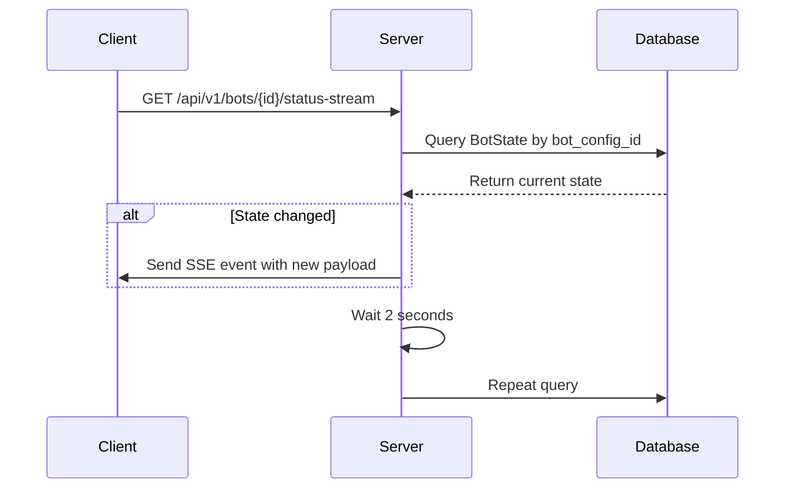
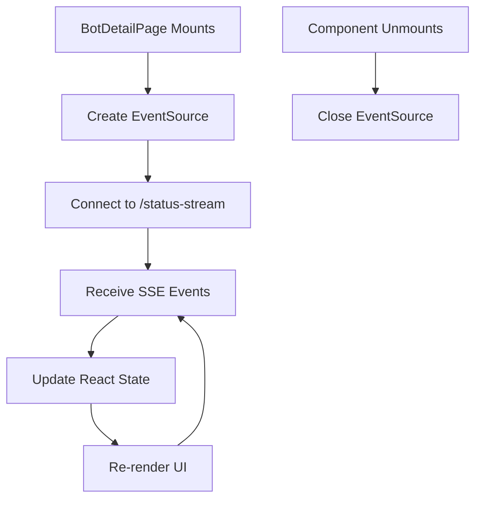
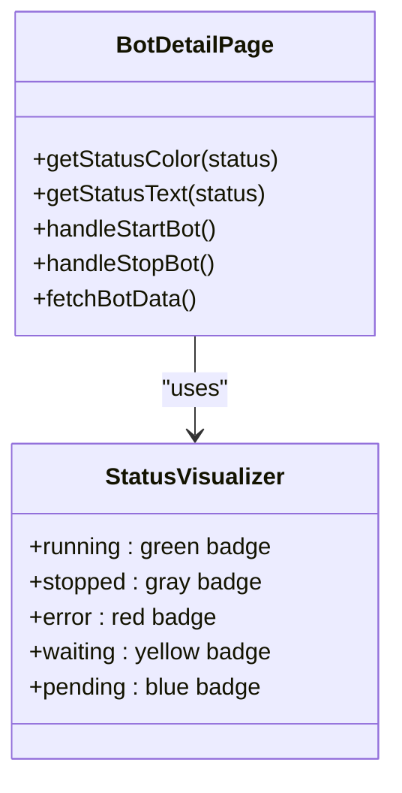
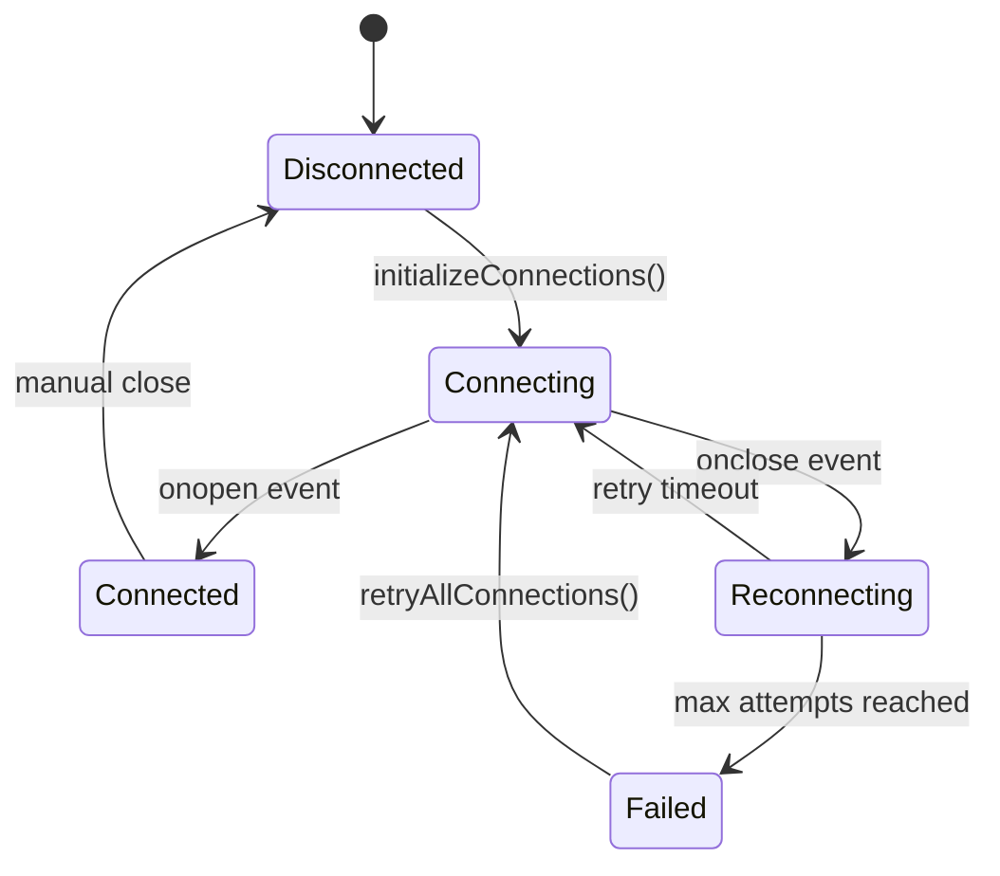

(docs)
# Real-time Monitoring

<cite>
**Referenced Files in This Document**   
- [app/main.py](file://app/main.py#L73-L93)
- [app/api/routes/bot_runner.py](file://app/api/routes/bot_runner.py)
- [frontend/src/pages/Bots/BotDetailPage.jsx](file://frontend/src/pages/Bots/BotDetailPage.jsx)
- [frontend/src/components/Markets/WebSocketManager.jsx](file://frontend/src/components/Markets/WebSocketManager.jsx)
</cite>

## Table of Contents
1. [Introduction](#introduction)
2. [SSE Endpoint Implementation](#sse-endpoint-implementation)
3. [Frontend Consumption of SSE Updates](#frontend-consumption-of-sse-updates)
4. [Status Visualization and UI Updates](#status-visualization-and-ui-updates)
5. [Connection Management and Retry Logic](#connection-management-and-retry-logic)
6. [Common Issues and Solutions](#common-issues-and-solutions)
7. [Performance Optimization](#performance-optimization)
8. [Conclusion](#conclusion)

## Introduction

The Real-time Monitoring system in the TradeBot application provides live updates of bot status and performance metrics through Server-Sent Events (SSE). This documentation details the implementation of the SSE endpoint in the backend, how frontend components consume these updates, and the complete flow from backend status changes to frontend UI updates. The system enables users to monitor their trading bots in real-time, with visual indicators for different bot states and robust connection management to handle network issues.

## SSE Endpoint Implementation

The SSE endpoint is implemented in the FastAPI backend to stream bot status updates to connected clients. The endpoint is defined in `app/main.py` and provides a continuous stream of JSON data containing the current state of a specific bot.

**Diagram sources** 
- [app/main.py](file://app/main.py#L73-L93)

The implementation uses an asynchronous generator function that continuously queries the database for the latest bot state. When a change is detected in the bot's status, entry price, PnL, or other metrics, the new state is sent to the client as an SSE event. The endpoint includes proper authentication through dependency injection, ensuring that only authorized users can access their bot's status stream.

**Section sources**
- [app/main.py](file://app/main.py#L73-L93)

## Frontend Consumption of SSE Updates

The frontend components consume the SSE updates through the `BotDetailPage.jsx` component, which establishes a connection to the SSE endpoint when a user views a specific bot's details. The component uses the browser's EventSource API to maintain a persistent connection and receive real-time updates.

**Diagram sources** 
- [frontend/src/pages/Bots/BotDetailPage.jsx](file://frontend/src/pages/Bots/BotDetailPage.jsx)

The frontend implementation handles the connection lifecycle properly, establishing the SSE connection when the component mounts and closing it when the component unmounts to prevent memory leaks. The received events are used to update the React component state, triggering UI re-renders when the bot status changes.

**Section sources**
- [frontend/src/pages/Bots/BotDetailPage.jsx](file://frontend/src/pages/Bots/BotDetailPage.jsx)

## Status Visualization and UI Updates

The frontend visualizes bot states through the `getStatusColor` function in `BotDetailPage.jsx`, which maps different bot status strings to appropriate color classes for visual indication. This function determines the styling of status badges in the UI based on the bot's current state.

**Diagram sources** 
- [frontend/src/pages/Bots/BotDetailPage.jsx](file://frontend/src/pages/Bots/BotDetailPage.jsx#L118-L135)

The `getStatusColor` function evaluates the bot status string and returns appropriate Tailwind CSS classes to style the status indicator. For example, a "running" status receives a green background with dark green text, while an "error" status receives a red background with dark red text. This provides immediate visual feedback to users about their bot's operational state.

**Section sources**
- [frontend/src/pages/Bots/BotDetailPage.jsx](file://frontend/src/pages/Bots/BotDetailPage.jsx#L118-L135)

## Connection Management and Retry Logic

The WebSocketManager.jsx component handles connection states and implements retry logic for WebSocket connections to market data providers. While this component primarily manages WebSocket connections rather than SSE connections, it demonstrates the application's approach to maintaining real-time data streams.

**Diagram sources** 
- [frontend/src/components/Markets/WebSocketManager.jsx](file://frontend/src/components/Markets/WebSocketManager.jsx)

The connection management system implements exponential backoff for reconnection attempts, with a base delay of 5 seconds that doubles with each failed attempt up to a maximum of 30 seconds. The system tracks connection statistics including the number of attempts and last error messages, providing detailed information for troubleshooting connection issues.

**Section sources**
- [frontend/src/components/Markets/WebSocketManager.jsx](file://frontend/src/components/Markets/WebSocketManager.jsx)

## Common Issues and Solutions

Several common issues can occur with real-time monitoring, and the system includes solutions for these scenarios:

### Connection Drops
When network connectivity is lost, the SSE connection will eventually time out. The frontend should detect this and provide appropriate user feedback. Implementing a heartbeat mechanism or connection timeout detection can help identify when a connection has been lost.

### Delayed Updates
The current implementation polls the database every 2 seconds, which creates a potential delay in status updates. For time-sensitive applications, consider reducing the polling interval or implementing a push-based notification system where the backend pushes updates immediately when state changes occur.

### Authentication Expiration
Long-lived SSE connections may outlast authentication tokens. The system should handle 401 Unauthorized responses by prompting the user to re-authenticate and re-establishing the connection with new credentials.

### Browser Tab Inactivity
When browser tabs are inactive, browsers may throttle or suspend JavaScript execution, affecting the EventSource connection. The application should detect when a tab becomes active again and re-establish the connection if necessary.

## Performance Optimization

The real-time monitoring system can be optimized in several ways to improve performance and reduce server load:

### Database Query Optimization
The current SSE implementation performs a database query every 2 seconds for each connected client. For systems with many active bots, this could create significant database load. Consider implementing caching mechanisms or using database triggers to push updates only when data changes.

### Connection Multiplexing
Instead of establishing separate SSE connections for each bot, consider implementing a multiplexed connection that streams updates for multiple bots over a single connection, reducing the total number of connections to the server.

### Data Throttling
Implement intelligent throttling that increases the update frequency when a bot's state is changing frequently and decreases it when the state is stable, balancing responsiveness with server load.

### Compression
Enable gzip compression on SSE responses to reduce bandwidth usage, especially important for mobile users or those with limited data plans.

## Conclusion

The Real-time Monitoring system effectively provides users with up-to-date information about their trading bots through Server-Sent Events. The implementation demonstrates a clean separation between backend data streaming and frontend consumption, with thoughtful consideration of connection management and user experience. By understanding the flow from backend status changes to frontend UI updates, developers can maintain and extend this system to support additional real-time features. The visualization of bot states through color-coded indicators provides immediate feedback to users, while the connection management strategies ensure reliability even in less-than-ideal network conditions.
(docs)