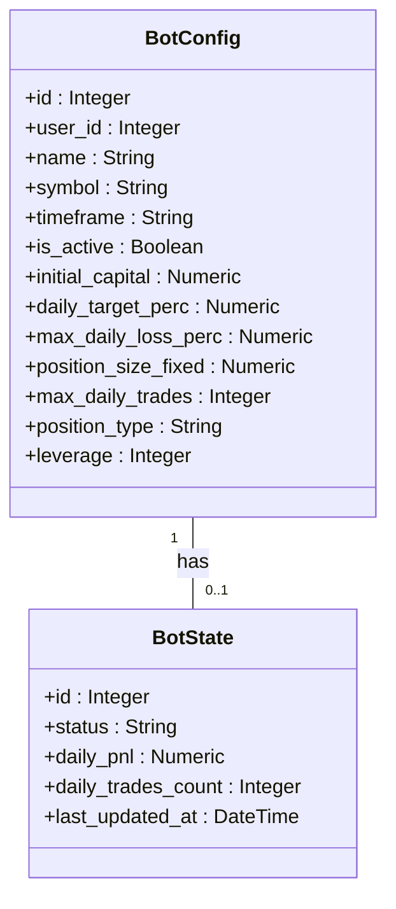
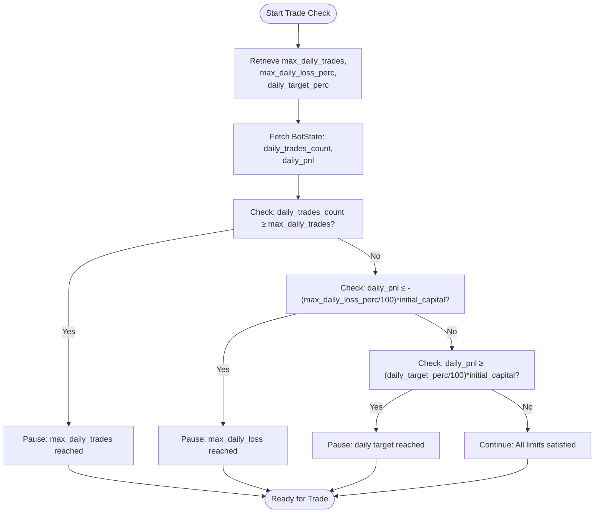
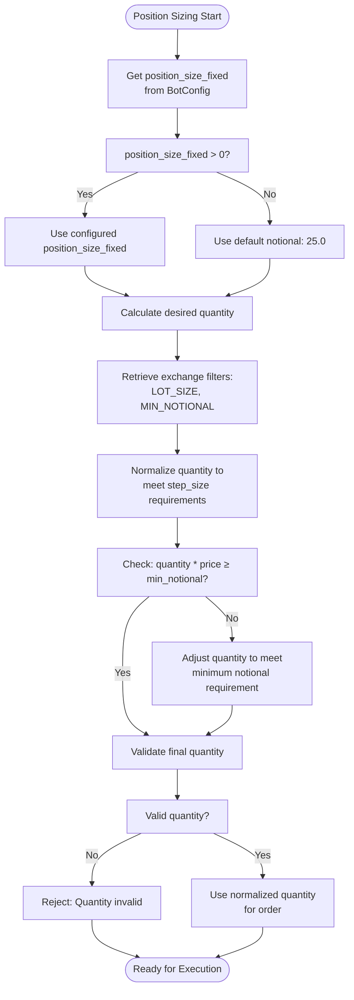

# Daily Limits and Position Sizing

<cite>
**Referenced Files in This Document**   
- [bot_config.py](file://app/models/bot_config.py)
- [bot_tasks.py](file://app/core/bot_tasks.py)
- [binance_client.py](file://app/core/binance_client.py)
- [bot_state.py](file://app/models/bot_state.py)
</cite>

## Table of Contents
1. [Introduction](#introduction)
2. [Core Risk Control Parameters](#core-risk-control-parameters)
3. [BotConfig Model Implementation](#botconfig-model-implementation)
4. [Daily Limits Enforcement](#daily-limits-enforcement)
5. [Position Sizing Logic](#position-sizing-logic)
6. [Daily Reset Mechanism](#daily-reset-mechanism)
7. [Common Issues and Solutions](#common-issues-and-solutions)
8. [Conclusion](#conclusion)

## Introduction

The Daily Limits and Position Sizing feature provides critical risk management controls for trading bots in the system. This documentation details how the bot enforces daily trading limits and calculates position sizes to protect capital. The system implements three key daily limits: maximum daily trades (`max_daily_trades`), maximum daily loss percentage (`max_daily_loss_perc`), and daily profit target percentage (`daily_target_perc`). These limits work in conjunction with position sizing parameters to create a comprehensive risk management framework. The implementation spans the `BotConfig` model for configuration storage and the `_run_bot` function for runtime enforcement, with daily state tracking maintained in the `BotState` model.

## Core Risk Control Parameters

The system implements four primary risk control parameters that govern trading behavior:

- **max_daily_trades**: Maximum number of trades allowed per day
- **daily_target_perc**: Daily profit target as percentage of initial capital
- **max_daily_loss_perc**: Maximum allowable daily loss as percentage of initial capital  
- **position_size_fixed**: Fixed position size for trades

These parameters work together to prevent overtrading, limit downside risk, and ensure consistent position sizing. The daily limits are calculated relative to the `initial_capital` parameter, which serves as the baseline for percentage-based calculations. When any of these limits are reached, the bot automatically pauses trading and updates its status accordingly. The position sizing parameter determines the quantity of assets to trade, with additional normalization applied based on exchange requirements.

**Section sources**
- [bot_config.py](file://app/models/bot_config.py#L14-L29)

## BotConfig Model Implementation

The `BotConfig` model defines the database schema for storing bot configuration parameters, including all risk control settings. The model contains specific columns for each daily limit parameter: `max_daily_trades` as an integer column, `daily_target_perc` and `max_daily_loss_perc` as numeric columns, and `position_size_fixed` for position sizing. These columns are nullable to allow optional configuration. The model also includes the `initial_capital` field which serves as the reference point for percentage-based daily limits. The configuration is stored in the "bot_configs" table and can be modified through the application interface. When a bot is created or updated, these parameters are validated and persisted to the database for use during trading operations.

**Diagram sources**
- [bot_config.py](file://app/models/bot_config.py#L5-L57)
- [bot_state.py](file://app/models/bot_state.py#L5-L22)

**Section sources**
- [bot_config.py](file://app/models/bot_config.py#L5-L57)

## Daily Limits Enforcement

The daily limits are enforced in the `_run_bot` function through a series of checks before trade execution. The function first retrieves the current daily trade count and PnL from the `BotState` model. It then checks three conditions in sequence: maximum daily trades, maximum daily loss, and daily target. For the trade count limit, if `current_daily_trades` exceeds `max_daily_trades`, the bot pauses. For percentage-based limits, the system calculates thresholds based on `initial_capital` and compares them to `current_daily_pnl`. If the loss threshold is breached (negative PnL exceeding `max_daily_loss_perc`), or if the profit target is reached (PnL exceeding `daily_target_perc`), the bot pauses trading. When any limit is triggered, the bot updates its status in the database and returns an appropriate message.

**Diagram sources**
- [bot_tasks.py](file://app/core/bot_tasks.py#L371-L397)

**Section sources**
- [bot_tasks.py](file://app/core/bot_tasks.py#L351-L397)

## Position Sizing Logic

The position sizing logic calculates the appropriate trade quantity based on the configured `position_size_fixed` parameter and exchange requirements. The system first retrieves the desired quantity from the bot configuration. If no fixed size is specified, it defaults to a small notional value of 25.0. The calculated quantity is then normalized according to the exchange's lot size and minimum notional requirements through the `normalize_spot_quantity` or `normalize_futures_quantity` methods. These methods ensure the order quantity meets the exchange's step size requirements and exceeds the minimum notional value. If the normalized quantity is invalid or below minimum requirements, the trade is rejected. The final order quantity is used when placing market orders through the Binance API.

**Diagram sources**
- [bot_tasks.py](file://app/core/bot_tasks.py#L340-L351)
- [binance_client.py](file://app/core/binance_client.py#L183-L221)

**Section sources**
- [bot_tasks.py](file://app/core/bot_tasks.py#L340-L351)

## Daily Reset Mechanism

The system includes a daily reset mechanism that automatically clears daily limits and restarts paused bots. The `reactivate_bots_after_reset` function runs daily and performs two key operations: it resets the `daily_trades_count` and `daily_pnl` counters in all `BotState` records to zero, and it reactivates any bots that were paused due to reaching daily limits by setting `is_active` to true. This reset ensures that bots can resume trading at the start of each new day with fresh counters. The function is designed to run once daily, typically at midnight UTC, to provide a clean slate for trading operations. This automated reset prevents bots from remaining paused indefinitely and ensures consistent daily performance tracking.

**Section sources**
- [bot_tasks.py](file://app/core/bot_tasks.py#L79-L108)

## Common Issues and Solutions

Several common issues can occur with the daily limits and position sizing system. Unexpected bot pausing often results from incorrect `initial_capital` configuration or overly aggressive limit settings. To resolve this, ensure `initial_capital` is set to the actual trading capital and adjust percentage limits to realistic levels (e.g., 3-5% daily target, 1-2% maximum loss). Position sizing issues typically stem from exchange requirements not being met; the system automatically handles this through quantity normalization, but extremely small position sizes may be rejected. For futures trading, ensure the `position_type` is correctly set and leverage is configured appropriately. Monitoring the bot status messages provides insight into which limit triggered a pause, allowing for targeted configuration adjustments.

**Section sources**
- [bot_config.py](file://app/models/bot_config.py#L14-L29)
- [bot_tasks.py](file://app/core/bot_tasks.py#L371-L397)

## Conclusion

The Daily Limits and Position Sizing feature provides a robust risk management framework for trading bots. By combining configurable daily limits with automated position sizing and a daily reset mechanism, the system protects capital while allowing for consistent trading performance. The implementation leverages the `BotConfig` model for parameter storage, the `_run_bot` function for runtime enforcement, and the `BotState` model for tracking daily metrics. Proper configuration of `initial_capital` and risk parameters is essential for optimal performance. The automated daily reset ensures that temporary pauses do not become permanent, maintaining trading continuity while respecting risk management principles.