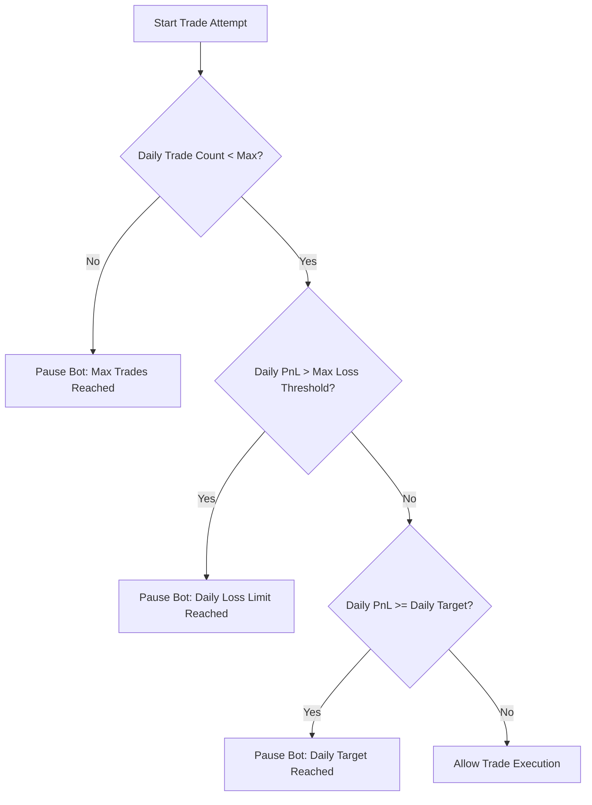
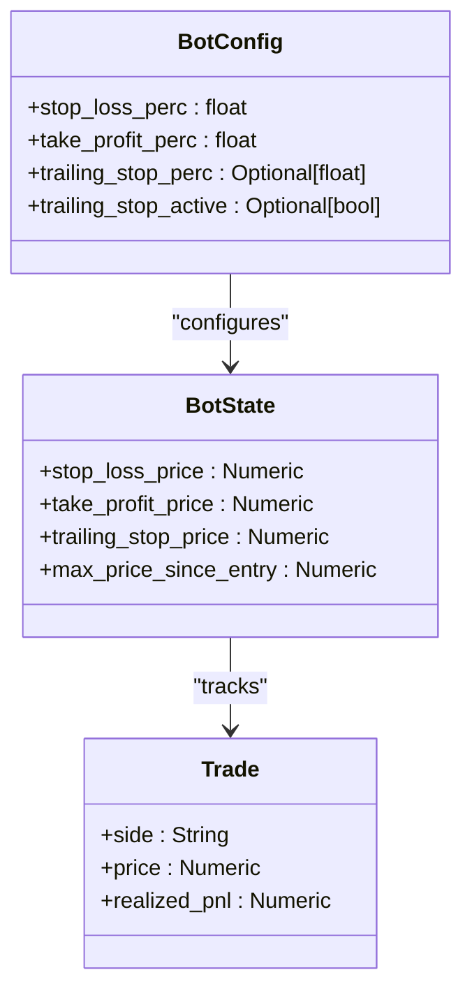
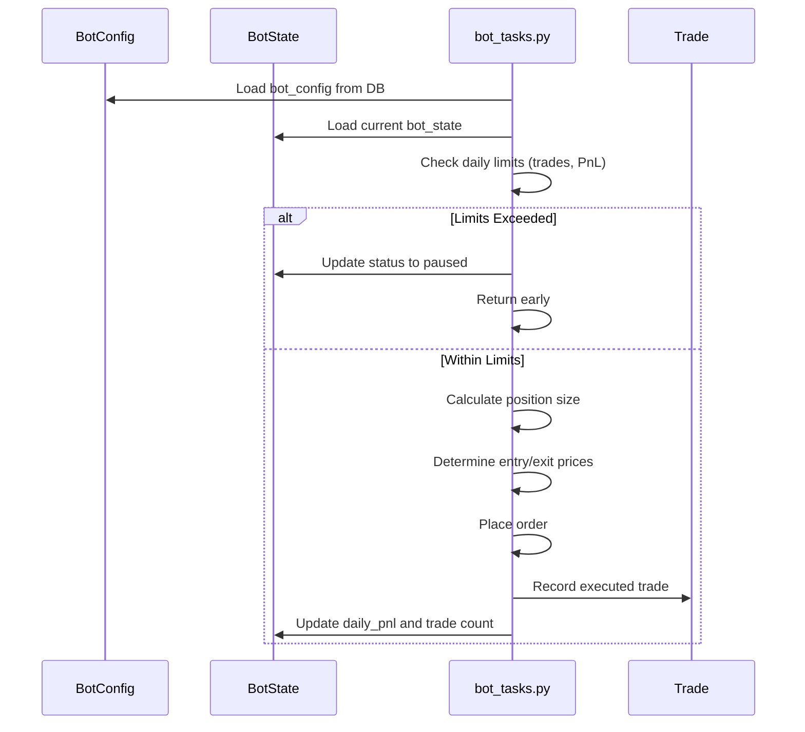

# Risk Management System

<cite>
**Referenced Files in This Document**   
- [bot_config.py](file://app/schemas/bot_config.py)
- [bot_tasks.py](file://app/core/bot_tasks.py)
- [bot_config.py](file://app/models/bot_config.py)
- [bot_state.py](file://app/models/bot_state.py)
- [trade.py](file://app/models/trade.py)
</cite>

## Table of Contents
1. [Introduction](#introduction)
2. [Risk Parameters in Configuration](#risk-parameters-in-configuration)
3. [Daily Limits and Bot Pausing Logic](#daily-limits-and-bot-pausing-logic)
4. [Position Sizing Calculation](#position-sizing-calculation)
5. [Stop-Loss, Take-Profit, and Trailing Stop Implementation](#stop-loss-take-profit-and-trailing-stop-implementation)
6. [Invocation Relationship Between Risk Configuration and Trade Execution](#invocation-relationship-between-risk-configuration-and-trade-execution)
7. [Common Issues and Solutions](#common-issues-and-solutions)
8. [Conclusion](#conclusion)

## Introduction
The Risk Management System in the trading bot is designed to protect capital through multiple layers of controls including stop-loss, take-profit, trailing stops, daily profit/loss limits, and position sizing. This document explains how risk parameters are defined in the configuration schema and enforced during execution. The system ensures that trading activity automatically pauses when predefined thresholds are reached, preventing excessive losses or overtrading. The implementation spans both the data model (bot_config) and execution logic (bot_tasks), with real-time tracking via BotState and Trade records.

## Risk Parameters in Configuration
Risk parameters are defined in the `BotConfigBase` schema and stored in the database via the `BotConfig` model. These include stop-loss, take-profit, trailing stop, daily targets, loss limits, and position sizing rules.

### Core Risk Parameters
The following risk-related fields are available in the bot configuration:

| Parameter | Type | Description | Default Value |
|---------|------|-------------|---------------|
| `stop_loss_perc` | float | Percentage loss threshold to trigger exit | Required |
| `take_profit_perc` | float | Percentage gain threshold to trigger exit | Required |
| `trailing_stop_perc` | Optional[float] | Percentage for trailing stop activation | None |
| `daily_target_perc` | Optional[float] | Daily profit target (percentage of initial capital) | None |
| `max_daily_loss_perc` | Optional[float] | Maximum daily loss allowed (percentage of initial capital) | None |
| `position_size_perc` | Optional[float] | Percentage of account capital to risk per trade | None |
| `position_size_fixed` | Optional[float] | Fixed amount to use per trade | None |
| `max_daily_trades` | Optional[int] | Maximum number of trades allowed per day | None |

**Section sources**
- [bot_config.py](file://app/schemas/bot_config.py#L11-L18)
- [bot_config.py](file://app/models/bot_config.py#L14-L28)

## Daily Limits and Bot Pausing Logic
The system enforces daily limits by checking current performance against configured thresholds before executing new trades. If limits are breached, the bot pauses automatically.

### Daily Limit Enforcement Flow


**Diagram sources**
- [bot_tasks.py](file://app/core/bot_tasks.py#L370-L397)

### Implementation Details
The daily limit checks occur in the `_run_bot` function within `bot_tasks.py`. The logic evaluates three conditions:

1. **Daily Trade Limit**: Compares `daily_trades_count` from `BotState` with `max_daily_trades` from `BotConfig`.
2. **Daily Loss Limit**: Calculates loss threshold as `(max_daily_loss_perc / 100) * initial_capital` and compares with `daily_pnl`.
3. **Daily Profit Target**: Calculates target as `(daily_target_perc / 100) * initial_capital` and compares with `daily_pnl`.

When any condition is met, the bot status is updated to reflect the reason for pausing (e.g., "paused (max_daily_loss reached)") and the function returns early without placing a trade.

**Section sources**
- [bot_tasks.py](file://app/core/bot_tasks.py#L370-L397)
- [bot_state.py](file://app/models/bot_state.py#L17-L18)

## Position Sizing Calculation
Position sizing determines how much capital to allocate per trade based on risk parameters and account balance.

### Position Sizing Logic
The system supports two modes:
- **Percentage-based**: Uses `position_size_perc` of available capital
- **Fixed amount**: Uses `position_size_fixed` value

If neither is set, a fallback notional value of $25 is used.

### Calculation Process
```mermaid
flowchart TD
A[Get Desired Quantity] --> B{position_size_fixed > 0?}
B --> |Yes| C[Use position_size_fixed]
B --> |No| D{position_size_perc > 0?}
D --> |Yes| E[Calculate: capital * (position_size_perc / 100)]
D --> |No| F[Use $25 Notional]
F --> G[Convert to Quantity: notional / price]
E --> H[Convert to Quantity: amount / price]
C --> I[Normalize Quantity via Exchange Rules]
H --> I
G --> I
I --> J[Apply Minimum Notional Check]
J --> K[Final Order Quantity]
```

**Diagram sources**
- [bot_tasks.py](file://app/core/bot_tasks.py#L340-L350)

For futures trading, the system also applies leverage and margin requirements, ensuring the position does not exceed 95% of available capital.

**Section sources**
- [bot_tasks.py](file://app/core/bot_tasks.py#L340-L350)
- [bot_config.py](file://app/schemas/bot_config.py#L13-L14)

## Stop-Loss, Take-Profit, and Trailing Stop Implementation
The system implements multiple exit strategies to manage open positions and lock in profits or limit losses.

### Exit Strategy Parameters
| Strategy | Configuration Field | Activation Condition |
|--------|-------------------|---------------------|
| Stop-Loss | `stop_loss_perc` | Price moves against position by specified percentage |
| Take-Profit | `take_profit_perc` | Price moves in favor of position by specified percentage |
| Trailing Stop | `trailing_stop_perc` | Price retraces from peak by specified percentage |

### Execution Logic
When a BUY signal is generated:
- Stop-loss price = Entry price × (1 - stop_loss_perc / 100)
- Take-profit price = Entry price × (1 + take_profit_perc / 100)

For SELL signals:
- Stop-loss price = Entry price × (1 + stop_loss_perc / 100)
- Take-profit price = Entry price × (1 - take_profit_perc / 100)

These prices are stored in `BotState` and used to place OCO (One-Cancels-Other) orders on spot markets or reduce-only orders on futures.



**Diagram sources**
- [bot_config.py](file://app/schemas/bot_config.py#L15-L17)
- [bot_state.py](file://app/models/bot_state.py#L13-L16)
- [trade.py](file://app/models/trade.py#L13-L22)

**Section sources**
- [bot_tasks.py](file://app/core/bot_tasks.py#L330-L338)
- [bot_state.py](file://app/models/bot_state.py#L13-L16)

## Invocation Relationship Between Risk Configuration and Trade Execution
The risk management system follows a clear invocation chain from configuration to enforcement.

### Control Flow Sequence


**Diagram sources**
- [bot_tasks.py](file://app/core/bot_tasks.py#L126-L518)
- [bot_config.py](file://app/models/bot_config.py)
- [bot_state.py](file://app/models/bot_state.py)

The `reactivate_bots_after_reset` Celery task runs daily to reset counters and reactivate paused bots, ensuring fresh starts each day.

**Section sources**
- [bot_tasks.py](file://app/core/bot_tasks.py#L79-L109)

## Common Issues and Solutions
This section addresses frequent problems users encounter with the risk management system.

### Issue 1: Unexpected Bot Pausing
**Symptom**: Bot stops trading even with favorable market conditions  
**Cause**: One of the daily limits (`max_daily_loss_perc`, `daily_target_perc`, or `max_daily_trades`) has been reached  
**Solution**: 
- Check `BotState.status` for pause reason
- Adjust limits in bot configuration
- Wait for daily reset (automatic at UTC midnight)

### Issue 2: Position Size Too Small
**Symptom**: Trades use much smaller amounts than expected  
**Cause**: Fallback mechanism activates when `position_size_fixed` and `position_size_perc` are not set  
**Solution**: Explicitly set either `position_size_fixed` or `position_size_perc` in configuration

### Issue 3: Stop-Loss/TP Not Triggering
**Symptom**: Market moves past stop-loss or take-profit levels but order not executed  
**Cause**: OCO orders may fail on spot; reduce-only protections on futures  
**Solution**: 
- Verify exchange connectivity
- Check `last_error_message` in `BotState`
- Ensure sufficient balance and margin

**Section sources**
- [bot_tasks.py](file://app/core/bot_tasks.py#L370-L397)
- [bot_state.py](file://app/models/bot_state.py#L20)
- [bot_tasks.py](file://app/core/bot_tasks.py#L422-L425)

## Conclusion
The Risk Management System provides comprehensive protection through configurable stop-loss, take-profit, trailing stops, daily limits, and position sizing rules. These parameters are defined in the `BotConfig` schema and enforced in `bot_tasks.py` before each trade execution. The system automatically pauses trading when daily thresholds are met, preventing excessive losses or overtrading. Position sizing is calculated based on risk percentage of account capital, with fallback mechanisms for safety. Understanding the interaction between configuration parameters and execution logic is crucial for optimizing bot performance while maintaining capital preservation.