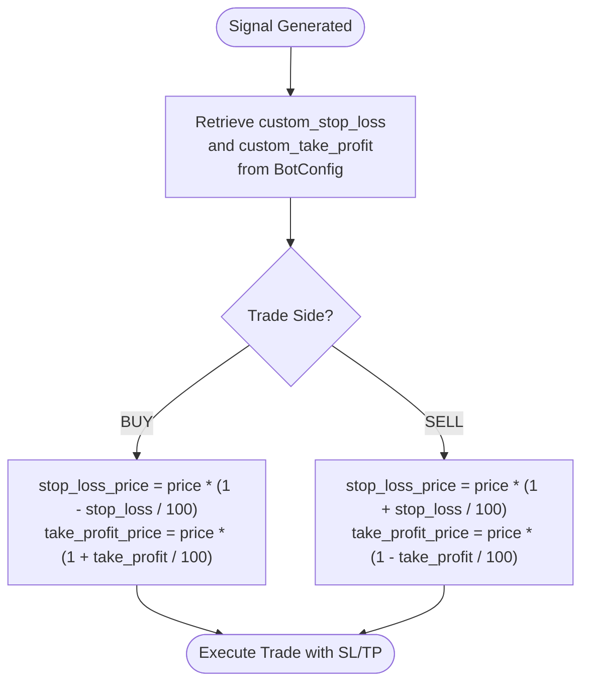

# Stop-Loss and Take-Profit Configuration

<cite>
**Referenced Files in This Document**   
- [bot_tasks.py](file://app/core/bot_tasks.py)
- [BotCreatePage.jsx](file://frontend/src/pages/Bots/BotCreatePage.jsx)
- [bot_config.py](file://app/models/bot_config.py)
- [bot_config.py](file://app/schemas/bot_config.py)
</cite>

## Table of Contents
1. [Introduction](#introduction)
2. [BotConfig Model Definition](#botconfig-model-definition)
3. [Schema Validation](#schema-validation)
4. [Stop-Loss and Take-Profit Calculation](#stop-loss-and-take-profit-calculation)
5. [Frontend Form Implementation](#frontend-form-implementation)
6. [Common Issues and Solutions](#common-issues-and-solutions)
7. [Risk-Reward Optimization](#risk-reward-optimization)

## Introduction
This document provides comprehensive documentation on the implementation and usage of custom_stop_loss and custom_take_profit parameters in the trading bot system. These risk management features allow users to define precise exit strategies for their automated trading bots. The document covers the complete lifecycle of these parameters from model definition through schema validation to execution in the trading logic. Special attention is given to the calculation methodology used in trade execution and practical implementation details visible in both backend and frontend components.

## BotConfig Model Definition
The custom_stop_loss and custom_take_profit parameters are defined as core components of the BotConfig model, which represents the configuration for each trading bot instance. These fields are implemented as numeric columns in the database with default values that provide sensible starting points for new bot configurations. The model design allows these values to be nullable, giving users flexibility in their risk management strategies while maintaining system stability through default values.

**Section sources**
- [bot_config.py](file://app/models/bot_config.py#L41-L44)

## Schema Validation
The validation schema for bot configuration ensures data integrity and prevents invalid risk management parameters from being stored. The Pydantic schema defines custom_stop_loss and custom_take_profit as optional float values with default values of 0.5 and 1.5 respectively. This validation layer acts as the first line of defense against malformed or potentially dangerous configuration values, ensuring that only properly formatted numerical values are accepted into the system.

**Section sources**
- [bot_config.py](file://app/schemas/bot_config.py#L37-L40)

## Stop-Loss and Take-Profit Calculation
The calculation of stop_loss_price and take_profit_price occurs within the _run_bot function in the bot_tasks module. When a trading signal is generated, the system retrieves the custom_stop_loss and custom_take_profit values from the bot configuration and applies them to the current market price. For buy signals, the stop loss price is calculated by reducing the current price by the stop loss percentage, while the take profit price is calculated by increasing the current price by the take profit percentage. The inverse calculation is applied for sell signals, with the stop loss price set above the current price and the take profit price set below it.

**Diagram sources**
- [bot_tasks.py](file://app/core/bot_tasks.py#L334-L338)

**Section sources**
- [bot_tasks.py](file://app/core/bot_tasks.py#L330-L339)

## Frontend Form Implementation
The BotCreatePage component in the frontend implements a user-friendly interface for configuring stop-loss and take-profit parameters. The form includes dedicated input fields for custom_stop_loss and custom_take_profit with client-side validation that enforces minimum and maximum values. The validation rules prevent users from entering values that could lead to excessive risk or impractical trading strategies. The form also provides visual feedback and tooltips to help users understand the implications of their chosen values, making the risk management configuration accessible even to beginners.

**Section sources**
- [BotCreatePage.jsx](file://frontend/src/pages/Bots/BotCreatePage.jsx#L662-L745)

## Common Issues and Solutions
A common issue encountered by users is entering incorrect percentage values for stop-loss and take-profit parameters. This typically manifests as values that are either too small to be effective or too large to be practical. The system addresses this through multiple layers of validation: frontend form validation prevents obviously incorrect values from being submitted, while backend schema validation ensures data integrity. Another common issue is misunderstanding the relationship between stop-loss and take-profit values in the context of risk-reward ratios. Users are encouraged to consider their overall trading strategy and risk tolerance when setting these parameters, with typical successful configurations maintaining a risk-reward ratio of at least 1:2.

**Section sources**
- [BotCreatePage.jsx](file://frontend/src/pages/Bots/BotCreatePage.jsx#L674-L677)
- [BotCreatePage.jsx](file://frontend/src/pages/Bots/BotCreatePage.jsx#L702-L705)

## Risk-Reward Optimization
Optimal parameter selection for stop-loss and take-profit values requires careful consideration of market conditions, asset volatility, and individual risk tolerance. Experienced developers should analyze historical price movements to determine appropriate percentage values that account for normal market fluctuations while still providing meaningful protection against significant losses. The risk-reward ratio, calculated as the potential profit divided by the potential loss, is a critical metric for evaluating the effectiveness of these parameters. A well-configured bot typically maintains a risk-reward ratio that favors potential gains over potential losses, often in the range of 1:2 to 1:3. Users should regularly review and adjust these parameters based on performance data and changing market conditions.