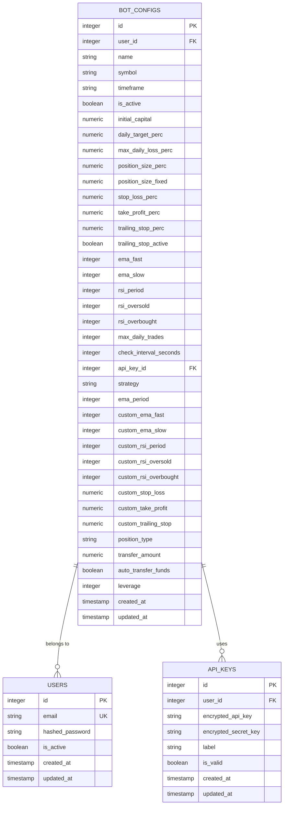
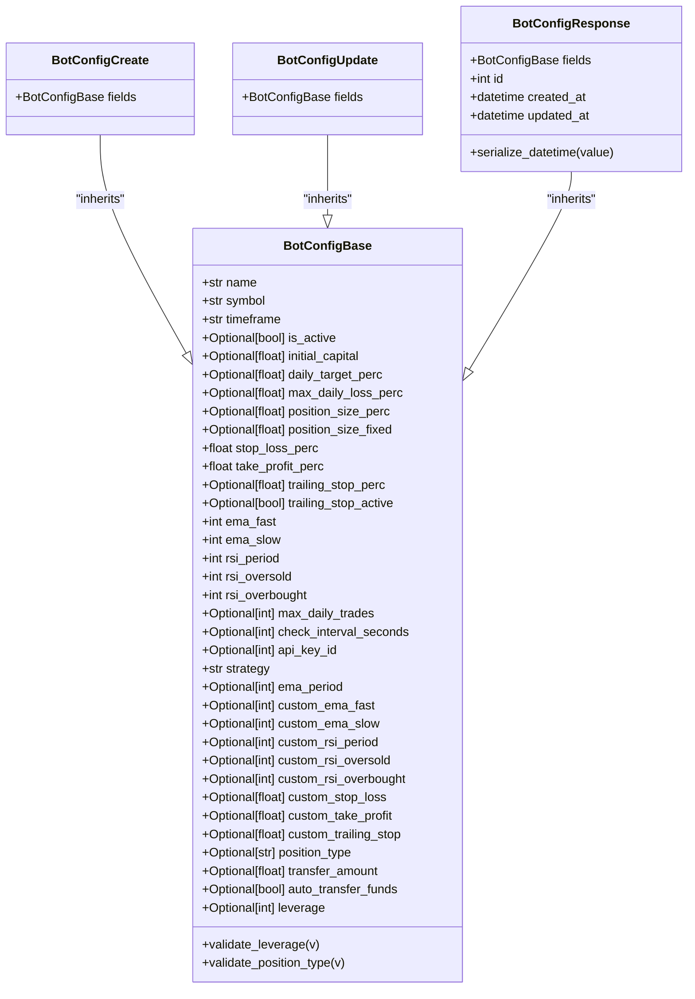
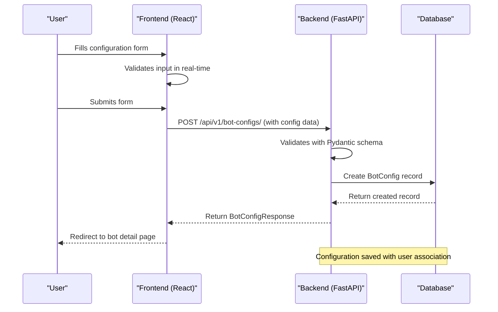
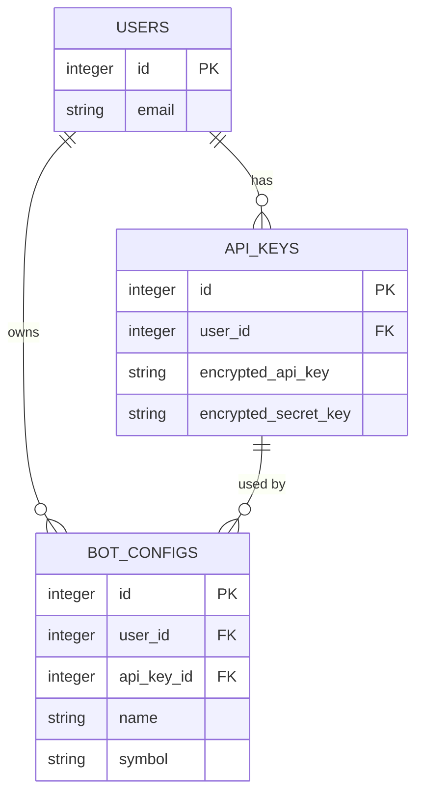

# Bot Configuration

<cite>
**Referenced Files in This Document**   
- [bot_config.py](file://app/models/bot_config.py)
- [bot_config.py](file://app/schemas/bot_config.py)
- [BotCreatePage.jsx](file://frontend/src/pages/Bots/BotCreatePage.jsx)
- [bot_config.py](file://app/api/routes/bot_config.py)
- [api.js](file://frontend/src/services/api.js)
</cite>

## Table of Contents
1. [Bot Configuration Overview](#bot-configuration-overview)
2. [Database Schema Definition](#database-schema-definition)
3. [Pydantic Validation Schemas](#pydantic-validation-schemas)
4. [Frontend Configuration Form](#frontend-configuration-form)
5. [API Integration and Data Flow](#api-integration-and-data-flow)
6. [Configuration Payload Examples](#configuration-payload-examples)
7. [API Key Integration](#api-key-integration)
8. [Default Values and Optional Parameters](#default-values-and-optional-parameters)

## Bot Configuration Overview

The bot configuration system enables users to create and manage trading bots with customizable parameters for different trading strategies, risk management settings, and market types. The system consists of a database model for storing bot configurations, Pydantic schemas for request validation, and a React frontend component for user interaction. The configuration process follows a multi-step form approach, guiding users through setting up their trading bots with real-time validation at each step.

**Section sources**
- [BotCreatePage.jsx](file://frontend/src/pages/Bots/BotCreatePage.jsx#L1-L800)

## Database Schema Definition

The `BotConfig` model in `app/models/bot_config.py` defines the database schema for storing bot configurations. This model includes fields for trading strategy parameters (EMA and RSI indicators), risk management settings (stop-loss, take-profit, trailing stop), position sizing, and market type (spot or futures). The schema is implemented using SQLAlchemy and includes relationships to user accounts and API keys.

Key fields in the database schema include:
- **Trading Strategy**: `ema_fast`, `ema_slow`, `rsi_period`, `rsi_oversold`, `rsi_overbought`
- **Risk Management**: `stop_loss_perc`, `take_profit_perc`, `trailing_stop_perc`, `trailing_stop_active`
- **Position Sizing**: `position_size_perc`, `position_size_fixed`
- **Market Type**: `position_type` (with values "spot" or "futures")
- **Leverage**: `leverage` (for futures trading)
- **Relationships**: `user_id` (foreign key to users), `api_key_id` (foreign key to API keys)

The model also includes timestamps for creation and updates, and relationships to associated entities such as the bot's state and trade history.



**Diagram sources **
- [bot_config.py](file://app/models/bot_config.py#L5-L59)

**Section sources**
- [bot_config.py](file://app/models/bot_config.py#L5-L59)

## Pydantic Validation Schemas

The Pydantic schemas in `app/schemas/bot_config.py` define the structure and validation rules for incoming requests to create and update bot configurations. The `BotConfigBase` class serves as the foundation, with `BotConfigCreate`, `BotConfigUpdate`, and `BotConfigResponse` classes extending it for specific use cases.

The validation system includes custom field validators for critical parameters:
- **Leverage validation**: Ensures the leverage value is within the 1-125 range, with appropriate error messages for out-of-range values
- **Position type validation**: Confirms that the position type is either "spot" or "futures"

The schemas also define default values for optional parameters, such as a default leverage of 10 and a default position type of "spot". The `BotConfigResponse` schema includes additional fields like `id`, `created_at`, and `updated_at` that are populated by the database but not required in creation requests.



**Diagram sources **
- [bot_config.py](file://app/schemas/bot_config.py#L5-L82)

**Section sources**
- [bot_config.py](file://app/schemas/bot_config.py#L5-L82)

## Frontend Configuration Form

The `BotCreatePage.jsx` component in the frontend implements a multi-step form for creating bot configurations. The form is divided into four logical sections: Basic Information, Technical Indicators, Risk Management, and Fund Management. Each step focuses on a specific aspect of the bot configuration, making the process more manageable for users.

The form uses React Hook Form for state management and validation, with real-time validation feedback displayed to users. Key features include:
- **Dynamic field visibility**: The leverage field is only shown when the user selects "futures" as the position type
- **Searchable symbol selection**: Users can search for trading pairs from a dynamically loaded list based on the selected market type
- **Step-by-step navigation**: Progress indicators show users their current position in the configuration process
- **Real-time validation**: Form fields display immediate feedback on input validity

The form collects all necessary configuration parameters and prepares them for submission to the backend API, handling data type conversions (e.g., parsing string inputs to numbers) before submission.

**Section sources**
- [BotCreatePage.jsx](file://frontend/src/pages/Bots/BotCreatePage.jsx#L1-L800)

## API Integration and Data Flow

The bot configuration system follows a clear data flow from the frontend form to the backend database. When a user submits the configuration form, the data is sent to the backend API endpoint defined in `app/api/routes/bot_config.py`. The API route `create_bot_config` handles the creation of new bot configurations, associating them with the authenticated user.

The data flow process is as follows:
1. User fills out the configuration form in the frontend
2. Form data is validated client-side using React Hook Form
3. Upon submission, the data is sent via POST request to `/api/v1/bot-configs/`
4. The backend validates the data using Pydantic schemas
5. A new `BotConfig` instance is created with the user's ID and configuration data
6. The configuration is saved to the database and returned to the frontend

The API also supports CRUD operations for existing configurations, allowing users to retrieve, update, and delete their bot configurations through corresponding endpoints.



**Diagram sources **
- [bot_config.py](file://app/api/routes/bot_config.py#L11-L17)
- [BotCreatePage.jsx](file://frontend/src/pages/Bots/BotCreatePage.jsx#L109-L153)
- [api.js](file://frontend/src/services/api.js#L309-L314)

**Section sources**
- [bot_config.py](file://app/api/routes/bot_config.py#L11-L17)
- [BotCreatePage.jsx](file://frontend/src/pages/Bots/BotCreatePage.jsx#L109-L153)
- [api.js](file://frontend/src/services/api.js#L309-L314)

## Configuration Payload Examples

### Valid Configuration Payload
```json
{
  "name": "BTC/USDT EMA RSI Bot",
  "symbol": "BTCUSDT",
  "timeframe": "1h",
  "is_active": false,
  "stop_loss_perc": 2.0,
  "take_profit_perc": 3.0,
  "ema_fast": 12,
  "ema_slow": 26,
  "rsi_period": 14,
  "rsi_oversold": 30,
  "rsi_overbought": 70,
  "max_daily_trades": 10,
  "check_interval_seconds": 60,
  "strategy": "ema_rsi",
  "custom_ema_fast": 8,
  "custom_ema_slow": 21,
  "custom_rsi_period": 7,
  "custom_rsi_oversold": 35,
  "custom_rsi_overbought": 65,
  "custom_stop_loss": 0.5,
  "custom_take_profit": 1.5,
  "custom_trailing_stop": 0.3,
  "position_type": "spot",
  "auto_transfer_funds": true,
  "leverage": 10
}
```

### Error Response for Invalid Leverage
```json
{
  "detail": "leverage 1-125 aralığında olmalıdır"
}
```

### Error Response for Invalid Position Type
```json
{
  "detail": "position_type 'spot' veya 'futures' olmalıdır"
}
```

### Error Response for Missing Required Field
```json
{
  "detail": "Bot adı gereklidir"
}
```

**Section sources**
- [bot_config.py](file://app/schemas/bot_config.py#L48-L62)
- [BotCreatePage.jsx](file://frontend/src/pages/Bots/BotCreatePage.jsx#L302-L304)

## API Key Integration

Bot configurations are securely linked to API keys through the `api_key_id` field in the `BotConfig` model. When a user creates a bot, they must have an API key configured in their account, which is automatically associated with the bot configuration. This relationship ensures that each bot operates with the appropriate trading permissions and credentials.

The integration works as follows:
1. The frontend checks if the user has an API key before allowing bot creation
2. If no API key exists, the user is prompted to create one
3. When creating a bot, the frontend includes the API key ID in the request
4. The backend associates the bot configuration with the specified API key
5. The bot uses these credentials when executing trades through the exchange API

This design separates API key management from bot configuration, allowing users to reuse the same API key across multiple bots while maintaining clear ownership and access controls.



**Diagram sources **
- [bot_config.py](file://app/models/bot_config.py#L30)
- [bot_config.py](file://app/models/api_key.py#L9)
- [BotCreatePage.jsx](file://frontend/src/pages/Bots/BotCreatePage.jsx#L64-L67)

**Section sources**
- [bot_config.py](file://app/models/bot_config.py#L30)
- [bot_config.py](file://app/models/api_key.py#L9)
- [BotCreatePage.jsx](file://frontend/src/pages/Bots/BotCreatePage.jsx#L64-L67)

## Default Values and Optional Parameters

The bot configuration system applies sensible default values for optional parameters to simplify the setup process for users. These defaults are defined in both the database model and the Pydantic schemas, ensuring consistency across the application.

Key default values include:
- **Leverage**: 10 (for futures trading)
- **Position type**: "spot" (default market type)
- **Auto transfer funds**: true (automatically transfer funds between spot and futures wallets)
- **Technical indicators**: Predefined values for EMA and RSI parameters (e.g., custom_ema_fast=8, custom_ema_slow=21)
- **Risk management**: Default values for stop-loss (0.5%), take-profit (1.5%), and trailing stop (0.3%)

Optional parameters that can be omitted by users include:
- `initial_capital`: If not specified, the bot uses the available balance
- `daily_target_perc`: No daily profit target
- `max_daily_loss_perc`: No daily loss limit
- `position_size_perc` and `position_size_fixed`: If not specified, the bot uses a default position sizing strategy
- `transfer_amount`: If not specified, the bot transfers the necessary amount for trading

These defaults and optional parameters allow users to start with a functional configuration while providing the flexibility to customize settings as needed.

**Section sources**
- [bot_config.py](file://app/models/bot_config.py#L35-L50)
- [bot_config.py](file://app/schemas/bot_config.py#L31-L46)