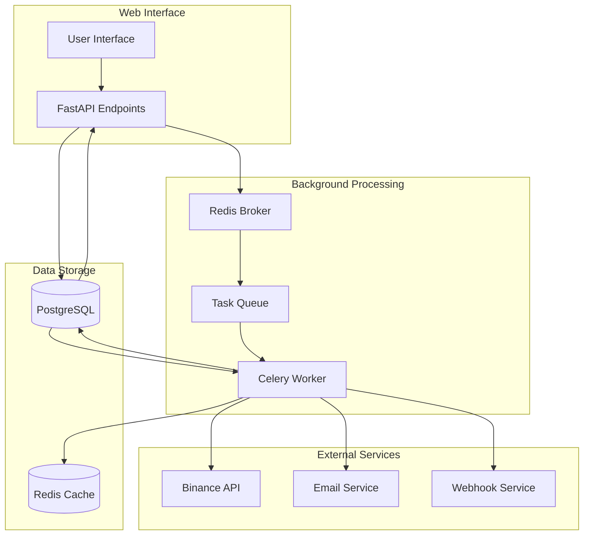

# Bot Execution Engine

<cite>
**Referenced Files in This Document**   
- [bot_tasks.py](file://app/core/bot_tasks.py)
- [bot_runner.py](file://app/api/routes/bot_runner.py)
- [tradebotctl.py](file://scripts/tradebotctl.py)
- [bot_config.py](file://app/models/bot_config.py)
- [bot_state.py](file://app/models/bot_state.py)
- [celery_app.py](file://app/core/celery_app.py)
</cite>

## Table of Contents
1. [Introduction](#introduction)
2. [Core Execution Flow](#core-execution-flow)
3. [run_bot_task Function Analysis](#run_bot_task-function-analysis)
4. [Concurrency Control and Database Locking](#concurrency-control-and-database-locking)
5. [Bot State Management](#bot-state-management)
6. [Strategy Implementation and Trading Logic](#strategy-implementation-and-trading-logic)
7. [Error Handling and Resilience](#error-handling-and-resilience)
8. [CLI Control with tradebotctl](#cli-control-with-tradebotctl)
9. [Demo Mode Simulation](#demo-mode-simulation)
10. [Architecture Overview](#architecture-overview)

## Introduction
The Bot Execution Engine is a critical component of the trading system that orchestrates automated trading strategies through Celery tasks. This engine processes active trading bots, retrieves market data, calculates technical indicators (EMA/RSI), and executes trades based on predefined strategy rules. The system employs robust concurrency control using database row locking to prevent race conditions during execution. The engine integrates with Binance API through secure credentials and implements comprehensive error handling to ensure reliable operation. The architecture combines web API endpoints for user interaction with background Celery workers for asynchronous task processing, enabling scalable and responsive trading operations.

**Section sources**
- [bot_tasks.py](file://app/core/bot_tasks.py#L1-L518)
- [bot_runner.py](file://app/api/routes/bot_runner.py#L1-L56)

## Core Execution Flow
The bot execution flow begins when a user initiates a bot through the web interface or CLI. The start_bot endpoint updates the bot's active state in the database and triggers a Celery task. The Celery worker then executes the run_bot_task function, which processes the trading logic for the specified bot configuration. The task retrieves the bot's configuration and API credentials, establishes a connection to the Binance exchange, and fetches the latest market data. It then calculates EMA and RSI indicators based on historical price data and evaluates trading signals according to the configured strategy. If a valid trading signal is detected and risk management conditions are satisfied, the system executes the appropriate market order. After each execution, the bot state is updated in the database, and relevant notifications are sent. The entire process is designed to run asynchronously, allowing multiple bots to operate concurrently without blocking the main application.

**Diagram sources**
- [bot_runner.py](file://app/api/routes/bot_runner.py#L13-L36)
- [bot_tasks.py](file://app/core/bot_tasks.py#L121-L518)

## run_bot_task Function Analysis
The run_bot_task function serves as the entry point for executing trading logic in the background. This Celery task, defined in bot_tasks.py, orchestrates the entire trading process by coordinating data retrieval, indicator calculation, strategy evaluation, and order execution. The function accepts a bot_config_id parameter that identifies which trading bot configuration to execute. It first retrieves the bot's configuration from the database, including trading parameters, strategy settings, and associated API credentials. After decrypting the API keys, it establishes a connection to the Binance exchange through the BinanceClientWrapper. The function then retrieves the latest market data for the configured symbol and timeframe, calculates EMA and RSI indicators using historical price data, and evaluates trading signals based on the configured strategy rules. Throughout execution, the function updates the bot's state in the database to reflect its current status and handles various error conditions gracefully.

**Section sources**
- [bot_tasks.py](file://app/core/bot_tasks.py#L121-L123)
- [bot_tasks.py](file://app/core/bot_tasks.py#L125-L518)

## Concurrency Control and Database Locking
The system implements robust concurrency control to prevent race conditions when multiple Celery workers attempt to execute the same bot simultaneously. This is achieved through database row-level locking using the `with_for_update(nowait=True)` method on the BotState table. When a worker begins processing a bot, it attempts to acquire an exclusive lock on the corresponding BotState record. If another worker has already locked the record, the operation immediately fails with an OperationalError, causing the current worker to skip execution and preventing duplicate trading activities. This approach ensures that each bot execution is atomic and isolated, maintaining data consistency and preventing over-trading. The locking mechanism is implemented in the _run_bot function, where the system queries for the BotState record with the FOR UPDATE clause, ensuring that no other transaction can modify the same row until the current transaction completes.

**Diagram sources**
- [bot_tasks.py](file://app/core/bot_tasks.py#L134-L144)

## Bot State Management
The system maintains comprehensive state information for each trading bot through the BotState model, which tracks the bot's operational status and performance metrics. The BotState table is linked to the BotConfig table via a one-to-one relationship, with the BotState.id serving as both a primary key and foreign key referencing the BotConfig.id. Key state attributes include the current status (e.g., "running", "stopped", "error"), position information (entry_price, in_position), risk management parameters (stop_loss_price, take_profit_price), and performance tracking (daily_pnl, daily_trades_count). The state is updated throughout the bot's lifecycle, from initialization through execution and error handling. When a bot is started via the start_bot endpoint, its state is set to "pending" before transitioning to "running" upon successful task execution. Daily performance metrics are reset by the reactivate_bots_after_reset Celery task, which runs at midnight UTC to prepare bots for the new trading day.

**Section sources**
- [bot_state.py](file://app/models/bot_state.py#L4-L22)
- [bot_tasks.py](file://app/core/bot_tasks.py#L86-L109)

## Strategy Implementation and Trading Logic
The trading engine supports multiple strategy implementations, with the primary strategy being the EMA/RSI combination. The strategy logic is implemented in the _run_bot function, where it calculates exponential moving averages (EMA) for fast and slow periods and the Relative Strength Index (RSI) based on historical price data. The EMA calculation uses the standard formula with a smoothing factor of 2/(period+1), while the RSI calculation follows the conventional methodology of comparing average gains to average losses over the specified period. Trading signals are generated when the fast EMA crosses above the slow EMA (for buy signals) or below (for sell signals), combined with RSI values indicating oversold or overbought conditions. The system incorporates comprehensive risk management, including stop-loss, take-profit, and trailing stop parameters, which are configured in the BotConfig model. Before executing any trade, the system validates that position sizing, daily trade limits, and profit/loss targets are within acceptable bounds.

**Diagram sources**
- [bot_tasks.py](file://app/core/bot_tasks.py#L251-L324)
- [bot_config.py](file://app/models/bot_config.py#L23-L27)

## Error Handling and Resilience
The bot execution engine incorporates comprehensive error handling to ensure reliable operation in the face of various failure scenarios. The system implements try-except blocks around critical operations such as API key decryption, Binance client initialization, market data retrieval, and order execution. When an error occurs, the bot's state is updated in the database to reflect the error condition, and detailed error messages are recorded for debugging purposes. For transient errors like network connectivity issues or rate limiting, the BinanceClientWrapper includes retry logic with exponential backoff to automatically recover from temporary failures. The system also handles concurrency conflicts through database row locking, gracefully skipping execution when another worker is already processing the same bot. Additionally, the engine validates all trading conditions before order submission, including position sizing, minimum notional requirements, and daily trading limits, preventing invalid trades that could result in errors or financial losses.

**Section sources**
- [bot_tasks.py](file://app/core/bot_tasks.py#L152-L185)
- [binance_client.py](file://app/core/binance_client.py#L74-L96)

## CLI Control with tradebotctl
The tradebotctl.py script provides command-line interface (CLI) control for managing the bot system, enabling automation and monitoring outside the web interface. This utility script offers several key commands for system administration, including manifest generation, package creation, system verification, and deployment updates. While primarily focused on system maintenance and deployment, the CLI tools complement the bot execution engine by ensuring the underlying infrastructure remains consistent and reliable. The script implements functionality for creating SHA-256 manifests of project files, verifying file integrity against these manifests, packaging the application for distribution, and updating installations from packages. These capabilities support automated deployment workflows and system integrity checks, which are essential for maintaining a stable trading environment. The CLI also includes repair functionality to restore missing or corrupted files, enhancing the system's resilience to deployment issues.

**Section sources**
- [tradebotctl.py](file://scripts/tradebotctl.py#L1-L458)

## Demo Mode Simulation
The system includes a demo mode that allows users to test trading strategies without executing real orders on the exchange. When demo mode is enabled, the bot execution engine simulates trading activities by generating fake market data and bypassing actual order placement. This is implemented in the _run_bot function, where a try-except block around the market data retrieval triggers demo mode when an exception is raised. In demo mode, the system creates randomized price data within a realistic range and proceeds with indicator calculations and strategy evaluation as in normal operation. However, instead of placing actual orders through the Binance API, the system logs simulated trading activities and updates the bot state accordingly. The bot's status is set to "running (demo mode)" to distinguish it from live trading, and no real funds are at risk. This feature enables users to validate their trading strategies, test configuration changes, and verify system behavior without financial exposure.

**Section sources**
- [bot_tasks.py](file://app/core/bot_tasks.py#L273-L279)
- [bot_tasks.py](file://app/core/bot_tasks.py#L318-L324)

## Architecture Overview
The bot execution engine follows a distributed architecture with clear separation between the web application layer and background task processing. The system is built on FastAPI for the REST API endpoints, Celery for asynchronous task execution, and PostgreSQL for persistent data storage. The architecture enables horizontal scaling of Celery workers to handle increased trading loads while maintaining responsive API endpoints. The core components include the bot_runner endpoints for state management, the bot_tasks module for trading logic execution, and the Celery task scheduler for periodic operations. Database models define the relationships between bots, their configurations, states, and trading history, ensuring data integrity through proper foreign key constraints and relationships. The system also integrates with Redis as a message broker for Celery, facilitating reliable task queuing and distribution among workers.

**Diagram sources**
- [celery_app.py](file://app/core/celery_app.py#L9-L14)
- [bot_runner.py](file://app/api/routes/bot_runner.py#L11-L12)
- [bot_tasks.py](file://app/core/bot_tasks.py#L24-L33)