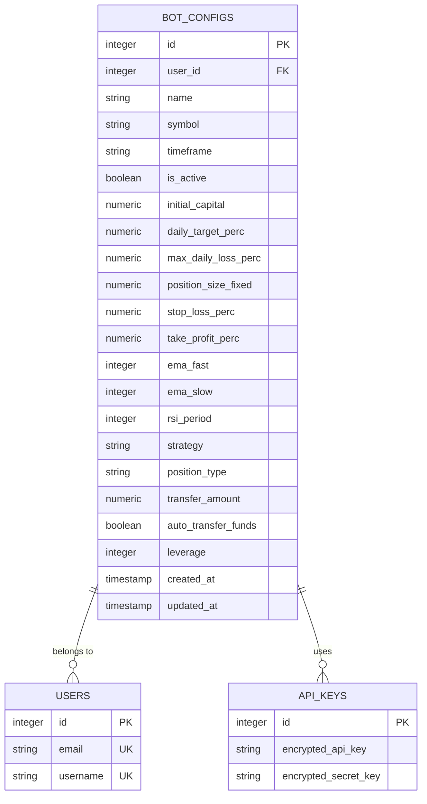
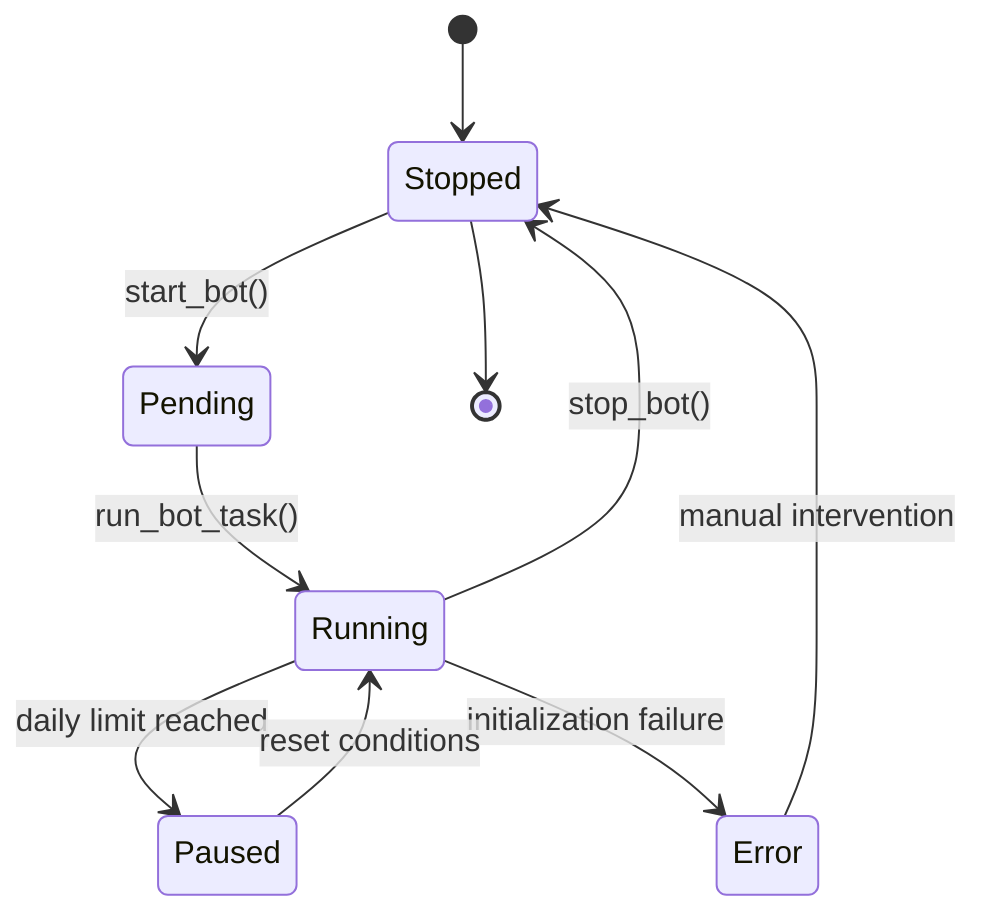
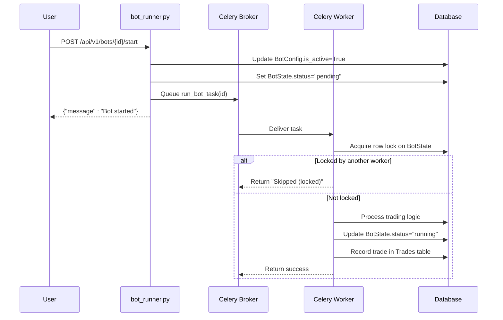
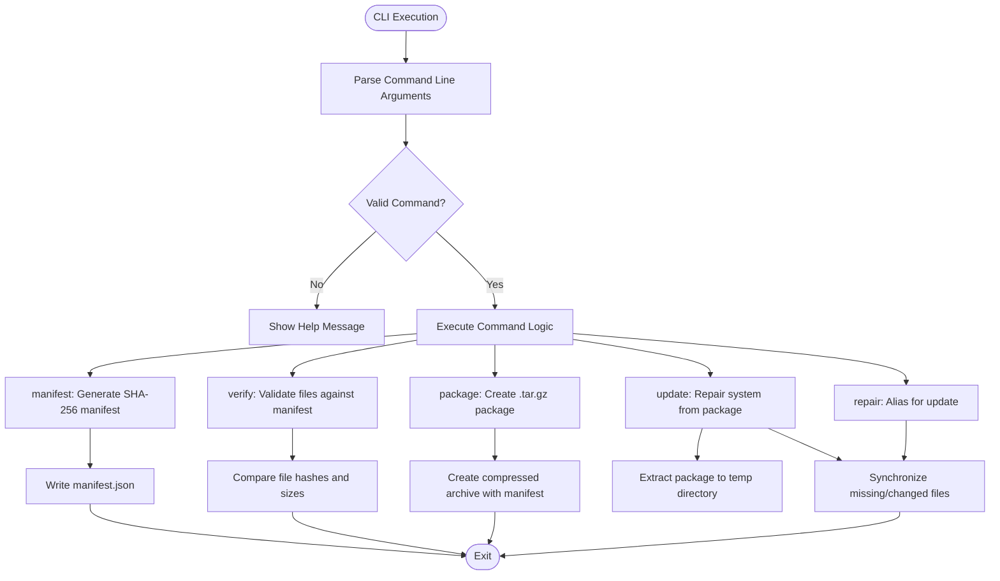
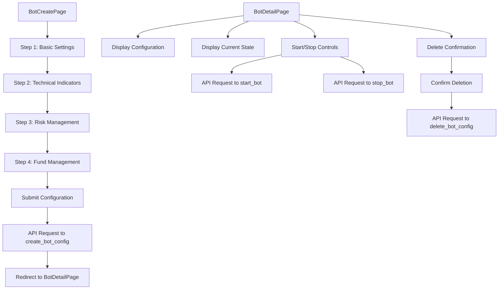

# Bot Lifecycle Management

<cite>
**Referenced Files in This Document**   
- [bot_config.py](file://app/api/routes/bot_config.py)
- [bot_runner.py](file://app/api/routes/bot_runner.py)
- [bot_tasks.py](file://app/core/bot_tasks.py)
- [tradebotctl.py](file://scripts/tradebotctl.py)
- [BotCreatePage.jsx](file://frontend/src/pages/Bots/BotCreatePage.jsx)
- [BotDetailPage.jsx](file://frontend/src/pages/Bots/BotDetailPage.jsx)
- [bot_config.py](file://app/models/bot_config.py)
- [bot_state.py](file://app/models/bot_state.py)
- [bot_config.py](file://app/schemas/bot_config.py)
- [celery_app.py](file://app/core/celery_app.py)
</cite>

## Table of Contents
1. [Introduction](#introduction)
2. [Bot Configuration Management](#bot-configuration-management)
3. [Bot State and Lifecycle Transitions](#bot-state-and-lifecycle-transitions)
4. [Bot Execution and Celery Task Management](#bot-execution-and-celery-task-management)
5. [CLI Control with tradebotctl.py](#cli-control-with-tradebotctlpy)
6. [Frontend Bot Management Interface](#frontend-bot-management-interface)
7. [Error Handling and Graceful Shutdown](#error-handling-and-graceful-shutdown)
8. [Performance Considerations](#performance-considerations)
9. [Conclusion](#conclusion)

## Introduction
The TradeBot system provides a comprehensive framework for managing automated trading bots throughout their lifecycle. This document details the implementation of bot creation, configuration, activation, monitoring, and termination processes. The system leverages FastAPI for REST endpoints, SQLAlchemy for data persistence, Celery for asynchronous task execution, and React for the frontend interface. Key components include CRUD operations for bot configurations, state management for lifecycle transitions, and Celery tasks for executing trading logic independently of HTTP requests.

## Bot Configuration Management

The bot configuration system implements CRUD operations through the `bot_config.py` API routes, enabling users to create, read, update, and delete bot configurations. Each bot configuration is persisted as a record in the database through SQLAlchemy models, with validation enforced by Pydantic schemas.

The `BotConfig` model defines the structure of bot configurations with fields for trading parameters including symbol, timeframe, strategy type, and risk management settings. The model establishes relationships with user accounts and maintains references to API keys for exchange authentication. Configuration validation occurs at multiple levels: Pydantic schemas validate input data types and constraints, while database constraints ensure referential integrity.

**Diagram sources**
- [bot_config.py](file://app/models/bot_config.py#L5-L59)
- [bot_config.py](file://app/schemas/bot_config.py#L5-L82)

**Section sources**
- [bot_config.py](file://app/api/routes/bot_config.py#L1-L54)
- [bot_config.py](file://app/models/bot_config.py#L1-L59)
- [bot_config.py](file://app/schemas/bot_config.py#L1-L82)

## Bot State and Lifecycle Transitions

The bot lifecycle is managed through state transitions handled by `bot_runner.py` and persisted in the database via the `BotState` model. The system implements a finite state machine with states including "stopped", "pending", "running", "paused", and "error". State transitions occur in response to user actions and automated processes.

When a bot is started, the system updates the `is_active` flag in the `BotConfig` model and sets the status to "pending" in the associated `BotState` record. The system then triggers a Celery task to execute the trading logic. When a bot is stopped, the `is_active` flag is set to false and the status is updated to "stopped". The state model also tracks runtime metrics including daily PnL, trade count, and error messages.

**Diagram sources**
- [bot_runner.py](file://app/api/routes/bot_runner.py#L1-L56)
- [bot_state.py](file://app/models/bot_state.py#L1-L24)

**Section sources**
- [bot_runner.py](file://app/api/routes/bot_runner.py#L1-L56)
- [bot_state.py](file://app/models/bot_state.py#L1-L24)
- [bot_state.py](file://app/schemas/bot_state.py#L1-L35)

## Bot Execution and Celery Task Management

Trading logic execution is handled by Celery tasks defined in `bot_tasks.py`, which run independently of HTTP requests to ensure responsive user interfaces and reliable background processing. The system uses Celery with Redis as the message broker to manage task queues and ensure fault tolerance.

The primary task `run_bot_task` executes the trading strategy, including market data retrieval, signal generation, and order execution. To prevent race conditions during concurrent bot starts, the system implements database row-level locking using `with_for_update(nowait=True)`. If a bot is already being processed by another worker, subsequent attempts will be skipped with a "Skipped (locked)" status.

**Diagram sources**
- [bot_tasks.py](file://app/core/bot_tasks.py#L1-L518)
- [celery_app.py](file://app/core/celery_app.py#L1-L43)

**Section sources**
- [bot_tasks.py](file://app/core/bot_tasks.py#L1-L518)
- [celery_app.py](file://app/core/celery_app.py#L1-L43)

## CLI Control with tradebotctl.py

The `tradebotctl.py` script provides command-line interface control for bot operations, enabling system administrators and advanced users to manage the application outside the web interface. The tool supports operations including manifest generation, file verification, packaging, and system updates.

The CLI implements a modular command structure with subcommands for different operations. It uses Python's argparse library for argument parsing and provides both human-readable and JSON output formats. The tool can verify system integrity by comparing file hashes against a manifest, update systems from packages, and repair corrupted installations.

**Diagram sources**
- [tradebotctl.py](file://scripts/tradebotctl.py#L1-L458)

**Section sources**
- [tradebotctl.py](file://scripts/tradebotctl.py#L1-L458)

## Frontend Bot Management Interface

The frontend interface enables users to create and manage bots through React components `BotCreatePage.jsx` and `BotDetailPage.jsx`. The interface provides a multi-step form for configuring bots with EMA/RSI parameters and displays real-time status information.

The `BotCreatePage` component guides users through a four-step configuration process: basic settings, technical indicators, risk management, and fund management. It includes validation for all required fields and provides contextual help for advanced parameters. The `BotDetailPage` displays comprehensive information about a bot's configuration and current state, with controls for starting, stopping, and deleting bots.

**Diagram sources**
- [BotCreatePage.jsx](file://frontend/src/pages/Bots/BotCreatePage.jsx#L1-L800)
- [BotDetailPage.jsx](file://frontend/src/pages/Bots/BotDetailPage.jsx#L1-L711)

**Section sources**
- [BotCreatePage.jsx](file://frontend/src/pages/Bots/BotCreatePage.jsx#L1-L800)
- [BotDetailPage.jsx](file://frontend/src/pages/Bots/BotDetailPage.jsx#L1-L711)

## Error Handling and Graceful Shutdown

The system implements comprehensive error handling to manage failed initialization and ensure graceful shutdown procedures. When bot initialization fails due to missing API keys or Binance client errors, the system updates the `BotState` with appropriate error messages and status codes.

For graceful shutdown, the system relies on Celery's task acknowledgment settings (`task_acks_late=True`) which ensure that tasks are only acknowledged after completion. This prevents task loss during worker shutdown. The `reactivate_bots_after_reset` task runs daily at UTC midnight to reset bot states and reactivate paused bots, ensuring that daily limits do not permanently disable trading strategies.

The system also handles race conditions through database row-level locking in the `_run_bot` function. When multiple workers attempt to process the same bot simultaneously, only one can acquire the lock while others are gracefully skipped. This prevents duplicate trading signals and order conflicts.

**Section sources**
- [bot_tasks.py](file://app/core/bot_tasks.py#L1-L518)
- [bot_runner.py](file://app/api/routes/bot_runner.py#L1-L56)

## Performance Considerations

Managing multiple active bots requires careful resource utilization planning. The system implements several performance optimizations to handle concurrent bot operations efficiently. Celery's worker prefetch multiplier is set to 1 to prevent workers from prefetching too many tasks, which could lead to uneven load distribution and resource exhaustion.

Each bot execution is designed to be stateless and idempotent, allowing for horizontal scaling of Celery workers. The system uses database connections efficiently through connection pooling, and the `SyncSessionLocal` session factory ensures proper session management. For high-frequency trading strategies, the check interval can be configured down to 30 seconds, balancing responsiveness with API rate limit considerations.

The daily reset task `reactivate_bots_after_reset` runs at low market activity periods (UTC midnight) to minimize impact on trading performance. The system also implements daily trade limits, profit targets, and loss limits to prevent excessive trading activity and potential resource overutilization during volatile market conditions.

**Section sources**
- [bot_tasks.py](file://app/core/bot_tasks.py#L1-L518)
- [celery_app.py](file://app/core/celery_app.py#L1-L43)

## Conclusion

The TradeBot system provides a robust framework for managing the complete bot lifecycle from creation through termination. By separating concerns between configuration management, state tracking, and execution logic, the system ensures reliability and scalability. The integration of FastAPI, SQLAlchemy, Celery, and React creates a cohesive architecture that supports both user-friendly interfaces and reliable background processing. Key features including race condition prevention, comprehensive error handling, and performance optimizations make the system suitable for production trading environments.