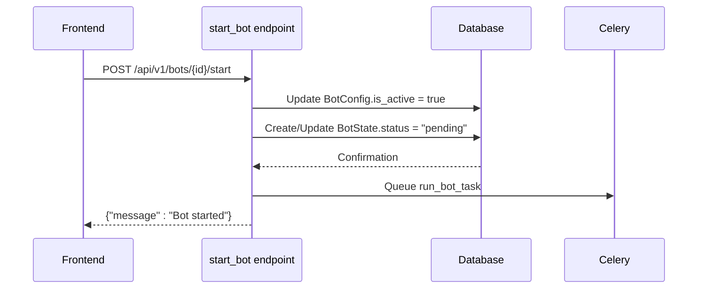
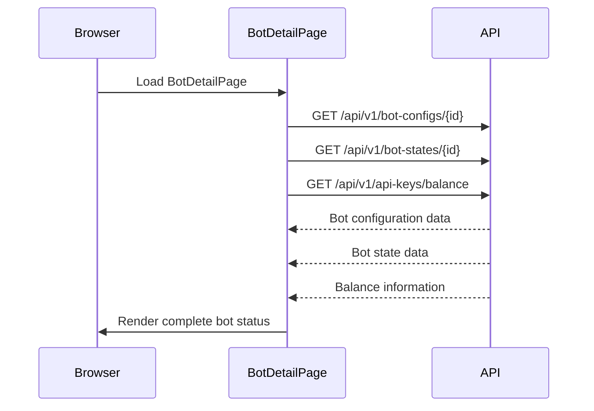

# Bot State Management

<cite>
**Referenced Files in This Document**   
- [BotState.py](file://app/models/bot_state.py)
- [bot_runner.py](file://app/api/routes/bot_runner.py)
- [bot_tasks.py](file://app/core/bot_tasks.py)
- [BotDetailPage.jsx](file://frontend/src/pages/Bots/BotDetailPage.jsx)
- [bot_state.py](file://app/schemas/bot_state.py)
</cite>

## Table of Contents
1. [Introduction](#introduction)
2. [BotState Model Structure](#botstate-model-structure)
3. [State Lifecycle and Transitions](#state-lifecycle-and-transitions)
4. [Daily Reset Mechanism](#daily-reset-mechanism)
5. [Frontend Integration and Real-Time Updates](#frontend-integration-and-real-time-updates)
6. [Error Handling and Failed Initializations](#error-handling-and-failed-initializations)
7. [Conclusion](#conclusion)

## Introduction
The BotState model serves as the central runtime tracking mechanism for trading bots within the system. It maintains execution context, performance metrics, and operational status throughout a bot's lifecycle. This document details how the BotState model tracks runtime information, how state transitions are managed through API endpoints and background tasks, and how this information is presented to users via the frontend interface. The system ensures accurate state representation while preserving configuration data across execution cycles.

## BotState Model Structure
The BotState model is designed to capture both operational status and performance metrics during bot execution. It is tightly coupled with the BotConfig model through a one-to-one relationship, using the bot configuration ID as its primary key.

Key fields in the BotState model include:
- **status**: Current operational state (pending, running, stopped, error)
- **daily_pnl**: Daily profit and loss tracking with default value of 0.0
- **daily_trades_count**: Counter for trades executed within the current day
- **last_run_at**: Timestamp of the most recent execution attempt
- **last_error_message**: Error details when execution fails
- **last_updated_at**: Automatic timestamp updated on every modification

The model also tracks position-specific data such as entry price, position size, and stop-loss/take-profit levels, enabling comprehensive monitoring of active trading positions.

**Section sources**
- [bot_state.py](file://app/models/bot_state.py#L4-L22)
- [bot_state.py](file://app/schemas/bot_state.py#L5-L18)

## State Lifecycle and Transitions
The bot state lifecycle is managed through coordinated interactions between API endpoints and background tasks. State transitions follow a well-defined sequence that ensures consistency between the user interface, database state, and execution engine.

### Initialization Process
When a user initiates a bot through the `start_bot` endpoint, the following sequence occurs:
1. The BotConfig's `is_active` flag is set to true
2. If no BotState exists, a new record is created with status "pending"
3. If BotState already exists, its status is updated to "pending"
4. A Celery task is queued for asynchronous execution



**Diagram sources**
- [bot_runner.py](file://app/api/routes/bot_runner.py#L13-L35)

### Execution Engine Updates
Once the Celery task begins execution, the state transitions from "pending" to "running" or "error" based on initialization outcomes:
- Successful initialization sets status to "running"
- Failed initialization (e.g., API key issues, connection problems) sets status to an error state with descriptive message
- The `last_updated_at` field is automatically updated on each state change

The execution engine also updates performance metrics during operation, incrementing `daily_trades_count` and adjusting `daily_pnl` based on realized profits and losses from completed trades.

**Section sources**
- [bot_runner.py](file://app/api/routes/bot_runner.py#L13-L35)
- [bot_tasks.py](file://app/core/bot_tasks.py#L126-L517)

## Daily Reset Mechanism
The system implements a daily reset task that clears performance counters while preserving configuration and state integrity. This scheduled task runs daily to ensure fresh metrics tracking for each trading day.

The reset process performs the following operations:
- Resets `daily_trades_count` to 0 for all bot states
- Resets `daily_pnl` to 0.0 for all bot states
- Clears `last_error_message` from all bot states
- Sets status to "stopped" for all bot states
- Reactivates any inactive bots that were paused due to daily limits

This mechanism ensures that daily performance metrics start fresh each day while maintaining the bot's configuration and allowing for continuous operation across days.

```mermaid
flowchart TD
A[Daily Reset Task] --> B[Reset daily_trades_count to 0]
A --> C[Reset daily_pnl to 0.0]
A --> D[Clear last_error_message]
A --> E[Set status to "stopped"]
A --> F[Reactivate paused bots]
B --> G[Commit changes to database]
C --> G
D --> G
E --> G
F --> G
```

**Diagram sources**
- [bot_tasks.py](file://app/core/bot_tasks.py#L79-L108)

**Section sources**
- [bot_tasks.py](file://app/core/bot_tasks.py#L79-L108)

## Frontend Integration and Real-Time Updates
The frontend interface provides real-time monitoring of bot state through the BotDetailPage component, which polls and displays current state information including performance metrics and error messages.

### State Display Logic
The frontend implements a comprehensive state display system that translates backend status values into user-friendly labels:
- "running" → "Çalışıyor" (Running)
- "stopped" → "Durdurulmuş" (Stopped)
- "error" → "Hata" (Error)
- "waiting" → "Bekliyor" (Waiting)
- "pending" → "Başlatılıyor" (Starting)

Visual indicators use color coding to convey status at a glance:
- Green for running/active states
- Gray for stopped/inactive states
- Red for error states
- Blue for pending/initializing states
- Yellow for waiting states

### Polling Mechanism
The BotDetailPage component uses React useEffect hooks to fetch bot data on initialization and after state-changing actions. It retrieves both the BotConfig and BotState information, handling cases where BotState may not yet exist (when a bot has never been started).

The component also implements error handling for API responses, redirecting users when bot configurations are not found and displaying appropriate error messages for other issues.



**Diagram sources**
- [BotDetailPage.jsx](file://frontend/src/pages/Bots/BotDetailPage.jsx#L20-L40)

**Section sources**
- [BotDetailPage.jsx](file://frontend/src/pages/Bots/BotDetailPage.jsx#L20-L40)
- [BotDetailPage.jsx](file://frontend/src/pages/Bots/BotDetailPage.jsx#L381-L399)

## Error Handling and Failed Initializations
The system implements robust error handling for failed bot initializations, ensuring that users receive meaningful feedback about issues preventing successful execution.

When initialization fails, the execution engine updates the BotState with:
- Appropriate error status (e.g., "error (api key decrypt failed)")
- Detailed error message in the `last_error_message` field
- Updated `last_updated_at` timestamp

Common failure scenarios include:
- Invalid or missing API keys
- API key decryption failures
- Binance client initialization errors
- Price data retrieval failures

The frontend displays these error messages prominently, allowing users to diagnose and resolve issues. The system preserves error state until the next start attempt, providing persistent visibility into the root cause of failures.

**Section sources**
- [bot_tasks.py](file://app/core/bot_tasks.py#L157-L163)
- [BotDetailPage.jsx](file://frontend/src/pages/Bots/BotDetailPage.jsx#L280-L290)

## Conclusion
The BotState management system provides a comprehensive framework for tracking bot runtime status, performance metrics, and execution context. Through well-defined state transitions, daily reset mechanisms, and tight integration between backend and frontend components, the system ensures reliable monitoring and control of trading bots. The design preserves configuration data while allowing for fresh daily metrics tracking, and provides clear error reporting to facilitate troubleshooting. This architecture supports both operational reliability and user transparency in bot management.