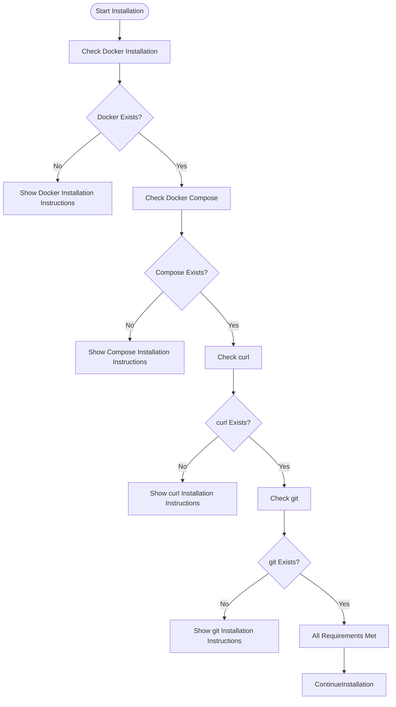
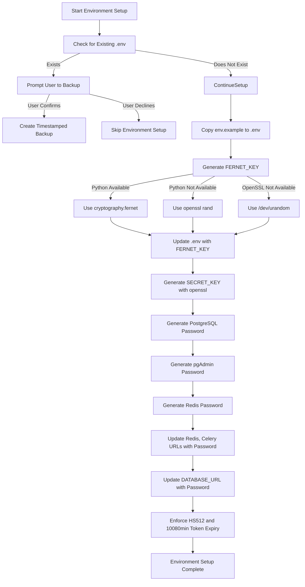
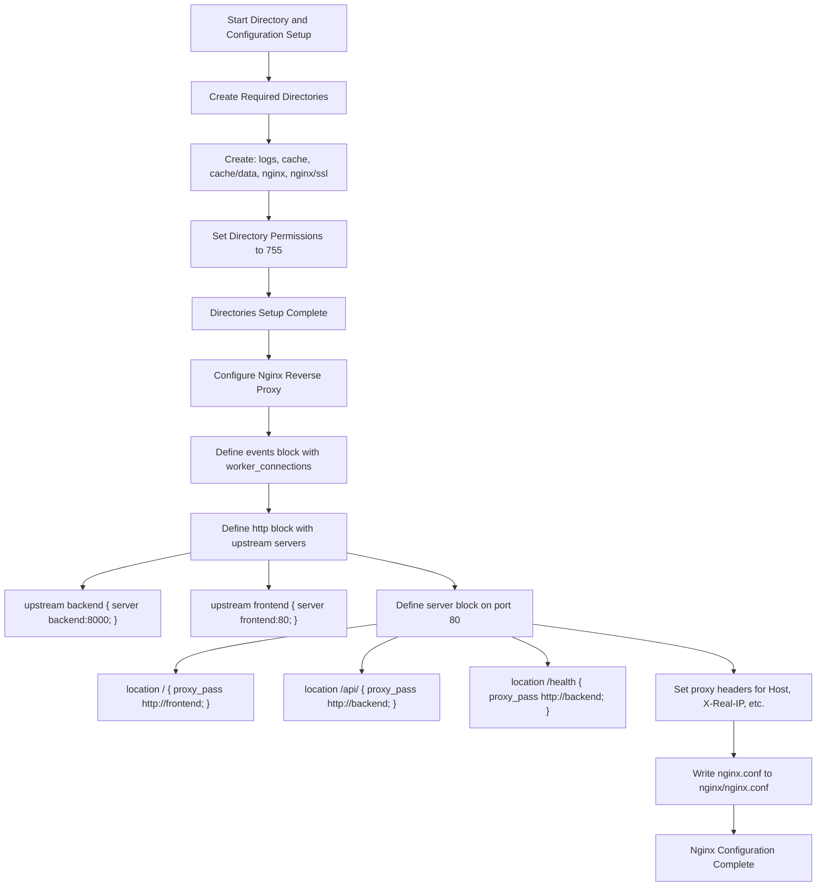
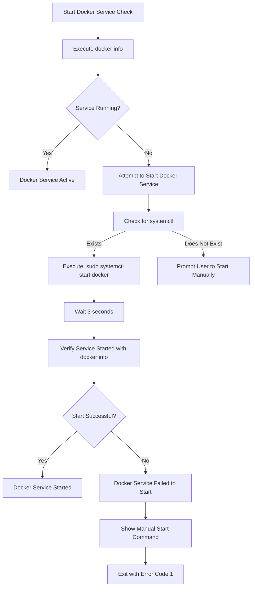
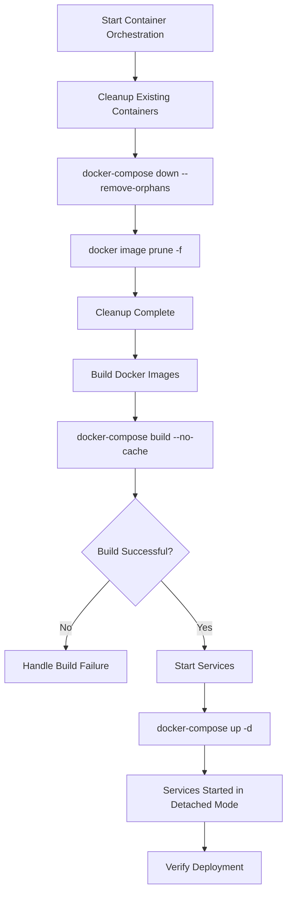
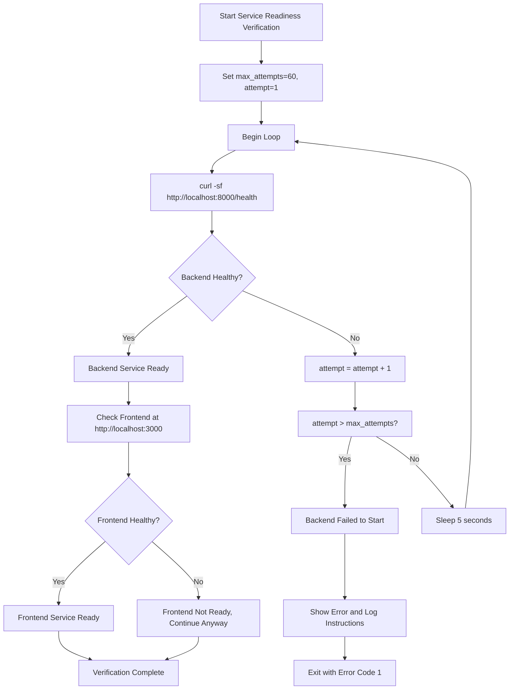
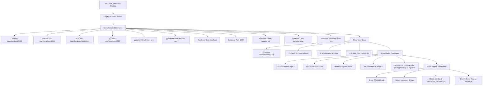

# Command-Line Installation

<cite>
**Referenced Files in This Document**   
- [install.sh](file://install.sh)
- [env.example](file://env.example)
- [docker-compose.yml](file://docker-compose.yml)
- [nginx.conf](file://nginx.conf)
- [WSL_DOCKER_KURULUM_REHBERI.md](file://WSL_DOCKER_KURULUM_REHBERI.md)
- [SECURE_INSTALL.md](file://SECURE_INSTALL.md)
- [installer/preflight_check.py](file://installer/preflight_check.py)
</cite>

## Table of Contents
1. [Introduction](#introduction)
2. [System Requirements Check](#system-requirements-check)
3. [Environment File Setup](#environment-file-setup)
4. [Directory and Configuration Setup](#directory-and-configuration-setup)
5. [Docker Service Management](#docker-service-management)
6. [Container Orchestration Workflow](#container-orchestration-workflow)
7. [Service Readiness Verification](#service-readiness-verification)
8. [Final Configuration and Access Information](#final-configuration-and-access-information)
9. [Platform-Specific Considerations](#platform-specific-considerations)
10. [Troubleshooting Guide](#troubleshooting-guide)

## Introduction
The `install.sh` script provides an automated installation process for the TradeBot application, handling all necessary setup steps from system validation to service orchestration. This document details the complete execution flow of the installation process, covering system requirement checks, secure environment configuration, directory setup, Nginx reverse proxy configuration, and Docker container orchestration. The script ensures a consistent and secure deployment across different operating systems while providing comprehensive feedback and error handling throughout the installation process.

## System Requirements Check
The installation process begins with a comprehensive system requirements validation to ensure all necessary tools are available before proceeding. The script checks for the presence of Docker, Docker Compose, curl, and git, which are essential for the application's containerized deployment and dependency management.

The validation process uses the `command_exists()` function to verify each required component. For Docker Compose, the script checks both the modern `docker compose` syntax (V2) and the legacy `docker-compose` command to ensure compatibility across different Docker installations. If any requirements are missing, the script provides platform-specific installation instructions for Ubuntu/Debian, Arch Linux, and macOS using their respective package managers.

**Diagram sources**
- [install.sh](file://install.sh#L58-L124)

**Section sources**
- [install.sh](file://install.sh#L58-L124)
- [installer/preflight_check.py](file://installer/preflight_check.py#L28-L39)

## Environment File Setup
The script automatically generates a secure `.env` file by copying the `env.example` template and populating it with cryptographically secure random values for all sensitive configuration parameters. This process ensures that default or weak credentials are never used in the deployment.

The environment setup begins by checking for an existing `.env` file. If found, the user is prompted to backup and overwrite it, preserving the ability to maintain custom configurations while allowing for safe regeneration of security credentials. The script then proceeds to generate the following secure values:

- **FERNET_KEY**: Generated using Python's cryptography library if available, with fallbacks to openssl and /dev/urandom
- **SECRET_KEY**: Created using openssl rand -hex 32 for 256-bit security
- **PostgreSQL Password**: Generated with openssl and filtered to ensure compatibility
- **pgAdmin Password**: Created with similar security measures but shorter length
- **Redis Password**: Generated and used to update all Redis-related URLs in the configuration

The script also enforces strong security settings by updating JWT configuration to use HS512 algorithm and setting token expiration to 10080 minutes (7 days).

**Diagram sources**
- [install.sh](file://install.sh#L126-L209)
- [env.example](file://env.example)

**Section sources**
- [install.sh](file://install.sh#L126-L209)
- [SECURE_INSTALL.md](file://SECURE_INSTALL.md#L10-L22)
- [env.example](file://env.example)

## Directory and Configuration Setup
The installation script creates the necessary directory structure for application data persistence and configures the Nginx reverse proxy to handle frontend and backend routing. This ensures proper separation of concerns and enables the application to serve both the user interface and API endpoints through a unified entry point.

The directory creation process establishes the following structure:
- `logs`: For application and service logs
- `cache`: For temporary data storage
- `cache/data`: Subdirectory for cache data
- `nginx`: For Nginx configuration files
- `nginx/ssl`: For SSL certificates (future HTTPS support)

The Nginx configuration is generated to create a reverse proxy that routes requests based on URL patterns:
- Root path (/) is proxied to the frontend service
- API path (/api/) is proxied to the backend service
- Health check endpoint (/health) is proxied to the backend

This configuration enables clean separation between the user interface and API while providing a single entry point for all application traffic.

**Diagram sources**
- [install.sh](file://install.sh#L211-L279)
- [nginx.conf](file://nginx.conf)

**Section sources**
- [install.sh](file://install.sh#L211-L279)
- [nginx.conf](file://nginx.conf)

## Docker Service Management
The installation process includes comprehensive Docker service management to ensure the Docker daemon is running before attempting to orchestrate containers. This step is critical for environments where Docker may not be automatically started or where the service has been stopped.

The script checks Docker service status using `docker info` command. If the service is not running, it attempts to start it using systemctl on Linux systems. The script handles both successful startup and failure scenarios, providing appropriate feedback and exit conditions. On non-systemd systems, it prompts the user to manually start the Docker service.

This service management capability enhances the robustness of the installation process, particularly in automated deployment scenarios or on systems where Docker is not configured to start automatically with the operating system.

**Diagram sources**
- [install.sh](file://install.sh#L281-L306)

**Section sources**
- [install.sh](file://install.sh#L281-L306)

## Container Orchestration Workflow
The container orchestration workflow handles the complete lifecycle of Docker containers, from cleanup of existing deployments to building and starting the new services. This ensures a clean and consistent deployment environment while leveraging Docker's containerization benefits.

The workflow begins with cleanup of any existing containers using `docker-compose down --remove-orphans`, which stops and removes containers defined in the compose file along with any orphaned containers. It also prunes dangling images to free up disk space.

The build process uses `docker-compose build --no-cache` to ensure fresh images are created without relying on potentially outdated cache layers. This guarantees that the latest code and dependencies are included in the container images. After successful builds, the services are started in detached mode using `docker-compose up -d`, allowing them to run in the background.

The Docker Compose configuration defines multiple services including PostgreSQL, Redis, backend API, Celery workers, frontend, Nginx reverse proxy, and pgAdmin, each with appropriate configurations for production deployment.

**Diagram sources**
- [install.sh](file://install.sh#L308-L332)
- [docker-compose.yml](file://docker-compose.yml)

**Section sources**
- [install.sh](file://install.sh#L308-L332)
- [docker-compose.yml](file://docker-compose.yml)

## Service Readiness Verification
After starting the services, the installation process verifies their readiness by performing health checks on the backend API endpoint. This ensures that the application is fully operational before presenting completion information to the user.

The verification process uses a polling mechanism that attempts to connect to the backend health endpoint at `http://localhost:8000/health` every 5 seconds, with a maximum of 60 attempts (5 minutes total). This generous timeout accommodates slower systems or containers that take time to initialize, particularly database migrations and application startup.

If the backend becomes responsive within the timeout period, the script proceeds to check the frontend service. Even if the frontend is not immediately available, the installation continues since the backend is the critical component for API functionality. This approach provides a balance between thorough verification and reasonable installation time.

**Diagram sources**
- [install.sh](file://install.sh#L334-L365)

**Section sources**
- [install.sh](file://install.sh#L334-L365)

## Final Configuration and Access Information
Upon successful installation, the script displays comprehensive final configuration and access information to guide the user through post-installation steps and system interaction. This information includes URLs for accessing different components, credential details, and useful management commands.

The final output provides:
- Frontend access at http://localhost:3000
- Backend API access at http://localhost:8000
- API documentation at http://localhost:8000/docs
- pgAdmin database management at http://localhost:5050 with email and password
- PostgreSQL connection details including host, port, database, username, and password
- Next steps for using the application
- Useful Docker commands for managing the services

This comprehensive summary ensures users have all necessary information to begin using the application immediately after installation, reducing the need to consult additional documentation for basic operations.

**Diagram sources**
- [install.sh](file://install.sh#L367-L408)

**Section sources**
- [install.sh](file://install.sh#L367-L408)

## Platform-Specific Considerations
The installation process includes specific considerations for different operating systems, with detailed guidance for Windows Subsystem for Linux (WSL) environments provided in the WSL_DOCKER_KURULUM_REHBERI.md document.

For WSL environments, the guide covers:
- Complete WSL installation and troubleshooting for registry errors
- Docker Desktop installation with WSL2 backend configuration
- Project setup within the WSL environment
- Common troubleshooting for Docker startup issues, WSL connectivity problems, and port conflicts

The document provides step-by-step instructions for resolving common issues such as Docker not being recognized, WSL registration errors, and TPM (Trusted Platform Module) problems that can prevent WSL2 from functioning properly. It includes PowerShell commands for system repair, WSL management, and TPM troubleshooting.

For Linux systems, the script provides apt and pacman package manager commands for installing dependencies. For macOS, it recommends using Homebrew. The installation process is designed to be consistent across platforms while accounting for their specific requirements and potential issues.

**Section sources**
- [WSL_DOCKER_KURULUM_REHBERI.md](file://WSL_DOCKER_KURULUM_REHBERI.md)
- [install.sh](file://install.sh#L103-L118)

## Troubleshooting Guide
The installation script and related documentation provide comprehensive troubleshooting guidance for common issues that may occur during or after the installation process.

### Common Errors and Resolutions

**Permission Issues**: When running the script, users are warned if executing as root, which is not recommended. File permissions are set appropriately for created directories (755 for logs and cache).

**Missing Dependencies**: If system requirements are not met, the script provides platform-specific installation commands and exits with an error code, preventing incomplete installations.

**Docker Service Failures**: The script attempts to start the Docker service automatically on Linux systems using systemctl. If this fails, it provides the manual command for users to start Docker themselves.

**Container Startup Issues**: The cleanup process removes existing containers before starting new ones, preventing conflicts from previous installations. The script also prunes dangling images to free up resources.

**Port Conflicts**: The docker-compose.yml file exposes standard ports (80, 443, 8000, 3000, 5432, 6379, 5050). If these ports are already in use, the docker-compose logs command can help identify the issue, and ports can be modified in the compose file.

### Health Check and Monitoring
The system includes multiple health check mechanisms:
- Docker Compose health checks for each service
- HTTP health endpoint at /health for the backend
- Docker stats for monitoring resource usage
- Comprehensive logging accessible via docker-compose logs

### Security Considerations
The installation process emphasizes security by:
- Generating cryptographically secure random passwords and keys
- Using environment variables for sensitive data
- Setting appropriate file permissions
- Enforcing strong JWT settings
- Isolating services within a dedicated Docker network

The SECURE_INSTALL.md document provides additional security hardening measures, including non-root container execution, privilege dropping, read-only filesystems, and regular password rotation procedures.

**Section sources**
- [install.sh](file://install.sh)
- [WSL_DOCKER_KURULUM_REHBERI.md](file://WSL_DOCKER_KURULUM_REHBERI.md)
- [SECURE_INSTALL.md](file://SECURE_INSTALL.md)
- [docker-compose.yml](file://docker-compose.yml)