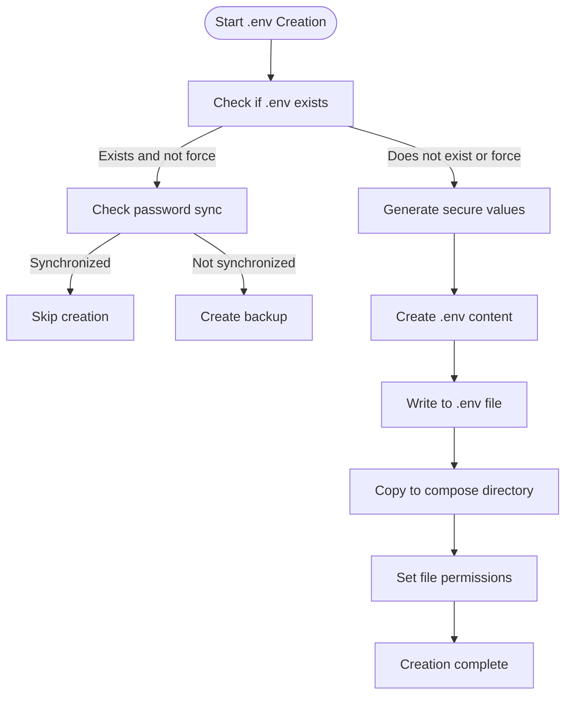
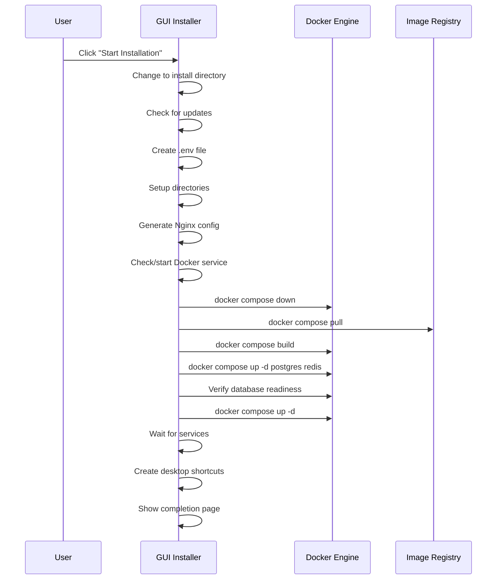
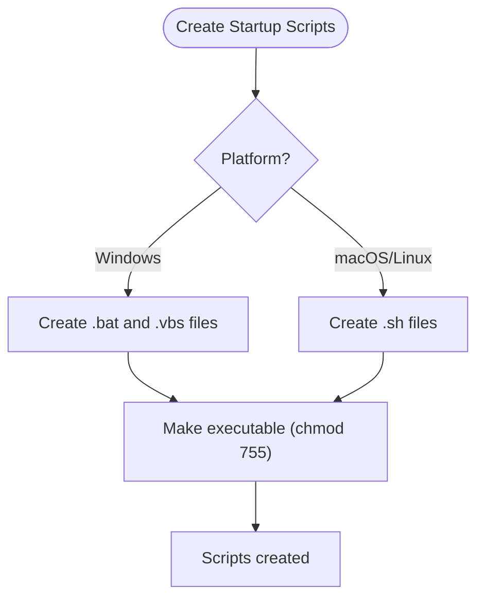

# GUI-Based Installation

<cite>
**Referenced Files in This Document**   
- [main.py](file://installer/main.py)
- [preflight_check.py](file://installer/preflight_check.py)
- [build.sh](file://installer/build.sh)
- [build.ps1](file://installer/build.ps1)
- [build_macos_app.sh](file://installer/build_macos_app.sh)
- [install.sh](file://install.sh)
- [setup_env.py](file://scripts/setup_env.py)
- [setup_security.py](file://scripts/setup_security.py)
</cite>

## Table of Contents
1. [Introduction](#introduction)
2. [Multi-Step Installation Wizard](#multi-step-installation-wizard)
3. [Dependency Validation](#dependency-validation)
4. [Configuration Interface](#configuration-interface)
5. [Secure Password Generation and .env File Creation](#secure-password-generation-and-env-file-creation)
6. [Background Installation Process](#background-installation-process)
7. [Desktop Shortcuts and Startup Scripts](#desktop-shortcuts-and-startup-scripts)
8. [Error Handling and Troubleshooting](#error-handling-and-troubleshooting)
9. [Common GUI Installation Issues](#common-gui-installation-issues)

## Introduction
The TradeBot GUI installer provides a user-friendly, multi-step installation wizard built with Python's Tkinter library. This document details the complete installation process, from initial system checks to final configuration and service orchestration. The installer automates complex setup tasks including dependency validation, secure environment configuration, Docker service management, and desktop integration. It features comprehensive error handling with visual feedback and built-in troubleshooting tools to ensure a smooth installation experience across Windows, macOS, and Linux platforms.

## Multi-Step Installation Wizard
The GUI installer implements a multi-page wizard interface that guides users through the installation process in a logical sequence. The wizard consists of five distinct pages: Welcome, System Check, Configuration, Installation, and Finish. Each page serves a specific purpose in the installation workflow, with navigation controlled by "Previous" and "Next" buttons that validate input before allowing progression. The interface uses a notebook widget to organize these pages, providing a clean, tabbed experience that prevents users from skipping essential setup steps.

### Welcome Page
The welcome page serves as the entry point to the installation process, introducing users to the TradeBot application and setting expectations for the installation. It displays a prominent title "TradeBot Installer" with a rocket emoji, accompanied by the subtitle "Professional Crypto Trading Bot." The page includes a descriptive text outlining the key installation steps: system requirement checks, configuration setup, Docker container deployment, secure password generation, and service orchestration. A warning note emphasizes that Docker and Docker Compose are required for installation. The page is designed to be informative yet concise, preparing users for the upcoming setup process which is estimated to take 5-10 minutes.

**Section sources**
- [main.py](file://installer/main.py#L157-L202)

### System Check Page
The system check page verifies that all required dependencies are installed and accessible on the user's system. When the user clicks the "Run System Check" button, the installer executes subprocess calls to check for Docker, Docker Compose (prioritizing V2 but falling back to V1), git, and curl. The results are displayed in real-time with visual indicators: green checkmarks (✅) for installed components and red crosses (❌) for missing ones. Docker Compose detection distinguishes between V2 and V1 installations. The curl dependency is marked as optional (ℹ️) and does not block installation if missing. This page ensures that the system meets all prerequisites before proceeding to configuration, preventing installation failures due to missing dependencies.

**Section sources**
- [main.py](file://installer/main.py#L203-L220)
- [main.py](file://installer/main.py#L455-L514)

### Configuration Page
The configuration page allows users to customize key installation parameters through an intuitive interface divided into left and right columns. The left column handles directory and password settings, while the right column manages port configurations and environment selection.

The installation directory can be selected using a "Browse" button that opens a file dialog, with the selected path displayed in a read-only entry field. Users can generate secure passwords for PostgreSQL and pgAdmin using dedicated "Create" buttons, which invoke the password generation mechanism. The pgAdmin email address is pre-filled with a default value but can be modified.

The right column enables customization of port mappings for the frontend, backend, PostgreSQL, and pgAdmin services. Users can select between "Production" and "Development" environments using radio buttons. An advanced "Force mode" checkbox allows users to force recreation of the .env file even if it already exists. A "Check Password Synchronization" button provides immediate validation of password consistency across configuration files.

**Section sources**
- [main.py](file://installer/main.py#L223-L308)

### Installation Page
The installation page displays the progress of the automated installation process with real-time feedback. It features an indeterminate progress bar that animates during installation, a status label that updates with the current operation, and a scrollable log area that shows detailed installation steps. The log area includes a vertical scrollbar for navigating through extensive output. A "Start Installation" button initiates the background installation process, which runs in a separate thread to prevent UI freezing. The installation steps are logged with timestamps and categorized by type (INFO, WARNING, ERROR), providing transparency into the installation progress and enabling troubleshooting if issues arise.

**Section sources**
- [main.py](file://installer/main.py#L311-L342)

### Finish Page
The finish page confirms successful installation and provides access to the installed application. It displays a green "Installation Completed!" message with a celebration emoji. The page includes a success information frame that lists web access URLs for the frontend, API documentation, and pgAdmin interface. A desktop shortcut information section explains that a desktop icon has been created and describes the start and stop scripts that have been generated.

Utility buttons allow users to open the frontend, API documentation, and pgAdmin interfaces directly in their default web browser. Additional tools include buttons to open the log file, open the installation directory, recreate the desktop shortcut, and perform network cleanup. This page serves as both a completion confirmation and a convenient launchpad for accessing the newly installed TradeBot application.

**Section sources**
- [main.py](file://installer/main.py#L345-L396)

## Dependency Validation
The GUI installer performs comprehensive dependency validation to ensure all required tools are available before proceeding with installation. The validation process checks for Docker, Docker Compose, git, and optionally curl, providing visual feedback on the system check page.

### Docker and Docker Compose Detection
The installer uses subprocess calls to verify Docker installation by executing `docker --version`. For Docker Compose, it implements a two-tier detection strategy: first checking for Docker Compose V2 with `docker compose version`, and if that fails, falling back to Docker Compose V1 with `docker-compose --version`. This approach ensures compatibility with both modern Docker Desktop installations (which include Compose V2) and traditional setups with the standalone docker-compose binary. The detection logic handles exceptions gracefully, marking components as missing if the subprocess calls fail due to the tool not being found or other execution errors.

### Git and Curl Validation
Git installation is verified by running `git --version` and checking the return code. The curl dependency is treated as optional; if curl is not found, it is displayed with an orange informational icon (ℹ️) rather than a red error indicator, and its absence does not prevent installation from proceeding. This distinction recognizes that while curl is useful for certain operations, it is not essential for the core installation process.

### Validation Workflow
The validation workflow is integrated into the page navigation system. When the user attempts to proceed from the system check page to the configuration page, the `validate_system()` method is called. This method checks whether any system requirements have failed (indicated by ❌ in the check results) and displays an error message if critical dependencies are missing. The navigation prevents progression until all required dependencies are satisfied, ensuring a robust installation environment.

**Section sources**
- [main.py](file://installer/main.py#L455-L514)
- [main.py](file://installer/main.py#L517-L530)
- [preflight_check.py](file://installer/preflight_check.py#L28-L39)

## Configuration Interface
The configuration interface provides a comprehensive set of options for customizing the TradeBot installation according to user preferences and system requirements.

### Installation Path Configuration
Users can specify the installation directory through a dedicated section on the configuration page. The current directory is displayed in a read-only text field, and a "Browse" button opens a file dialog that allows users to navigate the file system and select a different location. The selected path is then updated in the interface, ensuring users have full control over where TradeBot is installed. This feature is particularly useful for users who want to install TradeBot on a specific drive or in a directory with sufficient storage space.

### Database and pgAdmin Credentials
The interface includes fields for configuring PostgreSQL and pgAdmin credentials. Users can either manually enter passwords or generate secure random passwords using the "Create" buttons. The PostgreSQL password field is mandatory and validated before proceeding to installation. The pgAdmin configuration includes both an email address field (pre-filled with a default value) and a password field. Both password fields use masked input (showing asterisks) to protect sensitive information from shoulder surfing.

### Port Mappings
The port configuration section allows users to customize the network ports used by various TradeBot services. Four port fields are provided:
- Frontend Port (default: 3000)
- Backend Port (default: 8000) 
- PostgreSQL Port (default: 5432)
- pgAdmin Port (default: 5050)

These customizable ports enable users to avoid conflicts with existing services on their system and to implement specific network configurations. The interface validates that the fields contain valid port numbers before allowing installation to proceed.

### Environment Selection
Users can select between "Production" and "Development" environments using radio buttons. This selection affects the configuration of various services and security settings. The production environment typically enables stricter security measures and performance optimizations, while the development environment may include additional debugging features and relaxed security for easier development and testing.

**Section sources**
- [main.py](file://installer/main.py#L223-L308)

## Secure Password Generation and .env File Creation
The installer implements robust security practices for password generation and environment configuration, ensuring that sensitive credentials are created securely and stored appropriately.

### Secure Password Generation
The password generation mechanism uses Python's `secrets` module, which is cryptographically secure and designed for generating random numbers suitable for managing data such as passwords, account authentication, security tokens, and related secrets. When the user clicks the "Create" button for PostgreSQL or pgAdmin passwords, the installer generates a random string by selecting characters from the ASCII letters and digits alphabet. PostgreSQL passwords are 16 characters long, while pgAdmin passwords are 12 characters, providing a balance between security and usability.

```python
def generate_postgres_password(self):
    """Generate PostgreSQL password"""
    import secrets
    import string
    alphabet = string.ascii_letters + string.digits
    password = ''.join(secrets.choice(alphabet) for _ in range(16))
    self.postgres_pass_var.set(password)
```

**Section sources**
- [main.py](file://installer/main.py#L437-L452)

### .env File Creation Process
The `.env` file creation process is a critical step that configures the entire TradeBot environment with secure values. The installer first checks if a `.env` file already exists and whether the "Force mode" option is enabled. If the file exists and force recreation is not requested, the installer performs a password synchronization check to ensure consistency between the existing configuration and the current settings.

If a new `.env` file needs to be created, the installer generates multiple secure values:
- PostgreSQL password (24 characters)
- pgAdmin password (16 characters) 
- Redis password (24 characters)
- Secret key (32-character URL-safe token)
- Fernet key (32-byte key encoded in URL-safe base64)

The Fernet key is generated using the `cryptography` library's Fernet implementation when available; otherwise, it falls back to a secure random token. The generated `.env` file includes comprehensive configuration for database settings, security parameters, application settings, frontend configuration, logging, Redis/Celery configuration, and database URLs with properly URL-encoded passwords.



**Diagram sources**
- [main.py](file://installer/main.py#L853-L1007)

### File Permissions and Security
On Unix-like systems (Linux and macOS), the installer sets restrictive file permissions (0o600) on the `.env` file, ensuring that only the owner can read and write to it. This prevents other users on the system from accessing sensitive credentials. The installer also creates a backup of the existing `.env` file before overwriting it, with a timestamp in the filename, allowing for easy recovery if needed.

**Section sources**
- [main.py](file://installer/main.py#L853-L1007)

## Background Installation Process
The installation process runs in a background thread to maintain UI responsiveness, executing a series of orchestrated steps that transform the system into a fully functional TradeBot environment.

### Directory Setup
The installer creates essential directories for logs, cache, and scripts using `os.makedirs()` with `exist_ok=True` to avoid errors if directories already exist. The created directories include:
- `logs`: For application and service logs
- `cache/data`: For cached data storage
- `scripts`: For executable scripts

This directory structure ensures that TradeBot has the necessary file system organization to operate correctly.

### Nginx Configuration
The installer generates an Nginx configuration file that sets up reverse proxy routing for the TradeBot application. The configuration defines upstream servers for the backend (on port 8000) and frontend (on port 80), and configures location blocks to route requests appropriately:
- Root path (/) is proxied to the frontend
- API path (/api/) is proxied to the backend
- Health check endpoint (/health) is proxied to the backend

The configuration includes standard proxy headers to preserve client information through the proxy chain.

**Section sources**
- [main.py](file://installer/main.py#L684-L687)
- [main.py](file://installer/main.py#L690-L737)

### Docker Service Management
The installer includes logic to check the status of the Docker service and start it if necessary, with platform-specific implementations:
- On Windows: Attempts to launch Docker Desktop.exe from standard installation paths or uses the shell to start Docker Desktop by name
- On macOS: Uses the `open` command to launch the Docker application
- On Linux: Uses `sudo systemctl start docker` to start the Docker service via systemd

After attempting to start Docker, the installer waits for a period (15 seconds on Windows, 5 seconds on other platforms) before verifying that the service is running with `docker info`.

### Container Cleanup
Before starting new services, the installer cleans up existing containers to prevent conflicts. It detects the appropriate Docker Compose command (V2 or V1) and uses it to run `down --remove-orphans` on the docker-compose.yml file. If Docker Compose is not available, it proceeds with the installation, logging a warning. The installer also runs `docker image prune -f` to remove dangling images and free up disk space.

### Service Orchestration
The installer orchestrates the startup of Docker services through a multi-step process:
1. Pulls existing images using `docker compose pull`
2. Builds images with `docker compose build` (optionally with `--no-cache`)
3. Pre-starts PostgreSQL and Redis services to ensure they are ready
4. Validates and reconciles database passwords if necessary
5. Starts all services with `docker compose up -d`

The process includes sophisticated error handling that provides user-friendly error messages for common issues like port conflicts, network timeouts, and authentication failures.



**Diagram sources**
- [main.py](file://installer/main.py#L555-L681)

**Section sources**
- [main.py](file://installer/main.py#L555-L681)

## Desktop Shortcuts and Startup Scripts
The installer enhances user experience by creating desktop shortcuts and startup scripts that simplify launching and managing the TradeBot application.

### Platform-Specific Desktop Shortcuts
The installer creates desktop shortcuts tailored to the user's operating system:
- **Windows**: Creates a `.lnk` shortcut using the `win32com.client` library if available, with proper icon and working directory settings. If `pywin32` is not installed, it falls back to creating a `.bat` file. As a last resort, it creates a simple batch file.
- **macOS**: Creates an application bundle (`.app`) with an `Info.plist` file and an executable script that runs the start script.
- **Linux**: Creates a `.desktop` file with appropriate metadata, executable path, icon, and categories.

The shortcut creation process first determines the desktop path based on the operating system, with fallbacks for different language versions (e.g., "Masaüstü" for Turkish, "Bureau" for French).

### Startup and Shutdown Scripts
The installer generates platform-appropriate startup and shutdown scripts:
- **Windows**: Creates `start_tradebot.bat` and `stop_tradebot.bat` batch files, along with a `start_tradebot.vbs` file that runs the batch file without showing a console window.
- **Linux/macOS**: Creates `start_tradebot.sh` and `stop_tradebot.sh` shell scripts with execute permissions.

The startup scripts include comprehensive error handling, checking for the presence of Docker and attempting to start Docker Desktop if necessary. They use the appropriate Docker Compose command (V2 preferred, V1 as fallback) and provide user-friendly output with access URLs and automatic browser opening.



**Diagram sources**
- [main.py](file://installer/main.py#L1493-L1525)
- [main.py](file://installer/main.py#L1529-L1606)

**Section sources**
- [main.py](file://installer/main.py#L1493-L1634)

## Error Handling and Troubleshooting
The installer implements comprehensive error handling and troubleshooting capabilities to assist users in resolving installation issues.

### Logging System
The installer features a sophisticated logging system that writes to both a file (`installer.log`) and the console. The log file is created in the installation directory and includes timestamps and log levels (INFO, WARNING, ERROR). To prevent log file bloat from repeated errors, the installer implements duplicate error suppression: the first occurrence of an error is logged as ERROR, the second as WARNING with a deduplication message, and subsequent occurrences are suppressed entirely.

```python
def log_error(self, message, exception=None):
    """Log error with deduplication"""
    msg_key = str(message).strip()
    repeat_count = self._error_counters.get(msg_key, 0)
    self._error_counters[msg_key] = repeat_count + 1
    
    if repeat_count == 0:
        # First occurrence: log as ERROR
        pass
    elif repeat_count == 1:
        # Second occurrence: log as WARNING with deduplication notice
        pass
    else:
        # Third+ occurrence: suppress
        pass
```

**Section sources**
- [main.py](file://installer/main.py#L85-L126)
- [test_installer_logging.py](file://tests/test_installer_logging.py#L1-L36)

### Error Display and Recovery
When installation errors occur, the installer displays a detailed error window that shows the last 10 error messages in a scrollable text area. This window includes "Quick Fix" buttons that provide one-click solutions for common problems:
- Docker Cleanup: Runs `docker system prune -a -f` to clean up Docker resources
- Docker Restart: Restarts the Docker service using platform-specific commands
- Network Cleanup: Runs `docker network prune -f` to clean up unused networks
- Images Cleanup: Removes all unused Docker images
- Password Sync Check: Verifies and optionally fixes password synchronization issues

These quick fixes run in background threads to prevent UI freezing and provide feedback on success or failure.

### Built-in Troubleshooting Tools
The installer includes several built-in troubleshooting tools accessible from the completion page and error dialogs:
- **Docker Cleanup**: Removes unused Docker containers, networks, volumes, and images
- **Docker Restart**: Restarts the Docker service with platform-specific commands
- **Network Reset**: Cleans up Docker networks that may be causing port conflicts
- **Password Synchronization Check**: Validates that passwords in the .env file match those expected by Docker Compose, offering to recreate the .env file if inconsistencies are found

These tools are designed to resolve the most common installation issues without requiring users to use command-line interfaces or external tools.

**Section sources**
- [main.py](file://installer/main.py#L627-L681)
- [main.py](file://installer/main.py#L1835-L2054)

## Common GUI Installation Issues
Despite the installer's robust design, users may encounter certain common issues during installation. Understanding these issues and their solutions can help ensure successful deployment.

### Missing Dependencies
The most common issue is missing dependencies, particularly Docker and Docker Compose. Users should verify that Docker Desktop (or Docker Engine) is installed and running before starting the installer. On Linux systems, users may need to add their user to the docker group with `sudo usermod -aG docker $USER` and log out and back in for the change to take effect.

### Port Conflicts
Port conflicts occur when the configured ports (3000, 8000, 5432, 5050) are already in use by other applications. Users can resolve this by changing the port mappings in the configuration interface or by stopping the conflicting services. The installer provides a network cleanup tool that can help resolve port conflicts by removing unused Docker networks.

### Permission Issues
Permission issues may arise when the installer lacks write permissions to the selected installation directory or when Docker commands require elevated privileges. On Linux and macOS, users may need to ensure their user account has the necessary permissions. The installer's log file can help identify specific permission errors.

### Password Synchronization Problems
Password synchronization issues can prevent services from starting correctly, particularly the PostgreSQL database. This typically occurs when an existing .env file has passwords that don't match the Docker Compose configuration. The installer's password synchronization check can detect and resolve these issues by recreating the .env file with consistent passwords.

### Docker Service Not Running
On some systems, the Docker service may not be running even if Docker is installed. The installer attempts to start Docker automatically, but this may fail due to permission issues or system configuration. Users should ensure Docker Desktop is running (on Windows/macOS) or that the Docker service is started (on Linux with `sudo systemctl start docker`).

### Network and Proxy Issues
Users behind corporate firewalls or proxies may encounter network issues when pulling Docker images. Ensuring that Docker is configured to use the appropriate proxy settings can resolve these issues. The installer's network cleanup tool can also help by removing stale network configurations that may be causing connectivity problems.

**Section sources**
- [main.py](file://installer/main.py#L1004-L1079)
- [main.py](file://installer/main.py#L1274-L1287)