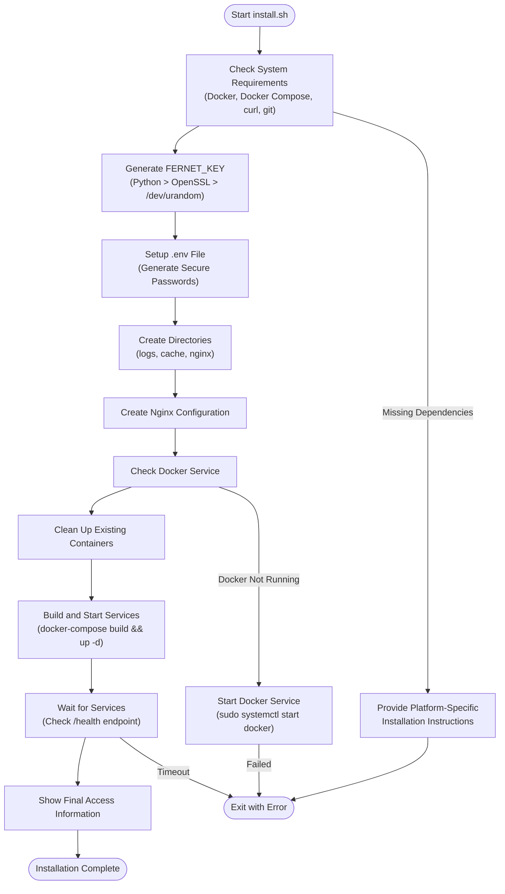
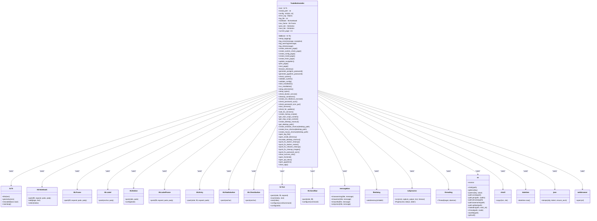
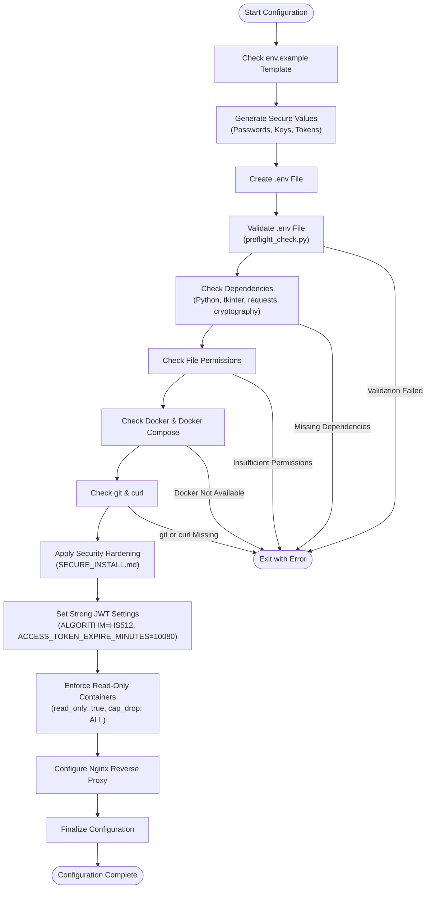
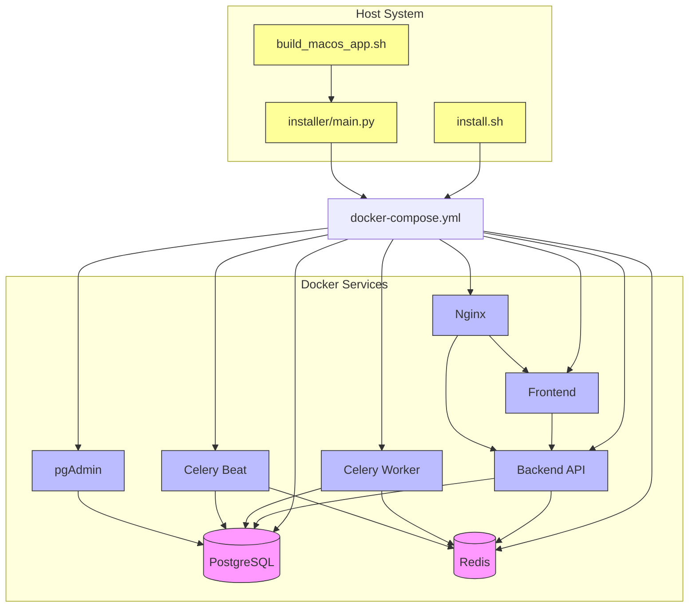
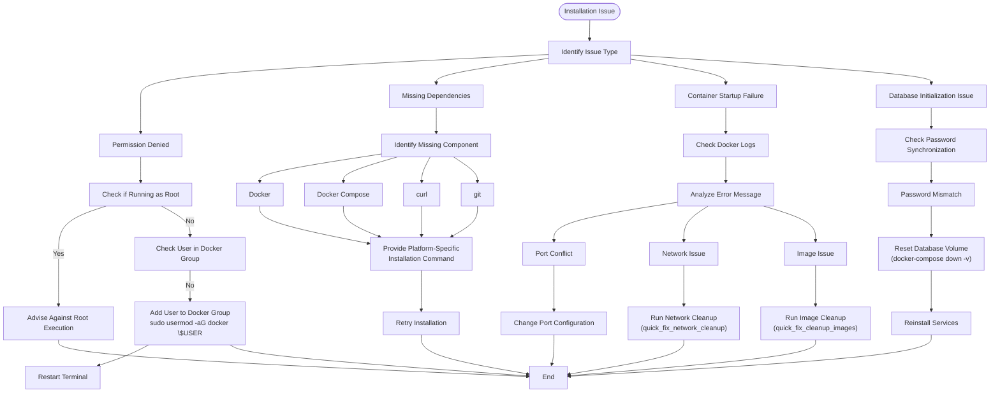

# Installation Procedures

<cite>
**Referenced Files in This Document**   
- [install.sh](file://install.sh)
- [installer/main.py](file://installer/main.py)
- [docker-compose.yml](file://docker-compose.yml)
- [SECURE_INSTALL.md](file://SECURE_INSTALL.md)
- [installer/preflight_check.py](file://installer/preflight_check.py)
- [installer/build_macos_app.sh](file://installer/build_macos_app.sh)
- [installer/requirements.txt](file://installer/requirements.txt)
- [env.example](file://env.example)
- [installer/nginx.conf](file://installer/nginx.conf)
</cite>

## Table of Contents
1. [Introduction](#introduction)
2. [Command-Line Installation (install.sh)](#command-line-installation-installsh)
3. [GUI-Based Installation (installer/main.py)](#gui-based-installation-installermainpy)
4. [Configuration and Environment Setup](#configuration-and-environment-setup)
5. [Service Dependencies and Containerized Deployment](#service-dependencies-and-containerized-deployment)
6. [Platform-Specific Considerations](#platform-specific-considerations)
7. [Troubleshooting Common Issues](#troubleshooting-common-issues)
8. [Conclusion](#conclusion)

## Introduction
The TradeBot system provides two primary installation methods: a command-line script (`install.sh`) and a graphical user interface (GUI) application (`installer/main.py`). Both methods automate the setup of a containerized trading environment using Docker, ensuring consistent deployment across different platforms. The installation process includes system requirement checks, secure environment configuration, service orchestration via Docker Compose, and integration with Nginx for reverse proxy functionality. This document details the execution flow, configuration options, and platform-specific considerations for both installation methods, along with troubleshooting guidance for common issues.

**Section sources**
- [install.sh](file://install.sh#L1-L442)
- [installer/main.py](file://installer/main.py#L1-L2066)

## Command-Line Installation (install.sh)
The `install.sh` script provides a fully automated command-line installation process for the TradeBot system. It begins by verifying system requirements, including Docker, Docker Compose, curl, and git. If any dependencies are missing, the script provides platform-specific installation instructions for Ubuntu/Debian, Arch Linux, and macOS. Upon successful dependency verification, the script generates secure cryptographic keys, including a FERNET_KEY using Python's cryptography library or fallback methods with OpenSSL or /dev/urandom. The installation then proceeds to create a `.env` file with strong, randomly generated passwords for PostgreSQL, pgAdmin, and Redis, ensuring secure defaults as outlined in SECURE_INSTALL.md. The script sets up necessary directories for logs, cache, and Nginx configuration, then orchestrates the Docker services using `docker-compose up -d`. It monitors service readiness by polling the backend health endpoint and provides a comprehensive summary of access credentials and next steps upon successful installation.

**Diagram sources**
- [install.sh](file://install.sh#L1-L442)

**Section sources**
- [install.sh](file://install.sh#L1-L442)

## GUI-Based Installation (installer/main.py)
The GUI-based installation is implemented in `installer/main.py` using Python's tkinter library, providing a user-friendly wizard interface. The installer consists of five sequential pages: Welcome, System Check, Configuration, Installation, and Completion. The System Check page verifies the presence of Docker, Docker Compose, git, and curl, displaying real-time status with color-coded indicators. The Configuration page allows users to customize installation settings, including the installation directory, port assignments for frontend, backend, PostgreSQL, and pgAdmin, and environment selection (Production/Development). Users can generate secure passwords for PostgreSQL and pgAdmin directly within the interface. The Installation page features a progress bar and real-time log output, providing transparency into the installation process. Upon completion, the Finish page displays access credentials and provides buttons to open the frontend, API documentation, and pgAdmin in the default web browser. The installer also creates platform-specific desktop shortcuts and startup scripts (`start_tradebot.sh/bat`, `stop_tradebot.sh/bat`) for easy project management.

**Diagram sources**
- [installer/main.py](file://installer/main.py#L21-L2066)

**Section sources**
- [installer/main.py](file://installer/main.py#L1-L2066)

## Configuration and Environment Setup
The TradeBot installation process emphasizes secure configuration management through automated environment file generation. Both installation methods create a `.env` file based on the `env.example` template, populating it with cryptographically secure values. The `SECURE_INSTALL.md` document outlines the security hardening measures applied during this process, including the use of strong passwords, secure key generation, and proper environment variable configuration. The `.env` file contains critical configuration options such as database credentials, Redis password, FERNET_KEY for data encryption, and JWT settings. The installation scripts ensure that sensitive information is never hardcoded and that default weak credentials are replaced with generated secure values. The `preflight_check.py` script validates system readiness by checking for required dependencies, including Python 3.10+, tkinter, requests, cryptography, and pywin32 on Windows. This preflight check ensures that the installation environment meets all prerequisites before proceeding with the setup process.

**Diagram sources**
- [env.example](file://env.example#L1-L89)
- [SECURE_INSTALL.md](file://SECURE_INSTALL.md#L1-L77)
- [installer/preflight_check.py](file://installer/preflight_check.py#L1-L108)

**Section sources**
- [env.example](file://env.example#L1-L89)
- [SECURE_INSTALL.md](file://SECURE_INSTALL.md#L1-L77)
- [installer/preflight_check.py](file://installer/preflight_check.py#L1-L108)

## Service Dependencies and Containerized Deployment
The TradeBot system relies on several key service dependencies orchestrated through Docker Compose, as defined in `docker-compose.yml`. The primary services include PostgreSQL for data persistence, Redis for caching and Celery message brokering, a backend API server, Celery workers for asynchronous task processing, a frontend web application, and an Nginx reverse proxy for production deployment. The `SECURE_INSTALL.md` document details the security hardening measures applied to these services, such as running containers as non-root users, disabling new privileges, dropping all capabilities, and mounting read-only filesystems. The installation process ensures that services are started in the correct order, with health checks verifying the readiness of dependent services before proceeding. The Nginx configuration, generated by both installation methods, routes traffic to the frontend and backend services, providing a unified entry point for the application. The `build_macos_app.sh` script demonstrates the platform-specific build process for creating a standalone macOS application bundle, integrating PyInstaller for packaging the GUI installer.

**Diagram sources**
- [docker-compose.yml](file://docker-compose.yml#L1-L276)
- [SECURE_INSTALL.md](file://SECURE_INSTALL.md#L1-L77)
- [installer/build_macos_app.sh](file://installer/build_macos_app.sh#L1-L254)

**Section sources**
- [docker-compose.yml](file://docker-compose.yml#L1-L276)
- [SECURE_INSTALL.md](file://SECURE_INSTALL.md#L1-L77)
- [installer/build_macos_app.sh](file://installer/build_macos_app.sh#L1-L254)

## Platform-Specific Considerations
The TradeBot installation process accounts for platform-specific differences across Linux, Windows (via WSL), and macOS. The `install.sh` script provides tailored installation instructions for Ubuntu/Debian, Arch Linux, and macOS using Homebrew. The GUI installer (`installer/main.py`) detects the operating system and adjusts its behavior accordingly, such as using different methods to start Docker Desktop on Windows and macOS. The `build_macos_app.sh` script specifically targets macOS, using PyInstaller to create a standalone `.app` bundle and optionally packaging it into a DMG disk image for distribution. On Windows, the installer creates `.lnk` shortcuts and batch files (`start_tradebot.bat`, `stop_tradebot.bat`), while on Linux and macOS, it creates shell scripts (`start_tradebot.sh`, `stop_tradebot.sh`) and desktop entries. The installation scripts handle platform-specific path separators, file permissions, and command execution methods to ensure consistent behavior across different operating systems.

**Section sources**
- [install.sh](file://install.sh#L1-L442)
- [installer/main.py](file://installer/main.py#L1-L2066)
- [installer/build_macos_app.sh](file://installer/build_macos_app.sh#L1-L254)

## Troubleshooting Common Issues
Common installation issues include permission denied errors, missing dependencies, and failed container startups. The `install.sh` script addresses permission issues by advising users not to run as root and providing instructions for adding the user to the docker group. Missing dependencies are handled by providing platform-specific installation commands for Docker, Docker Compose, curl, and git. For failed container startups, the installation scripts implement comprehensive error handling and logging. The GUI installer includes a dedicated error popup with quick-fix buttons for common issues, such as Docker cleanup, Docker restart, network cleanup, image cleanup, and password synchronization. Database initialization issues are addressed by the `start_services` method in `installer/main.py`, which performs password reconciliation between the `.env` file and the PostgreSQL container, automatically resetting the database volume if necessary. The `SECURE_INSTALL.md` document provides additional troubleshooting guidance for issues such as 401/403 errors, encryption failures, database connection problems, Redis authentication errors, and port conflicts.

**Diagram sources**
- [install.sh](file://install.sh#L1-L442)
- [installer/main.py](file://installer/main.py#L1-L2066)
- [SECURE_INSTALL.md](file://SECURE_INSTALL.md#L1-L77)

**Section sources**
- [install.sh](file://install.sh#L1-L442)
- [installer/main.py](file://installer/main.py#L1-L2066)
- [SECURE_INSTALL.md](file://SECURE_INSTALL.md#L1-L77)

## Conclusion
The TradeBot system offers two robust installation methods: a command-line script (`install.sh`) and a GUI-based application (`installer/main.py`). Both methods automate the setup of a secure, containerized trading environment, ensuring consistent deployment across Linux, Windows (via WSL), and macOS. The installation process emphasizes security through automated generation of strong passwords and cryptographic keys, adherence to best practices outlined in `SECURE_INSTALL.md`, and comprehensive error handling. The integration with Docker and Nginx enables scalable and production-ready deployment, while platform-specific considerations ensure compatibility across different operating systems. The detailed troubleshooting guidance and quick-fix utilities provided in the GUI installer enhance the user experience and simplify issue resolution. By following the procedures outlined in this document, users can successfully install and configure the TradeBot system for professional trading operations.