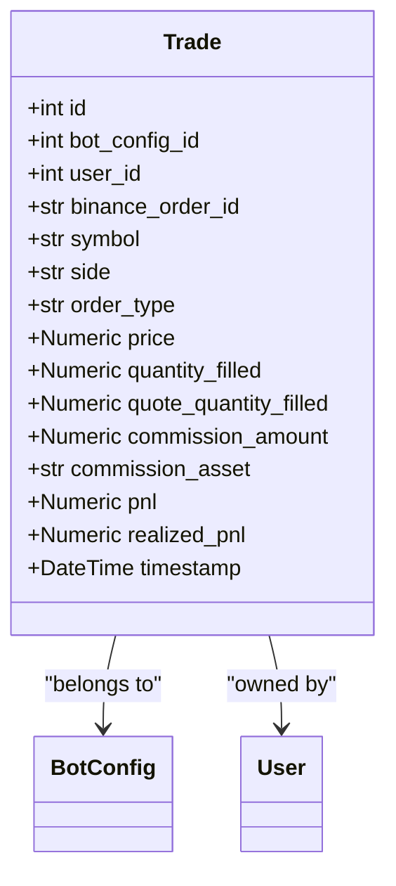
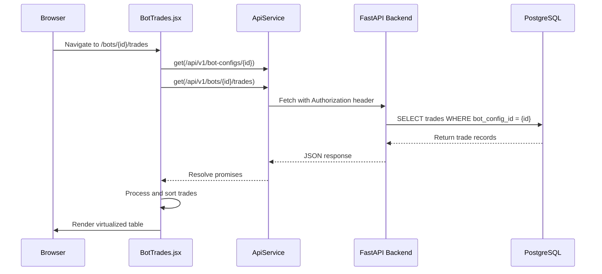

# Historical Trade Visualization

<cite>
**Referenced Files in This Document**   
- [trade.py](file://app/api/routes/trade.py)
- [trade.py](file://app/models/trade.py)
- [trade.py](file://app/schemas/trade.py)
- [BotTrades.jsx](file://frontend/src/pages/Bots/BotTrades.jsx)
- [api.js](file://frontend/src/services/api.js)
</cite>

## Table of Contents
1. [Introduction](#introduction)
2. [Trade Retrieval via API](#trade-retrieval-via-api)
3. [Trade Model Schema](#trade-model-schema)
4. [Frontend Trade Data Handling](#frontend-trade-data-handling)
5. [Data Transformation and Metrics Calculation](#data-transformation-and-metrics-calculation)
6. [Performance Considerations](#performance-considerations)
7. [Handling Large Trade Datasets](#handling-large-trade-datasets)
8. [Common Issues and Debugging](#common-issues-and-debugging)
9. [Conclusion](#conclusion)

## Introduction
The Historical Trade Visualization system enables users to analyze past trading activity generated by automated bots. This document details how trade data is stored, retrieved, and rendered across the backend and frontend layers. It covers the full lifecycle of trade records—from database schema and API endpoints to client-side rendering and performance optimization. The system supports filtering, sorting, and exporting trade history while calculating key performance metrics such as win rate and realized PnL.

## Trade Retrieval via API

The `/trades` endpoint in `trade.py` provides access to trade records with built-in security and filtering. All endpoints enforce user authentication and ensure data isolation by restricting access to trades belonging to the authenticated user.

The primary endpoint for retrieving trades is `GET /api/v1/trades`, which returns all trades associated with the current user. However, in the context of bot-specific trade history, the frontend uses a different route: `GET /api/v1/bots/{id}/trades`. This suggests a separate bot-focused endpoint not visible in the provided `trade.py` file, likely implemented in `bot_runner.py` or `bot_config.py`.

The existing `list_trades` function retrieves all trades for the current user without pagination or bot-level filtering:
```python
@router.get("/", response_model=list[TradeResponse])
async def list_trades(db: AsyncSession = Depends(get_db), current_user: User = Depends(get_current_active_user)):
    result = await db.execute(select(Trade).where(Trade.user_id == current_user.id))
    trades = result.scalars().all()
    return [TradeResponse.model_validate(t, from_attributes=True) for t in trades]
```

To support filtering by `bot_config_id`, an extended query would be required, potentially through a query parameter. Future enhancements could include pagination using offset and limit parameters to manage large datasets.

**Section sources**
- [trade.py](file://app/api/routes/trade.py#L22-L26)

## Trade Model Schema

The `Trade` model defines the structure of trade records stored in the database. It includes essential trading data such as price, quantity, side (BUY/SELL), and profitability metrics.

Key fields in the `Trade` model include:

- **side**: Indicates the trade direction (`BUY` or `SELL`)
- **price**: Entry price of the trade
- **quantity_filled**: Amount of asset traded
- **realized_pnl**: Profit or loss realized from the trade
- **timestamp**: When the trade was executed
- **bot_config_id**: Foreign key linking the trade to a specific bot configuration
- **user_id**: Foreign key ensuring data ownership and isolation

The model uses database indexing on `bot_config_id` and `user_id` to optimize query performance for filtered requests. The `realized_pnl` field was added in a later migration (`92c67f02186c_add_realized_pnl_to_trade.py`), indicating an evolution in the system's ability to track actual profitability.



**Diagram sources**
- [trade.py](file://app/models/trade.py#L5-L27)

**Section sources**
- [trade.py](file://app/models/trade.py#L5-L27)

## Frontend Trade Data Handling

The `BotTrades.jsx` component is responsible for fetching and rendering trade data for a specific bot. It uses the `apiServiceInstance` from `api.js` to make authenticated API calls.

On component mount, `fetchData` executes two parallel requests:
1. Fetch bot configuration details (`/api/v1/bot-configs/{id}`)
2. Fetch associated trade history (`/api/v1/bots/{id}/trades`)

The component implements error handling for both requests and displays appropriate messages if either fails. Authentication is managed through `useAuthStore`, which provides the JWT token used in API requests.

For rendering, the component uses virtualization when more than 300 trades are present. This optimizes performance by only rendering visible rows in the scrollable table. The virtualization logic calculates visible range based on scroll position and dynamically renders spacers above and below the visible window.

The table displays key trade information including timestamp, symbol, side, price, quantity, and realized PnL, with visual indicators for BUY/SELL sides and positive/negative PnL values.



**Diagram sources**
- [BotTrades.jsx](file://frontend/src/pages/Bots/BotTrades.jsx#L24-L78)
- [api.js](file://frontend/src/services/api.js#L7-L98)

**Section sources**
- [BotTrades.jsx](file://frontend/src/pages/Bots/BotTrades.jsx#L1-L335)
- [api.js](file://frontend/src/services/api.js#L1-L375)

## Data Transformation and Metrics Calculation

While the provided code does not show explicit metric calculations, the system is designed to support derived performance indicators. Based on standard trading analytics, the following metrics can be calculated from the available trade data:

| Metric | Calculation Method | Source Fields |
|--------|-------------------|-------------|
| Win Rate | (Number of positive PnL trades / Total trades) × 100 | `realized_pnl` |
| Average Gain | Sum of positive `realized_pnl` / Number of winning trades | `realized_pnl` |
| Average Loss | Sum of negative `realized_pnl` / Number of losing trades | `realized_pnl` |
| Maximum Drawdown | Maximum peak-to-trough decline in cumulative PnL | `realized_pnl`, `timestamp` |
| Profit Factor | Gross Profit / Gross Loss | `realized_pnl` |
| Expectancy | (Win Rate × Average Gain) - (Loss Rate × Average Loss) | `realized_pnl`, trade count |

These calculations would typically be performed client-side in `BotTrades.jsx` after data retrieval, or potentially server-side in a dedicated reporting endpoint. The current implementation focuses on raw data display rather than aggregated analytics.

## Performance Considerations

The system faces several performance challenges related to trade data volume and rendering efficiency:

1. **API Response Size**: The current `list_trades` endpoint returns all trades without pagination, which can lead to large payloads for active bots.
2. **Client-Side Rendering Load**: Rendering hundreds or thousands of rows can cause UI lag and high memory usage.
3. **Database Query Performance**: Unindexed queries on large trade tables can result in slow response times.

To address these issues, the system implements virtualized rendering in `BotTrades.jsx` for datasets exceeding 300 records. This reduces DOM complexity and improves scroll performance. Database indexing on `bot_config_id`, `user_id`, and `timestamp` ensures efficient query execution.

Additional optimizations could include:
- Implementing server-side pagination with `limit` and `offset` parameters
- Adding sorting and filtering capabilities at the database level
- Caching frequently accessed trade histories
- Using compressed responses for large datasets

**Section sources**
- [BotTrades.jsx](file://frontend/src/pages/Bots/BotTrades.jsx#L8-L12)
- [trade.py](file://app/models/trade.py#L9-L10)

## Handling Large Trade Datasets

For large trade datasets, the system employs several strategies:

1. **Virtualization**: The `BotTrades.jsx` component uses virtual scrolling when trade count exceeds `VIRTUAL_THRESHOLD` (300). This renders only visible rows, significantly reducing memory and CPU usage.
2. **Lazy Loading**: Trade data is fetched only when the component mounts, not eagerly during navigation.
3. **Efficient State Updates**: The component uses `unstable_batchedUpdates` to combine multiple React state updates into a single render pass, improving performance during data loading.

Recommended enhancements for handling large datasets:
- **Server-Side Pagination**: Implement `page` and `size` query parameters in the API to limit response size
- **Cursor-Based Pagination**: Use timestamp-based cursors for more efficient navigation through large datasets
- **Data Streaming**: For export operations, stream CSV data instead of loading everything into memory
- **Indexed Database Queries**: Ensure all query filters (bot_config_id, timestamp range) are supported by appropriate database indexes

The current implementation lacks explicit pagination in the API, which could become a bottleneck as trade volume grows.

## Common Issues and Debugging

Several common issues may arise when working with trade data:

### Stale Data Display
**Symptoms**: Trade list does not reflect recent activity  
**Causes**: 
- Client-side caching without proper invalidation
- Delayed synchronization between trading engine and database
- WebSocket connection issues

**Debugging Steps**:
1. Check browser network tab for successful API responses
2. Verify the `timestamp` of the latest trade matches expected execution time
3. Inspect server logs for database commit errors
4. Confirm WebSocket connectivity in browser developer tools

### Missing Trades
**Symptoms**: Gaps in trade history  
**Causes**:
- Failed database inserts due to constraint violations
- Bot crashes before trade recording
- Network issues during trade submission

**Debugging Steps**:
1. Search server logs for `create_trade` errors
2. Verify `binance_order_id` uniqueness constraints
3. Check for unhandled exceptions in bot execution logs
4. Compare exchange order history with recorded trades

### Incorrect PnL Calculations
**Symptoms**: Realized PnL values appear inaccurate  
**Causes**:
- Commission calculation errors
- Floating-point precision issues
- Incorrect price or quantity values stored

**Debugging Steps**:
1. Validate `price`, `quantity_filled`, and `commission_amount` values
2. Recalculate PnL manually using trade parameters
3. Check database schema for `Numeric` field precision
4. Review PnL calculation logic in trading engine

Use browser developer tools to inspect API responses and verify data consistency between frontend and backend.

**Section sources**
- [BotTrades.jsx](file://frontend/src/pages/Bots/BotTrades.jsx#L39-L68)
- [trade.py](file://app/api/routes/trade.py#L11-L20)

## Conclusion
The Historical Trade Visualization system provides a comprehensive view of bot trading activity through a well-structured backend API and optimized frontend component. The `Trade` model captures essential trading data with proper relationships and indexing. The `BotTrades.jsx` component efficiently renders large datasets using virtualization and handles authentication seamlessly. While the current implementation focuses on data display, opportunities exist to enhance the system with server-side pagination, advanced filtering, and built-in performance analytics. Addressing potential issues like stale data and missing trades through proper monitoring and logging will ensure data integrity and user trust.