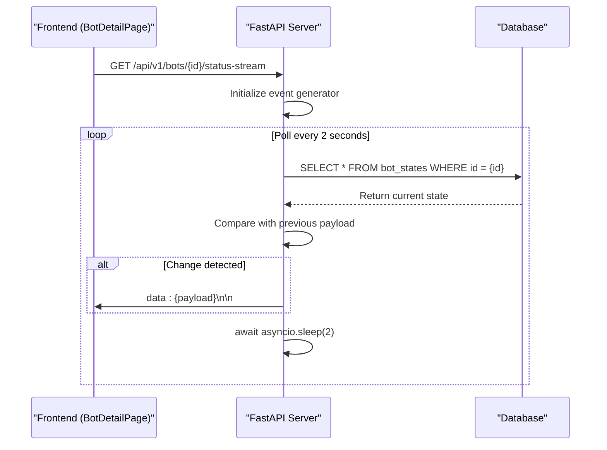
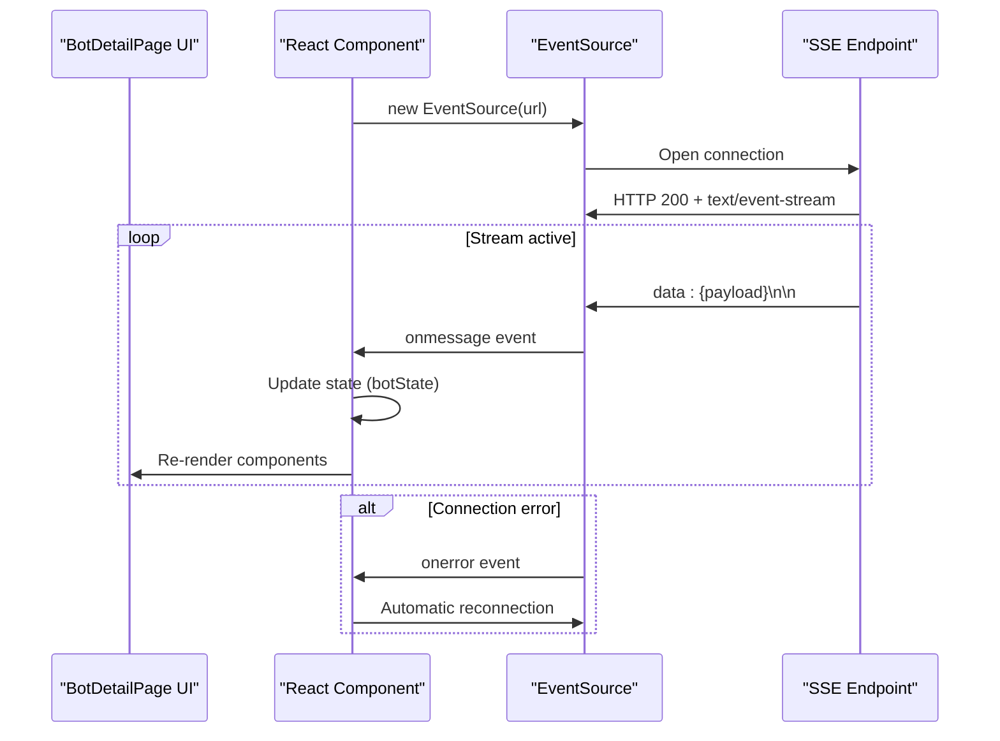

# Real-time Status Streaming

<cite>
**Referenced Files in This Document**   
- [main.py](file://app/main.py#L73-L92)
- [bot_state.py](file://app/api/routes/bot_state.py#L1-L30)
- [BotDetailPage.jsx](file://frontend/src/pages/Bots/BotDetailPage.jsx#L6-L708)
- [api.js](file://frontend/src/services/api.js#L317-L320)
- [bot_state.py](file://app/models/bot_state.py#L5-L22)
- [bot_state.py](file://app/schemas/bot_state.py#L5-L18)
</cite>

## Table of Contents
1. [Introduction](#introduction)
2. [Server-Side Implementation](#server-side-implementation)
3. [Client-Side Subscription](#client-side-subscription)
4. [Connection Lifecycle and Error Handling](#connection-lifecycle-and-error-handling)
5. [Performance Considerations](#performance-considerations)
6. [Troubleshooting Guide](#troubleshooting-guide)

## Introduction
The real-time status streaming mechanism in the TradeBot application enables continuous updates of bot state information from the server to the frontend using Server-Sent Events (SSE). This document details the implementation of the `/api/v1/bots/{bot_config_id}/status-stream` endpoint, which streams BotState updates to the BotDetailPage component. The system provides reactive UI updates for critical metrics including bot status, PnL, position data, and trading statistics without requiring manual page refreshes.

**Section sources**
- [main.py](file://app/main.py#L73-L92)
- [BotDetailPage.jsx](file://frontend/src/pages/Bots/BotDetailPage.jsx#L6-L708)

## Server-Side Implementation

The SSE endpoint is implemented in FastAPI within the `main.py` file as a streaming response that continuously polls the database for BotState changes. The endpoint `/api/v1/bots/{bot_config_id}/status-stream` accepts a bot configuration ID and user authentication, then establishes a persistent connection to push updates.

The event generator function polls the `bot_states` table every 2 seconds, comparing the current state with the previous payload to avoid sending duplicate events. When a change is detected, it formats the relevant state data into a JSON payload and yields it as an SSE event. The payload includes essential bot metrics:

- Current operational status (running, stopped, error, etc.)
- Position status (whether the bot is currently in a trade)
- Entry price for the current position
- Daily profit and loss (PnL) in USDT
- Daily trade count
- Timestamp of last update

The implementation leverages FastAPI's `StreamingResponse` with `text/event-stream` media type to maintain the persistent connection. Database queries are performed asynchronously using SQLAlchemy's async session to prevent blocking the event loop.

**Diagram sources**
- [main.py](file://app/main.py#L73-L92)
- [bot_state.py](file://app/models/bot_state.py#L5-L22)

**Section sources**
- [main.py](file://app/main.py#L73-L92)
- [bot_state.py](file://app/models/bot_state.py#L5-L22)
- [bot_state.py](file://app/schemas/bot_state.py#L5-L18)

## Client-Side Subscription

The BotDetailPage component in the frontend establishes and manages the SSE connection using the EventSource API. Upon mounting, the component creates an EventSource instance pointing to the status stream endpoint, which automatically handles the connection lifecycle including opening, receiving messages, and error events.

The received events trigger React state updates that re-render the relevant UI components, providing real-time feedback on the bot's status, PnL, and position metrics. The component includes proper cleanup in its useEffect cleanup function to close the EventSource connection when the component unmounts, preventing memory leaks and unnecessary server load.

The frontend also implements error handling and reconnection logic. When a connection error occurs, the EventSource API automatically attempts to reconnect according to the browser's default retry mechanism. The component can extend this with custom reconnection strategies if needed.

**Diagram sources**
- [BotDetailPage.jsx](file://frontend/src/pages/Bots/BotDetailPage.jsx#L6-L708)
- [api.js](file://frontend/src/services/api.js#L317-L320)

**Section sources**
- [BotDetailPage.jsx](file://frontend/src/pages/Bots/BotDetailPage.jsx#L6-L708)
- [api.js](file://frontend/src/services/api.js#L317-L320)

## Connection Lifecycle and Error Handling

The SSE connection follows a standard lifecycle with distinct states: connection establishment, message streaming, error handling, and termination. The server maintains the connection open indefinitely, sending updates every 2 seconds when changes are detected.

The connection keep-alive mechanism is implemented through regular polling and response streaming. The server does not implement explicit ping/pong messages, relying instead on the regular data transmission to maintain connection vitality. The 2-second polling interval strikes a balance between real-time responsiveness and server resource usage.

For error handling, both server and client implement robust mechanisms:
- Server-side: Database query errors are caught and logged, with the stream continuing after the error
- Client-side: The EventSource API provides built-in reconnection logic that automatically attempts to re-establish broken connections
- The system handles various error scenarios including network interruptions, server restarts, and authentication expiration

The current implementation does not use Redis for event buffering, instead relying on direct database polling. This simplifies the architecture but means that events generated while the client is disconnected are not buffered and will be missed. Clients receive only the current state upon reconnection.

**Section sources**
- [main.py](file://app/main.py#L73-L92)
- [BotDetailPage.jsx](file://frontend/src/pages/Bots/BotDetailPage.jsx#L6-L708)

## Performance Considerations

The real-time streaming implementation involves several performance considerations that affect both server and client resources:

Server memory usage scales with the number of active connections, as each SSE connection maintains an open thread or async task. The current 2-second polling interval results in approximately 30 database queries per minute per connected client. For applications with many concurrent users, this could create significant database load.

To mitigate database read frequency, potential optimizations include:
- Implementing Redis caching to reduce direct database queries
- Using database change notifications or triggers instead of polling
- Increasing the polling interval for less critical updates
- Implementing connection pooling and limits

Client-side performance is affected by the frequency of state updates and UI re-renders. The current implementation updates React state whenever bot state changes, which could cause performance issues if updates are very frequent. Implementing client-side throttling or debouncing could help smooth UI updates.

Network bandwidth usage is relatively low, with each event message being approximately 200-300 bytes. However, with many clients connected simultaneously, the cumulative bandwidth could become significant.

**Section sources**
- [main.py](file://app/main.py#L73-L92)
- [BotDetailPage.jsx](file://frontend/src/pages/Bots/BotDetailPage.jsx#L6-L708)

## Troubleshooting Guide

### Stream Disconnections
Common causes of stream disconnections include:
- Network instability between client and server
- Server timeouts or restarts
- Client-side tab inactivity or browser suspending background tabs
- Large event backlogs causing buffer overflow

**Solutions:**
- Verify network connectivity and firewall settings
- Check server logs for timeout or error messages
- Implement client-side reconnection with exponential backoff
- Monitor server resource usage during peak times

### CORS Misconfigurations
The SSE endpoint is subject to CORS policies. Issues may arise if:
- The frontend origin is not included in the allowed origins
- Credentials are required but not properly configured
- Headers are not properly exposed

**Solutions:**
- Verify the `FRONTEND_URL` environment variable matches the actual frontend URL
- Ensure the CORS middleware includes `expose_headers=["Content-Disposition"]`
- Check that `allow_credentials=True` is set when authentication is required

### Event Backlog Under High Load
When the system experiences high load, clients may miss events or experience delayed updates due to:
- Database query latency
- Server thread/concurrency limits
- Network congestion

**Solutions:**
- Monitor database performance and optimize queries
- Implement connection limits and queuing
- Consider switching from polling to a push-based notification system
- Add Redis caching layer to reduce database load

**Section sources**
- [main.py](file://app/main.py#L73-L92)
- [BotDetailPage.jsx](file://frontend/src/pages/Bots/BotDetailPage.jsx#L6-L708)