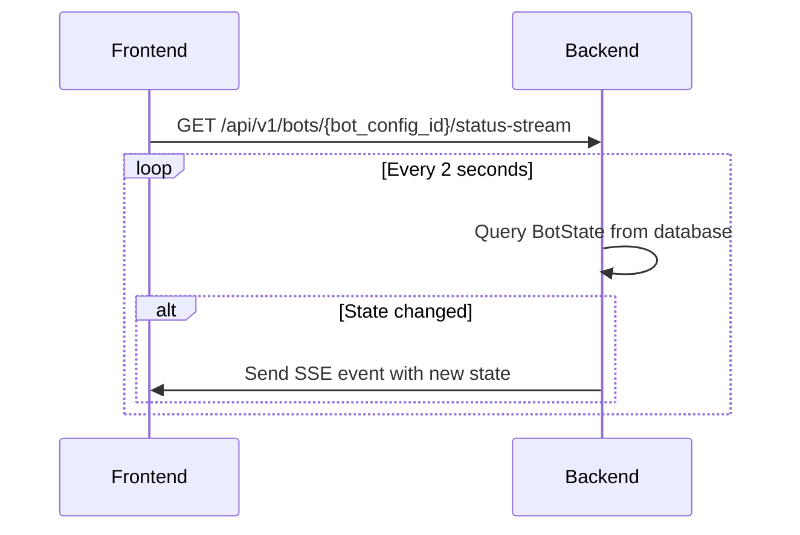
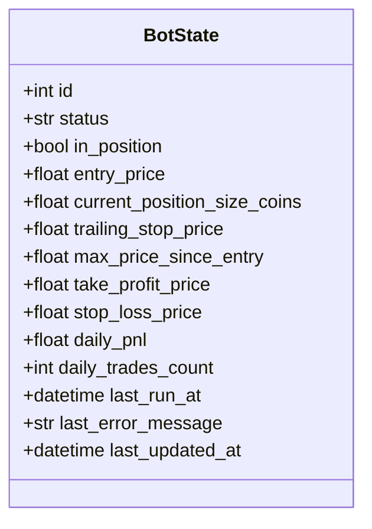
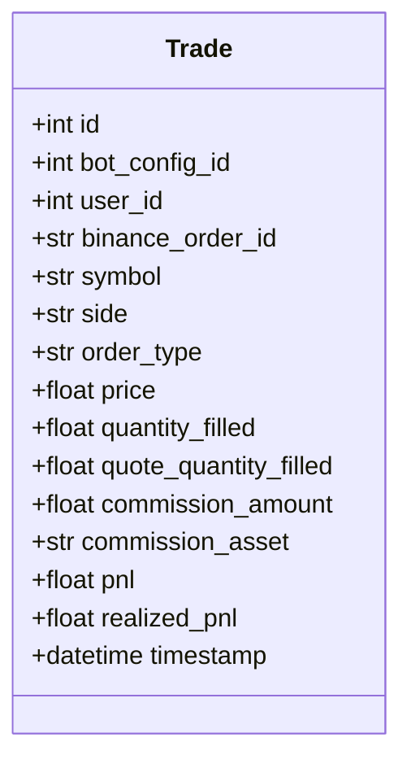
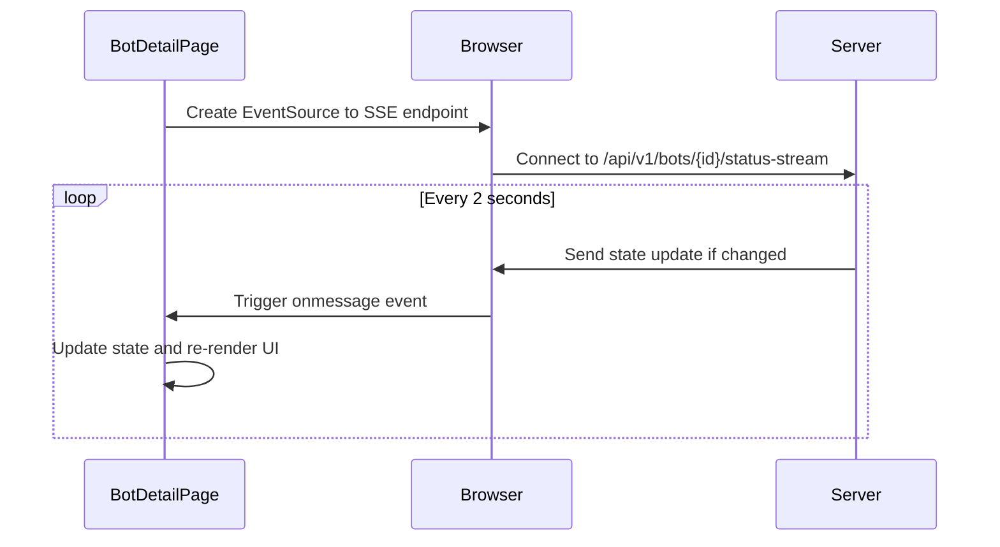
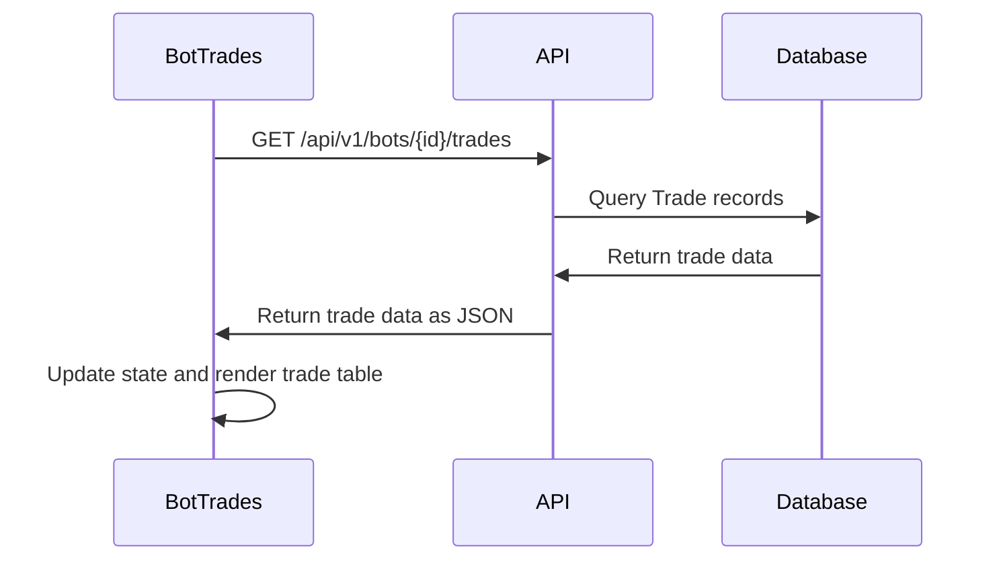
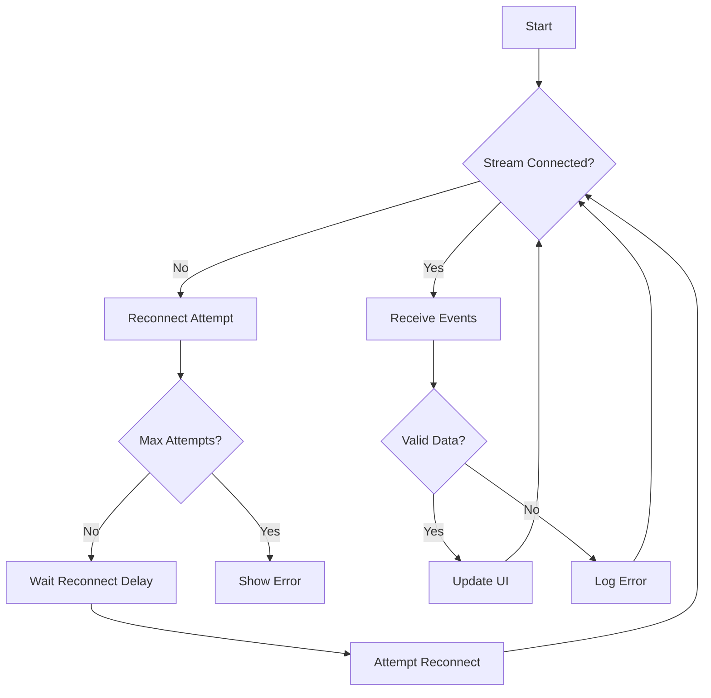
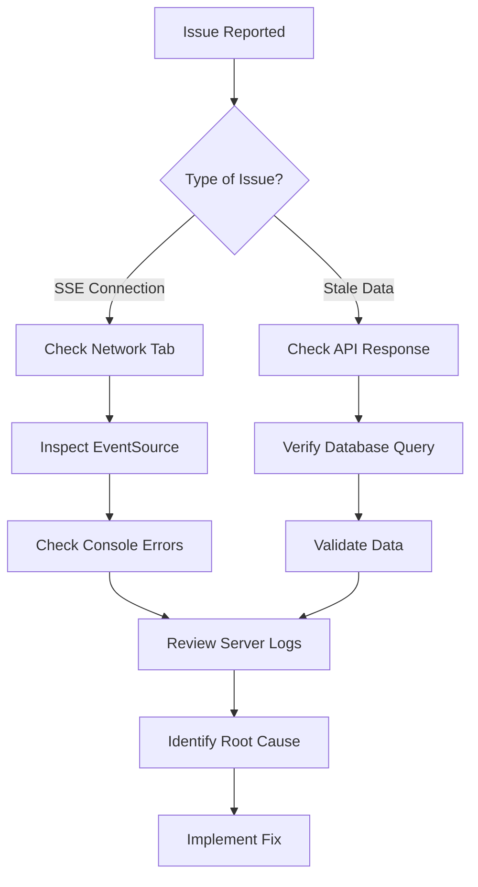

# Trade Monitoring Flow

<cite>
**Referenced Files in This Document**   
- [main.py](file://app/main.py)
- [bot_state.py](file://app/models/bot_state.py)
- [trade.py](file://app/models/trade.py)
- [bot_state.py](file://app/api/routes/bot_state.py)
- [trade.py](file://app/api/routes/trade.py)
- [bot_report.py](file://app/api/routes/bot_report.py)
- [BotDetailPage.jsx](file://frontend/src/pages/Bots/BotDetailPage.jsx)
- [BotTrades.jsx](file://frontend/src/pages/Bots/BotTrades.jsx)
- [api.js](file://frontend/src/services/api.js)
</cite>

## Table of Contents
1. [Introduction](#introduction)
2. [Real-Time Status Updates via SSE](#real-time-status-updates-via-sse)
3. [BotState and Trade Data Structures](#botstate-and-trade-data-structures)
4. [Frontend Event Subscription and UI Updates](#frontend-event-subscription-and-ui-updates)
5. [Historical Trade Polling Mechanism](#historical-trade-polling-mechanism)
6. [Latency, Buffering, and Error Recovery](#latency-buffering-and-error-recovery)
7. [Performance Metrics Interpretation](#performance-metrics-interpretation)
8. [Common Issues and Debugging Strategies](#common-issues-and-debugging-strategies)
9. [Conclusion](#conclusion)

## Introduction
This document details the trade monitoring flow in the trading bot system, focusing on real-time status updates and historical trade visualization. It explains how Server-Sent Events (SSE) stream bot state changes from the backend to the frontend, describes the data structures used for bot state and trade records, and outlines how the frontend subscribes to these events and updates UI components reactively. The document also covers the polling mechanism for fetching historical trades, latency considerations, event buffering, error recovery, performance metrics interpretation, and debugging strategies for common issues.

## Real-Time Status Updates via SSE
The system uses Server-Sent Events (SSE) to provide real-time updates of bot state changes to the frontend. The SSE endpoint is defined in `main.py` and streams updates from the `BotState` model to the frontend at a 2-second interval.

**Diagram sources**
- [main.py](file://app/main.py#L73-L93)

**Section sources**
- [main.py](file://app/main.py#L73-L93)

## BotState and Trade Data Structures
The system uses two primary data models: `BotState` for tracking the current state of trading bots and `Trade` for recording completed trades.

### BotState Model
The `BotState` model contains fields that track the current operational status and performance metrics of a trading bot.

**Diagram sources**
- [bot_state.py](file://app/models/bot_state.py#L8-L21)

### Trade Model
The `Trade` model contains fields that record details of completed trades, including financial metrics like PnL.

**Diagram sources**
- [trade.py](file://app/models/trade.py#L7-L23)

**Section sources**
- [bot_state.py](file://app/models/bot_state.py#L4-L22)
- [trade.py](file://app/models/trade.py#L4-L25)

## Frontend Event Subscription and UI Updates
The frontend subscribes to SSE events through the `BotDetailPage.jsx` component, which displays real-time bot state information and updates UI components reactively when new events are received.

**Diagram sources**
- [BotDetailPage.jsx](file://frontend/src/pages/Bots/BotDetailPage.jsx#L7-L711)

**Section sources**
- [BotDetailPage.jsx](file://frontend/src/pages/Bots/BotDetailPage.jsx#L7-L711)

## Historical Trade Polling Mechanism
The system uses a polling mechanism in `BotTrades.jsx` to fetch historical trades via the trade.py API endpoint. The frontend makes periodic HTTP requests to retrieve trade history for display.

**Diagram sources**
- [BotTrades.jsx](file://frontend/src/pages/Bots/BotTrades.jsx#L1-L335)
- [trade.py](file://app/api/routes/trade.py#L1-L35)
- [bot_report.py](file://app/api/routes/bot_report.py#L57-L90)

**Section sources**
- [BotTrades.jsx](file://frontend/src/pages/Bots/BotTrades.jsx#L1-L335)
- [trade.py](file://app/api/routes/trade.py#L1-L35)
- [bot_report.py](file://app/api/routes/bot_report.py#L57-L90)

## Latency, Buffering, and Error Recovery
The event streaming system addresses latency, buffering, and error recovery through several mechanisms. The SSE endpoint polls the database every 2 seconds, creating a maximum latency of 2 seconds for state updates. The system uses payload comparison to avoid sending duplicate events, reducing network traffic. For error recovery, the frontend should implement reconnection logic to handle temporary disconnections from the event stream.

**Diagram sources**
- [main.py](file://app/main.py#L73-L93)
- [BotDetailPage.jsx](file://frontend/src/pages/Bots/BotDetailPage.jsx#L7-L711)

## Performance Metrics Interpretation
The system provides several performance metrics for evaluating bot effectiveness, including win rate, average gain/loss, and drawdown. These metrics are derived from the trade history and current bot state.

### Key Performance Metrics
- **Win Rate**: Percentage of profitable trades out of total trades
- **Average Gain**: Average profit from winning trades
- **Average Loss**: Average loss from losing trades
- **Drawdown**: Maximum observed loss from a peak to a trough
- **Daily PnL**: Profit and loss for the current day
- **Total Realized PnL**: Cumulative profit and loss from closed positions

These metrics are calculated from the `Trade` model data and displayed in the bot performance dashboard. The `daily_pnl` field in `BotState` provides real-time daily performance, while historical metrics are computed from the complete trade history.

**Section sources**
- [bot_state.py](file://app/models/bot_state.py#L4-L22)
- [trade.py](file://app/models/trade.py#L4-L25)
- [bot_report.py](file://app/api/routes/bot_report.py#L27-L59)

## Common Issues and Debugging Strategies
This section addresses common issues in the trade monitoring flow and provides debugging strategies using browser developer tools and server logs.

### Disconnected Event Streams
When SSE connections are lost, the frontend may stop receiving real-time updates. To debug:
1. Check browser developer tools Network tab for SSE connection status
2. Verify the EventSource is properly created and listening
3. Examine console for JavaScript errors
4. Check server logs for SSE endpoint errors

### Stale Trade Data
When historical trade data appears stale or incomplete:
1. Verify the polling request is being made correctly
2. Check API response in browser developer tools
3. Validate database queries in server logs
4. Confirm user authentication and authorization

### Debugging Tools
- **Browser Developer Tools**: Monitor network requests, inspect SSE events, and view console errors
- **Server Logs**: Check for database query performance, API errors, and authentication issues
- **Database Queries**: Verify trade and bot state data integrity
- **API Testing**: Use tools like curl or Postman to test endpoints independently

**Diagram sources**
- [main.py](file://app/main.py#L73-L93)
- [BotDetailPage.jsx](file://frontend/src/pages/Bots/BotDetailPage.jsx#L7-L711)
- [BotTrades.jsx](file://frontend/src/pages/Bots/BotTrades.jsx#L1-L335)

**Section sources**
- [main.py](file://app/main.py#L73-L93)
- [BotDetailPage.jsx](file://frontend/src/pages/Bots/BotDetailPage.jsx#L7-L711)
- [BotTrades.jsx](file://frontend/src/pages/Bots/BotTrades.jsx#L1-L335)

## Conclusion
The trade monitoring flow in this system effectively combines real-time status updates via SSE with historical trade visualization through polling. The BotState and Trade models provide a comprehensive data structure for tracking bot performance and trade history. The frontend components reactively update UI elements based on incoming events and polled data, providing users with timely information about their trading bots. By understanding the latency characteristics, buffering mechanisms, and error recovery strategies, users can effectively monitor and debug their trading operations. The performance metrics provided enable informed decision-making about bot effectiveness and trading strategies.