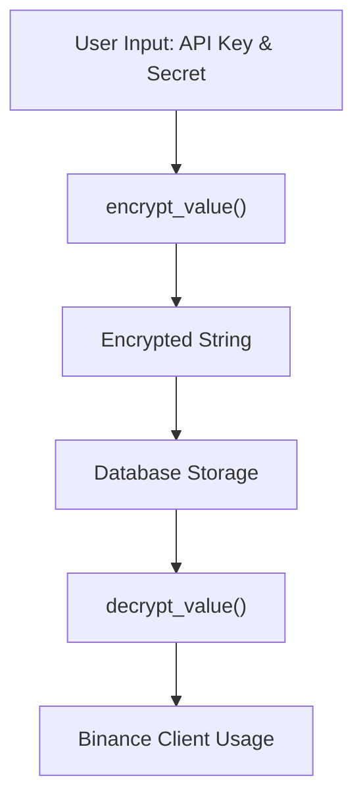
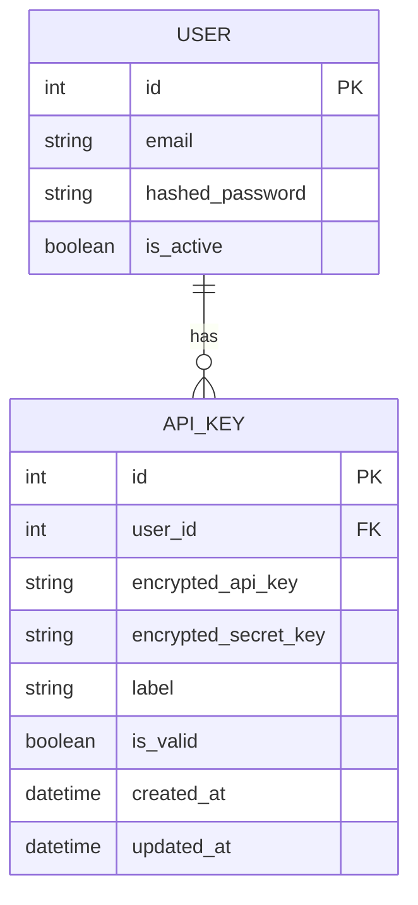
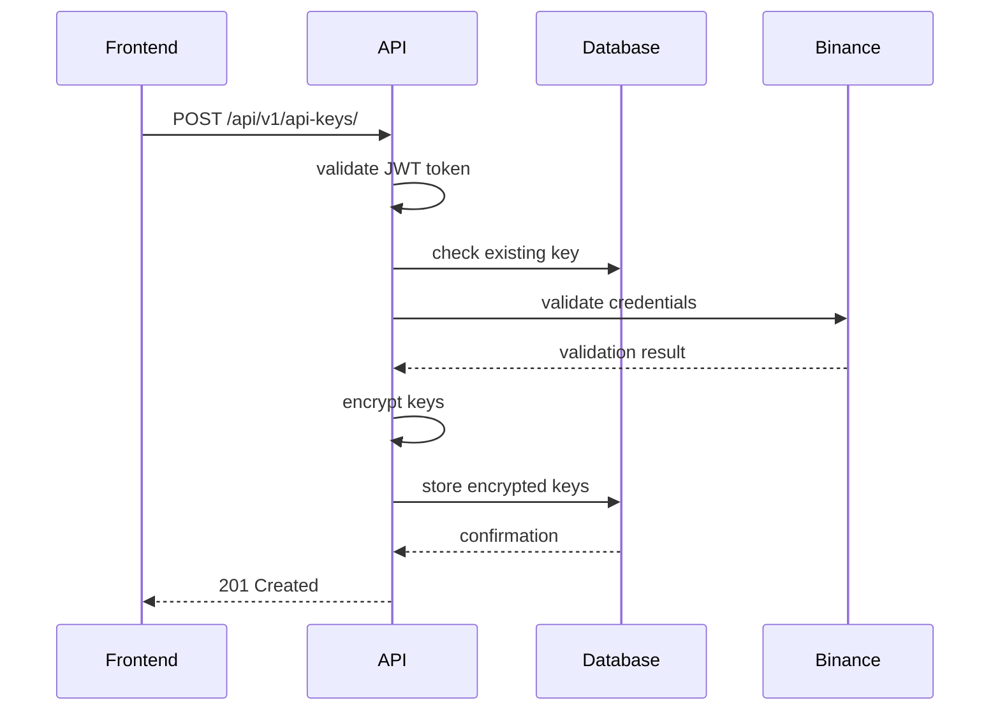
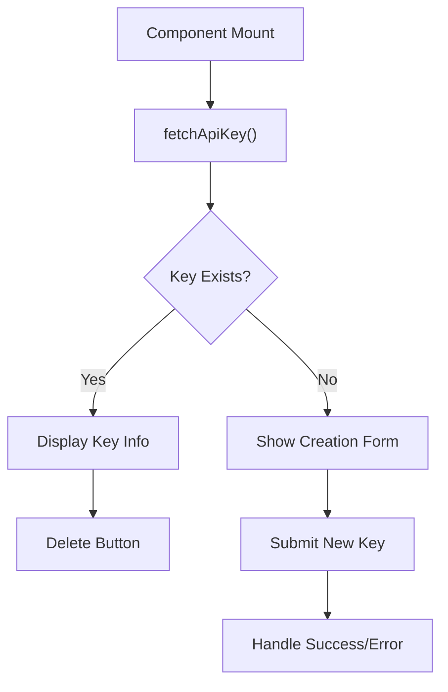
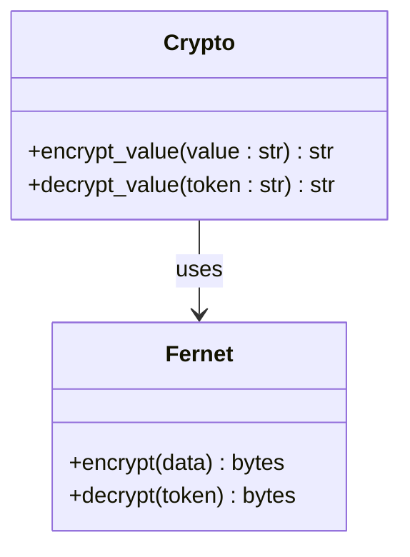

# API Key Management

<cite>
**Referenced Files in This Document**   
- [crypto.py](file://app/core/crypto.py)
- [api_key.py](file://app/api/routes/api_key.py)
- [api_key.py](file://app/models/api_key.py)
- [api_key.py](file://app/schemas/api_key.py)
- [ApiKeysPage.jsx](file://frontend/src/pages/ApiKeys/ApiKeysPage.jsx)
</cite>

## Table of Contents
1. [Introduction](#introduction)
2. [Secure Storage and Encryption](#secure-storage-and-encryption)
3. [ApiKey Model Structure](#apikey-model-structure)
4. [API Endpoints for Key Management](#api-endpoints-for-key-management)
5. [User Interface Interactions](#user-interface-interactions)
6. [Encryption and Decryption Functions](#encryption-and-decryption-functions)
7. [Common Issues and Troubleshooting](#common-issues-and-troubleshooting)
8. [Best Practices](#best-practices)

## Introduction
This document provides comprehensive details on the API key management system within the tradebot application. It covers secure storage mechanisms, encryption protocols, database model structure, API endpoints, frontend interactions, and best practices for maintaining security and usability.

## Secure Storage and Encryption
The system uses Fernet symmetric encryption to securely store API keys. The encryption key is managed through environment variables, specifically the `FERNET_KEY` setting. In production environments, this key must be explicitly set, while development environments can generate a temporary key if none is provided.

**Diagram sources**
- [crypto.py](file://app/core/crypto.py#L16-L22)
- [api_key.py](file://app/api/routes/api_key.py#L48-L49)

**Section sources**
- [crypto.py](file://app/core/crypto.py#L1-L24)
- [api_key.py](file://app/api/routes/api_key.py#L48-L55)

## ApiKey Model Structure
The `ApiKey` SQLAlchemy model defines the structure for storing encrypted API credentials with a foreign key relationship to the User model. It includes fields for encrypted API key and secret, an optional label, validity status, and timestamps.

**Diagram sources**
- [api_key.py](file://app/models/api_key.py#L4-L16)

**Section sources**
- [api_key.py](file://app/models/api_key.py#L1-L18)

## API Endpoints for Key Management
The API provides endpoints for creating, retrieving, and deleting API keys with JWT-based access control. Each user can have only one active API key at a time.

**Diagram sources**
- [api_key.py](file://app/api/routes/api_key.py#L17-L60)

**Section sources**
- [api_key.py](file://app/api/routes/api_key.py#L1-L152)

## User Interface Interactions
The React frontend component `ApiKeysPage.jsx` handles form submission, displays encrypted key status, and provides user feedback for API key operations. It shows masked key values and validation status.

**Diagram sources**
- [ApiKeysPage.jsx](file://frontend/src/pages/ApiKeys/ApiKeysPage.jsx#L23-L88)

**Section sources**
- [ApiKeysPage.jsx](file://frontend/src/pages/ApiKeys/ApiKeysPage.jsx#L1-L450)

## Encryption and Decryption Functions
The `encrypt_value` and `decrypt_value` functions in `crypto.py` handle the core cryptographic operations using Fernet encryption. These functions are critical for secure key retrieval during bot execution.

**Diagram sources**
- [crypto.py](file://app/core/crypto.py#L16-L22)

**Section sources**
- [crypto.py](file://app/core/crypto.py#L1-L24)

## Common Issues and Troubleshooting
Common issues include failed decryption due to missing or incorrect `FERNET_KEY`, improper permission handling, and invalid API credentials. The system prevents multiple API keys per user and validates credentials before storage.

**Section sources**
- [api_key.py](file://app/api/routes/api_key.py#L26-L45)
- [crypto.py](file://app/core/crypto.py#L8-L13)

## Best Practices
Recommended practices include regular API key rotation, limiting permissions to spot trading only (avoiding withdrawal rights), implementing audit logging, and using environment-specific encryption keys. The system automatically validates API credentials before storage and masks sensitive information in responses.

**Section sources**
- [api_key.py](file://app/api/routes/api_key.py#L26-L45)
- [ApiKeysPage.jsx](file://frontend/src/pages/ApiKeys/ApiKeysPage.jsx#L306-L337)