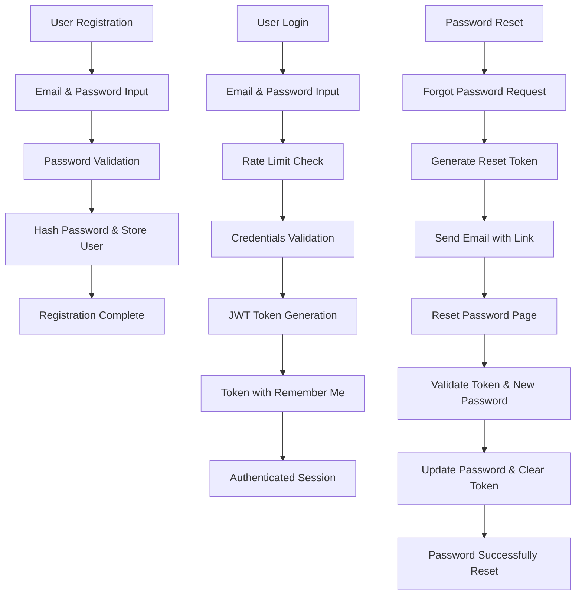
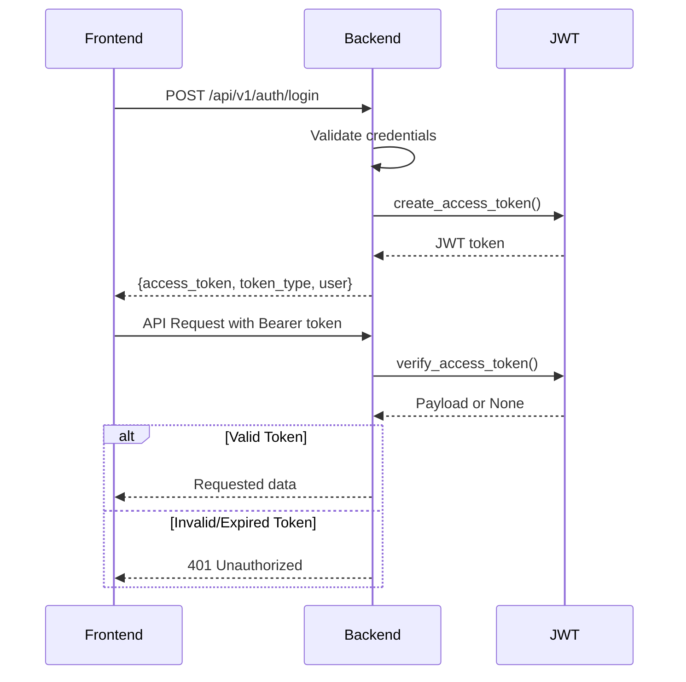
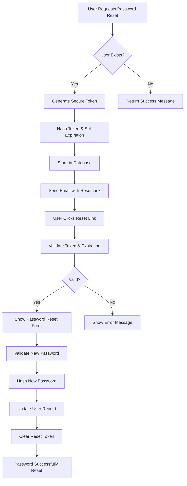
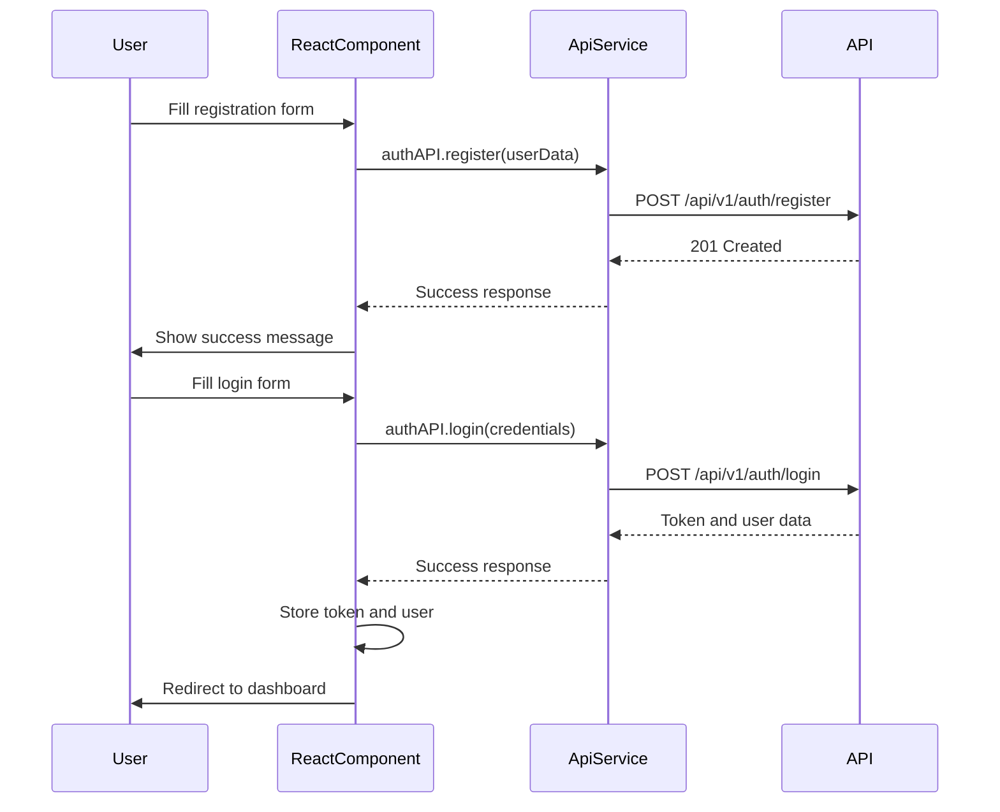
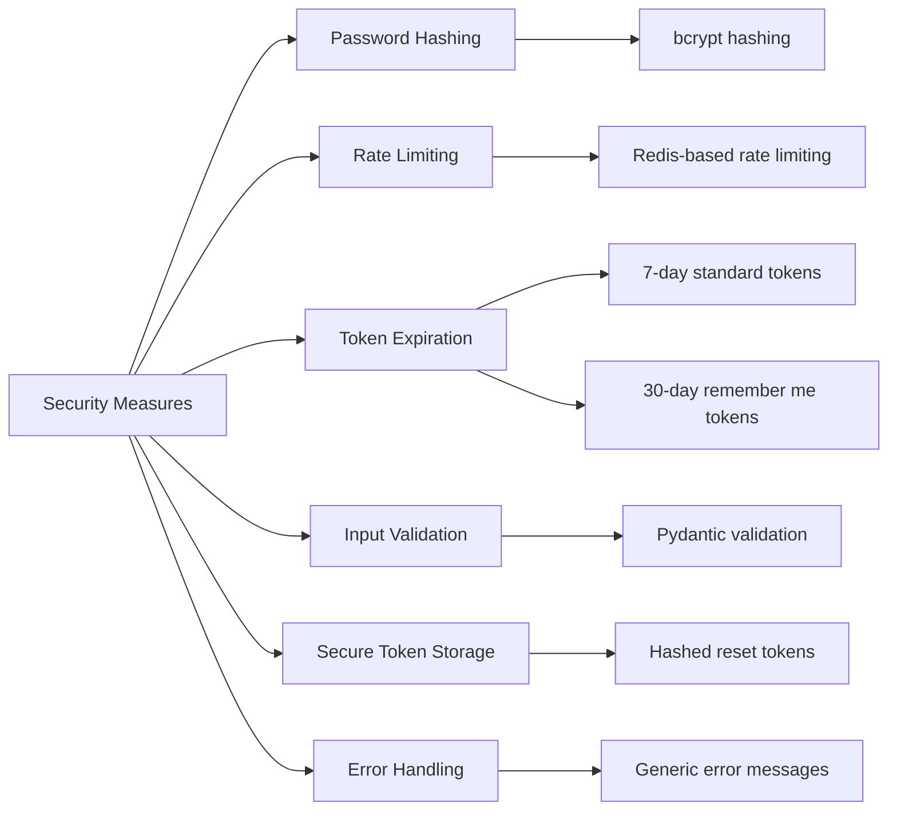

# Authentication Flow

<cite>
**Referenced Files in This Document**   
- [user.py](file://app/schemas/user.py)
- [jwt.py](file://app/core/jwt.py)
- [auth.py](file://app/api/routes/auth.py)
- [user.py](file://app/models/user.py)
- [api.js](file://frontend/src/services/api.js)
- [RegisterPage.jsx](file://frontend/src/pages/Auth/RegisterPage.jsx)
- [LoginPage.jsx](file://frontend/src/pages/Auth/LoginPage.jsx)
- [ResetPasswordPage.jsx](file://frontend/src/pages/Auth/ResetPasswordPage.jsx)
</cite>

## Table of Contents
1. [Introduction](#introduction)
2. [Core Components](#core-components)
3. [Authentication Flow Overview](#authentication-flow-overview)
4. [User Registration and Login Models](#user-registration-and-login-models)
5. [JWT Token Generation and Validation](#jwt-token-generation-and-validation)
6. [Password Reset and Email Verification](#password-reset-and-email-verification)
7. [Frontend Implementation](#frontend-implementation)
8. [Security Best Practices](#security-best-practices)
9. [Common Issues and Troubleshooting](#common-issues-and-troubleshooting)

## Introduction
This document details the authentication flow for the TradeBot application, covering user registration, login, JWT token management, and secure password reset functionality. The system implements robust security measures including password validation, token expiration, rate limiting, and secure credential storage. The backend is built with FastAPI and SQLAlchemy, while the frontend uses React with Tailwind CSS for responsive UI components.

## Core Components

The authentication system consists of several key components across the backend and frontend:

- **Pydantic Models**: Define data validation rules for user input
- **JWT Token Management**: Handle secure token generation and validation
- **Database Models**: Store user credentials and reset tokens securely
- **API Endpoints**: Expose authentication functionality to the frontend
- **React Components**: Provide user interface for authentication flows
- **API Service**: Manage HTTP requests and authentication headers

**Section sources**
- [user.py](file://app/schemas/user.py#L3-L21)
- [jwt.py](file://app/core/jwt.py#L1-L45)
- [auth.py](file://app/api/routes/auth.py#L1-L177)
- [user.py](file://app/models/user.py#L1-L24)
- [api.js](file://frontend/src/services/api.js#L1-L375)

## Authentication Flow Overview



**Diagram sources**
- [auth.py](file://app/api/routes/auth.py#L19-L177)
- [user.py](file://app/models/user.py#L1-L24)
- [jwt.py](file://app/core/jwt.py#L1-L45)

## User Registration and Login Models

The authentication system uses Pydantic models to validate user input for registration and login. The `UserCreate` model enforces strict password requirements to ensure account security.

The password validation requires:
- Minimum 12 characters
- At least one uppercase letter
- At least one lowercase letter
- At least one digit
- At least one special character

These requirements are implemented in the `validate_password` field validator, which raises a descriptive error message in Turkish if any requirement is not met.

```mermaid
classDiagram
class UserCreate {
+email : EmailStr
+password : str
+validate_password(v : str) : str
}
class UserLogin {
+email : EmailStr
+password : str
+remember_me : Optional[bool]
}
note right of UserCreate
Password must be at least 12 characters
with uppercase, lowercase, digits,
and special characters
end note
```

**Diagram sources**
- [user.py](file://app/schemas/user.py#L3-L21)

**Section sources**
- [user.py](file://app/schemas/user.py#L3-L21)

## JWT Token Generation and Validation

The JWT token system provides secure authentication with configurable expiration times. Tokens are generated using the HS256 algorithm and include user identity information.

Two token expiration policies are implemented:
- **Standard Login**: 7 days (10080 minutes)
- **Remember Me**: 30 days (43200 minutes)

The token contains the user's email and ID in the payload, with an expiration timestamp. The system verifies tokens on protected endpoints and handles expired tokens by requiring re-authentication.



**Diagram sources**
- [jwt.py](file://app/core/jwt.py#L1-L45)
- [auth.py](file://app/api/routes/auth.py#L32-L60)

**Section sources**
- [jwt.py](file://app/core/jwt.py#L1-L45)

## Password Reset and Email Verification

The password reset flow provides a secure way for users to recover access to their accounts. When a user requests a password reset, the system generates a cryptographically secure token that is stored in the database with an expiration time.

The User model includes two fields for password reset functionality:
- `reset_token`: Stores the hashed reset token
- `reset_token_expires`: Timestamp when the token expires

The reset token is valid for 1 hour. When the user clicks the reset link, they are directed to a form where they can enter a new password that must meet the same validation requirements as during registration.



**Diagram sources**
- [auth.py](file://app/api/routes/auth.py#L67-L177)
- [user.py](file://app/models/user.py#L1-L24)

**Section sources**
- [auth.py](file://app/api/routes/auth.py#L67-L177)
- [user.py](file://app/models/user.py#L1-L24)

## Frontend Implementation

The frontend implements the authentication flows using React components that handle form submission, error states, and API integration. Each authentication page provides a responsive user interface with visual feedback.

The API service manages authentication headers automatically, attaching the JWT token to requests when available. It also handles 401 responses by logging the user out and redirecting to the login page.

Key React components include:
- `RegisterPage`: Handles user registration with form validation
- `LoginPage`: Manages login with remember me functionality
- `ResetPasswordPage`: Implements password reset flow with token validation
- `ForgotPasswordPage`: Allows users to request password reset



**Diagram sources**
- [RegisterPage.jsx](file://frontend/src/pages/Auth/RegisterPage.jsx#L1-L219)
- [LoginPage.jsx](file://frontend/src/pages/Auth/LoginPage.jsx#L1-L207)
- [ResetPasswordPage.jsx](file://frontend/src/pages/Auth/ResetPasswordPage.jsx#L1-L330)
- [api.js](file://frontend/src/services/api.js#L1-L375)

**Section sources**
- [RegisterPage.jsx](file://frontend/src/pages/Auth/RegisterPage.jsx#L1-L219)
- [LoginPage.jsx](file://frontend/src/pages/Auth/LoginPage.jsx#L1-L207)
- [ResetPasswordPage.jsx](file://frontend/src/pages/Auth/ResetPasswordPage.jsx#L1-L330)
- [api.js](file://frontend/src/services/api.js#L1-L375)

## Security Best Practices

The authentication system implements multiple security best practices to protect user accounts and application integrity:

**Credential Storage**
- Passwords are hashed using bcrypt before storage
- The `get_password_hash` and `verify_password` functions handle secure hashing
- Plain passwords are never stored in the database

**Session Management**
- JWT tokens are used for stateless authentication
- Tokens have limited expiration times
- "Remember me" tokens are longer but still expire after 30 days
- Tokens are transmitted over HTTPS in production

**Rate Limiting**
- Login attempts are rate-limited by IP and email
- 5 attempts per minute per IP
- 10 attempts per hour per email
- Password reset requests limited to 5 per minute per IP and 3 per hour per email

**Additional Security Measures**
- CSRF protection is implemented
- Input validation on all endpoints
- Error messages do not reveal whether an email exists
- Reset tokens are cryptographically secure and hashed before storage



**Diagram sources**
- [security.py](file://app/core/security.py#L1-L16)
- [rate_limit.py](file://app/core/rate_limit.py)
- [auth.py](file://app/api/routes/auth.py#L34-L37)
- [jwt.py](file://app/core/jwt.py#L14-L17)

**Section sources**
- [security.py](file://app/core/security.py#L1-L16)
- [auth.py](file://app/api/routes/auth.py#L34-L37)
- [jwt.py](file://app/core/jwt.py#L14-L17)

## Common Issues and Troubleshooting

This section addresses common issues that may occur during authentication and provides troubleshooting guidance.

**Expired Tokens**
- Symptoms: 401 Unauthorized responses, automatic logout
- Solution: Users must log in again to obtain a new token
- Prevention: Use "Remember me" option for longer sessions

**Invalid Reset Links**
- Symptoms: "Invalid or expired token" error on reset page
- Causes: Link older than 1 hour, already used, or manually modified
- Solution: Request a new password reset email

**Brute Force Protection**
- Symptoms: 429 Too Many Requests error
- Triggers: Excessive failed login attempts from same IP or email
- Recovery: Wait 1 minute for IP limit, 1 hour for email limit
- Verification: The smoke_rate_limit.py script can test this functionality

**Password Validation Errors**
- Common issues: Not meeting 12+ character requirement, missing character types
- User guidance: Ensure password contains uppercase, lowercase, digits, and special characters
- Frontend feedback: Password strength meter in reset form

**Section sources**
- [auth.py](file://app/api/routes/auth.py#L42-L44)
- [auth.py](file://app/api/routes/auth.py#L141-L143)
- [smoke_rate_limit.py](file://scripts/smoke_rate_limit.py#L33-L45)
- [ResetPasswordPage.jsx](file://frontend/src/pages/Auth/ResetPasswordPage.jsx#L36-L50)