# User Setup Workflow

<cite>
**Referenced Files in This Document**   
- [auth.py](file://app/api/routes/auth.py)
- [crypto.py](file://app/core/crypto.py)
- [api_key.py](file://app/models/api_key.py)
- [user.py](file://app/models/user.py)
- [RegisterPage.jsx](file://frontend/src/pages/Auth/RegisterPage.jsx)
- [ApiKeysPage.jsx](file://frontend/src/pages/ApiKeys/ApiKeysPage.jsx)
</cite>

## Table of Contents
1. [Introduction](#introduction)
2. [User Registration and Authentication](#user-registration-and-authentication)
3. [JWT-Based Authentication Implementation](#jwt-based-authentication-implementation)
4. [Secure API Key Storage with Encryption](#secure-api-key-storage-with-encryption)
5. [Frontend Implementation and User Experience](#frontend-implementation-and-user-experience)
6. [User and ApiKey Model Relationship](#user-and-apikey-model-relationship)
7. [Email Verification and Password Reset Flows](#email-verification-and-password-reset-flows)
8. [Common Issues and Troubleshooting](#common-issues-and-troubleshooting)
9. [Best Practices for API Key Security](#best-practices-for-api-key-security)
10. [Conclusion](#conclusion)

## Introduction
This document provides a comprehensive overview of the user setup workflow in the TradeBot application, covering the complete journey from user registration to API key configuration. The system implements robust security measures including JWT-based authentication, encrypted storage of sensitive credentials, and secure password recovery mechanisms. The workflow integrates backend services with a React frontend to provide a seamless user experience while maintaining high security standards for trading operations on Binance.

## User Registration and Authentication

The user registration and authentication process begins with the registration endpoint that validates email uniqueness and securely hashes passwords before storing them in the database. Upon successful registration, users can authenticate using their credentials to obtain a JWT access token. The authentication system includes rate limiting to prevent brute force attacks, with separate limits for IP addresses and email addresses.

```mermaid
flowchart TD
Start([User Registration]) --> ValidateEmail["Validate Email Format"]
ValidateEmail --> CheckEmailExists["Check if Email Already Registered"]
CheckEmailExists --> |Exists| ReturnError["Return 409 Conflict"]
CheckEmailExists --> |Not Exists| HashPassword["Hash Password with Security Library"]
HashPassword --> StoreUser["Store User in Database"]
StoreUser --> ReturnSuccess["Return User Response"]
LoginStart([User Login]) --> ApplyRateLimit["Apply Rate Limiting by IP and Email"]
ApplyRateLimit --> FindUser["Find User by Email"]
FindUser --> VerifyCredentials["Verify Password Hash"]
VerifyCredentials --> |Invalid| ReturnAuthError["Return 401 Unauthorized"]
VerifyCredentials --> |Valid| CheckActive["Check if User is Active"]
CheckActive --> |Inactive| ReturnInactiveError["Return 400 Inactive User"]
CheckActive --> |Active| GenerateToken["Generate JWT Access Token"]
GenerateToken --> ReturnToken["Return Token and User Data"]
```

**Diagram sources**
- [auth.py](file://app/api/routes/auth.py#L19-L60)

**Section sources**
- [auth.py](file://app/api/routes/auth.py#L19-L60)
- [RegisterPage.jsx](file://frontend/src/pages/Auth/RegisterPage.jsx#L1-L219)

## JWT-Based Authentication Implementation

The JWT-based authentication system generates secure access tokens upon successful login, incorporating user identity and session preferences. The token generation process includes support for "Remember Me" functionality, which adjusts the token expiration duration based on user preference. Tokens contain essential claims including the subject (user email) and user ID, enabling stateless authentication across the application.

The authentication middleware validates incoming tokens on protected routes, extracting user information and ensuring the user account remains active. The system implements proper error handling for expired or invalid tokens, requiring users to re-authenticate when necessary. Token validation occurs on every authenticated request, maintaining security while providing a seamless user experience.

**Diagram sources**
- [auth.py](file://app/api/routes/auth.py#L32-L64)
- [jwt.py](file://app/core/jwt.py)

**Section sources**
- [auth.py](file://app/api/routes/auth.py#L32-L64)

## Secure API Key Storage with Encryption

The system implements a secure mechanism for storing Binance API keys using symmetric encryption with the Fernet scheme from the cryptography library. When users submit their API keys, the system encrypts both the API key and secret key before storing them in the database. The encryption key is managed through environment variables, with strict requirements for production environments.

The encryption service provides simple interfaces for encrypting and decrypting values, abstracting the complexity of cryptographic operations. In production environments, the system requires a Fernet key to be explicitly configured, preventing accidental deployment with insecure defaults. The encryption process ensures that even if the database is compromised, the API keys remain protected and unusable without the encryption key.

**Diagram sources**
- [crypto.py](file://app/core/crypto.py#L1-L24)
- [api_key.py](file://app/models/api_key.py#L1-L18)

**Section sources**
- [crypto.py](file://app/core/crypto.py#L1-L24)
- [api_key.py](file://app/models/api_key.py#L1-L18)

## Frontend Implementation and User Experience

The React frontend provides intuitive interfaces for user registration and API key management, implementing proper form validation and user feedback mechanisms. The registration form validates email format, password strength, and ensures password confirmation matches, providing immediate feedback for validation errors. Upon successful registration, users are automatically redirected to the login page with a success indicator.

The API key management interface displays existing keys with masked values for security, while providing clear visual indicators for key status and creation date. The form for adding new API keys includes comprehensive security guidance, warning users against granting withdrawal permissions and emphasizing the importance of keeping keys confidential. Error and success states are clearly communicated with appropriate styling based on the application's theme.

**Diagram sources**
- [RegisterPage.jsx](file://frontend/src/pages/Auth/RegisterPage.jsx#L1-L219)
- [ApiKeysPage.jsx](file://frontend/src/pages/ApiKeys/ApiKeysPage.jsx#L1-L450)

**Section sources**
- [RegisterPage.jsx](file://frontend/src/pages/Auth/RegisterPage.jsx#L1-L219)
- [ApiKeysPage.jsx](file://frontend/src/pages/ApiKeys/ApiKeysPage.jsx#L1-L450)

## User and ApiKey Model Relationship

The User and ApiKey models maintain a parent-child relationship through a foreign key constraint, ensuring data integrity and proper ownership semantics. Each ApiKey record references a User through the user_id field, creating a one-to-many relationship where a user can have multiple API keys but each key belongs to exactly one user. The database schema enforces referential integrity, preventing orphaned API key records.

The relationship is implemented with cascading deletes, meaning that when a user account is deleted, all associated API keys are automatically removed. This prevents accumulation of unused credentials and maintains data consistency. The ORM configuration includes proper relationship mappings, allowing efficient querying of a user's API keys and accessing user information from key records.

**Diagram sources**
- [user.py](file://app/models/user.py#L1-L24)
- [api_key.py](file://app/models/api_key.py#L1-L18)

**Section sources**
- [user.py](file://app/models/user.py#L1-L24)
- [api_key.py](file://app/models/api_key.py#L1-L18)

## Email Verification and Password Reset Flows

The password reset functionality implements a secure token-based system that prevents enumeration attacks and ensures only legitimate users can reset their passwords. When a user requests a password reset, the system generates a cryptographically secure random token, hashes it, and stores it in the database with an expiration time. The reset link contains the original token (not the hash) and is valid for one hour.

The system protects against email enumeration by returning the same response regardless of whether an email exists in the system, enhancing security. Rate limiting is applied to prevent abuse of the password reset functionality. Upon receiving a reset request with a valid token, the system enforces strong password policies requiring at least 12 characters with mixed case, digits, and special characters.

**Diagram sources**
- [auth.py](file://app/api/routes/auth.py#L66-L177)
- [user.py](file://app/models/user.py#L15-L17)

**Section sources**
- [auth.py](file://app/api/routes/auth.py#L66-L177)
- [user.py](file://app/models/user.py#L15-L17)

## Common Issues and Troubleshooting

Several common issues may arise during the user setup workflow, each with specific troubleshooting approaches. Expired tokens result in authentication failures, requiring users to log in again. The system should provide clear error messages and automatically redirect to the login page when token validation fails.

Invalid verification links typically occur when users attempt to use expired reset tokens or modify the token parameter. The system should provide user-friendly error messages explaining that the link has expired and guide users to request a new reset email. For encrypted key retrieval failures, the most common cause is a missing or incorrect FERNET_KEY environment variable, particularly when deploying to production environments.

Rate limiting can temporarily block login attempts, especially during development or when users forget their credentials. The system implements separate limits for IP addresses and email addresses to balance security and usability. Users encountering rate limiting should wait for the specified window to expire before attempting again.

**Section sources**
- [auth.py](file://app/api/routes/auth.py#L34-L37)
- [crypto.py](file://app/core/crypto.py#L8-L13)
- [auth.py](file://app/api/routes/auth.py#L142-L143)

## Best Practices for API Key Security

To ensure the highest level of security for trading operations, several best practices should be followed when configuring Binance API keys. Users should create API keys with the minimum necessary permissions, granting only spot trading access without withdrawal capabilities. This limits potential damage if credentials are compromised.

API keys should be created with IP address restrictions whenever possible, limiting usage to known server addresses. Regular rotation of API keys is recommended, with old keys being deactivated after introducing new ones. Users should never share their API keys or store them in version control systems.

The application itself follows security best practices by encrypting API keys at rest, implementing proper rate limiting, and using secure token-based authentication. Developers should ensure the FERNET_KEY is properly managed in production environments and never hardcoded in source files.

**Section sources**
- [crypto.py](file://app/core/crypto.py#L8-L13)
- [ApiKeysPage.jsx](file://frontend/src/pages/ApiKeys/ApiKeysPage.jsx#L306-L337)

## Conclusion

The user setup workflow in the TradeBot application provides a secure and user-friendly process for new users to register, authenticate, and configure their trading credentials. By implementing JWT-based authentication, encrypted storage of sensitive data, and secure password recovery mechanisms, the system balances usability with robust security. The integration between the React frontend and FastAPI backend ensures a seamless experience while maintaining proper validation and error handling throughout the workflow. Following the documented best practices will help users maintain the security of their trading accounts and API credentials.