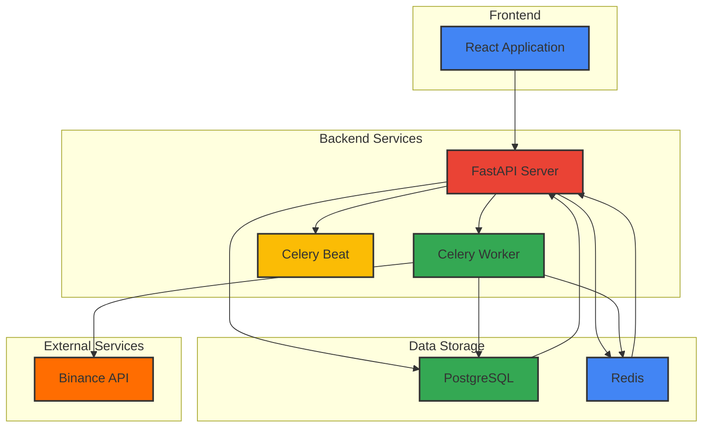
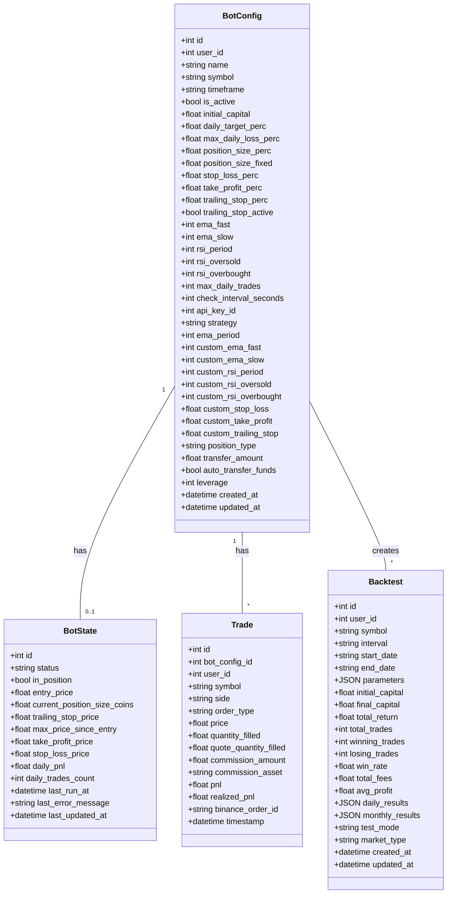
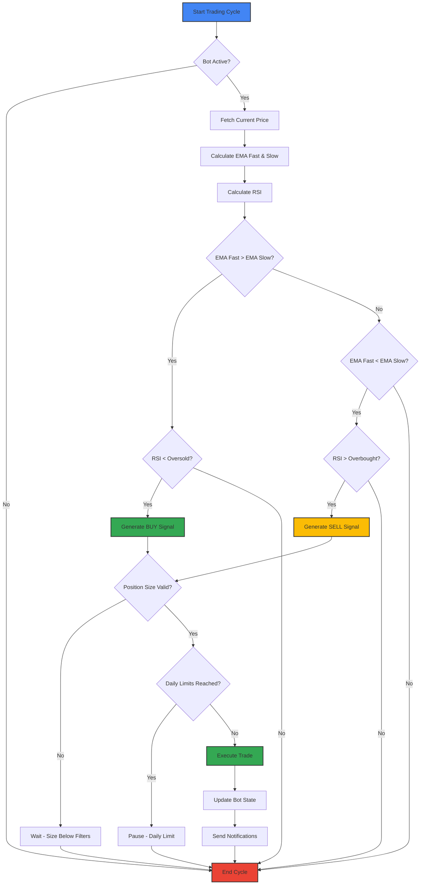
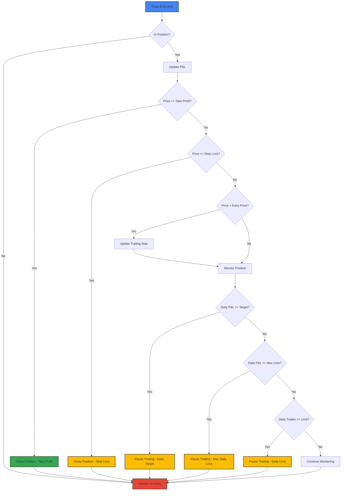
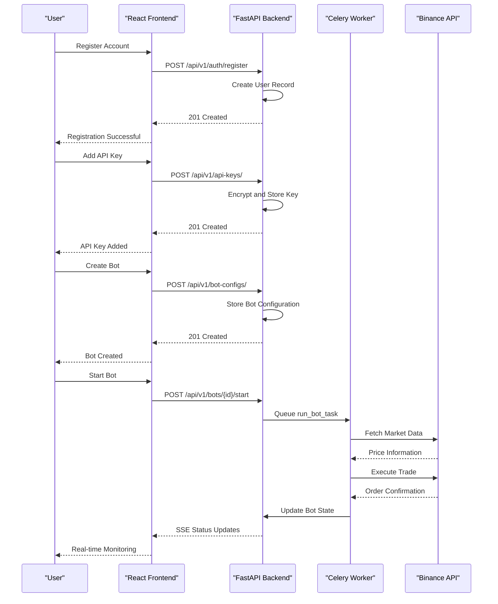
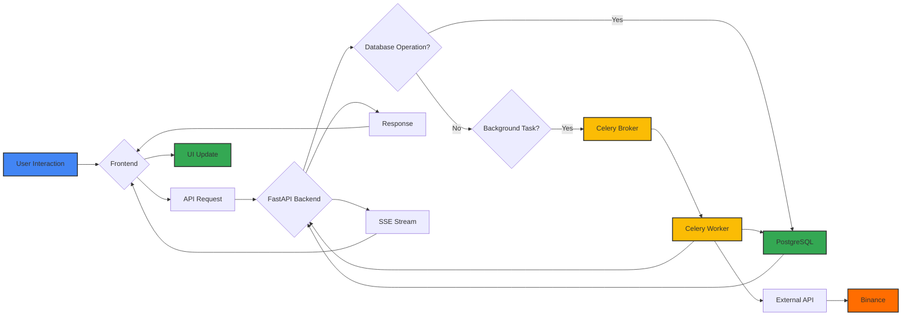

# System Overview

<cite>
**Referenced Files in This Document**   
- [app/main.py](file://app/main.py)
- [app/core/bot_tasks.py](file://app/core/bot_tasks.py)
- [app/core/binance_client.py](file://app/core/binance_client.py)
- [app/models/bot_config.py](file://app/models/bot_config.py)
- [app/models/bot_state.py](file://app/models/bot_state.py)
- [app/models/backtest.py](file://app/models/backtest.py)
- [app/api/routes/bot_config.py](file://app/api/routes/bot_config.py)
- [app/api/routes/bot_state.py](file://app/api/routes/bot_state.py)
- [app/api/routes/backtest.py](file://app/api/routes/backtest.py)
- [app/schemas/bot_config.py](file://app/schemas/bot_config.py)
- [app/schemas/bot_state.py](file://app/schemas/bot_state.py)
- [app/schemas/backtest.py](file://app/schemas/backtest.py)
- [frontend/src/pages/Bots/BotCreatePage.jsx](file://frontend/src/pages/Bots/BotCreatePage.jsx)
- [frontend/src/pages/Bots/BotDetailPage.jsx](file://frontend/src/pages/Bots/BotDetailPage.jsx)
- [frontend/src/services/api.js](file://frontend/src/services/api.js)
- [docker-compose.yml](file://docker-compose.yml)
- [README.md](file://README.md)
</cite>

## Table of Contents
1. [Introduction](#introduction)
2. [System Architecture](#system-architecture)
3. [Core Components](#core-components)
4. [Trading Strategy Implementation](#trading-strategy-implementation)
5. [Risk Management System](#risk-management-system)
6. [User Journey and Bot Management](#user-journey-and-bot-management)
7. [Data Flow and Component Interaction](#data-flow-and-component-interaction)
8. [Conclusion](#conclusion)

## Introduction

The TradeBot system is a full-stack cryptocurrency trading platform designed to automate trading strategies on the Binance exchange. This document provides a comprehensive overview of the system, focusing on its architecture, core components, and operational workflows. The platform enables users to create, manage, and monitor automated trading bots that execute EMA/RSI strategies with sophisticated risk management features.

TradeBot connects to the Binance API to execute trades based on user-defined parameters and market conditions. The system is built with a modern technology stack, featuring a FastAPI backend for handling business logic and API requests, a React frontend for user interaction, PostgreSQL for persistent data storage, Redis for caching, and Celery for managing background tasks. This architecture allows for efficient processing of market data, execution of trading strategies, and real-time monitoring of bot performance.

The platform supports both spot and futures trading with configurable leverage, providing users with flexibility in their trading approaches. Key features include backtesting capabilities, real-time performance monitoring, email notifications for trade execution, and comprehensive risk management controls such as stop-loss, take-profit, and trailing stop mechanisms. The system also implements daily trading limits and profit targets to help users manage their risk exposure effectively.

**Section sources**
- [README.md](file://README.md#L1-L746)

## System Architecture

The TradeBot system follows a microservices-inspired architecture with clearly defined components that work together to provide a seamless trading experience. The system is containerized using Docker, with each major component running in its own container, ensuring isolation, scalability, and ease of deployment.

The architecture consists of several key components: the React frontend serves as the user interface, providing an intuitive dashboard for managing trading bots; the FastAPI backend handles all business logic, API requests, and database interactions; PostgreSQL stores all persistent data including user accounts, bot configurations, and trading history; Redis provides caching for frequently accessed data such as market symbols and prices; and Celery manages background tasks including the core trading loop and periodic maintenance operations.

The system is orchestrated using Docker Compose, which defines the relationships between containers and their networking configuration. The frontend container serves the React application, while the backend container hosts the FastAPI application. The Celery worker and beat containers handle asynchronous task processing, with Celery worker executing individual bot tasks and Celery beat scheduling periodic operations. All containers communicate through a shared network, with the backend acting as the central hub that coordinates interactions between components.

**Diagram sources**
- [docker-compose.yml](file://docker-compose.yml#L1-L276)

**Section sources**
- [docker-compose.yml](file://docker-compose.yml#L1-L276)
- [README.md](file://README.md#L1-L746)

## Core Components

The TradeBot system comprises several core components that work together to enable automated trading. The most fundamental component is the bot configuration system, which allows users to define the parameters for their trading bots. Each bot configuration (bot_config) includes essential information such as the trading symbol, timeframe, strategy type, and various technical indicator parameters. The configuration also includes risk management settings like stop-loss and take-profit percentages, as well as advanced options for position sizing and trading limits.

The bot state system (bot_state) maintains the current operational status of each trading bot. This includes information such as whether the bot is currently in a position, the entry price, current profit and loss, and various stop-loss and take-profit price levels. The bot state is updated in real-time as the bot executes trades and responds to market conditions, providing a comprehensive view of the bot's current status and performance.

The trading engine is implemented as a Celery task that runs periodically based on the configured check interval. This task retrieves the current market price, calculates technical indicators, evaluates trading signals, and executes trades when conditions are met. The engine includes comprehensive error handling and logging to ensure reliable operation, with mechanisms to pause trading when daily limits are reached or when errors occur. The system also includes a daily reset task that reactivates paused bots at the start of each trading day, allowing users to continue trading with fresh daily limits.

**Diagram sources**
- [app/models/bot_config.py](file://app/models/bot_config.py#L1-L58)
- [app/models/bot_state.py](file://app/models/bot_state.py#L1-L23)
- [app/models/backtest.py](file://app/models/backtest.py#L1-L43)

**Section sources**
- [app/models/bot_config.py](file://app/models/bot_config.py#L1-L58)
- [app/models/bot_state.py](file://app/models/bot_state.py#L1-L23)
- [app/models/backtest.py](file://app/models/backtest.py#L1-L43)
- [app/core/bot_tasks.py](file://app/core/bot_tasks.py#L1-L518)

## Trading Strategy Implementation

The TradeBot system implements a sophisticated EMA/RSI trading strategy that combines multiple technical indicators to generate trading signals. The core strategy, identified by the "ema" strategy type, uses Exponential Moving Averages (EMA) and Relative Strength Index (RSI) to determine optimal entry and exit points for trades. The system allows users to customize the parameters for these indicators through the bot configuration interface, enabling them to fine-tune the strategy to their specific trading preferences.

The EMA component of the strategy compares a fast EMA (typically with a shorter period) to a slow EMA (with a longer period). When the fast EMA crosses above the slow EMA, it generates a buy signal, indicating upward momentum. Conversely, when the fast EMA crosses below the slow EMA, it generates a sell signal, indicating downward momentum. Users can configure the periods for both EMAs through the custom_ema_fast and custom_ema_slow parameters in the bot configuration.

The RSI component acts as a confirmation filter for the EMA signals, helping to avoid false signals during overbought or oversold conditions. The RSI is calculated based on price changes over a specified period (custom_rsi_period), with values ranging from 0 to 100. When the RSI falls below a configurable oversold threshold (custom_rsi_oversold), it indicates that the asset may be undervalued, potentially confirming a buy signal from the EMA crossover. When the RSI rises above a configurable overbought threshold (custom_rsi_overbought), it indicates that the asset may be overvalued, potentially confirming a sell signal from the EMA crossover.

**Diagram sources**
- [app/core/bot_tasks.py](file://app/core/bot_tasks.py#L245-L319)

**Section sources**
- [app/core/bot_tasks.py](file://app/core/bot_tasks.py#L245-L319)
- [app/schemas/bot_config.py](file://app/schemas/bot_config.py#L1-L81)

## Risk Management System

The TradeBot system incorporates a comprehensive risk management framework designed to protect users' capital and ensure sustainable trading operations. The system implements multiple layers of risk controls, including position sizing, stop-loss mechanisms, take-profit targets, trailing stops, and daily trading limits. These features work together to minimize potential losses while allowing users to capture profits and manage their risk exposure effectively.

Position sizing is controlled through two complementary parameters: position_size_perc and position_size_fixed. The position_size_perc parameter allows users to specify what percentage of their initial capital should be used for each trade, providing a dynamic sizing approach that scales with account size. The position_size_fixed parameter allows users to specify a fixed amount of capital to be used for each trade, providing a consistent position size regardless of account fluctuations. These parameters ensure that users don't overcommit their capital to any single trade.

The system implements three types of exit strategies to manage risk and lock in profits. The stop-loss mechanism automatically closes a position when the price moves against the trade by a specified percentage (custom_stop_loss), limiting potential losses. The take-profit mechanism automatically closes a position when the price moves in favor of the trade by a specified percentage (custom_take_profit), locking in profits at a predetermined level. The trailing stop mechanism (custom_trailing_stop) dynamically adjusts the stop-loss level as the price moves in favor of the trade, allowing users to capture more profit during strong trends while still protecting against reversals.

**Diagram sources**
- [app/core/bot_tasks.py](file://app/core/bot_tasks.py#L351-L398)

**Section sources**
- [app/core/bot_tasks.py](file://app/core/bot_tasks.py#L351-L398)
- [app/models/bot_config.py](file://app/models/bot_config.py#L1-L58)

## User Journey and Bot Management

The user journey in the TradeBot system begins with account creation and progresses through bot configuration, activation, monitoring, and performance analysis. Users first register an account through the frontend interface, which securely stores their credentials in the PostgreSQL database. After logging in, users can add their Binance API keys, which are encrypted using Fernet encryption before being stored in the database, ensuring the security of their trading credentials.

Once API keys are configured, users can create trading bots through the bot creation interface. This multi-step form guides users through configuring their bot's parameters, including selecting the trading pair, choosing between spot and futures trading, setting leverage for futures positions, and defining their trading strategy parameters. The interface provides real-time validation and helpful guidance for each parameter, making it accessible even for users with limited trading experience.

After creating a bot, users can manage its lifecycle through the bot detail page. From this interface, users can start or stop their bots with a single click, view real-time performance metrics, and access detailed trading history. The system provides visual indicators of the bot's current status, including whether it is actively trading, waiting for signals, or paused due to reaching daily limits. Users can also edit their bot's configuration or delete the bot entirely if they no longer wish to use it.

**Diagram sources**
- [frontend/src/pages/Bots/BotCreatePage.jsx](file://frontend/src/pages/Bots/BotCreatePage.jsx#L1-L800)
- [frontend/src/pages/Bots/BotDetailPage.jsx](file://frontend/src/pages/Bots/BotDetailPage.jsx#L1-L711)
- [frontend/src/services/api.js](file://frontend/src/services/api.js#L1-L375)
- [app/api/routes/bot_config.py](file://app/api/routes/bot_config.py#L1-L53)
- [app/api/routes/bot_runner.py](file://app/api/routes/bot_runner.py#L1-L56)

**Section sources**
- [frontend/src/pages/Bots/BotCreatePage.jsx](file://frontend/src/pages/Bots/BotCreatePage.jsx#L1-L800)
- [frontend/src/pages/Bots/BotDetailPage.jsx](file://frontend/src/pages/Bots/BotDetailPage.jsx#L1-L711)
- [app/api/routes/bot_config.py](file://app/api/routes/bot_config.py#L1-L53)
- [app/api/routes/bot_runner.py](file://app/api/routes/bot_runner.py#L1-L56)

## Data Flow and Component Interaction

The TradeBot system features a well-defined data flow that connects the frontend user interface with the backend processing components and external services. When a user interacts with the frontend, their actions are translated into API requests that are sent to the FastAPI backend. The backend processes these requests, validates the data, and either updates the database directly or queues background tasks through Celery for more complex operations.

For bot management operations such as creating, updating, or deleting bot configurations, the data flow is relatively straightforward. The frontend sends a request to the appropriate API endpoint, the backend validates the user's authentication and authorization, processes the request, and updates the PostgreSQL database. The response is then sent back to the frontend, which updates the user interface accordingly. This synchronous flow ensures that configuration changes are immediately reflected in the system.

For trading operations, the data flow involves asynchronous processing through Celery. When a user starts a bot, the backend queues a Celery task that runs the core trading loop. This task periodically checks market conditions, evaluates trading signals, and executes trades when appropriate. The results of these operations are stored in the database, and status updates are pushed to the frontend through Server-Sent Events (SSE), enabling real-time monitoring of bot performance without requiring constant polling.

**Diagram sources**
- [app/main.py](file://app/main.py#L1-L94)
- [app/core/bot_tasks.py](file://app/core/bot_tasks.py#L1-L518)
- [frontend/src/services/api.js](file://frontend/src/services/api.js#L1-L375)

**Section sources**
- [app/main.py](file://app/main.py#L1-L94)
- [app/core/bot_tasks.py](file://app/core/bot_tasks.py#L1-L518)
- [frontend/src/services/api.js](file://frontend/src/services/api.js#L1-L375)

## Conclusion

The TradeBot system represents a comprehensive full-stack solution for automated cryptocurrency trading, combining a user-friendly interface with sophisticated trading algorithms and robust risk management features. The system's architecture effectively separates concerns between the frontend presentation layer, backend business logic, and background processing components, enabling scalable and maintainable operation.

Key strengths of the system include its support for both spot and futures trading with configurable leverage, its implementation of the EMA/RSI strategy with customizable parameters, and its comprehensive risk management framework that includes stop-loss, take-profit, trailing stop, and daily trading limits. The integration with the Binance API allows for real-time trading execution, while the backtesting capabilities enable users to validate their strategies before deploying them with real capital.

The system's use of modern technologies such as FastAPI, React, PostgreSQL, Redis, and Celery provides a solid foundation for performance, reliability, and extensibility. The containerized deployment model using Docker simplifies installation and scaling, while the modular architecture allows for future enhancements and feature additions. Overall, TradeBot offers a powerful platform for both novice and experienced traders to automate their cryptocurrency trading strategies with confidence and control.

**Section sources**
- [README.md](file://README.md#L1-L746)
- [docker-compose.yml](file://docker-compose.yml#L1-L276)