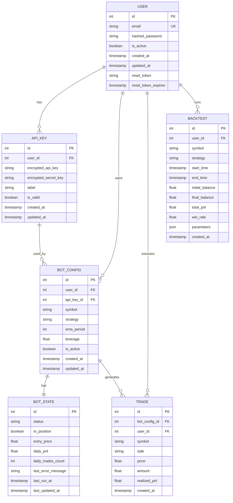
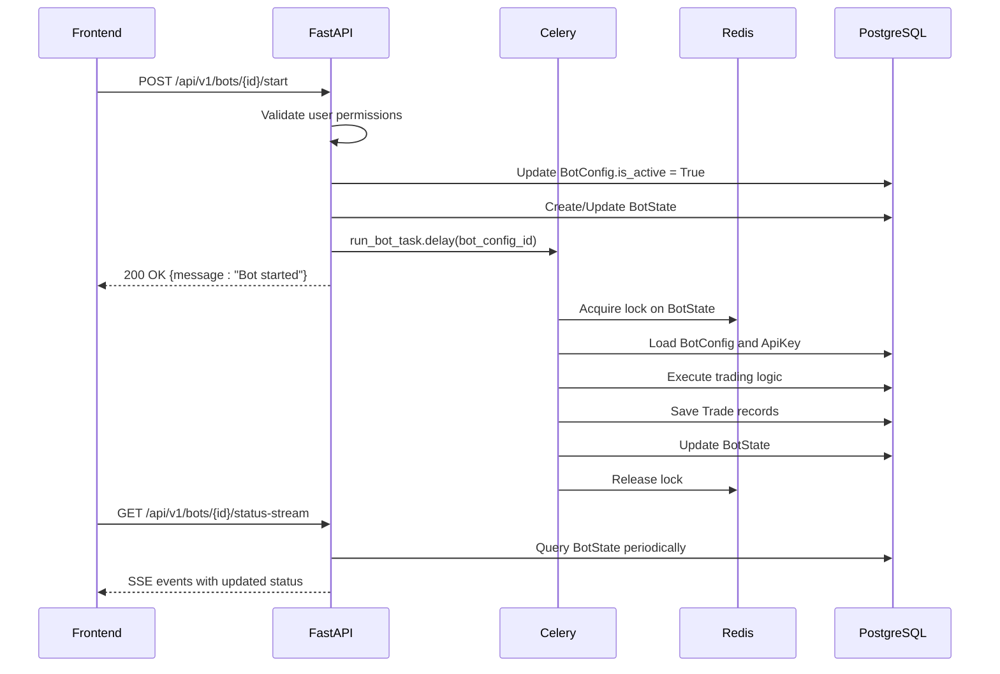
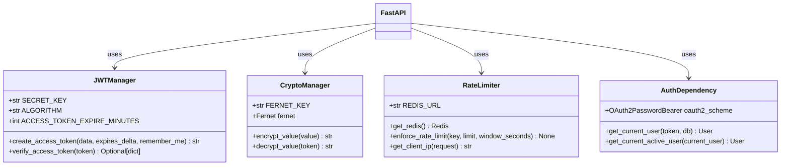

# Backend Technologies

<cite>
**Referenced Files in This Document**   
- [main.py](file://app/main.py)
- [database.py](file://app/database.py)
- [db_base.py](file://app/db_base.py)
- [celery_app.py](file://app/core/celery_app.py)
- [bot_tasks.py](file://app/core/bot_tasks.py)
- [redis_client.py](file://app/core/redis_client.py)
- [jwt.py](file://app/core/jwt.py)
- [crypto.py](file://app/core/crypto.py)
- [rate_limit.py](file://app/core/rate_limit.py)
- [auth.py](file://app/api/routes/auth.py)
- [bot_runner.py](file://app/api/routes/bot_runner.py)
- [api_key.py](file://app/models/api_key.py)
- [user.py](file://app/models/user.py)
</cite>

## Table of Contents
1. [Introduction](#introduction)
2. [Technology Stack Overview](#technology-stack-overview)
3. [FastAPI: RESTful API Framework](#fastapi-restful-api-framework)
4. [SQLAlchemy 2.0 with PostgreSQL](#sqlalchemy-20-with-postgresql)
5. [Celery 5.5 for Distributed Task Processing](#celery-55-for-distributed-task-processing)
6. [Redis 6.1: Cache and Message Broker](#redis-61-cache-and-message-broker)
7. [Integration Architecture](#integration-architecture)
8. [Security Practices](#security-practices)
9. [Performance Optimization Patterns](#performance-optimization-patterns)
10. [Conclusion](#conclusion)

## Introduction
The TradeBot Python application leverages a modern backend technology stack designed for high-performance trading automation. This document details the core backend components: FastAPI as the web framework, SQLAlchemy 2.0 as the ORM for PostgreSQL, Celery 5.5 for distributed task processing, and Redis 6.1 serving dual roles as a cache layer and message broker. The integration between these technologies enables real-time trading decisions, secure user authentication, rate limiting, and persistent state management. The system is designed with production-grade security, scalability, and fault tolerance in mind.

## Technology Stack Overview
The TradeBot backend combines asynchronous web handling, robust database interactions, distributed task execution, and in-memory data management. FastAPI provides type-safe, high-performance REST endpoints with automatic OpenAPI documentation. SQLAlchemy 2.0 offers a modern ORM interface to PostgreSQL, ensuring data integrity and efficient querying. Celery handles background trading logic execution with periodic scheduling, while Redis facilitates both low-latency caching and reliable message queuing between components. This combination allows the system to handle real-time market data, execute trading strategies, and maintain user state efficiently.

## FastAPI: RESTful API Framework
FastAPI serves as the primary web framework for exposing RESTful APIs in the TradeBot application. It provides automatic validation, serialization, and OpenAPI/Swagger documentation generation. The framework's asynchronous capabilities align with the async SQLAlchemy and Redis clients, enabling non-blocking I/O operations. Key endpoints in `app/api/routes/` handle authentication, bot configuration, trade execution, and real-time status streaming. FastAPI's dependency injection system manages database sessions and authentication flows, while middleware handles CORS policies based on the environment configuration.

**Section sources**
- [main.py](file://app/main.py#L1-L94)
- [auth.py](file://app/api/routes/auth.py#L1-L32)

## SQLAlchemy 2.0 with PostgreSQL
SQLAlchemy 2.0 is used as the Object-Relational Mapper (ORM) to interact with PostgreSQL, providing a Pythonic interface to the database schema. The declarative base is defined in `app/db_base.py`, and models in `app/models/` map directly to database tables managed by Alembic migrations. The async engine and session factory in `app/database.py` enable non-blocking database operations, crucial for maintaining responsiveness during high-frequency trading operations. Relationships between entities such as User, BotConfig, ApiKey, and Trade are defined with proper foreign key constraints and cascading behaviors.



**Diagram sources**
- [db_base.py](file://app/db_base.py#L1-L4)
- [database.py](file://app/database.py#L1-L24)
- [user.py](file://app/models/user.py#L1-L24)
- [api_key.py](file://app/models/api_key.py#L1-L17)

**Section sources**
- [database.py](file://app/database.py#L1-L24)
- [db_base.py](file://app/db_base.py#L1-L4)

## Celery 5.5 for Distributed Task Processing
Celery 5.5 powers the distributed task processing system, executing trading logic and periodic maintenance tasks. The Celery application is configured in `app/core/celery_app.py` with Redis as both broker and result backend. Critical tasks in `app/core/bot_tasks.py` include `run_bot_task` for executing individual trading strategies and `run_bot_task_for_all` for periodic processing of all active bots. Celery Beat schedules tasks such as daily bot reactivation and periodic strategy execution. The configuration includes safety measures like late acknowledgments, time limits, and controlled prefetching to prevent worker overload.

```mermaid
flowchart TD
A[FastAPI Endpoint] --> B{Start/Stop Bot}
B --> C[Trigger Celery Task]
C --> D[run_bot_task.delay(bot_config_id)]
D --> E[Celery Worker]
E --> F[Execute Trading Logic]
F --> G[Update Bot State in DB]
G --> H[Store Results in PostgreSQL]
I[Celery Beat] --> J[Scheduled Tasks]
J --> K[run_bot_task_for_all]
J --> L[reactivate_bots_after_reset]
K --> E
L --> E
```

**Diagram sources**
- [celery_app.py](file://app/core/celery_app.py#L1-L44)
- [bot_tasks.py](file://app/core/bot_tasks.py#L86-L145)
- [bot_runner.py](file://app/api/routes/bot_runner.py#L1-L55)

**Section sources**
- [celery_app.py](file://app/core/celery_app.py#L1-L44)
- [bot_tasks.py](file://app/core/bot_tasks.py#L1-L145)

## Redis 6.1: Cache and Message Broker
Redis 6.1 serves dual critical roles in the TradeBot architecture: as a message broker for Celery and as a high-speed cache for frequently accessed data. The Redis client in `app/core/redis_client.py` provides both synchronous and asynchronous interfaces, supporting JSON serialization for complex data structures. Cache keys are defined for market symbols (spot and futures), enabling rapid access to trading pairs. Redis also powers the rate limiting system in `app/core/rate_limit.py`, preventing abuse of authentication endpoints. The same Redis instance facilitates communication between FastAPI and Celery workers, ensuring consistent state management.

**Section sources**
- [redis_client.py](file://app/core/redis_client.py#L1-L129)
- [rate_limit.py](file://app/core/rate_limit.py#L1-L43)

## Integration Architecture
The backend components integrate through well-defined interfaces and data flows. FastAPI endpoints in `app/api/routes/` trigger Celery tasks that process trading logic in `app/core/bot_tasks.py`. SQLAlchemy models in `app/models/` map to PostgreSQL tables, with Alembic managing schema migrations. Redis stores temporary state and facilitates communication between the web application and Celery workers. The JWT authentication flow in `app/core/jwt.py` secures API access, while rate limiting uses Redis to track request counts. Real-time updates are delivered via Server-Sent Events in `app/main.py`, streaming bot status changes to the frontend.



**Diagram sources**
- [main.py](file://app/main.py#L67-L93)
- [bot_runner.py](file://app/api/routes/bot_runner.py#L1-L55)
- [bot_tasks.py](file://app/core/bot_tasks.py#L114-L145)
- [redis_client.py](file://app/core/redis_client.py#L1-L129)

**Section sources**
- [main.py](file://app/main.py#L1-L94)
- [bot_runner.py](file://app/api/routes/bot_runner.py#L1-L55)

## Security Practices
The TradeBot application implements multiple security layers to protect user data and trading operations. JWT authentication in `app/core/jwt.py` uses environment-configurable secrets with extended expiration times (7 days for login, 30 days for "Remember Me"). API keys are encrypted using Fernet symmetric encryption from the Cryptography library, with the key managed through environment variables and protected during production deployment. The system enforces rate limiting on authentication endpoints using Redis, preventing brute force attacks. Database connections use asyncpg for PostgreSQL, and all sensitive operations are protected by dependency-injected authentication checks.



**Diagram sources**
- [jwt.py](file://app/core/jwt.py#L1-L45)
- [crypto.py](file://app/core/crypto.py#L1-L24)
- [rate_limit.py](file://app/core/rate_limit.py#L1-L43)
- [auth.py](file://app/api/routes/auth.py#L1-L32)

**Section sources**
- [jwt.py](file://app/core/jwt.py#L1-L45)
- [crypto.py](file://app/core/crypto.py#L1-L24)
- [rate_limit.py](file://app/core/rate_limit.py#L1-L43)

## Performance Optimization Patterns
The application employs several performance optimization patterns for production efficiency. Cache warmup tasks in `app/core/cache_warmup_tasks.py` pre-load market symbol data at startup, reducing initial latency. The Celery configuration uses `task_acks_late` and `worker_prefetch_multiplier=1` to prevent task loss during worker failures and avoid overwhelming workers. Database sessions are properly scoped and closed using FastAPI's dependency system. The rate limiting implementation gracefully degrades when Redis is unavailable, ensuring system availability. Asynchronous Redis and database clients prevent blocking operations, maintaining responsiveness under load.

**Section sources**
- [celery_app.py](file://app/core/celery_app.py#L1-L44)
- [main.py](file://app/main.py#L46-L70)
- [database.py](file://app/database.py#L1-L24)

## Conclusion
The TradeBot backend effectively integrates FastAPI, SQLAlchemy 2.0, Celery 5.5, and Redis 6.1 into a cohesive, production-ready trading automation system. The architecture enables secure, scalable, and responsive trading operations with proper separation of concerns. FastAPI provides a robust API surface, SQLAlchemy ensures data integrity with PostgreSQL, Celery handles background processing, and Redis enables both caching and message brokering. Security practices including JWT authentication, encrypted API keys, and rate limiting protect user assets. The system demonstrates thoughtful design choices for performance, reliability, and maintainability in a financial application context.