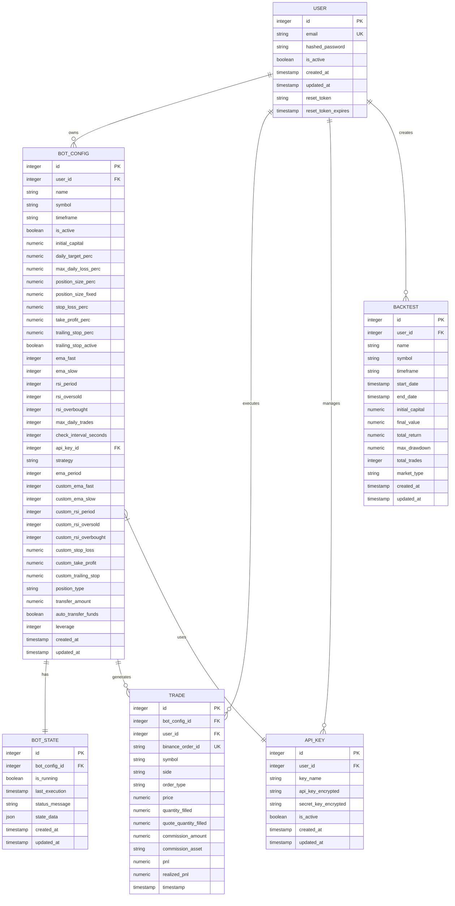
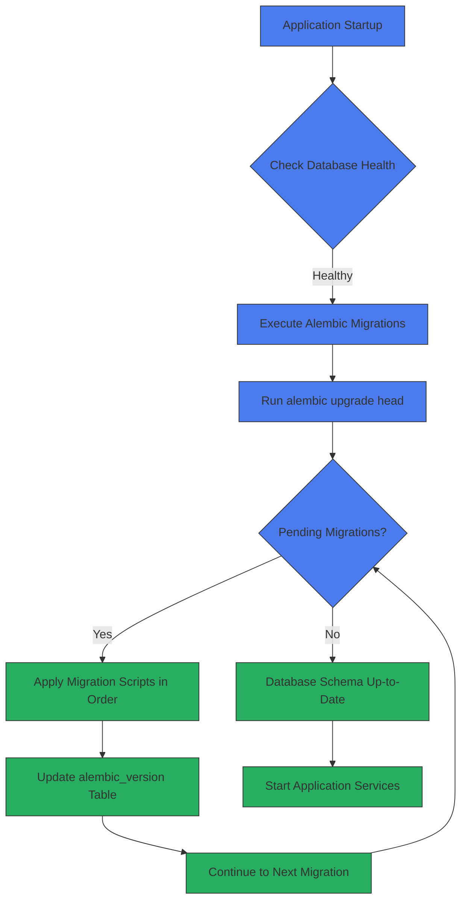
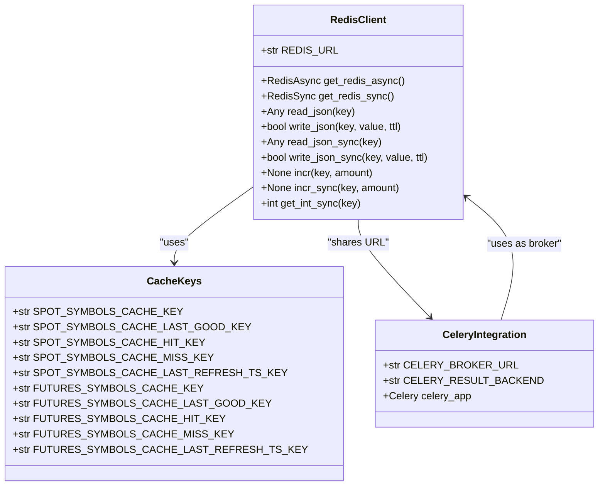

# Database and Cache Infrastructure

<cite>
**Referenced Files in This Document**   
- [docker-compose.yml](file://docker-compose.yml)
- [app/models/user.py](file://app/models/user.py)
- [app/models/bot_config.py](file://app/models/bot_config.py)
- [app/models/trade.py](file://app/models/trade.py)
- [app/database.py](file://app/database.py)
- [app/core/redis_client.py](file://app/core/redis_client.py)
- [app/core/celery_app.py](file://app/core/celery_app.py)
- [alembic/env.py](file://alembic/env.py)
- [app/core/cache.py](file://app/core/cache.py)
</cite>

## Table of Contents
1. [Introduction](#introduction)
2. [Database and Cache Deployment Architecture](#database-and-cache-deployment-architecture)
3. [PostgreSQL Database Schema Design](#postgresql-database-schema-design)
4. [Database Migration Strategy](#database-migration-strategy)
5. [Connection Pooling and Async Configuration](#connection-pooling-and-async-configuration)
6. [Redis Cache Implementation](#redis-cache-implementation)
7. [Performance Considerations](#performance-considerations)
8. [Security Configuration](#security-configuration)
9. [Conclusion](#conclusion)

## Introduction
This document provides comprehensive architectural documentation for the database and cache infrastructure of the trading bot system. The system utilizes PostgreSQL 15 as its primary relational database for persistent storage of critical application data, and Redis 7 as an in-memory data store for caching market data and serving as a message broker for Celery task processing. The infrastructure is deployed using Docker Compose with careful attention to data persistence, health monitoring, and network isolation. The document details the schema design, migration strategy, connection configuration, performance optimization, and security aspects of this infrastructure.

## Database and Cache Deployment Architecture

The database and cache infrastructure is orchestrated through Docker Compose, providing isolated, containerized services with proper networking, volume mounting, and health checks. The architecture ensures high availability, data persistence, and secure communication between components.

```mermaid
graph TB
subgraph "Docker Network: tradebot-network"
postgres[PostgreSQL 15<br/>Persistent Storage]
redis[Redis 7<br/>In-Memory Cache & Broker]
backend[Backend API]
celery[Celery Worker/Beat]
frontend[Frontend Application]
nginx[Nginx Reverse Proxy]
backend --> postgres
backend --> redis
celery --> postgres
celery --> redis
frontend --> backend
nginx --> frontend
nginx --> backend
end
postgres --> |Volume: postgres_data| Volume1[(Persistent Volume)]
redis --> |Volume: redis_data| Volume2[(Persistent Volume)]
backend --> |Volume: logs| Volume3[(Logs Volume)]
backend --> |Volume: cache| Volume4[(Data Cache Volume)]
style postgres fill:#4B7BEC,stroke:#333
style redis fill:#D94F43,stroke:#333
style backend fill:#27AE60,stroke:#333
style celery fill:#8E44AD,stroke:#333
style frontend fill:#F39C12,stroke:#333
style nginx fill:#34495E,stroke:#333
```

**Diagram sources**
- [docker-compose.yml](file://docker-compose.yml#L3-L276)

**Section sources**
- [docker-compose.yml](file://docker-compose.yml#L3-L276)

## PostgreSQL Database Schema Design

The PostgreSQL database schema is designed to store all critical application data including user accounts, bot configurations, trading history, and backtest results. The schema is implemented using SQLAlchemy ORM models that define the structure, relationships, and constraints of the data.

The core entities include:
- **users**: Stores user account information with authentication credentials
- **bot_configs**: Contains trading bot configurations with technical and risk parameters
- **trades**: Records all executed trades with financial details and PnL calculations
- **api_keys**: Manages API credentials for external exchange access
- **backtests**: Stores historical backtesting results
- **bot_state**: Maintains the current state of active trading bots

**Diagram sources**
- [app/models/user.py](file://app/models/user.py#L5-L22)
- [app/models/bot_config.py](file://app/models/bot_config.py#L5-L57)
- [app/models/trade.py](file://app/models/trade.py#L5-L25)

**Section sources**
- [app/models/user.py](file://app/models/user.py#L5-L22)
- [app/models/bot_config.py](file://app/models/bot_config.py#L5-L57)
- [app/models/trade.py](file://app/models/trade.py#L5-L25)

## Database Migration Strategy

The system employs Alembic for database schema migrations, providing a versioned, incremental approach to database evolution. Migrations are stored in the `alembic/versions/` directory as Python scripts, each representing a specific schema change.

The migration process is automated during container startup through the backend service's command sequence, which executes `alembic upgrade head` to apply all pending migrations. This ensures that the database schema is always up-to-date when the application starts.

The Alembic configuration (`alembic/env.py`) dynamically sets the database URL from environment variables, with special handling to convert asyncpg URLs to psycopg2 format for compatibility with Alembic's synchronous operations.

**Diagram sources**
- [docker-compose.yml](file://docker-compose.yml#L96-L102)
- [alembic/env.py](file://alembic/env.py#L1-L98)

**Section sources**
- [docker-compose.yml](file://docker-compose.yml#L96-L102)
- [alembic/env.py](file://alembic/env.py#L1-L98)

## Connection Pooling and Async Configuration

The application uses SQLAlchemy 2.0 with asyncpg for asynchronous database operations, providing non-blocking I/O and efficient connection pooling. The connection configuration is centralized in `app/database.py`, which creates an async engine with appropriate settings for production use.

Key connection pool settings include:
- `autoflush=False`: Prevents automatic flushing of changes to the database
- `expire_on_commit=False`: Keeps object attributes accessible after session commit
- Connection pooling managed by SQLAlchemy with default pool settings
- Echo logging configurable via SQLALCHEMY_ECHO environment variable

The async configuration enables the application to handle multiple database operations concurrently, which is particularly important for the trading bot system that must process market data and execute trades in real-time.

**Section sources**
- [app/database.py](file://app/database.py#L1-L24)

## Redis Cache Implementation

Redis serves dual purposes in the architecture: as an in-memory cache for frequently accessed market data and as the message broker for Celery task distribution. The implementation provides both synchronous and asynchronous Redis clients through singleton patterns in `app/core/redis_client.py`.

The cache is used for:
- Storing market symbol data with TTL-based expiration
- Caching API responses to reduce external API calls
- Serving as Celery's message broker for task queuing
- Storing task results through Celery's result backend
- Maintaining rate limiting counters
- Storing temporary session data

The Redis client implementation includes helper functions for JSON serialization, atomic counters, and type-safe operations. Cache keys follow a consistent naming convention with prefixes for cache entries, metrics, and timestamps.

**Diagram sources**
- [app/core/redis_client.py](file://app/core/redis_client.py#L1-L129)
- [app/core/celery_app.py](file://app/core/celery_app.py#L1-L44)

**Section sources**
- [app/core/redis_client.py](file://app/core/redis_client.py#L1-L129)
- [app/core/celery_app.py](file://app/core/celery_app.py#L1-L44)

## Performance Considerations

The database and cache infrastructure incorporates several performance optimization strategies to ensure responsive operation under load.

### Database Performance
- **Indexing Strategy**: Primary keys, foreign keys, and frequently queried fields are indexed
- **Query Optimization**: Use of SQLAlchemy's lazy/eager loading patterns to minimize N+1 queries
- **Async Operations**: Non-blocking database operations prevent thread blocking
- **Connection Pooling**: Efficient reuse of database connections

### Redis Performance
- **Persistence Configuration**: Redis is configured with append-only file (AOF) persistence (`appendonly yes`) for durability while maintaining performance
- **Memory Optimization**: Data structures are chosen for memory efficiency
- **TTL Management**: Cache entries have appropriate time-to-live settings to balance freshness and performance
- **Batch Operations**: Where possible, operations are batched to reduce network round trips

### Caching Strategy
The system implements a multi-layer caching approach:
1. **In-Memory Cache**: Redis for frequently accessed data with short TTL
2. **File-Based Cache**: Local filesystem cache for historical market data that rarely changes
3. **Application-Level Cache**: In-memory objects for frequently accessed configuration data

The `DataCache` class in `app/core/cache.py` manages file-based caching of market data with intelligent expiration logic based on data recency.

**Section sources**
- [app/core/cache.py](file://app/core/cache.py#L1-L192)
- [docker-compose.yml](file://docker-compose.yml#L46-L47)
- [app/database.py](file://app/database.py#L13-L19)

## Security Configuration

The infrastructure implements multiple security layers to protect sensitive data and prevent unauthorized access.

### Database Security
- **Password Management**: Database passwords are managed through environment variables, with the installer generating secure random passwords
- **Network Isolation**: PostgreSQL container is only accessible within the Docker network, not exposed to the host
- **Read-Only Containers**: Backend and worker containers run in read-only mode to prevent unauthorized file system modifications
- **Privilege Dropping**: Containers drop all capabilities and run without new privileges

### Redis Security
- **Password Protection**: Redis server requires authentication when REDIS_PASSWORD is set
- **Network Isolation**: Redis container is only accessible within the Docker network
- **Secure Configuration**: Redis server runs with requirepass when password is provided

### General Security
- **Environment Variables**: Sensitive credentials are passed through environment variables rather than hardcoded values
- **Container Hardening**: All containers use security optimizations including no-new-privileges, capability dropping, and read-only filesystems
- **Network Segmentation**: Services communicate over an isolated Docker bridge network
- **Health Checks**: Comprehensive health checks ensure service integrity

The security configuration balances protection with operational requirements, ensuring that the trading bot can access necessary resources while minimizing attack surface.

**Section sources**
- [docker-compose.yml](file://docker-compose.yml#L13-L15)
- [docker-compose.yml](file://docker-compose.yml#L40-L47)
- [docker-compose.yml](file://docker-compose.yml#L83-L88)
- [docker-compose.yml](file://docker-compose.yml#L131-L135)
- [installer/main.py](file://installer/main.py#L248-L272)

## Conclusion

The database and cache infrastructure provides a robust foundation for the trading bot application, combining PostgreSQL 15 for reliable persistent storage and Redis 7 for high-performance caching and message brokering. The Docker-based deployment ensures consistent environment configuration across development and production, with proper data persistence through volume mounting and comprehensive health monitoring.

The schema design effectively models the core domain entities with appropriate relationships and constraints. The Alembic migration system enables safe, versioned schema evolution. The async database configuration supports high-concurrency operations required for real-time trading, while the Redis implementation optimizes performance through intelligent caching and efficient task queuing.

Security is addressed through multiple layers including network isolation, credential management, container hardening, and access controls. Performance is optimized through indexing, connection pooling, and a multi-layer caching strategy.

This infrastructure provides a scalable, secure, and performant foundation for the trading bot system, capable of handling the demands of real-time market data processing and automated trading operations.