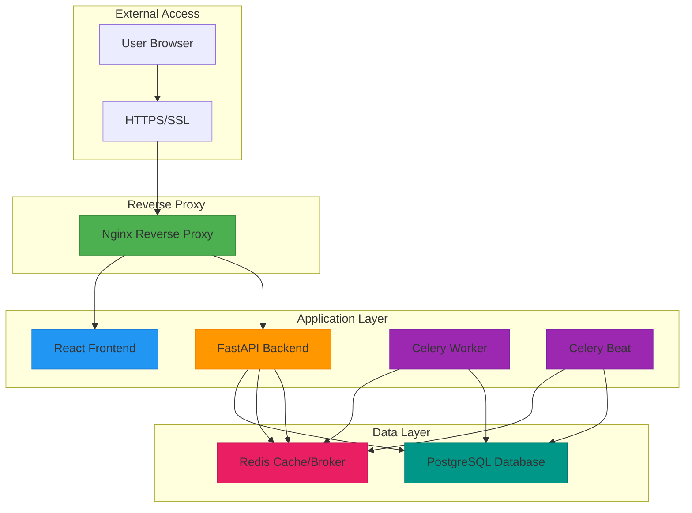
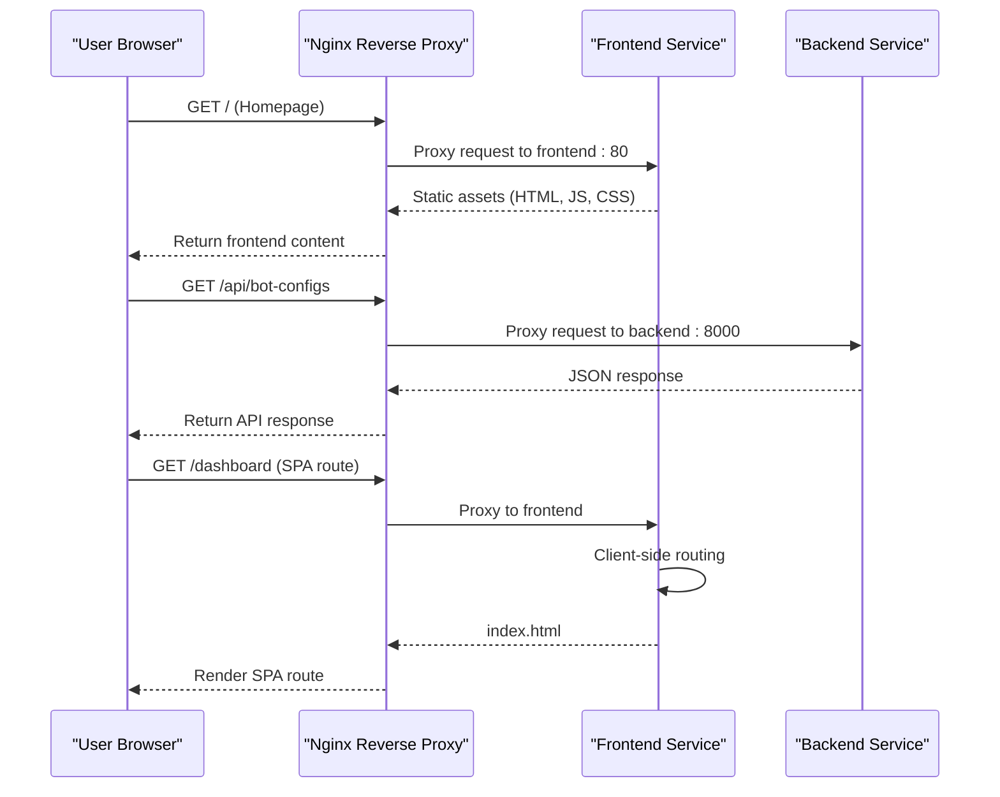

# Deployment and Containerization

<cite>
**Referenced Files in This Document**   
- [docker-compose.yml](file://docker-compose.yml)
- [Dockerfile.backend](file://Dockerfile.backend)
- [frontend/Dockerfile.prod](file://frontend/Dockerfile.prod)
- [nginx/nginx.conf](file://nginx/nginx.conf)
- [frontend/nginx.conf](file://frontend/nginx.conf)
</cite>

## Table of Contents
1. [Introduction](#introduction)
2. [Multi-Container Architecture](#multi-container-architecture)
3. [Docker Build Process](#docker-build-process)
4. [Nginx Configuration](#nginx-configuration)
5. [Operational Aspects](#operational-aspects)
6. [CI/CD and Production Deployment](#cicd-and-production-deployment)
7. [Monitoring and Debugging](#monitoring-and-debugging)

## Introduction
This document provides comprehensive architectural documentation for the deployment and containerization infrastructure of the TradeBot application. The system utilizes Docker Compose to orchestrate a multi-container environment that includes backend (FastAPI), frontend (React), PostgreSQL, Redis, Celery workers, and Nginx reverse proxy services. The architecture is designed for production readiness with security hardening, health checks, and environment-specific configurations.

## Multi-Container Architecture

The TradeBot application employs a microservices-style container architecture orchestrated through Docker Compose, enabling isolated yet interconnected services that communicate over a dedicated Docker network. The architecture consists of six primary services: PostgreSQL for persistent data storage, Redis for caching and message brokering, FastAPI backend for business logic and API endpoints, React frontend for user interface, Celery workers for asynchronous task processing, and Nginx as a reverse proxy for routing and SSL termination.

**Diagram sources**
- [docker-compose.yml](file://docker-compose.yml#L3-L275)

**Section sources**
- [docker-compose.yml](file://docker-compose.yml#L3-L275)

## Docker Build Process

The containerization strategy employs multi-stage Docker builds for both backend and frontend components, optimizing image size and security while maintaining production-ready performance. The backend uses a three-stage build process with separate builder, development, and production stages, while the frontend implements a two-stage build with dedicated builder and production phases.

### Backend Multi-Stage Build
The backend Docker build process follows a security-conscious approach with three distinct stages. The builder stage compiles Python wheel packages from requirements.txt using build dependencies like gcc and libpq-dev. The development stage installs all dependencies directly for rapid iteration during development. The production stage creates a minimal runtime environment by copying pre-compiled wheels from the builder stage, eliminating build tools and reducing attack surface. This approach ensures reproducible builds while minimizing the final image size.

### Frontend Production Build
The frontend build process utilizes a two-stage Docker strategy optimized for React applications. The first stage uses a Node.js 20 Alpine image to install dependencies and build the production-ready static assets using Vite. The second stage employs an Nginx Alpine image to serve the compiled assets, ensuring a lightweight production container. The build process incorporates environment variables during compilation, allowing configuration of the API endpoint URL at build time through the VITE_API_URL argument.

```mermaid
flowchart TD
subgraph BackendBuild["Backend Multi-Stage Build"]
Builder["Builder Stage\n(python:3.11-slim)"]
Production["Production Stage\n(python:3.11-slim)"]
Builder --> |Compile wheels| WheelCache["/wheels cache"]
WheelCache --> Production
Production --> |Install from wheels| FinalImage["tradebot-backend:latest"]
end
subgraph FrontendBuild["Frontend Multi-Stage Build"]
BuildStage["Builder Stage\n(node:20-alpine)"]
ServeStage["Production Stage\n(nginx:alpine)"]
BuildStage --> |Build assets| Dist["/app/dist"]
Dist --> ServeStage
ServeStage --> |Serve via Nginx| FinalFrontend["Frontend Container"]
end
style BackendBuild fill:#f0f8ff,stroke:#4682b4
style FrontendBuild fill:#f0fff0,stroke:#3cb371
```

**Diagram sources**
- [Dockerfile.backend](file://Dockerfile.backend#L1-L86)
- [frontend/Dockerfile.prod](file://frontend/Dockerfile.prod#L1-L49)

**Section sources**
- [Dockerfile.backend](file://Dockerfile.backend#L1-L86)
- [frontend/Dockerfile.prod](file://frontend/Dockerfile.prod#L1-L49)

## Nginx Configuration

The Nginx configuration implements a reverse proxy pattern that routes incoming requests to appropriate backend services while providing SSL termination, static asset serving, and security hardening. Two distinct Nginx configurations exist in the system: one for the production reverse proxy service and another for the frontend container, each serving different purposes in the architecture.

### Reverse Proxy Configuration
The primary Nginx service acts as the entry point for all external traffic, listening on ports 80 and 443. It routes requests based on URL paths: root requests (/) are forwarded to the frontend service, API requests (/api/) are directed to the backend service, and health checks (/health) are proxied to the backend. The configuration establishes upstream servers for both frontend and backend services using Docker Compose service names as hostnames, leveraging Docker's built-in DNS resolution.

### Frontend Nginx Configuration
The frontend container includes its own Nginx instance configured to serve static React assets with optimal performance settings. This configuration enables gzip compression for various asset types, sets aggressive caching headers for static files (1-year expiration with immutable flag), and implements security headers including X-Frame-Options, X-XSS-Protection, and Content-Security-Policy. The configuration also handles client-side routing through the try_files directive, ensuring SPA navigation works correctly.

**Diagram sources**
- [nginx/nginx.conf](file://nginx/nginx.conf#L1-L43)
- [frontend/nginx.conf](file://frontend/nginx.conf#L1-L58)

**Section sources**
- [nginx/nginx.conf](file://nginx/nginx.conf#L1-L43)
- [frontend/nginx.conf](file://frontend/nginx.conf#L1-L58)

## Operational Aspects

The containerized deployment incorporates comprehensive operational practices for reliability, security, and maintainability. These include environment variable management, health checks, restart policies, and security hardening measures that ensure stable production operation.

### Environment Variable Management
Configuration is managed through environment variables sourced from a .env file, enabling separation of configuration from code. Critical settings include database credentials (POSTGRES_PASSWORD, DATABASE_URL), security keys (SECRET_KEY, FERNET_KEY), and service endpoints (REDIS_URL, CELERY_BROKER_URL). The installer scripts generate secure random values for passwords and cryptographic keys, setting appropriate file permissions (600) to protect sensitive information from unauthorized access.

### Health Checks and Restart Policies
Each service implements health checks to ensure proper operation and enable automatic recovery. The PostgreSQL service uses pg_isready to verify database readiness, Redis employs redis-cli ping to confirm availability, and the backend exposes a dedicated /health endpoint for liveness probing. All services use "unless-stopped" restart policies, ensuring automatic recovery from failures while allowing graceful shutdown. Service dependencies are explicitly defined with health-based conditions, preventing startup race conditions.

### Security Hardening
Security is prioritized through multiple container hardening techniques. All production services employ the "no-new-privileges" security option to prevent privilege escalation. The cap_drop directive removes all Linux capabilities (ALL), minimizing the attack surface. Read-only filesystems are implemented where possible, and temporary filesystems (tmpfs) are used for volatile storage like /tmp and /var/cache/nginx. These measures collectively reduce the risk of container breakout and limit potential damage from security vulnerabilities.

**Section sources**
- [docker-compose.yml](file://docker-compose.yml#L3-L275)
- [Dockerfile.backend](file://Dockerfile.backend#L1-L86)
- [frontend/Dockerfile.prod](file://frontend/Dockerfile.prod#L1-L49)

## CI/CD and Production Deployment

The deployment infrastructure supports both development and production environments through Docker Compose profiles, enabling environment-specific configurations and service inclusion. The architecture facilitates CI/CD pipelines and provides considerations for production scaling and operational management.

### Development vs Production Profiles
The system differentiates between development and production environments using Docker Compose profiles. The pgadmin service is included only in the development profile, providing a web-based PostgreSQL administration interface during development. Conversely, the nginx reverse proxy is included only in the production profile, ensuring proper SSL termination and routing in production environments. This profile-based approach allows developers to work with a rich set of tools locally while maintaining a lean, secure production configuration.

### Scaling Considerations
The Celery worker architecture is designed for horizontal scaling to handle increased workload. Multiple Celery worker instances can be deployed to process tasks in parallel, with Redis serving as the message broker to distribute work. The Celery Beat service handles periodic tasks like running active bots every minute and reactivating bots daily, ensuring reliable execution of time-based operations. The separation of worker and beat services allows independent scaling based on workload characteristics.

### Production Deployment Profile
The production deployment emphasizes security, performance, and reliability. The Nginx reverse proxy handles SSL termination, offloading encryption overhead from application containers. Static assets are served directly by Nginx with optimal caching headers, reducing backend load. The database and Redis volumes use local drivers for persistent storage, ensuring data durability across container restarts. The network configuration allows outbound internet access, enabling integration with external services like Binance API.

**Section sources**
- [docker-compose.yml](file://docker-compose.yml#L3-L275)

## Monitoring and Debugging

The containerized environment provides multiple avenues for monitoring, logging, and debugging to ensure operational visibility and facilitate troubleshooting.

### Container Logs
Each service writes logs to mounted volumes, enabling persistent log storage and analysis. The backend service logs to ./logs/tradebot.log, while Docker captures container stdout/stderr for additional visibility. The logs directory is shared across backend, celery-worker, and celery-beat services, centralizing log collection. Log levels are configurable via the LOG_LEVEL environment variable, allowing adjustment of verbosity based on operational needs.

### Health Monitoring
Health checks are implemented at multiple levels: container health checks in Docker Compose, application-level health endpoints in the backend (/health), and infrastructure monitoring through pgAdmin for database performance. The Nginx reverse proxy also performs health checks, ensuring traffic is only routed to healthy services. These layered health checks provide comprehensive system monitoring and enable automated recovery mechanisms.

### Debugging Strategies
Debugging in this containerized environment involves several approaches: examining container logs using docker-compose logs, inspecting running containers with docker exec, and leveraging the development profile with pgAdmin for database inspection. The separation of concerns between services allows isolated troubleshooting, while the comprehensive logging and health checks provide visibility into system behavior. For production issues, the read-only filesystems and security restrictions may require temporary configuration adjustments to enable deeper investigation.

**Section sources**
- [docker-compose.yml](file://docker-compose.yml#L3-L275)
- [Dockerfile.backend](file://Dockerfile.backend#L1-L86)
- [frontend/Dockerfile.prod](file://frontend/Dockerfile.prod#L1-L49)