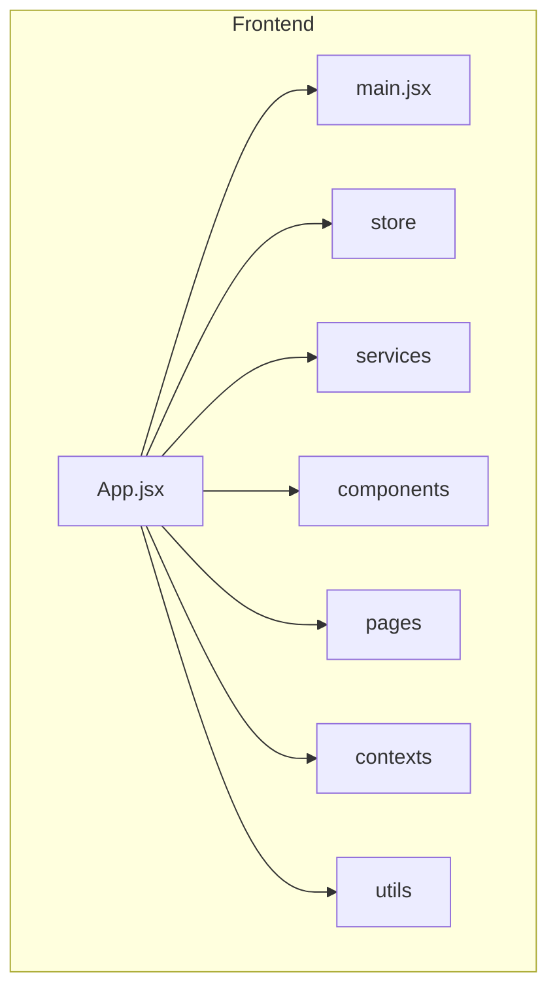
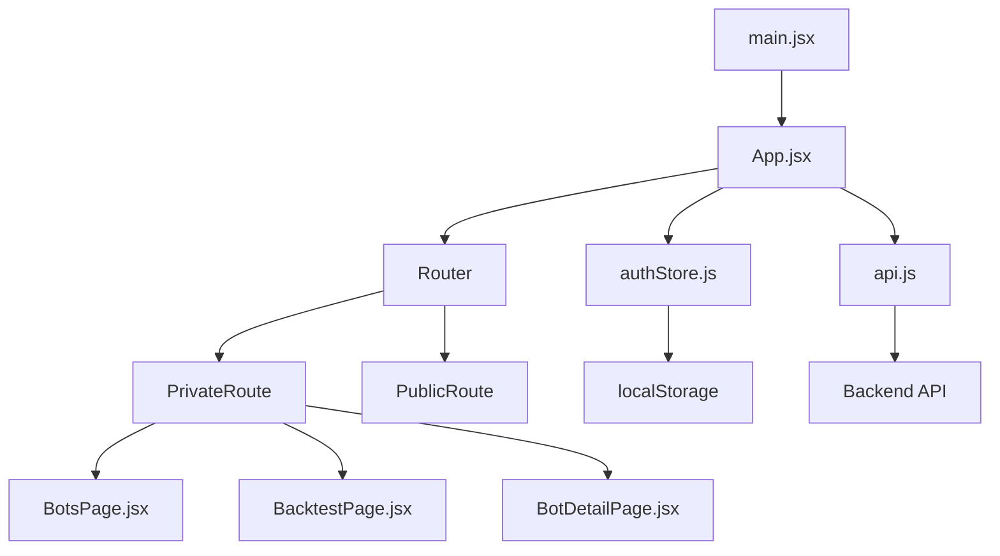
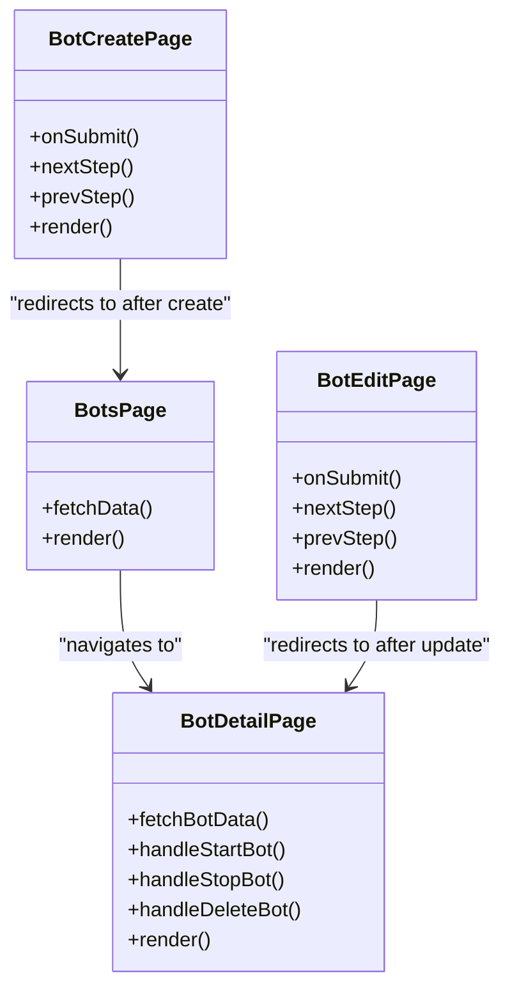
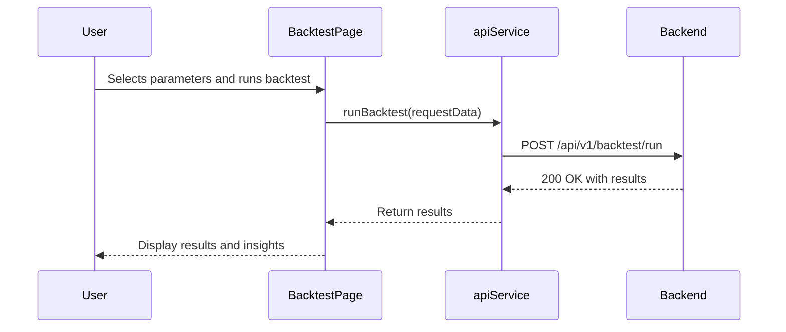
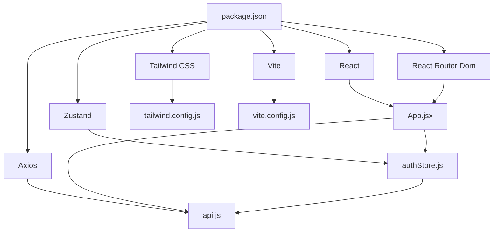

# Frontend Technologies

<cite>
**Referenced Files in This Document**   
- [package.json](file://frontend/package.json)
- [tailwind.config.js](file://frontend/tailwind.config.js)
- [vite.config.js](file://frontend/vite.config.js)
- [main.jsx](file://frontend/src/main.jsx)
- [App.jsx](file://frontend/src/App.jsx)
- [authStore.js](file://frontend/src/store/authStore.js)
- [api.js](file://frontend/src/services/api.js)
- [BotsPage.jsx](file://frontend/src/pages/Bots/BotsPage.jsx)
- [BacktestPage.jsx](file://frontend/src/pages/Backtest/BacktestPage.jsx)
- [BotDetailPage.jsx](file://frontend/src/pages/Bots/BotDetailPage.jsx)
- [BotCreatePage.jsx](file://frontend/src/pages/Bots/BotCreatePage.jsx)
- [BotEditPage.jsx](file://frontend/src/pages/Bots/BotEditPage.jsx)
- [BacktestInsights.jsx](file://frontend/src/components/Backtest/BacktestInsights.jsx)
- [BacktestHistory.jsx](file://frontend/src/components/Backtest/BacktestHistory.jsx)
</cite>

## Table of Contents
1. [Introduction](#introduction)
2. [Project Structure](#project-structure)
3. [Core Components](#core-components)
4. [Architecture Overview](#architecture-overview)
5. [Detailed Component Analysis](#detailed-component-analysis)
6. [Dependency Analysis](#dependency-analysis)
7. [Performance Considerations](#performance-considerations)
8. [Troubleshooting Guide](#troubleshooting-guide)
9. [Conclusion](#conclusion)

## Introduction
The TradeBot React application is a modern frontend interface designed for managing automated trading bots and conducting backtesting on cryptocurrency markets. Built with React 19, the application leverages a component-based architecture to deliver a responsive and interactive user experience. It integrates Zustand 5.0 for lightweight and efficient state management, particularly for authentication and user session data. The UI is styled using Tailwind CSS 3.4, which enables rapid development with its utility-first approach, ensuring consistent and responsive design across all components. API communication is handled by Axios, providing a robust and flexible way to interact with the backend services. The application uses React Router for seamless navigation between pages such as BotsPage.jsx and BacktestPage.jsx, and incorporates advanced features like form handling with react-hook-form, date selection with react-datepicker, and data visualization with Chart.js. This documentation provides a comprehensive overview of the frontend technologies used, their integration, and best practices followed in the codebase.

## Project Structure
The frontend project is organized in a feature-based structure within the `src` directory, promoting modularity and ease of navigation. The `components` directory contains reusable UI elements such as `Auth`, `Backtest`, `ErrorBoundary`, `Layout`, and `Markets`, each housing related components. The `contexts` directory includes `ThemeContext.jsx`, which manages the application's theme state. The `pages` directory is the core of the application, containing high-level views like `ApiKeys`, `Auth`, `Backtest`, `Bots`, `Dashboard`, and `Markets`, each with their respective page components. The `services` directory holds `api.js`, which encapsulates all API communication logic. The `store` directory contains `authStore.js`, the Zustand store for authentication state. The `utils` directory includes helper functions for error handling and market page testing. The root of the `src` directory contains the main application files: `App.jsx`, `main.jsx`, and the CSS files. This structure ensures a clear separation of concerns and facilitates scalable development.

**Diagram sources**
- [App.jsx](file://frontend/src/App.jsx)
- [main.jsx](file://frontend/src/main.jsx)

**Section sources**
- [App.jsx](file://frontend/src/App.jsx)
- [main.jsx](file://frontend/src/main.jsx)

## Core Components
The core components of the TradeBot application are designed to be modular and reusable, forming the building blocks of the user interface. The `BotsPage.jsx` component serves as the main dashboard for managing trading bots, displaying a grid of bot cards with key information such as name, symbol, strategy, and status. It uses React Router for navigation to detailed views and implements filtering and sorting functionality. The `BacktestPage.jsx` component provides a comprehensive interface for running and analyzing backtests, featuring a tabbed layout for new backtests and history, with dynamic form inputs for parameters and date ranges. The `BotDetailPage.jsx` component offers an in-depth view of a single bot, including configuration, state, and performance metrics, with action buttons for starting, stopping, and deleting the bot. These components are built using React's component model and are styled with Tailwind CSS for a consistent and modern look.

**Section sources**
- [BotsPage.jsx](file://frontend/src/pages/Bots/BotsPage.jsx)
- [BacktestPage.jsx](file://frontend/src/pages/Backtest/BacktestPage.jsx)
- [BotDetailPage.jsx](file://frontend/src/pages/Bots/BotDetailPage.jsx)

## Architecture Overview
The TradeBot frontend architecture is a single-page application (SPA) built on React 19, utilizing a component-based design pattern. The application is bootstrapped by `main.jsx`, which renders the `App` component into the DOM using React's `StrictMode`. The `App` component acts as the root, setting up the routing with `BrowserRouter` and providing the `ThemeProvider` for theme management. Navigation is handled by `React Router Dom`, with routes defined for each page, including public routes for authentication and private routes protected by the `PrivateRoute` component. State management is centralized with `Zustand`, where the `authStore` manages the user's authentication state, including token, user data, and login status. API interactions are abstracted in the `api.js` service, which uses Axios to make HTTP requests and includes interceptors for authentication and error handling. The UI is constructed from a hierarchy of components, with data flowing from the top-level `App` component down to the individual page and component levels.

**Diagram sources**
- [main.jsx](file://frontend/src/main.jsx)
- [App.jsx](file://frontend/src/App.jsx)
- [authStore.js](file://frontend/src/store/authStore.js)
- [api.js](file://frontend/src/services/api.js)

## Detailed Component Analysis

### Bots Management Components
The bots management components are central to the application, providing users with the ability to create, view, edit, and manage their trading bots. The `BotsPage.jsx` component displays a list of all bots, with each bot represented as a card showing its name, symbol, strategy, and status. It includes a header with a welcome message and statistics on the number of bots, active bots, and total trades. The page features a navigation button to create a new bot and uses a grid layout for responsive design. The `BotDetailPage.jsx` component provides a detailed view of a specific bot, with tabs for configuration, state, and performance. It includes action buttons for starting, stopping, and deleting the bot, and displays real-time state information fetched from the backend. The `BotCreatePage.jsx` and `BotEditPage.jsx` components are multi-step forms that guide the user through the process of creating or updating a bot, with validation provided by `react-hook-form`.

#### For Object-Oriented Components:

**Diagram sources**
- [BotsPage.jsx](file://frontend/src/pages/Bots/BotsPage.jsx)
- [BotDetailPage.jsx](file://frontend/src/pages/Bots/BotDetailPage.jsx)
- [BotCreatePage.jsx](file://frontend/src/pages/Bots/BotCreatePage.jsx)
- [BotEditPage.jsx](file://frontend/src/pages/Bots/BotEditPage.jsx)

**Section sources**
- [BotsPage.jsx](file://frontend/src/pages/Bots/BotsPage.jsx)
- [BotDetailPage.jsx](file://frontend/src/pages/Bots/BotDetailPage.jsx)
- [BotCreatePage.jsx](file://frontend/src/pages/Bots/BotCreatePage.jsx)
- [BotEditPage.jsx](file://frontend/src/pages/Bots/BotEditPage.jsx)

### Backtesting Components
The backtesting components enable users to simulate trading strategies on historical data and analyze the results. The `BacktestPage.jsx` component is the main interface for this functionality, featuring a tabbed layout with 'New Backtest' and 'History' tabs. The 'New Backtest' tab includes a form for configuring the backtest parameters, such as symbol, interval, date range, and risk management settings. It also displays cache information and allows the user to clear the cache. The 'History' tab shows a table of previous backtests, with columns for symbol, interval, return, win rate, and creation date. The `BacktestHistory.jsx` component is a reusable table that displays the backtest history and includes a modal for viewing detailed results. The `BacktestInsights.jsx` component provides AI-like heuristic analysis of the backtest results, offering insights and recommendations based on the performance metrics.

#### For API/Service Components:

**Diagram sources**
- [BacktestPage.jsx](file://frontend/src/pages/Backtest/BacktestPage.jsx)
- [api.js](file://frontend/src/services/api.js)

**Section sources**
- [BacktestPage.jsx](file://frontend/src/pages/Backtest/BacktestPage.jsx)
- [BacktestHistory.jsx](file://frontend/src/components/Backtest/BacktestHistory.jsx)
- [BacktestInsights.jsx](file://frontend/src/components/Backtest/BacktestInsights.jsx)

## Dependency Analysis
The TradeBot frontend has a well-defined dependency structure, with clear relationships between components and external libraries. The primary dependencies are listed in the `package.json` file and include React 19, React Router Dom, Zustand, Axios, Tailwind CSS, and various utility libraries. The application uses Vite as its build tool, configured in `vite.config.js` to proxy API requests to the backend server. The `tailwind.config.js` file defines the configuration for Tailwind CSS, including content sources, dark mode settings, and custom themes. The `api.js` service has a direct dependency on the `authStore.js` to access the authentication token for API requests. The `App.jsx` component depends on the `ThemeProvider` and `PrivateRoute` components, which in turn depend on the `authStore` for authentication state. This dependency graph ensures that the application is modular and maintainable, with each component having a single responsibility.

**Diagram sources**
- [package.json](file://frontend/package.json)
- [tailwind.config.js](file://frontend/tailwind.config.js)
- [vite.config.js](file://frontend/vite.config.js)
- [App.jsx](file://frontend/src/App.jsx)
- [authStore.js](file://frontend/src/store/authStore.js)
- [api.js](file://frontend/src/services/api.js)

**Section sources**
- [package.json](file://frontend/package.json)
- [tailwind.config.js](file://frontend/tailwind.config.js)
- [vite.config.js](file://frontend/vite.config.js)

## Performance Considerations
The TradeBot application incorporates several performance optimization strategies to ensure a fast and responsive user experience. Code splitting is implemented using React's `lazy` and `Suspense` components, which dynamically load page components only when they are needed, reducing the initial bundle size. The application uses `react-hook-form` for efficient form handling, minimizing re-renders and improving performance for complex forms like those in `BotCreatePage.jsx` and `BotEditPage.jsx`. Caching strategies are employed at both the client and server levels; the `BacktestPage.jsx` component displays cache information and allows the user to clear it, while the backend likely caches historical market data to speed up backtest calculations. Real-time updates are achieved through Server-Sent Events (SSE) integration, although this is not explicitly shown in the provided code. The use of Tailwind CSS's JIT mode in `tailwind.config.js` ensures that only the CSS classes used in the application are generated, further reducing the bundle size. These optimizations collectively contribute to a high-performance application that can handle complex operations smoothly.

## Troubleshooting Guide
Common issues in the TradeBot application can often be traced to authentication, API connectivity, or state management. If a user is unable to access private routes, it may be due to an expired or missing authentication token; the `authStore.js` initializes the token from `localStorage`, so clearing the browser's local storage and logging in again can resolve this. API errors, such as 401 Unauthorized, are handled by the Axios interceptors in `api.js`, which automatically log the user out and redirect to the login page. If the `BotsPage.jsx` fails to load bots, it could be due to a network issue or an error in the `botConfigAPI.getAll()` call; checking the browser's developer console for error messages can provide more insight. For issues with form validation in `BotCreatePage.jsx` or `BotEditPage.jsx`, ensure that all required fields are filled and that the values are within the specified ranges. If the backtest results are not displaying correctly, verify that the date range is valid and that the symbol and interval are supported by the backend.

**Section sources**
- [authStore.js](file://frontend/src/store/authStore.js)
- [api.js](file://frontend/src/services/api.js)
- [BotsPage.jsx](file://frontend/src/pages/Bots/BotsPage.jsx)
- [BotCreatePage.jsx](file://frontend/src/pages/Bots/BotCreatePage.jsx)
- [BacktestPage.jsx](file://frontend/src/pages/Backtest/BacktestPage.jsx)

## Conclusion
The TradeBot React application exemplifies modern frontend development practices, combining the latest technologies to create a powerful and user-friendly interface for cryptocurrency trading. The use of React 19 provides a solid foundation for building a dynamic and responsive UI, while Zustand 5.0 offers a lightweight and efficient solution for state management. Tailwind CSS 3.4 enables rapid and consistent styling, and Axios ensures reliable communication with the backend. The application's architecture is well-structured, with a clear separation of concerns and a modular component design. Best practices such as code splitting, form validation, and error handling are implemented throughout the codebase, resulting in a high-performance and maintainable application. This documentation serves as a comprehensive guide to the frontend technologies used in TradeBot, providing valuable insights for developers and stakeholders alike.