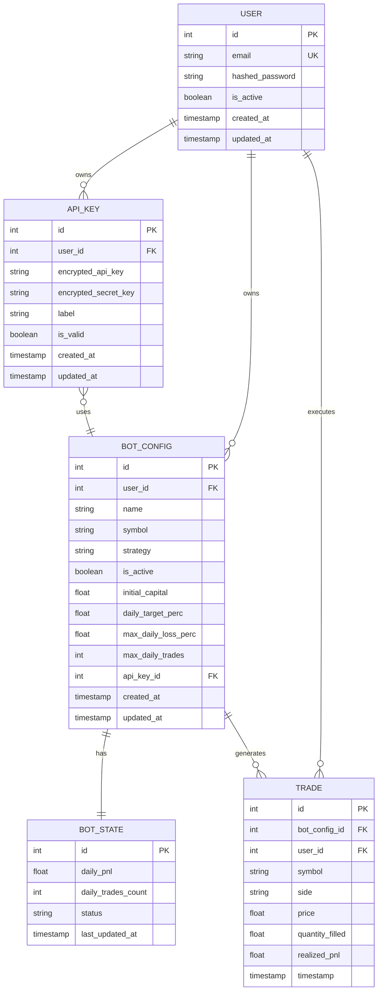
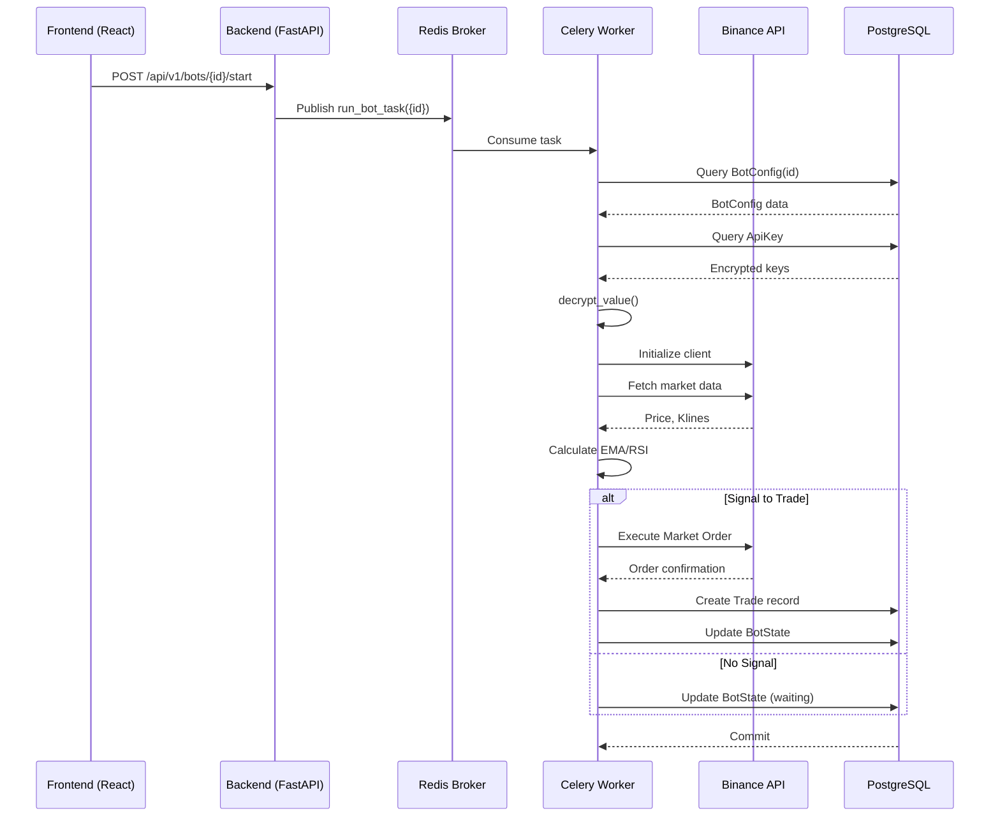
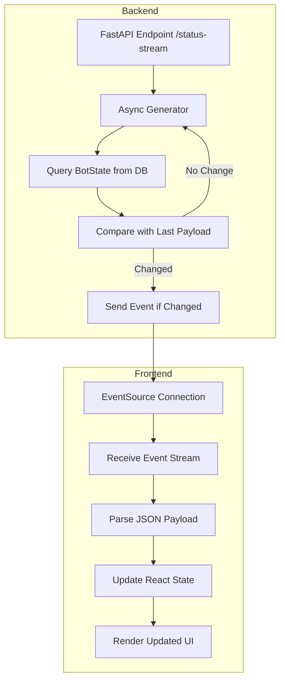

# Technology Stack

<cite>
**Referenced Files in This Document**   
- [main.py](file://app/main.py)
- [bot_tasks.py](file://app/core/bot_tasks.py)
- [celery_app.py](file://app/core/celery_app.py)
- [redis_client.py](file://app/core/redis_client.py)
- [jwt.py](file://app/core/jwt.py)
- [auth.py](file://app/api/routes/auth.py)
- [bot_state.py](file://app/api/routes/bot_state.py)
- [database.py](file://app/database.py)
- [bot_config.py](file://app/models/bot_config.py)
- [bot_state.py](file://app/models/bot_state.py)
- [trade.py](file://app/models/trade.py)
- [api_key.py](file://app/models/api_key.py)
- [user.py](file://app/models/user.py)
- [authStore.js](file://frontend/src/store/authStore.js)
- [api.js](file://frontend/src/services/api.js)
- [ComponentStateManager.jsx](file://frontend/src/components/Markets/ComponentStateManager.jsx)
- [WebSocketManager.jsx](file://frontend/src/components/Markets/WebSocketManager.jsx)
- [package.json](file://frontend/package.json)
</cite>

## Table of Contents
1. [Introduction](#introduction)
2. [Backend Framework: FastAPI](#backend-framework-fastapi)
3. [Frontend Framework: React](#frontend-framework-react)
4. [Data Storage: PostgreSQL](#data-storage-postgresql)
5. [Caching and Message Broker: Redis](#caching-and-message-broker-redis)
6. [Task Processing: Celery](#task-processing-celery)
7. [Data Access: SQLAlchemy ORM](#data-access-sqlalchemy-orm)
8. [Authentication: JWT](#authentication-jwt)
9. [Real-time Updates: Server-Sent Events](#real-time-updates-server-sent-events)
10. [Technology Integration](#technology-integration)
11. [Performance and Best Practices](#performance-and-best-practices)
12. [Conclusion](#conclusion)

## Introduction
The TradeBot application is a full-stack cryptocurrency trading platform designed to automate trading strategies on exchanges like Binance. Its architecture is built upon a robust technology stack that enables secure user management, real-time market data processing, automated trading execution, and a responsive user interface. This document provides a comprehensive analysis of the core technologies powering the TradeBot ecosystem: FastAPI for the backend, React for the frontend, PostgreSQL for persistent data storage, Redis for caching and message brokering, and Celery for distributed task processing. It details how these components integrate through SQLAlchemy ORM, JWT for authentication, and Server-Sent Events for real-time updates, providing a holistic view of the system's implementation and operational principles.

## Backend Framework: FastAPI
FastAPI serves as the high-performance backend framework for the TradeBot application, providing a modern, asynchronous RESTful API. It is chosen for its speed, automatic OpenAPI/Swagger documentation generation, and strong typing with Pydantic, which ensures data validation and reduces bugs. The framework efficiently handles HTTP requests for user authentication, bot configuration, trade execution, and health checks. Its asynchronous nature, powered by Starlette, allows the backend to manage concurrent requests from the frontend and handle long-running operations like database queries and external API calls without blocking. The API is structured into modular routers (e.g., `auth_router`, `bot_config_router`) that are included in the main application instance, promoting a clean and maintainable codebase. FastAPI's built-in support for CORS middleware is configured to allow secure communication between the frontend and backend, with origins restricted in production for enhanced security.

**Section sources**
- [main.py](file://app/main.py#L1-L43)
- [auth.py](file://app/api/routes/auth.py#L1-L32)

## Frontend Framework: React
The frontend of the TradeBot application is built using React, a component-based JavaScript library that enables the creation of a dynamic and interactive user interface. The application follows a modern React architecture with a component hierarchy, where complex UIs are broken down into reusable, stateful components. State management is handled by Zustand, which provides a simple and scalable solution for managing global state such as user authentication and application settings. The UI is rendered using React Router for client-side navigation, allowing for a seamless single-page application (SPA) experience. The frontend communicates with the FastAPI backend through an Axios-based API client that automatically attaches JWT tokens to requests and handles authentication errors by redirecting users to the login page. The use of modern tooling like Vite, Tailwind CSS, and React Hook Form ensures a fast development workflow and a responsive, aesthetically pleasing design.

**Section sources**
- [main.jsx](file://frontend/src/main.jsx#L1-L10)
- [authStore.js](file://frontend/src/store/authStore.js#L1-L43)
- [api.js](file://frontend/src/services/api.js#L1-L375)

## Data Storage: PostgreSQL
PostgreSQL is the relational database management system (RDBMS) used for the persistent storage of all critical application data. It provides a reliable and ACID-compliant foundation for storing user accounts, bot configurations, trade history, and backtest results. The database schema is defined using SQLAlchemy ORM models, which map Python classes to database tables. Key entities include the `User` model for authentication, the `BotConfig` model for storing a bot's trading parameters (such as strategy, symbol, and risk management settings), the `BotState` model for tracking a bot's real-time operational status (like its current PnL and position), and the `Trade` model for recording every executed trade. Alembic is used for database migrations, allowing for the safe and version-controlled evolution of the database schema as the application grows. This structured approach ensures data integrity and enables complex queries for reporting and analysis.

**Diagram sources** 
- [user.py](file://app/models/user.py#L4-L22)
- [api_key.py](file://app/models/api_key.py#L4-L16)
- [bot_config.py](file://app/models/bot_config.py#L4-L57)
- [bot_state.py](file://app/models/bot_state.py#L4-L22)
- [trade.py](file://app/models/trade.py#L4-L25)

**Section sources**
- [user.py](file://app/models/user.py#L4-L22)
- [api_key.py](file://app/models/api_key.py#L4-L16)
- [bot_config.py](file://app/models/bot_config.py#L4-L57)
- [bot_state.py](file://app/models/bot_state.py#L4-L22)
- [trade.py](file://app/models/trade.py#L4-L25)

## Caching and Message Broker: Redis
Redis plays a dual role in the TradeBot architecture, serving as both a high-speed cache for market data and as the message broker for the Celery task queue. As a cache, Redis stores frequently accessed data, such as lists of available trading symbols from Binance, to reduce the load on the external API and improve application responsiveness. The `cache_warmup_tasks.py` module contains Celery tasks that periodically refresh this cached data. As a message broker, Redis is configured as the `CELERY_BROKER_URL`, facilitating asynchronous communication between the FastAPI backend and the Celery workers. When a user starts a bot, the backend publishes a task message to a Redis queue. Celery workers then consume these messages, execute the trading logic, and update the database. This decoupling allows the backend to respond to user requests immediately while long-running trading operations are processed in the background.

**Section sources**
- [redis_client.py](file://app/core/redis_client.py#L1-L44)
- [celery_app.py](file://app/core/celery_app.py#L6-L7)
- [cache_warmup_tasks.py](file://app/core/cache_warmup_tasks.py#L61-L88)

## Task Processing: Celery
Celery is the distributed task queue that powers the automated trading operations in the TradeBot application. It works in conjunction with Redis to execute long-running, asynchronous tasks outside the main request-response cycle of the FastAPI backend. The core trading logic is encapsulated in the `run_bot_task` function within `bot_tasks.py`. This function is decorated as a Celery task and is responsible for fetching a bot's configuration, connecting to the Binance API, analyzing market data, making trading decisions based on the configured strategy (e.g., EMA crossover), and executing trades. A periodic Celery Beat task, `run_bot_task_for_all`, is scheduled to run every minute, triggering the `run_bot_task` for all active bots. This ensures that trading strategies are evaluated regularly. Another scheduled task, `reactivate_bots_after_reset`, runs daily to reset bot counters and reactivate any paused bots, providing a clean slate for the new trading day.

**Diagram sources** 
- [bot_tasks.py](file://app/core/bot_tasks.py#L120-L123)
- [bot_tasks.py](file://app/core/bot_tasks.py#L110-L118)
- [bot_config.py](file://app/models/bot_config.py#L4-L57)
- [bot_state.py](file://app/models/bot_state.py#L4-L22)
- [trade.py](file://app/models/trade.py#L4-L25)

**Section sources**
- [bot_tasks.py](file://app/core/bot_tasks.py#L1-L517)
- [celery_app.py](file://app/core/celery_app.py#L1-L43)

## Data Access: SQLAlchemy ORM
SQLAlchemy ORM is the primary tool for database interaction in the TradeBot backend, providing a Pythonic interface to the PostgreSQL database. It abstracts the underlying SQL, allowing developers to work with database records as if they were regular Python objects. The `database.py` module configures an asynchronous engine and session factory, enabling non-blocking database operations that are crucial for the performance of the FastAPI application. The `get_db` dependency in `dependencies/auth.py` provides a database session to route handlers, ensuring proper resource management with context managers. For Celery tasks, which run in a synchronous context, a separate synchronous session (`SyncSessionLocal`) is used to maintain data consistency. The ORM's relationship system, defined in the model classes, allows for easy navigation between related entities, such as accessing a bot's trades from its `BotConfig` object, simplifying complex data retrieval and manipulation.

**Section sources**
- [database.py](file://app/database.py#L1-L10)
- [auth.py](file://app/dependencies/auth.py#L1-L34)
- [bot_tasks.py](file://app/core/bot_tasks.py#L32-L33)

## Authentication: JWT
Authentication between the React frontend and the FastAPI backend is secured using JSON Web Tokens (JWT). When a user successfully logs in via the `POST /api/v1/auth/login` endpoint, the backend generates a JWT using the `create_access_token` function from `jwt.py`. This token is signed with a secret key (`SECRET_KEY`) and contains a payload with the user's email (the subject). The token is then sent back to the frontend, where it is stored in the browser's localStorage and in the Zustand store. For every subsequent request to a protected endpoint, the frontend includes this token in the `Authorization` header as a Bearer token. The backend uses the `get_current_user` dependency, which calls `verify_access_token` to decode and validate the JWT. If the token is valid, the user's information is retrieved from the database, and the request is processed. This stateless mechanism provides a secure and scalable way to authenticate users across the application.

**Section sources**
- [jwt.py](file://app/core/jwt.py#L1-L45)
- [auth.py](file://app/api/routes/auth.py#L1-L32)
- [authStore.js](file://frontend/src/store/authStore.js#L1-L43)
- [api.js](file://frontend/src/services/api.js#L1-L375)

## Real-time Updates: Server-Sent Events
To provide users with real-time updates on their bot's status without the complexity of WebSockets, the TradeBot application implements Server-Sent Events (SSE). The `/api/v1/bots/{bot_config_id}/status-stream` endpoint in `main.py` creates a persistent connection that streams JSON data to the frontend. An asynchronous generator function continuously polls the `BotState` table in the database, checking for any changes in the bot's status, PnL, or trade count. When a change is detected, a new event is sent to the client. The frontend uses the `EventSource` API to listen to this stream and updates the UI components accordingly. This approach is efficient for one-way, server-to-client communication and is used to display live metrics such as the bot's current status ("running", "stopped"), its daily profit and loss, and the number of trades executed, giving users a near real-time view of their bot's performance.

**Diagram sources** 
- [main.py](file://app/main.py#L67-L93)
- [ComponentStateManager.jsx](file://frontend/src/components/Markets/ComponentStateManager.jsx#L245-L295)
- [WebSocketManager.jsx](file://frontend/src/components/Markets/WebSocketManager.jsx#L76-L113)

**Section sources**
- [main.py](file://app/main.py#L67-L93)
- [ComponentStateManager.jsx](file://frontend/src/components/Markets/ComponentStateManager.jsx#L245-L295)

## Technology Integration
The technologies in the TradeBot stack are tightly integrated to create a cohesive and functional application. The process begins when a user interacts with the React frontend, which uses the `api.js` service to make authenticated requests to the FastAPI backend. For instance, when a user starts a bot, the frontend sends a request to the `/api/v1/bots/{id}/start` endpoint. The FastAPI backend, using SQLAlchemy ORM, validates the request and the user's permissions. Instead of executing the trading logic directly, it uses Celery to asynchronously dispatch a `run_bot_task` to the Redis message broker. A Celery worker picks up this task, uses a synchronous SQLAlchemy session to read the bot's configuration and API keys from PostgreSQL, and decrypts the keys. The worker then uses the Binance client to fetch real-time market data, which may be partially served from a Redis cache to improve performance. After making a trading decision, the worker executes the trade, records the result in the `Trade` table in PostgreSQL, and updates the `BotState`. Simultaneously, the frontend maintains an SSE connection to the `/status-stream` endpoint, which polls the updated `BotState` from PostgreSQL and streams the changes back to the user's browser, providing a live dashboard experience.

## Performance and Best Practices
The TradeBot application employs several best practices to ensure performance, security, and maintainability. For performance, the use of asynchronous operations in FastAPI and Celery's distributed task processing prevents the blocking of critical user-facing requests. Redis caching of market data reduces latency and external API load. The application is containerized with Docker, ensuring consistent environments from development to production. Security is paramount: user passwords are hashed with bcrypt, API keys are encrypted with Fernet before being stored in PostgreSQL, and all communication is secured with JWT. The codebase follows a modular structure, with clear separation of concerns between routes, models, schemas, and core logic. Version control for the database schema is managed with Alembic, and the frontend leverages modern build tools like Vite for fast compilation. The system is designed to be monitored, with logging and health check endpoints to ensure reliability.

## Conclusion
The TradeBot application's technology stack is a well-integrated ecosystem of modern, open-source tools. FastAPI and React provide a fast and responsive API and UI, respectively. PostgreSQL offers a robust and reliable data store, while Redis enhances performance through caching and enables asynchronous task processing via Celery. The integration of these components through SQLAlchemy ORM, JWT authentication, and Server-Sent Events creates a powerful platform for automated trading. This architecture is scalable, secure, and maintainable, providing a solid foundation for both current functionality and future enhancements, such as multi-strategy support or social trading features.